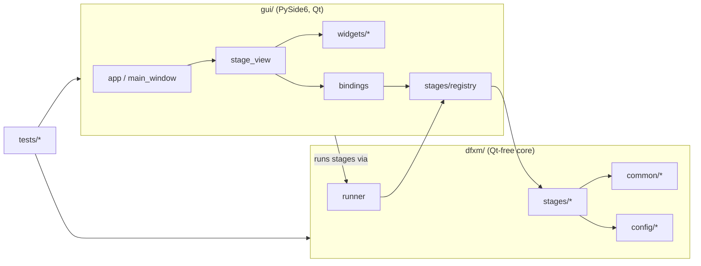

# DFXM Pipeline — Codebase Reference

> [!info] What this is
> A file-by-file, part-by-part explanation of the **entire** codebase: what each
> module, class, and function does and how the pieces fit together. For *how to
> use* the app see [[Usage]]; for contributor conventions see `CLAUDE.md`. This
> document focuses on *what the code is*.

> [!note] Keep this in sync
> When you add/remove a module, class, or public function — or change what one
> does — update the matching entry here in the same change (see
> [[#Maintaining this reference]]).

## Contents

- [[#Big picture]]
- [[#Repository layout]]
- [[#Layer 1 — `dfxm/` core library]]
    - [[#`dfxm/config` — typed config & presets]]
    - [[#`dfxm/common` — shared primitives]]
    - [[#`dfxm/stages` — the nine analysis stages]]
    - [[#`dfxm/runner.py` — the process worker]]
- [[#Layer 2 — `gui/` PySide6 application]]
- [[#Layer 3 — `tests/`]]
- [[#Data & artifact flow]]
- [[#Project files]]
- [[#Maintaining this reference]]

---

## Big picture

The codebase is three layers with a strict one-way dependency:



> [!important] The core invariant
> **`dfxm/` never imports Qt.** The GUI imports the core; the core never imports
> the GUI. That is what lets every stage run headless (CLI/tests) and keeps the
> stage **worker process** lightweight. Heavy optional deps (`pyvista`/`vtk`)
> are imported *lazily*, inside the functions that need them.

Three ideas recur everywhere:

1. **Schema-driven stages.** A stage is a pure function `run(params, progress=None)
   -> result` plus a declarative `STAGE: StageSpec`. The GUI builds its form from
   the schema; the CLI and tests call `run` directly.
2. **One shared alignment.** Every volume stage co-registers through the *single*
   implementation in [[#`alignment.py`]] (origin-0 PVTI world frame). No stage
   re-implements the samy-shift / Z-interpolation.
3. **Process isolation.** Long/`matplotlib`/3-D work runs in a child process via
   [[#`dfxm/runner.py` — the process worker]] so the UI stays responsive and
   cancellable.

---

## Repository layout

```
dfxm_pipeline/
├── dfxm/                  # Layer 1 — Qt-free core library
│   ├── config/            #   typed config models + YAML presets
│   ├── common/            #   shared primitives (sort, h5io, alignment, …)
│   ├── stages/            #   the 9 analysis stages + registry
│   └── runner.py          #   run a stage in a child process
├── gui/                   # Layer 2 — PySide6 desktop app
│   └── widgets/           #   reusable Qt widgets
├── tests/                 # Layer 3 — pytest suite + fixtures
├── experiments/           # shipped experiment presets (YAML)
├── docs/                  # Usage.md (user) + Codebase.md (this file)
├── CLAUDE.md  README.md  pyproject.toml  .claude/settings.json  .gitignore
```

---

## Layer 1 — `dfxm/` core library

`dfxm/__init__.py` — package marker; defines `__version__` and states the
**Qt-free invariant** in its docstring.

### `dfxm/config` — typed config & presets

#### `models.py`

The declarative backbone. Nothing here touches Qt; the GUI *reads* these types
to build forms.

| Symbol | Kind | What it does |
|---|---|---|
| `ParamType` | `str, Enum` | The editor kinds: `INT, FLOAT, STR, BOOL, PATH, DIR, SAVE_PATH, ENUM, TEXT`. The GUI maps each to a widget. `TEXT` = multi-line (JSON). |
| `Param` | frozen dataclass | One parameter: `name, type, label, default, unit, choices, help, calibration`. `__post_init__` enforces that an `ENUM` has `choices`. `coerce(value)` converts a raw form string to the declared type. |
| `StageSpec` | frozen dataclass | A stage's identity + its `params` tuple. `defaults()` → dict of defaults; `get(name)` → a `Param`; `coerce_all(values)` → all values coerced with defaults filled in. |
| `Experiment` | dataclass | The shared, preset-saved state: data roots, folder glob patterns (`folder_pattern`, `mosa_pattern`, `rocking_pattern`), calibration (`ccmth_ref_deg`, pixel scales), and beamline HDF5/motor paths. `to_dict()` / `from_dict()` (the latter warns on unknown keys). |
| `EXPERIMENT_SCHEMA` | `tuple[Param]` | The display schema for `Experiment`, in field order. A test asserts it stays in lock-step with the dataclass fields. |
| `CALIBRATION_FIELDS` | tuple[str] | Names of the physically-meaningful fields (flagged red in the form). |
| `experiment_schema()` | fn | Returns `EXPERIMENT_SCHEMA`. |

#### `presets.py`

Load/save/discover experiment presets (YAML in `experiments/`).

| Function | What it does |
|---|---|
| `experiments_dir()` | Default presets dir = `<project root>/experiments`. |
| `discover_experiments(dir=None)` | `{name → path}` for every `*.yaml` (name from the YAML `name:` key, else the file stem); sorted. |
| `load_experiment(path)` | Read one YAML → `Experiment`. |
| `save_experiment(exp, path)` | Write an `Experiment` to YAML (field order preserved; comments not emitted). |
| `load_experiment_by_name(name, dir=None)` | Discover + load by name. |

### `dfxm/common` — shared primitives

`common/__init__.py` is just a package marker. The rest are the de-duplicated
building blocks the legacy scripts each re-implemented.

#### `sort.py`
- `natural_sort_key(s)` — orders embedded numbers numerically (`layer__2` before `layer__10`).
- `find_matching_folders(root, pattern)` — directories matching a glob, natural-sorted by basename.

#### `h5io.py`
Stage-agnostic HDF5 I/O (used mostly by [[#concat.py]]).

| Function / type | What it does |
|---|---|
| `resolve_input_file(folder, override)` | BLISS convention: `folder/folder.h5` (or an override name). |
| `make_output_path(in, suffix="_concat")` | `<stem><suffix><ext>` next to the input. |
| `get_filtered_entries(h5f, suffix)` | Top-level groups ending in `suffix` (e.g. `.1`), natural-sorted. |
| `make_virtual_source(ds, out, policy)` | A `VirtualSource` referencing `ds` by **relative** (portable) or **absolute** path. |
| `build_virtual_layout(sources, counts, shape, dtype)` | Stack per-scan detector sources along axis 0 into one `VirtualLayout`. |
| `detector_info(ds)` | `(n_frames, frame_shape, dtype)` for a 3-D stack. |
| `read_positioners(h5f, group)` | Every dataset under a positioners group → `{name: value}` (raw). |
| `read_samy_samz(h5f, group, …)` | The `samy`/`samz` stages specifically. |
| `MapsValidation` + `validate_maps_file(path, required)` | Bracket darfix: check a `maps.h5` has the required COM datasets *without raising* (returns a result object that is truthy when valid). |

#### `alignment.py`
The **single source of truth** for putting volumes into the shared world frame.
The fixed order is `abs(FWHM) → ROI → samy X-shift → uniform-Z interp → centre`.

| Function / type | What it does |
|---|---|
| `_samy_ref(samy, ref)` | Resolve the X reference: explicit value, else `samy[0]`. |
| `compute_pad_left/right(samy, scale_x, dir, ref_samy=None)` | The left/right canvas padding the X-shift will add (same formula, so an origin can be anchored). |
| `apply_samy_shifts_to_volume(vol, samy, scale_x, dir, ref_samy=None)` | Sub-pixel shift each Z-layer along image-X by its samy offset, expanding the canvas (NaN-padded). `ref_samy` anchors to an external frame (the rocking stage anchors to mosa). |
| `interpolate_to_uniform_z(vol, samz, ref_samz=None)` | Resample irregular `samz` layers onto a uniform Z grid → `(vol, z_uniform_um, scale_z)`. |
| `apply_roi_3d(data, roi_x, roi_y)` | Crop a `(Z,Y,X)` volume in pixel coords. |
| `center_around_zero(data, method)` | Subtract the `mean`/`median` over finite voxels → `(data, offset)`. |
| `raw_detector_origin(samy, z, …)` | World origin (µm) placing a volume in the raw-detector-absolute frame (folds in samy pad + ROI + darfix origin). |
| `AlignedVolume` + `align_volume(...)` | Convenience wrapper running the whole fixed pipeline in one call. |

#### `raster.py`
Per-layer sample positions.
- `find_h5_file(folder)` — the `.h5` in a folder (`folder.h5`, else smallest `*.h5`).
- `extract_motor_positions(folders, samy_path, samz_path)` — scalar `(samy, samz)` per folder → `(samy_arr, samz_arr, names)`; folders without motors are skipped.
- `nearest_index(samy_arr, samz_arr, ty, tz)` — index of the layer closest to a target `(samy, samz)` (used by [[#matched.py]]).

#### `plotting.py`
GUI-safe plotting helpers — **never** `pyplot`/`matplotlib.use`.
- `symmetric_limits(data, percentile=None)` — colour limits symmetric about 0.
- `physical_extent(shape, px, py, roi)` — imshow `extent` in µm.
- `get_cmap(name)` — colormap lookup; maps ParaView `"fast"` → `coolwarm` fallback.
- `new_figure(figsize)` — a white `Figure` (no pyplot).
- `add_scale_bar(ax, length_um, …)` — a µm scale bar in axes coords.

#### `render.py`
Shared **volume** renderers used by [[#visualize.py]] and [[#rocking.py]].
- `cmap_nan_transparent(name)` — colormap with NaN → transparent.
- `add_scale_bar(ax, ext_x, ext_y, …)` / `layer_figure(...)` — one equal-aspect layer figure.
- `save_layer_pngs(...)` — one PNG per Z layer.
- `save_layer_animation(...)` — layer flip-through movie; MP4 (ffmpeg) → GIF fallback.
- `_pyvista_grid(data, spacing)` / `save_top_view(...)` — 3-D top-view render (**lazy** `pyvista` import; NaN voxels thresholded out).

### `dfxm/stages` — the nine analysis stages

`stages/__init__.py` documents the `run(params, progress=None) -> result`
contract. Every stage module follows the same shape: a module-level
`STAGE: StageSpec`, one or more result dataclasses, the ported numeric core, a
`run()` entry point, and a `_main()` CLI.

#### `registry.py`
- `STAGE_TARGETS: dict[name → "module:function"]` — the lazy stage map; importing it does **not** import matplotlib/pyvista/h5py.
- `resolve(target)` — resolve a `"module:function"` string (or callable) to a callable.
- `resolve_stage(name)` — resolve a registered stage name.

#### `concat.py`
Port of `concatenate_h5_scans_v3` + `batch_concatenate_h5_scans_v1`. Combines a
BLISS file's `*.1` entries into one darfix-ready `entry_0000`.
- `ConcatFileResult` / `ConcatResult` — per-file and aggregate outcomes (`n_ok`, `n_skipped`, `n_failed`, `outputs`).
- `collect_positioners(...)` — merge motors across scans (arrays concatenated; varying scalars expanded per-frame; uniform scalars collapsed).
- `concatenate_single_file(...)` — write one output: detector stack as a **VDS** (default) or a self-contained **copy** (`copy_data=True`), plus merged positioners.
- `run(params, progress)` — dispatch `single`/`batch` mode; `_main()` — CLI.

#### `strain.py`
Port of `calc_axial_strain_v7_batch`. Per-pixel axial strain (cot method,
ccmth-only) → stacked 3-D volume.
- `LayerResult` / `StrainResult` — per-layer stats + the stacked path/shape.
- `cot`, `_arctan_model`, `_fit_arctan_1d`, `detrend_arctan_2d` — the separable arctan **detrend** (run on the full map, **before** ROI).
- `compute_strain(ccmth, ccmth_ref)` — single-array `cot(ccmth_ref)·Δccmth`.
- `process_maps_file(...)` — one `maps.h5` → 2-D strain + diagnostic PNGs.
- `save_stacked_volume(...)` — stack all layers into `stacked_strain_volumes.h5`.
- `run` / `_main`.

#### `mosaicity.py`
Port of `stack_h5_darfix_volumes`. Stacks χ/μ Center-of-mass + FWHM maps.
- `MosaicityResult` — stacked path + per-dataset shapes + layers.
- `_read_dataset(h5f, path)` — a dataset or `None`.
- `run` (a folder is included if any of its four maps exist) / `_main` → `stacked_volumes.h5`.

#### `rocking.py`
Port of `build_aligned_raw_rocking_volumes_v3`. Aligned 3-D volumes straight
from raw rocking scans, anchored to the mosaicity reference.
- `RockingProducts` / `RockingResult` — per-volume render products + aligned path/shape/reference.
- `process_raw_scan(...)` — per-scan median **background subtraction** → integrated **sum** + one **specific frame**.
- `build_raw_volumes(...)` — stack scans (sorted by samz) into two 3-D volumes.
- `save_aligned_raw_volumes(...)` — write `aligned_raw_rocking_volumes.h5` (the schema [[#slices.py]] reads).
- `_render(...)` — per-volume PNGs/animation/top-view via [[#render.py]].
- `run` (mosa reference + mosa∪strain samz union filter + alignment) / `_main`.

#### `visualize.py`
Port of `visualize_aligned_volumes_v6`. Aligns the stacked volumes and renders.
- `DatasetProducts` / `VisualizeResult`.
- Colour/centre helpers: `_symmetric_range`, `_midrange_clim`, `_center_com_and_range`, `_colorbar_range`, `_display_info` (title/label/cmap per field).
- `load_mosa_datasets` / `load_strain_volume`, `_align(...)` (reuses [[#`alignment.py`]]), `_process_dataset(...)`.
- `run` → per-layer PNGs, animation, 3-D top-view.
- **3-D viewer helpers** (used by the GUI): `mosa_field_names(path)`, `available_fields(params)`, `aligned_field(params, name)` → `(volume, spacing, cmap, clim)` aligned with the *same* pipeline as the PNGs.

#### `paraview.py`
Port of `export_aligned_volumes_to_paraview_v6_pvti`. Writes partitioned PVTI.
- `SAVE_DTYPE` (`float32`), `ExportInfo` / `ParaviewResult`.
- PVTI writer (`vtk` imported **lazily**): `_numpy_to_vtk_type_str`, `compute_piece_extents_z` (adjacent pieces share one Z index), `write_piece_vti`, `write_pvti_master`, `save_volumes_as_pvti` (NaN sentinels + `valid_mask`).
- `_process_mosaicity` / `_process_strain` — align (shared pipeline) then export; `run` writes `*.pvti` + `*_pieces/` + `export_info.txt`.

#### `slices.py`
Port of `extract_oblique_slices_v5`. Arbitrary planes through the aligned volumes.
- `SlicesResult`; centring/range helpers mirror visualize.
- Geometry: `build_basis(normal, up)` (orthonormal u/v/n), `slice_plane_offsets`, `sample_plane` (world→voxel via `map_coordinates`), `_world_box`/`_union_box`/`resolve_auto_extent` (`extent:"auto"` fits the data box; `default_du` ← `scale_x`).
- `prepare_volume(...)` — load + (if `stacked`) align + style; `_estimate_box` for auto-extent; `_standard_volumes(...)` builds the volume list from the `include_*` toggles.
- `render_slice_png` / `write_volume_group`; `run` validates each slice up front, writes `oblique_slices.h5` + a PNG per plane.

#### `profiles.py`
Port of `line_profile_oblique_slices_v2` (headless modes). 1-D profiles across one
slice plane, every field at the same in-plane positions.
- `ProfileJobResult` / `ProfilesResult`.
- **Profiling core** (pure, unit-tested): `grid_pitch`, `line_geometry`, `sample_nan_aware` (NaN-aware bilinear), `profile_plane`.
- HDF5 access: `volume_ids_with_slice`, `read_volume_attrs`, `read_axes`, `resolve_plane_index`, `check_geometry`.
- Figures: `make_companion_figure` (image + per-field stack), `render_single`.
- Drivers: `_collect`, `_write_csvs`, `_save_overviews`; `run` supports `parameter` (CSV + figures) and `preview` modes. (The interactive click-pick is the GUI's [[#`line_picker.py`]].)

#### `matched.py`
Port of `plot_rocking_matched_layers_v3`. Grayscale rocking frames matched to
strain layers.
- `MatchedResult`.
- `load_pco_ff_frame(...)` — one frame, median-background subtracted, negatives→NaN.
- `match_nearest(...)` — nearest rocking scan per strain layer within a threshold.
- `_apply_shift_single(...)` — place a frame on the padded canvas with the strain samy shift (skips frames whose shape differs).
- `run` / `_main`.

### `dfxm/runner.py` — the process worker

Runs a stage in a **child process** and streams messages back; UI-agnostic.

| Symbol | What it does |
|---|---|
| `Progress` / `Log` / `Done` / `Failed` | The four picklable message kinds (fraction+text / a printed line / the result / error+traceback). |
| `_QueueWriter` | stdout/stderr shim → emits one `Log` per completed line. |
| `_worker(q, target, params)` | Child entry point: resolve the target, run it with a `progress` callback that posts `Progress`, post `Done`/`Failed`. |
| `StageRunner` | Parent side: `start()`, `poll()` (drain queued messages), `is_alive()`, `cancel()` (SIGTERM→kill), `join()`, `finished/result/failure` props, and `run_blocking()` (used by CLI/tests). Requires a `"module:function"` target under `spawn`. |

---

## Layer 2 — `gui/` PySide6 application

`gui/__init__.py` is a package marker.

| Module | What it does |
|---|---|
| `app.py` | Entry point `main()` (`python3 -m gui.app`). Sets `QT_API=pyside6`, then **defers** Qt imports so the spawn-reimported worker child stays Qt-free. |
| `main_window.py` | `MainWindow`: left column = `ExperimentPanel` + stage nav list + per-stage status panel; right = a `QStackedWidget` of one `StageView` per stage. Wires experiment changes into every view and updates a stage's ✓/✗ status on `runFinished`. |
| `experiment_panel.py` | `ExperimentPanel`: preset dropdown + reload, a `ParamForm` over `EXPERIMENT_SCHEMA`, the preset's notes (red when present), **Apply** and **Save as…**. Emits `experimentChanged(Experiment)`. |
| `stage_view.py` | `StageView`: the generic per-stage panel — param form + **Run/Cancel** + Log/Results/Output tabs (and a **3D** tab for volume stages, a **Pick line…** button for profiles). Launches the stage via `StageRunner` and polls it on a `QTimer`. Module helpers `_summarize(stage_name, result)` (text summary) and `_representative_image(stage_name, result)` (preview picker) dispatch on the stage name via the `_SUMMARIZERS` / `_IMAGE_PICKERS` tables — one formatter per stage, no result-type sniffing. `_VOLUME_STAGES = (visualize, rocking)`. |
| `bindings.py` | The glue: `STAGE_ORDER` (nav order), `STAGE_SPECS` (name→`StageSpec`), and `experiment_overrides(stage, exp)` — how an `Experiment` pre-fills each stage *and* how an upstream output auto-fills the next stage's input (the auto-chaining). |
| `viewers.py` | Lazy interactive-viewer glue: `volume_sources(stage, result, params)` → `{name: callable}` where each callable loads/aligns one volume **only when invoked**; `_rocking_source(...)`; `inject_line_into_jobs(jobs_json, …)` writes a picked line back into a profiles job (pure, unit-tested). |

### `gui/widgets/`

| Widget | What it does |
|---|---|
| `param_form.py` | `ParamForm`: auto-builds a form from a `Param` tuple — `ENUM→QComboBox`, `BOOL→QCheckBox`, `INT/FLOAT→spin`, `PATH/DIR/SAVE_PATH→QLineEdit+Browse`, `TEXT→QPlainTextEdit`, else `QLineEdit`. Calibration params get a red label. `values()` (coerced) / `set_values()`; emits `changed`. |
| `log_console.py` | `LogConsole`: progress bar + status label + capped append-only log; driven by `runner` messages. |
| `mpl_canvas.py` | `MplCanvas`: an embedded matplotlib `Figure` + toolbar that emits `clicked(x, y)` on a click in the axes. |
| `pv_canvas.py` | `PvCanvas`: an embedded `pyvistaqt` 3-D view created **lazily** (`ensure()` on first use; degrades to a label if there's no OpenGL). `show_volume(volume, spacing, cmap, clim)` volume-renders with NaN thresholded out. |
| `volume3d.py` | `Volume3DPanel`: a volume dropdown + **Render 3-D** button over a (lazy) `PvCanvas`. `set_sources()` installs lazy callables — nothing loads until the button is clicked. |
| `line_picker.py` | `LinePickerDialog`: scroll a slice's planes (◀/▶), click two endpoints, read back `(start_uv, end_uv, offset_um)`. Built on demand; reuses the [[#profiles.py]] readers. |

---

## Layer 3 — `tests/`

`pytest` suite (run `python3 -m pytest`). `tests/__init__.py` is a marker.

| File | Covers |
|---|---|
| `conftest.py` | Fixtures `bliss_factory` / `batch_root` that write tiny synthetic BLISS HDF5 files (detector stack + positioners), so stages run without the SSD. |
| `test_common_sort.py`, `test_common_alignment.py`, `test_common_h5io.py` | The shared primitives (incl. alignment **vs-legacy parity**). |
| `test_config.py` | `Param`/`StageSpec` coercion, the `EXPERIMENT_SCHEMA`↔dataclass sync, preset round-trip, the shipped calibration values. |
| `test_stage_*.py` | One per stage: synthetic-data end-to-end + targeted unit tests (and golden comparison vs the legacy script where available). |
| `test_gui_viewers.py` | `visualize.aligned_field`, `viewers.volume_sources` (lazy), `inject_line_into_jobs` — the headless parts of the interactive viewers. |
| `test_stage_summaries.py` | `stage_view._summarize` / `_representative_image` — the stage-name-keyed Results/Output formatters (one per stage), incl. skip-reason listing and the empty-result messages. |
| `gui_smoke.py` | A scripted Qt smoke test (offscreen): builds the window, loads the preset, runs concat + strain through the UI, checks the 3D tab / pick button exist and that `pyvista` isn't imported at startup, and that Cancel kills a worker. Run directly, not via pytest. |

> [!note] "vs-legacy" tests self-skip here
> Several parity tests import the original ESRF scripts as oracles. In this
> standalone repo those scripts aren't vendored, so those tests **skip**
> gracefully (parity was confirmed where the originals live).

---

## Data & artifact flow

What each stage reads and writes (file names are the defaults):

| Stage | Reads | Writes |
|---|---|---|
| `concat` | raw BLISS `*.1` scans | `<folder>_concat.h5` (→ darfix) |
| *(darfix, external)* | `*_concat.h5` | `maps.h5` |
| `strain` | `maps.h5` | strain PNGs + `stacked_strain_volumes.h5` |
| `mosaicity` | `maps.h5` | `stacked_volumes.h5` |
| `rocking` | raw rocking scans (+ mosa/strain motors) | `aligned_raw_rocking_volumes.h5` + media |
| `visualize` | `stacked_volumes.h5`, `stacked_strain_volumes.h5` | PNGs / MP4 / 3-D top-view |
| `paraview` | the stacked volumes | `*_volume.pvti` + `*_pieces/` + `export_info.txt` |
| `slices` | stacked volumes + aligned rocking volume | `oblique_slices.h5` + PNG per plane |
| `profiles` | `oblique_slices.h5` | companion figures + CSVs + overviews |
| `matched` | raw strain + rocking scans | grayscale `rocking_layers/*.png` |

`bindings.experiment_overrides` encodes these hand-offs so each stage's inputs
auto-fill from the experiment + the previous stage's outputs.

---

## Project files

| File | Purpose |
|---|---|
| `pyproject.toml` | Project metadata + deps; **ruff** config (line 100, py310, E/F/I) and **pytest** config (`pythonpath=["."]` so `dfxm`/`gui` import without installing). |
| `.claude/settings.json` | `PostToolUse` hooks: ruff format+check on `.py` edits, and a reminder to update the `docs/` guides when `dfxm/stages/` or `gui/` changes. |
| `.gitignore` | Ignores `__pycache__/`, `*.pyc`, `.ruff_cache/`, `.pytest_cache/`. |
| `CLAUDE.md` | Contributor/AI guide: architecture, conventions, add-a-stage checklist, doc-sync rule. |
| `README.md` | Short project summary. |
| `docs/Usage.md` | The user-facing how-to ([[Usage]]). |
| `docs/Codebase.md` | This file. |
| `experiments/STO2_overnight.yaml` | The shipped preset (paths, calibrated angles, pixel scales). |

---

## Maintaining this reference

> [!important] For contributors (and future Claude sessions)
> This file mirrors the code structure. **When you add, remove, or change a
> module, class, or public function — or what it does — update the matching entry
> here in the same change**, alongside the user-facing [[Usage]] guide. The
> `.claude/settings.json` hook reminds you when you edit `dfxm/stages/` or `gui/`,
> and `CLAUDE.md` records this as a standing rule.

## See also

- [[Usage]] — how to operate the pipeline.
- `CLAUDE.md` — conventions & the add-a-stage checklist.
