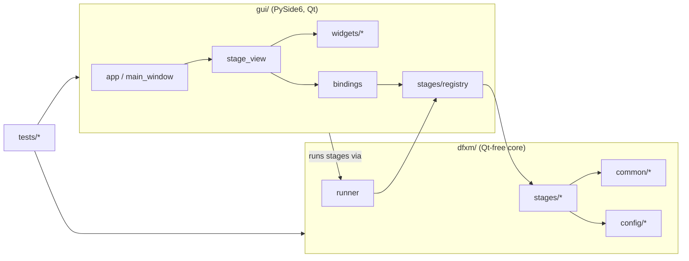

# DFXM Pipeline — Codebase Reference

> [!info] What this is
> A file-by-file, part-by-part explanation of the **entire** codebase: what each
> module, class, and function does and how the pieces fit together. For *how to
> use* the app see [[Usage]]; for contributor conventions see `CLAUDE.md`. This
> document focuses on *what the code is*.

> [!note] Keep this in sync
> When you add/remove a module, class, or public function — or change what one
> does — update the matching entry here in the same change (see
> [[#Maintaining this reference]]).

## Contents

- [[#Big picture]]
- [[#Repository layout]]
- [[#Layer 1 — `dfxm/` core library]]
    - [[#`dfxm/config` — typed config & presets]]
    - [[#`dfxm/common` — shared primitives]]
    - [[#`dfxm/stages` — the nine analysis stages]]
    - [[#`dfxm/compose` — publication figure composer]]
    - [[#`dfxm/runner.py` — the process worker]]
    - [[#`dfxm/viewer_jobs.py` — child-process viewer jobs]]
- [[#Layer 2 — `gui/` PySide6 application]]
- [[#Layer 3 — `tests/`]]
- [[#Data & artifact flow]]
- [[#Project files]]
- [[#Maintaining this reference]]

---

## Big picture

The codebase is three layers with a strict one-way dependency:



> [!important] The core invariant
> **`dfxm/` never imports Qt.** The GUI imports the core; the core never imports
> the GUI. That is what lets every stage run headless (CLI/tests) and keeps the
> stage **worker process** lightweight. Heavy optional deps (`pyvista`/`vtk`)
> are imported *lazily*, inside the functions that need them.

Three ideas recur everywhere:

1. **Schema-driven stages.** A stage is a pure function `run(params, progress=None)
   -> result` plus a declarative `STAGE: StageSpec`. The GUI builds its form from
   the schema; the CLI and tests call `run` directly.
2. **One shared alignment.** Every volume stage co-registers through the *single*
   implementation in [[#`alignment.py`]] (origin-0 PVTI world frame). No stage
   re-implements the samy-shift / Z-interpolation.
3. **Process isolation.** Long/`matplotlib`/3-D work runs in a child process via
   [[#`dfxm/runner.py` — the process worker]] so the UI stays responsive and
   cancellable.

---

## Repository layout

```
dfxm_pipeline/
├── dfxm/                  # Layer 1 — Qt-free core library
│   ├── config/            #   typed config models + YAML presets
│   ├── common/            #   shared primitives (sort, h5io, alignment, plotting, figures, …)
│   ├── stages/            #   the 9 analysis stages + registry
│   ├── runner.py          #   run a stage in a child process
│   └── viewer_jobs.py     #   child-process viewer jobs (e.g. rotation video)
├── gui/                   # Layer 2 — PySide6 desktop app
│   └── widgets/           #   reusable Qt widgets (incl. export_dialog)
├── tests/                 # Layer 3 — pytest suite + fixtures
├── experiments/           # shipped experiment presets (YAML)
├── docs/                  # Usage.md (user) + Codebase.md (this file)
├── CLAUDE.md  README.md  pyproject.toml  .claude/settings.json  .gitignore
```

---

## Layer 1 — `dfxm/` core library

`dfxm/__init__.py` — package marker; defines `__version__` and states the
**Qt-free invariant** in its docstring.

### `dfxm/config` — typed config & presets

#### `models.py`

The declarative backbone. Nothing here touches Qt; the GUI *reads* these types
to build forms.

| Symbol | Kind | What it does |
|---|---|---|
| `ParamType` | `str, Enum` | The editor kinds: `INT, FLOAT, STR, BOOL, PATH, DIR, SAVE_PATH, ENUM, TEXT`. The GUI maps each to a widget. `TEXT` = multi-line (JSON). |
| `Param` | frozen dataclass | One parameter: `name, type, label, default, unit, choices, help, calibration`. GUI metadata: `advanced` (True → collapse into the Advanced expander), `group` (themed header inside the Advanced section), `must_exist` (True → the GUI verifies the path exists on disk before a run). ROI-picker hooks: `roi_group` (non-empty string → this param belongs to a named ROI-picker target; all params sharing a `roi_group` are edited together), `roi_axis` (`"" | "x" | "y" | "both"` — which spatial axis the param constrains; `"both"` means one 4-int `r0,r1,c0,c1` field), `roi_frame` (`"" | "detector" | "map"` — the coordinate frame a ROI param is expressed in; `"detector"` = raw-detector pixels, `"map"` = darfix-map pixels relative to the darfix window. A ROI-carrying param declares `roi_group` and/or `roi_frame`; downstream code that must locate every markable ROI field keys off `p.roi_group or p.roi_frame`). `__post_init__` enforces: (1) `ENUM` has `choices`; (2) non-empty `roi_axis` requires non-empty `roi_group`; (3) `roi_axis` ∈ `{"", "x", "y", "both"}`; (4) `roi_frame` ∈ `{"", "detector", "map"}`. `coerce(value)` converts a raw form string to the declared type. |
| `StageSpec` | frozen dataclass | A stage's identity + its `params` tuple. `defaults()` → dict of defaults; `get(name)` → a `Param`; `coerce_all(values)` → all values coerced with defaults filled in. |
| `Experiment` | dataclass | The shared, preset-saved state: data roots, folder glob patterns (`folder_pattern`, `mosa_pattern`, `rocking_pattern`), calibration (`ccmth_ref_deg`, pixel scales), regions of interest (`darfix_roi` — the darfix detector crop as `x,y,w,h` origin+size; `analysis_roi_x` / `analysis_roi_y` — the map-frame analysis window as `c0,c1` / `r0,r1`, blank = full; frames + conversions in `dfxm/common/roi.py`), and beamline HDF5/motor paths. `to_dict()` / `from_dict()` (the latter warns on unknown keys). |
| `EXPERIMENT_SCHEMA` | `tuple[Param]` | The display schema for `Experiment`, in field order. A test asserts it stays in lock-step with the dataclass fields. |
| `CALIBRATION_FIELDS` | tuple[str] | Names of the physically-meaningful fields (flagged red in the form). |
| `experiment_schema()` | fn | Returns `EXPERIMENT_SCHEMA`. |

`tests/test_param_metadata.py` enforces the metadata contract: every `Param` must have a `help` string, every advanced param must have a `group`, and every stage declares between 1 and 8 essential (non-advanced) params.

#### `presets.py`

Load/save/discover experiment presets (YAML in `experiments/`).

| Function | What it does |
|---|---|
| `experiments_dir()` | Default presets dir = `<project root>/experiments`. |
| `discover_experiments(dir=None)` | `{name → path}` for every `*.yaml` (name from the YAML `name:` key, else the file stem); sorted. |
| `load_experiment(path)` | Read one YAML → `Experiment`. |
| `save_experiment(exp, path)` | Write an `Experiment` to YAML (field order preserved; comments not emitted). |
| `load_experiment_by_name(name, dir=None)` | Discover + load by name. |

**`detect.py` — data-driven experiment initialization.** Qt-free detectors that
suggest experiment values from the trees on disk; each returns `Detection`
rows (`field`, `value`, `note`, `error` — `error` set = skip-with-reason;
`value` and `error` both `None` = info-only row). `folder_families` /
`detect_patterns` classify `<stem>__<N>` raw subfolders into
folder/mosa/rocking globs; `select_scan_file` picks the raw scan .h5 (concat
output excluded); `detect_entry_suffix` reads the majority BLISS suffix;
`detect_pixel_sizes` wraps `common.pixel_size.compute_pixel_size`;
`find_strain_maps` + `detect_ccmth_from_maps` take the nanmedian of the ccmth
COM map (mosa maps are skipped — chi/mu only), with
`detect_ccmth_from_positioners` as the pre-darfix fallback;
`detect_darfix_roi` recovers the crop *size* from the map shape (darfix
records no origin — blank current → partial `?,?,w,h`, filled current →
consistency check). `detect_experiment(current)` orchestrates all of the
above (re-runnable, never overwrites); `main` is the
`python3 -m dfxm.config.detect` CLI. GUI consumer:
`gui/widgets/detect_review.py` + the Edit dialog's "Initialize from data…"
button.

### `dfxm/common` — shared primitives

`common/__init__.py` is just a package marker. The rest are the de-duplicated
building blocks the legacy scripts each re-implemented. New in the plot-export
workstream: `plotting.py` gained the `PlotStyle` dataclass and publication
primitives; `figures.py` was added as the stage-figure catalog.

#### `sort.py`
- `natural_sort_key(s)` — orders embedded numbers numerically (`layer__2` before `layer__10`).
- `find_matching_folders(root, pattern)` — directories matching a glob, natural-sorted by basename.

#### `errors.py`
- `StageUserError(message, hint="")` — a `ValueError` subclass that marks an input problem the user can fix (wrong path, missing file, bad parameter). Stages raise it at their input-validation choke points. The runner captures it and forwards `hint` to the GUI, which displays both `message` and `hint` in the status banner so the user knows what to change. `tests/test_stage_user_errors.py` checks that each stage raises this (not a bare exception) for malformed inputs.

#### `h5io.py`
Stage-agnostic HDF5 I/O (used mostly by [[#concat.py]]).

| Function / type | What it does |
|---|---|
| `resolve_input_file(folder, override)` | BLISS convention: `folder/folder.h5` (or an override name). |
| `make_output_path(in, suffix="_concat")` | `<stem><suffix><ext>` next to the input. |
| `get_filtered_entries(h5f, suffix)` | Top-level groups ending in `suffix` (e.g. `.1`), natural-sorted. |
| `make_virtual_source(ds, out, policy)` | A `VirtualSource` referencing `ds` by **relative** (portable) or **absolute** path. |
| `build_virtual_layout(sources, counts, shape, dtype)` | Stack per-scan detector sources along axis 0 into one `VirtualLayout`. |
| `detector_info(ds)` | `(n_frames, frame_shape, dtype)` for a 3-D stack. |
| `read_positioners(h5f, group)` | Every dataset under a positioners group → `{name: value}` (raw). |
| `read_samy_samz(h5f, group, …)` | The `samy`/`samz` stages specifically. |
| `MapsValidation` + `validate_maps_file(path, required)` | Bracket darfix: check a `maps.h5` has the required COM datasets *without raising* (returns a result object that is truthy when valid). |

#### `pixel_size.py` (new)
`compute_pixel_size(scan_h5, positioners_path="instrument/positioners",
entry_suffix=".1") -> PixelSizeResult`. Reads the far-field geometry motors
(`mainx`, `obx`, `ffsel`, `ffz`, `lenssel`) from the first matching entry of a
raw (pre-darfix) scan and derives the effective detector pixel size. `mainx`
reads negative in the ID03 motor frame, so the formulas use its magnitude:
`M = |mainx|/obx − 1`, `E_x = base/M` (base 3.25 for 2× at `ffsel=−60`, 0.65 for
10× at `ffsel=0`), `2θ = atan2(ffz, |mainx|)`, and `E_y = E_x/sin(2θ)` when the
condenser is in (`lenssel=0`) else `E_y = E_x`. Raises `StageUserError` for a
missing entry/motor, an unrecognized `ffsel`, a non-positive `obx`, a
non-physical magnification, or (condenser in) a non-positive `2θ` (`ffz ≤ 0`) —
so a sign-flipped motor errors out instead of writing a negative pixel size.
`PixelSizeResult` carries both pixel sizes plus `magnification`,
`two_theta_deg`, `objective`, `condenser_in`, and the raw (signed) motor values.

#### `roi.py` (new)
Darfix-window / map-frame ROI conversions and validation. Pure module — no Qt,
no I/O. Two frames describe every DFXM dataset: the **darfix window** (the
detector crop darfix used when fitting the maps, given as *origin + size*
`x,y,w,h` — map pixel (0, 0) sits at detector pixel `(x, y)`) and the
**analysis window** (the sub-region chosen for study, in *map-frame* start,end
pairs). The rule tying them together is `detector = darfix_origin + map`.

| Function / type | What it does |
|---|---|
| `DarfixWindow(origin_x, origin_y, width, height)` | Frozen dataclass for the darfix crop; properties `.x0`/`.x1`/`.y0`/`.y1` give the absolute detector bounds (`x1 = origin_x + width`, etc.). |
| `parse_pair(text)` | `"start,end"` → `(start, end)`; blank/`None` → `None`; malformed → `ValueError`. |
| `parse_darfix_roi(text)` | `"x,y,w,h"` (origin+size, darfix's own display) → `DarfixWindow`; blank → `None`; malformed → `ValueError`. |
| `map_to_detector(pair, origin)` / `detector_to_map(pair, origin)` | Convert a `(start, end)` pair along one axis between map-frame and absolute detector pixels; inverses of each other. |
| `format_pair(pair)` | `(start, end)` → `"start,end"`. |
| `analysis_detector_window(darfix_roi, analysis_roi_x, analysis_roi_y)` | The analysis window in absolute detector pixels (what rocking crops) → `(det_x, det_y)`, each `(start, end) \| None`. A blank analysis axis falls back to the full darfix window; no darfix window at all → `(None, None)`. Malformed input raises `ValueError` — use `validate_rois` for user-facing messages instead. |
| `validate_rois(darfix_roi, analysis_roi_x, analysis_roi_y)` | Human-readable problems with the three experiment ROI fields (`[]` = all fine): malformed text, a non-positive darfix width/height, `end <= start` or `start < 0` on an analysis pair, or an analysis end past the darfix window's own size. |

#### `alignment.py`
The **single source of truth** for putting volumes into the shared world frame.
The fixed order is `abs(FWHM) → ROI → samy X-shift → uniform-Z interp → centre`.

| Function / type | What it does |
|---|---|
| `_samy_ref(samy, ref)` | Resolve the X reference: explicit value, else `samy[0]`. |
| `compute_pad_left/right(samy, scale_x, dir, ref_samy=None)` | The left/right canvas padding the X-shift will add (same formula, so an origin can be anchored). |
| `apply_samy_shifts_to_volume(vol, samy, scale_x, dir, ref_samy=None)` | Sub-pixel shift each Z-layer along image-X by its samy offset, expanding the canvas (NaN-padded). `ref_samy` anchors to an external frame (the rocking stage anchors to mosa). |
| `interpolate_to_uniform_z(vol, samz, ref_samz=None)` | Resample irregular `samz` layers onto a uniform Z grid → `(vol, z_uniform_um, scale_z)`. |
| `apply_roi_3d(data, roi_x, roi_y)` | Crop a `(Z,Y,X)` volume in pixel coords. |
| `center_around_zero(data, method)` | Subtract the `mean`/`median` over finite voxels → `(data, offset)`. |
| `raw_detector_origin(samy, z, …)` | World origin (µm) placing a volume in the raw-detector-absolute frame (folds in samy pad + ROI + darfix origin). |
| `AlignedVolume` + `align_volume(...)` | Convenience wrapper running the whole fixed pipeline in one call. |

#### `raster.py`
Per-layer sample positions.
- `find_h5_file(folder)` — the `.h5` in a folder (`folder.h5`, else smallest `*.h5`).
- `extract_motor_positions(folders, samy_path, samz_path)` — scalar `(samy, samz)` per folder → `(samy_arr, samz_arr, names)`; folders without motors are skipped.
- `nearest_index(samy_arr, samz_arr, ty, tz)` — index of the layer closest to a target `(samy, samz)` (used by [[#matched.py]]).

#### `cmaps.py`
ParaView colormaps not shipped with matplotlib. Holds the authoritative *Fast*
control points (9 sRGB points, `ColorSpace: "Lab"`, from ParaView master
`Remoting/Views/ColorMaps.json`), converts them to CIELAB, interpolates
linearly on the normalized positions (exactly how ParaView renders the map) and
bakes a 256-entry `ListedColormap` named `"fast"`. `fast_colormap(n=256)`
builds it; `register()` registers it with `matplotlib.colormaps` (idempotent)
and is called once at [[#plotting.py]] import, so `"fast"` resolves everywhere
— matplotlib, the export dialogs, and pyvista alike.

#### `plotting.py`
GUI-safe plotting helpers — **never** `pyplot`/`matplotlib.use`.

- `symmetric_limits(data, percentile=None)` — colour limits symmetric about 0.
- `round_limits_outward(vmin, vmax)` — round colour limits outward (vmin down, vmax up) to "nice" 2-significant-digit values (step = 0.5 × 10^floor(log10|v|)), so evenly spaced colourbar ticks land on round numbers. Symmetric input stays exactly symmetric. Zero, non-finite, or degenerate inputs are returned unchanged.
- `apply_round_clim(vmin, vmax, style)` → `(vmin, vmax, note | None)` — call `round_limits_outward` when `style.round_clim` is set. Returns a human-readable note string describing what changed (e.g. `"colour limits rounded ±0.0778 → ±0.08 (round_clim)"`) or `None` when rounding is off/not needed. Stages surface the note in the run log and results summary.
- `physical_extent(shape, px, py, roi)` — imshow `extent` in µm.
- `get_cmap(name)` — colormap lookup; ParaView's `"fast"` is a real registered colormap (see [[#cmaps.py]]), so no fallback is needed.
- `new_figure(figsize)` — a white `Figure` (no pyplot).
- `styled_figure(figsize, *, styled)` — the Figure constructor every shared builder uses. `styled=True` (a `PlotStyle` is in play) turns on matplotlib constrained layout, which measures every text element at its final font size and reserves space so title/axis-labels/colourbar/offset-text can never overlap — the figure keeps its exact requested size and the axes shrink instead. `styled=False` is the legacy path: a plain `Figure`, byte-identical with the pre-export renderers. `build_companion_figure` (profiles) is the one exception — it always passes `styled=True` on both its dispatch paths; the fixed-scale path (`_build_companion_fixed`) immediately calls `fig.set_layout_engine("none")` afterwards, since `plotting.place_axes_stack` does its own deterministic sizing and constrained layout would fight it.

**Publication-export primitives** (new; all accept a `PlotStyle` argument):

| Symbol | What it does |
|---|---|
| `PlotStyle` | Dataclass holding every style knob — scale bar (show / length / thickness / label-scale / location / edge-inset `scale_bar_inset_pt` in printed points / colour / box show+colour+alpha+margin), text (font_scale / `title_scale` / show_title / center_axis_labels / `axes_mode` — `"full"`/`"no_frame"`/`"none"`, default `"full"`, axes decoration on map figures via `apply_axes_mode` below), colourbar (show / label / fraction / ticks / `round_clim`; typography 2026-07-25: `cbar_label_scale` and `cbar_tick_scale` multiply `font_scale` independently on the label's 10 pt and the tick numbers' 9 pt bases, `cbar_labelpad_pt` sets the label↔tick-numbers gap in printed points with `None` = matplotlib default), figure (figure_width, `scale_um_per_cm`), output (formats / dpi) and **per-quantity colormaps** (`cmap_mosa_com="fast"`, `cmap_mosa_fwhm="magma"`, `cmap_strain="RdBu_r"`, `cmap_raw="gray"`, looked up via `cmap_for(group)`; groups in `CMAP_GROUPS`, curated dropdown list in `CMAP_CHOICES`). `None` in any builder means "use legacy look". `title_scale` multiplies the title font size independently of `font_scale`. `round_clim=True` routes auto-computed colour limits through `apply_round_clim` in the slices, strain, visualize, rocking, and matched stages (matched rounds only when both `vmin`/`vmax` params are blank). Per-group colourbar number format is controlled by `tickfmt_<group>` / `offset_scale_<group>` / `offset_pos_<group>` fields (one per `CMAP_GROUPS` entry), looked up via `tickfmt_for(group)` / `offset_scale_for(group)` / `offset_pos_for(group)`; `group=None` returns the neutral defaults (`"auto"` / `1.0` / `"top"`). `scale_um_per_cm: float \| None = None` is an opt-in fixed physical scale (µm of data per cm of page) — when set it overrides `figure_width` for maps, and the profiles trace figures size their box from the line length at the TRACE-effective scale (`trace_width_in` ignored; the companion stays excluded). `trace_scale_um_per_cm: float \| None = None` is the trace-only override: blank = traces follow `scale_um_per_cm`, read via `trace_fixed_scale(style)` (trace value when positive-finite, else the `fixed_scale` fallback — traces typically want ~half the map value or less). Read defensively via `fixed_scale`/`trace_fixed_scale`/`fixed_scale_box` below, never the fields directly. |
| `PUBLICATION_STYLE` | A ready-made `PlotStyle` tuned for publication: white scale bar with a box, font_scale=2.2, colourbar_ticks=5, single-column width, PNG+PDF+SVG at 300 dpi, and per-group tick formats (strain → scientific with the ×10ⁿ exponent at the **bottom**, mosaicity → auto, raw → arbitrary units). |
| `figure_size(style, ext_x, ext_y)` | Returns `(w, h)` in inches from `style.figure_width` (`"single"`=3.5 in, `"double"`=7.0 in), preserving the physical aspect ratio plus ~1 in headroom; returns `None` for `"auto"`. |
| `fixed_scale(style)` | Defensive read of `style.scale_um_per_cm`: `None` for `style=None`, a missing attribute, a blank/non-numeric/non-positive/non-finite value (stale persisted strings like `"50"` still parse; `"junk"` degrades to `None` like any other malformed style field), else the positive float. Never raises. |
| `fixed_scale_box(style, ext_x_um, ext_y_um, scale=None)` | Target axes-box `(w_in, h_in, effective_um_per_cm)` for fixed-scale mode: `w_in, h_in = ext_x_um/scale/2.54, ext_y_um/scale/2.54`. `scale` (an already-validated µm/cm, e.g. from `trace_fixed_scale`) overrides the style's own `scale_um_per_cm`; `None` keeps the `fixed_scale(style)` read. Returns `None` when the effective scale is `None` or either extent is non-positive/non-finite (degenerate — caller keeps its own sizing). `trace_fixed_scale(style)` (defined beside `fixed_scale`) is the TRACE-effective reader: `trace_scale_um_per_cm` when positive-finite, else the `fixed_scale` fallback; never raises. A typo scale that would request a side over `_MAX_FIXED_SIDE_IN` (30 in) is clamped to 30 in preserving aspect, with the effective µm/cm raised accordingly and a `logging.warning` — never an exception or an oversized render. |
| `fit_axes_to_box(fig, ax, w_in, h_in, tol_in=0.02, max_iter=3)` | Draw–measure–resize helper: attaches a `FigureCanvasAgg` if the canvas can't render, then draws, measures `ax.get_window_extent()`, and corrects the figure size ADDITIVELY by the miss between the measured axes box and `(w_in, h_in)` — decorations (title/colourbar/labels) are constant in inches, so the first correction is nearly exact and the loop (`max_iter`, default 3) is insurance. The target box must carry the data aspect so `aspect="equal"` doesn't fight the fit. Returns `True` once the miss is within `tol_in` on both axes; on non-convergence keeps the last (finite, floor-clamped ≥0.5 in) size, logs at `INFO`, and returns `False` — never raises. |
| `finalize_fixed_scale(fig, ax, style, ext_x_um, ext_y_um)` | Convenience wrapper: computes `fixed_scale_box(style, ext_x_um, ext_y_um)` and, when set, calls `fit_axes_to_box` with it; a no-op (returns `None`) when the fixed-scale knob is off or the box is degenerate. Currently has no in-tree callers — the stage builders call `fixed_scale_box` + `fit_axes_to_box` directly (they need `box[2]`, the effective µm/cm, for the scale bar); this wrapper is kept as the documented convenience for future stage authors and is covered on-path by `test_finalize_fixed_scale_fits_axes_box_on_path`. |

**Deterministic axes placement** (the trace/companion fixed-scale engine — no iteration, no `set_box_aspect`; replaces `fit_axes_to_box` where an EXACT box is required, e.g. small boxes at large fonts that defeated the iterative fit):

| Symbol | What it does |
|---|---|
| `AxesMargins(left, right, top, bottom)` | Frozen dataclass: one axes' decoration extents (labels/ticks/title/offset text), in inches. `.max_with(other)` returns the per-side max — the shared-margins case for a figure set that must all line up. |
| `measure_axes_margins(fig, ax, extras=(), pad_in=0.02)` | Draws once, then measures `ax`'s `AxesMargins` from `ax.get_tightbbox()` vs `ax.get_window_extent()`. `extras` are additional axes (e.g. a manually placed colourbar) whose tight bbox is unioned in, so they count toward this axes' decoration envelope. `pad_in` adds a small breathing margin on every side. |
| `apply_axes_margins(fig, ax, w_in, h_in, m)` | Sizes `fig` to exactly `(m.left + w_in + m.right, m.bottom + h_in + m.top)` and pins `ax`'s position there — no iteration. |
| `place_axes_box(fig, ax, w_in, h_in, margins=None, pad_in=0.02)` | Gives `ax` an exactly `(w_in, h_in)`-inch box. `margins=None`: places provisionally at the final box size (so tick density is measured at the real geometry) via `apply_axes_margins` with a rough guess, measures the real margins with `measure_axes_margins`, then applies them for real. Explicit `margins` (e.g. `AxesMargins.max_with` across a figure set) applies directly. Returns the margins used. |
| `trace_height_cm(style)` | Defensive read of `style.trace_height_cm`: positive finite float, else the `3.0` default (same never-raises pattern as `fixed_scale`). |
| `trace_fixed_box(style, length_um)` | Target trace-panel box `(w_in, h_in, effective_um_per_cm)`, or `None` when no TRACE-effective scale is set (`trace_fixed_scale(style)` is `None`) or `length_um` is non-positive/non-finite. `w_in = length_um/scale/2.54`; `h_in = min(trace_height_cm(style)/2.54, 30 in)` — the fixed height, NOT `trace_aspect` (which fixed-scale mode ignores). Width clamps to 30 in like the map figures, raising the effective scale and logging a warning. Height also clamps to 30 in (only reachable via an extreme `trace_height_cm`) — it does not affect the effective scale, but the clamp is logged too, so it is never silent. |
| `measured_box_in(fig, ax)` | The axes box as actually rendered, in inches (draws once, reads `ax.get_window_extent()`). Used to verify a placement landed on target. |
| `box_drift_note(label, fig, ax, w_in, h_in, rel_tol=0.005)` | `None` when the rendered box (`measured_box_in`) is within `rel_tol` of `(w_in, h_in)`; else a user-facing string (`"{label}: plot box rendered {w}x{h} cm, expected {w_in}x{h_in} cm — physical scale is off"`), also logged at `WARNING`. Callers append the note to a `notes` list (surfaced in the GUI Results tab). Never raises. |
| `place_axes_stack(fig, panels, pad_in=0.02, gap_in=0.15)` | Stack `panels` top→bottom, each with an EXACT `(w_in, h_in)` box, sharing one left margin (the max over panels) so their boxes left-align. `panels` is `[(ax, w_in, h_in, extras, sync), ...]`: `extras` are attached axes (e.g. a manual colourbar) counted in that panel's decoration envelope (passed to `measure_axes_margins`); `sync`, when not `None`, is `callable(fig, ax)` invoked after each placement pass to re-glue an attachment (e.g. reposition a manual colourbar beside its map panel). Two passes: (1) provisional placement at final box sizes on a generously oversized canvas (so tick density is measured at real geometry), then measure every panel's margins; (2) final placement — figure sized to `shared_left + max(box_w + right_margin)` wide by `sum(top_margin + box_h + bottom_margin) + gap_in*(n-1)` tall, each panel positioned at its own top margin below the previous panel's bottom margin + `gap_in`. Used by `dfxm.stages.profiles._build_companion_fixed` to stack the fixed-scale companion's map + trace panels. |
| `auto_scale_bar_length_um(ext_x)` | A "nice" bar length ≈15% of the X extent, snapped to the 1–2–5–10 series. |
| `draw_scale_bar(ax, length_um=None, *, style, fixed_scale_um_per_cm=None)` | Draw a µm scale bar on `ax` whose data coordinates are in µm. Built as an `AnchoredOffsetbox` in `ax.artists` (`VPacker`: bold label `TextArea` over a bar `Rectangle` in an `AuxTransformBox(transData)`): the optional background box is laid out at draw time around the *rendered* label + bar, so it hugs its content at any `font_scale` (exact under constrained layout), and label/bar are mutually centred. `length_um=None` calls `auto_scale_bar_length_um`. Box padding (`scale_bar_box_margin_pt`) is in real points and applies only while the box is shown; the corner inset is `scale_bar_inset_pt` in real printed points (`borderpad = max(inset_pt, 0)/label_size`; default 15 pt ≡ the former fixed 1.5 font units at default fonts, but no longer growing with `font_scale`). Robust against hand-written styles: non-canonical `scale_bar_loc` strings fall back via the old substring rule, and the label size is floored so `font_scale=0` can't divide by zero. `set_in_layout(False)` keeps constrained layout from budgeting figure margin for it, and every packed artist is clipped to the axes (`AnchoredOffsetbox` ignores its own clip flag), so extreme font scales truncate at the axes edge like the old clipped label. `fixed_scale_um_per_cm` is a keyword-only, opt-in-per-call override for bar **height**: when a positive value is given, `bh = style.scale_bar_thickness_pt * (2.54/72.0) * fixed_scale_um_per_cm` (true printed points at that known µm-per-cm scale) instead of the default `abs(yr) * 0.004 * style.scale_bar_thickness_pt`. The function never infers the scale from `style` itself — only a caller that has actually fit the axes to a physical page size via `finalize_fixed_scale` may pass it; an un-fitted caller must leave it `None`. Left `None` (the default), geometry is byte-identical to before this knob existed. |
| `apply_text_scale(ax, style)` | Scale axis-label/tick fonts by `style.font_scale` and the title by the independent `style.title_scale`; apply `show_title` and `center_axis_labels`. Also grows the title's `pad` proportionally to `font_scale` — a colourbar's scientific-notation offset text sits just above the axes and constrained layout does not account for it when reserving room for the title, so without extra pad the two collide at large font scales. |
| `apply_axes_mode(ax, style)` | Hide map-axes decoration per `style.axes_mode`: `"no_frame"` hides the four spines (ticks/labels stay), `"none"` calls `ax.set_axis_off()`; `"full"` or any stale/unknown persisted value is a no-op (defensive, like `fixed_scale`). The canonical mode list is the module-level `AXES_MODES` tuple (`"full"`, `"no_frame"`, `"none"`), which the GUI combo derives its entries and stale-value guard from (like `CMAP_CHOICES`). Map axes only — never applied to trace, companion, histogram or diagnostic axes. |
| `colorbar_tick_values(vmin, vmax, n)` | `n` evenly-spaced tick values from vmin..vmax (always includes both endpoints). |
| `add_colorbar(fig, im, ax, label, style, *, group=None, cax=None)` | Add a colourbar honouring `style.colorbar_fraction`, label, tick count, and the per-group number format `style.tickfmt_for(group)`. `group` is one of `CMAP_GROUPS` (or `None` = neutral). Formats: `"auto"`/digit as before; `"scientific"` draws a custom, styleable `×10ⁿ` exponent label at the group's `offset_pos_*` (top/bottom) and `offset_scale_*` size, hiding matplotlib's built-in top offset; `"arb"` drops all ticks and appends " (arb. units)" to the label (unless it already says a.u./arb, or a manual `colorbar_label` override is set). `cax`, when given, draws into that already-placed axes (`fig.colorbar(im, cax=cax)`) instead of stealing space from `ax` (`fig.colorbar(im, ax=ax, fraction=..., pad=...)`) — used by callers (the profiles fixed-scale companion) that place and re-glue the colourbar axes themselves; omitting `cax` (every map builder) is byte-identical to before. Typography: the label draws at `10 * font_scale * cbar_label_scale` pt with `labelpad=cbar_labelpad_pt` (None = matplotlib default) and the tick numbers at `9 * font_scale * cbar_tick_scale` pt. |
| `apply_axis_tickfmt(ax, style, group, *, axis="y", exp_fontsize=None)` | Apply the per-group tick number format (`style.tickfmt_for(group)`) to a plain axes axis — the LINE-plot mirror of `add_colorbar`'s formats, used by the profiles trace value axis. `"scientific"` renders mantissa ticks (`FuncFormatter`, values ÷ 10ⁿ from the axis `dataLim` magnitude) plus our own static `×10ⁿ` exponent text at the axis end (matplotlib's built-in `scilimits` offset resets its order of magnitude under the constrained-layout multi-draw on mpl 3.6 and silently shows nothing), hiding the built-in offset text; a digit count fixes the decimals; `"auto"` leaves matplotlib's default and `"arb"` is ignored (hiding a curve's value numbers has no meaning). `exp_fontsize` sizes the exponent text (default `9 * font_scale`), multiplied by the group's `offset_scale_*` knob either way; values already O(1) draw no exponent. |
| `build_histogram(data, *, title, xlabel, style)` | Histogram of finite values in `data` (steelblue bars, mean/median lines). Returns a `Figure` or `None` when there are no finite values. Applies text scaling when `style` is not `None`. The caller calls `fig.savefig`. |
| `resolve_cmap(style, group, fallback="magma")` | Colormap name for a quantity group from *style* (PlotStyle defaults when `style=None`); `group=None` returns *fallback* unchanged. Every stage builder resolves its colormap through this at build/run time. |
| `GROUP_BY_KIND: dict[str, str]` | Maps a volume "kind" (as stored in HDF5 attrs: `mosa_com`, `mosa_fwhm`, `strain`, `raw_sum`, `raw_specific`, `raw_mosa_sum`, `raw_mosa_specific`) to its quantity group; shared by slices and profiles. The mosa raw kinds map to `"raw"`. |
| `style_from_params(params)` | Rebuild the GUI-injected style from the reserved `plot_style` params key (`None` when absent → legacy/headless look). Unknown keys dropped, missing keys defaulted, `formats` list→tuple. |
| `style_to_json(style)` / `style_from_json(text)` | JSON (de)serialisation used for QSettings persistence; `style_from_json` returns `None` on any parse/shape failure. |

#### `render.py`
Shared **2-D volume** renderers used by [[#visualize.py]] and [[#rocking.py]] — per-layer
map figures and the layer flip-through animation. Touches no `pyvista`: every 3-D render
lives in [[#render3d.py]], which reuses this module's `_save_animation`.
- `cmap_nan_transparent(name)` — colormap with NaN → transparent.
- `draw_map_layer(ax, layer, vmin, vmax, cmap, ext_x, ext_y, title, cbar_label, *, style=None, group=None, cax=None, colorbar=None, scale_bar=None, fixed_scale_um_per_cm=None)` — draws one equal-aspect map layer (imshow + labels/title + colourbar + scale bar + text-scale + axes-mode) into an *already-placed* axes; returns the image. Extracted from `layer_figure` (task 2 of the figure-builder work, 2026-07-24) so a later composer can draw map panels into axes it owns without duplicating this look. `colorbar`/`scale_bar` default to the style's flags (`None` = follow style); an explicit `bool` overrides — the composer switches them off per-panel when a shared bar covers the group. `cax`, when given, routes the colourbar into a pre-placed axes instead of stealing space from `ax` (see `add_colorbar`'s `cax`). `fixed_scale_um_per_cm` forwards straight to `draw_scale_bar` — sizing/fitting the containing figure to a target box is the caller's job (`layer_figure` still does this via `fixed_scale_box`/`fit_axes_to_box`), not `draw_map_layer`'s.
- `layer_figure(layer, vmin, vmax, cmap, ext_x, ext_y, title, cbar_label, *, style=None, group=None)` — one equal-aspect layer figure. `style=None` reproduces the legacy look (12×10 in, plain colourbar, no scale bar). When a `PlotStyle` is passed, figsize/colourbar/scale-bar/text-scaling are honoured; `group` (a `CMAP_GROUPS` name) selects the per-group colourbar tick format. When `style.scale_um_per_cm` is set, `plotting.fixed_scale_box` sizes the initial figure to the target axes box plus 1.5 in of decoration headroom (`figure_size`/`figure_width` are ignored for the map itself), `draw_scale_bar` gets the effective µm/cm for a point-exact bar, and `plotting.fit_axes_to_box` runs last (after the colourbar/title/scale-bar are all in place) to converge the axes box onto the fixed scale regardless of decoration load. Applies `plotting.apply_axes_mode` after the text scaling, so `style.axes_mode` reaches every styled volume-layer figure (live runs, exports, replots, animation frames); the legacy `style=None` path resolves to the default `"full"` (no-op). Returns `(fig, ax, im)`. This one code path covers visualize/paraview/rocking/mosaicity/matched live runs, exports, and their `figures.render_volume_layer` replots. Now a thin wrapper: it sizes/creates the figure and axes, then delegates the actual drawing to `draw_map_layer` — byte-identical output, pinned by `tests/test_draw_map_layer.py`.
- `save_layer_pngs(..., *, style=None, group=None)` — one PNG per Z layer (styled when a `PlotStyle` is passed); `group` (a `CMAP_GROUPS` name) forwarded to `layer_figure` for per-group colourbar tick format.
- `save_layer_animation(..., *, style=None, group=None)` — layer flip-through movie via `_save_animation`; `group` forwarded to `layer_figure`.
- `_save_animation(anim, base_path, fmt, fps, dpi)` — the single MP4 (ffmpeg) → GIF fallback policy shared by `save_layer_animation` and `render3d._video_from_frames`: `fmt` is `mp4`/`gif`/`both`; a failed MP4 write removes the partial `.mp4` before falling back to GIF; returns the written path.

> [!note] `render.add_scale_bar` was removed
> The old `render.add_scale_bar` function was deleted. Scale bars are now drawn by `plotting.draw_scale_bar` and are called from `render.layer_figure` (and from stage builders) when a `PlotStyle` with `scale_bar=True` is supplied.

> [!note] the 3-D functions moved to `render3d.py`
> `_pyvista_grid`, `_volume_plotter`, `save_top_view`, `save_rotation_video` and `_write_image_video` were deleted from `render.py` (2026-08-13) and replaced by the `Scene3D`-based equivalents in [[#render3d.py]]. `render.py` is 2-D only; the stages call `render3d.save_top_view` / `render3d.save_rotation_video` with a `Scene3D`.

#### `render3d.py` (new)
The single 3-D renderer: one description of "what to render" (`Scene3D`) used by the
visualize/rocking top views, the rotation video, and the GUI's pop-out viewer, so an
exported figure is guaranteed to look like the interactive view. Qt-free; `pyvista` is
imported **lazily inside functions**, so a missing GL stack only disables 3-D. Figures use
the explicit `Figure`/Agg API.

| Symbol | What it does |
|---|---|
| `Scene3D` | Dataclass describing one volume render: `volume` `(Z,Y,X)`, `spacing` (sx, sy, sz µm/px), `mode` (`"volume"`/`"surface"`/`"isosurface"`), `n_isosurfaces`, `cmap`, `clim` (`None` → `auto_clim`), `log_scale`, `opacity` (scalar transparency 0–1, honoured by **every** mode), `opacity_mapping` (the volume-mode transfer-function shape, scaled by `opacity`), `threshold` value window, `clip` plane, `downsample`, `background`. `resolved_clim()` fills in the auto limits; `prepared()` returns the volume after downsample → threshold → clip plus the adjusted spacing; `prepared_shape()` returns that volume's `(Z, Y, X)` **without building it** (the masks keep the shape — only `downsample` changes it), which is what the oversize-texture check compares. JSON-friendly (no Qt, no vtk objects). |
| `CameraSpec` | Reproducible camera pose: `preset` (one of `PRESETS`: `front`/`top`/`side`/`iso`) + `azimuth`/`elevation`/`zoom` offsets. |
| `downsample_volume` / `threshold_mask` / `clip_mask` / `auto_clim` / `log_valid` | Pure-numpy volume prep helpers behind `Scene3D.prepared()` and the GUI controls (`log_valid(clim)` is the guard that log mapping needs an all-positive colour range). |
| `orbit_positions(base_camera, elevation_deg, n_frames)` | The orbit maths, pure numpy: **absolute** `(eye, focal, up)` poses for a full 360° turn — frame *i* is the base eye rotated by `i·360/n` about the view-up axis through the focal point, then lifted by `elevation_deg`. Absolute poses (never incremental vtk `Azimuth()` mutation) are what make frame generation idempotent — the fix for the "rotation video doesn't rotate" bug and a requirement of the MP4→GIF replay. |
| `populate(plotter, scene, *, scalar_bar_title=None)` | Build the scene's actors into any plotter (off-screen `Plotter` or the GUI's `QtInteractor`) — the one place volume/surface/isosurface styling is decided. Returns `False`, adding nothing, when no finite voxel survives `prepared()`. `scalar_bar_title=None` suppresses the pyvista scalar bar (exports draw a matplotlib colourbar instead); a string shows the interactive one. |
| `_volume_opacity(scene)` | The named `opacity_mapping` built explicitly as a `_VOLUME_OPACITY_STEPS` (256) step alpha curve (`pv.opacity_transfer_function`) and scaled by `scene.opacity`, for `add_volume(opacity=…)`. Handing `add_volume` the mapping *name* always yields the full 0–255 ramp, which made the scalar opacity a silent no-op in volume mode (the stages' `volume_opacity` did nothing); scaling the curve makes one opacity knob mean the same thing in every render mode. The length matches pyvista's `LookupTable` size exactly, so the curve is applied verbatim (a resampled curve would smear the zero band below). The bottom `_VOLUME_CLEAR_STEPS` (2) entries are forced to **zero alpha** — the transparent band the NaN sentinel of `_volume_scalars` lands in. |
| `_volume_scalars(dt, clim)` | Volume-mode upload array: finite voxels clipped into `[vmin + _VOLUME_CLEAR_STEPS steps, vmax]`, NaN padding sent to a sentinel a full span **below** `vmin`. NaN used to be uploaded as `0.0` ("transparent under the transfer function") — only true when the colour range starts above zero; with the symmetric clims CoM/strain volumes default to (e.g. `(-1, 1)`), and in log space (`log10` `0` = a value of 1), zero is MID-range, so the heavily NaN-padded borders rendered as a semi-opaque slab of mid-colormap fog. VTK's piecewise opacity function clamps below-range scalars to its first point, so the zeroed bottom entries of `_volume_opacity` make the whole sentinel band invisible for **every** mapping — including `geom_r`, which is high-alpha at low scalars and would otherwise paint the padding solid. Clipping the real data keeps it out of that band, so below-range voxels still render with the lowest data alpha, exactly as clim clamping did before. Degenerate/inverted clims fall back to a plain below-range sentinel. |
| `volume_texture_limit(plotter=None)` / `oversize_note(scene, limit)` | The guard against a **silently blank** volume render. Volume mode uploads the grid as one 3-D texture; when a dimension exceeds `GL_MAX_3D_TEXTURE_SIZE` (2048 on llvmpipe/software GL versus e.g. an STO2 volume's 2891 px width) VTK logs "Invalid texture dimensions" and draws nothing, while the stage happily reports success. `volume_texture_limit` reads the limit from *plotter*'s render window (`vtkTextureObject.GetMaximumTextureSize3D`), or — with no plotter — from a tiny off-screen probe plotter created once per process and cached; it returns `None` (never raises) wherever GL or the vtk API is unavailable. `oversize_note` turns `(scene, limit)` into the user-facing note, or `None` when the scene fits, when *limit* is `None`, or in surface/isosurface mode (they upload geometry, not a 3-D texture). The texture is sized in POINTS — one more than the voxel count per axis — so a volume as wide as the limit already fails (empirically: 2047 px renders, 2048 px is blank at a 2048 limit). No auto-downsample: the note tells the user to crop/downsample. |
| `apply_camera(plotter, cam)` | Apply a `CameraSpec` with the proven recipe: preset reset first (`top` uses the old script's +Y eye / Z-up pose), then the azimuth/elevation/zoom offsets. |
| `render_scene_image(scene, camera, *, window_size=(1920, 1080))` | One off-screen render → `(rgb array, px_per_um)`, or `None` when the scene is empty. Uses **parallel projection**, so px-per-µm follows exactly from the camera's parallel scale and the compositor's scale bar is exact, not estimated. `camera` is a `CameraSpec` or an explicit `(eye, focal, up)` triple. |
| `scene_figure(img, *, px_per_um, cbar_label, group=None, clim, log_scale=False, cmap="magma", title=None, style=None)` | Publication-styled figure around a rendered 3-D image (white background): the image is drawn `origin="upper"` (a pyvista screenshot's row 0 is the top of the render) in true µm data coordinates, so `plotting.draw_scale_bar` needs no estimation. The colourbar comes from a `ScalarMappable` with the ORIGINAL (non-log) limits — `LogNorm` when `log_scale` — so log figures label real values; colourbar and scale bar honour the style's flags like `render.draw_map_layer`. Returns `(fig, ax, im)`; `im` is the `AxesImage` whose data the rotation video swaps per frame. |
| `save_top_view(scene, path, *, cbar_label, group=None, style=None, window_size=(1920, 1080))` | Styled top-view figure (`render_scene_image` at the `top` preset → `scene_figure` → `savefig`). Returns *path*, or `None` when the volume has no finite voxels. |
| `save_rotation_video(scene, base_path, fmt, *, cbar_label, group=None, style=None, n_frames=180, fps=15, elevation=20.0, zoom=1.2, base_camera=None, window_size=(1280, 960), progress=None)` | 360° orbit movie, publication-styled (colourbar + exact scale bar in every frame). `base_camera` — an explicit `(eye, focal, up)` triple, e.g. the GUI viewer's live pose — orbits around that pose instead of the `front` preset; `progress` is a `(frac, msg)` callable. Returns the written path (`.mp4`/`.gif` per `fmt`) or `None` when the volume is empty. |
| `_orbit_frames(scene, *, elevation, zoom, base_camera, window_size)` | `(get_frame, px_per_um)` frame source behind the video, or `None` if the scene is empty. **One** off-screen plotter, built once and reused, so every frame shares the same `window_size` and therefore the same image shape; each frame assigns an absolute `camera_position` from `orbit_positions` and calls `plotter.render()` before `screenshot()` (after the first render, pyvista's `screenshot()` only grabs the window buffer — without the explicit render every frame is a copy of frame 0). An explicit `base_camera` is **assigned to the plotter before `enable_parallel_projection()`** — the parallel scale (and therefore `px_per_um`) follows the camera's distance, so without that assignment every video froze at the populate-reset default zoom while "Save figure…" (`render_scene_image`) honoured the live pose, and the two export paths disagreed for the same view. The orbit table regenerates whenever the caller sets `get_frame.n_frames`, and the caller owns the plotter's lifetime via `get_frame.close()`. The setup runs under `try/except` (**not** `try/finally` — on success the plotter must stay open for the closure): an empty scene or any failure in the camera setup closes the plotter before returning/re-raising. |
| `_video_from_frames(get_frame, n_frames, base_path, fmt, *, fps, cbar_label, group, clim, log_scale, cmap, px_per_um, style)` | GL-free frame→movie assembler (testable with fake frames): builds the `scene_figure` ONCE from frame 0 and swaps only the image per frame, then saves through `render._save_animation`. `get_frame` must be idempotent in `i` — the sequence is replayed in full for `fmt="both"` and for the MP4→GIF fallback. |

#### `figures.py` (new)
Per-stage figure catalog: enumerate and rebuild a stage's saved figures at any `PlotStyle`. Qt-free.

| Symbol | What it does |
|---|---|
| `FigureSpec` | Dataclass with `figure_id: str`, `title: str`, `kind: str` (`"map"` or `"plot"`), `filename: str` (export stem, no extension), `build: Callable[[PlotStyle \| None], Figure]`. The `build` callable re-reads the saved data from disk and returns a `Figure` at the requested style. |
| `ReplotGroup` | Dataclass with `key: str`, `label: str`, `item_labels: list[str]`, `shape: tuple[int, int] | None` (stored layer `(Y, X)` pixel shape). Represents one selectable group in a replot catalog (a dataset/product with N layers); used by the mosaicity/rocking cold-replot paths. `shape` is surfaced in the dialog tree as the ROI-crop pixel-bounds reference. |
| `resolve_clim(clim, key)` | Pick the per-group `(vmin, vmax)` override for one replot group *key*. `clim=None` → `None` (keep stored limits); a single `(vmin, vmax)` tuple applies to every key (legacy); a `{key: (vmin, vmax)}` mapping is looked up per key (a missing key → `None`, i.e. stored). Called inside every stage's `render_replot` loop so the dialogs can set colour limits per key — per-quantity `volume_id` in slices (χ/μ and each `raw_*` separate, with a colormap-group fallback), per HDF5 dataset key in the generic dialog. |
| `load_middle_layer(h5_path, dataset)` | Return the middle-Z 2-D layer of a `(Z,Y,X)` HDF5 dataset. Used as an ROI-picker preview helper; `h5py` imported lazily inside the function. |
| `crop_roi_2d(layer, roi)` | Crop a 2-D array to `(r0, r1, c0, c1)` pixel bounds, clamped to the array shape. `roi=None` returns *layer* unchanged. Returns `None` when the (clamped) crop is empty. |
| `render_volume_layer(h5_path, dataset, z, *, cmap, cmap_group, title, cbar_label, sx, sy, vmin, vmax, style, clim=None, roi=None, z_um=None)` | Read one `(Z,Y,X)` layer from HDF5, apply optional ROI crop and clim override, and return a map `Figure` (or `None` if the crop is empty). Shared render path used by both `volume_layer_specs` export and the mosaicity/rocking cold-replot. |
| `register(stage_name)` | Decorator: registers a `fn(result, params) -> list[FigureSpec]` catalog function for a stage. `concat` and `paraview` pre-register as empty catalogs. |
| `figures_for(stage_name, result, params)` | Lazy-import all stage modules (via `_load_stage_catalogs()`) then call the registered catalog function. Returns `[]` if no catalog is registered. |
| `volume_layer_specs(*, h5_path, dataset, id_prefix, title, cbar_label, cmap, cmap_group=None, sx, sy, vmin, vmax, z_um=None)` | Convenience factory: one `FigureSpec` of `kind="map"` per Z layer of a `(Z,Y,X)` HDF5 volume. Opens the file once (for the shape); each `build(style)` delegates to `render_volume_layer` (memory-light for large volumes). When `cmap_group` is given, `build(style)` resolves the colormap via `resolve_cmap(style, cmap_group, fallback=cmap)`. |
| `stacked_volume_previews(params)` | `(label, thunk)` ROI-picker previews shared by the co-registration stages (visualize/paraview/slices). Reads `mosa_volume_file` and `strain_volume_file` from `params`; for mosa, opens the HDF5 and finds whichever of `chi/Center of mass` / `mu/Center of mass` are present; for strain uses the top-level `strain` dataset. Each thunk returns `(array2d, sx_um, sy_um)` — the middle-Z layer via `load_middle_layer` plus the pixel scales from `pixel_size_x_um`/`pixel_size_y_um` (defaults 0.152/0.385). Qt-free; returns `[]` when neither file is set or readable — never raises. |

The lazy load (`_load_stage_catalogs`) ensures `import dfxm.common.figures` is cheap and headless-safe — heavy deps (h5py, scipy) are only pulled in on the first `figures_for()` call.

### `dfxm/stages` — the nine analysis stages

`stages/__init__.py` documents the `run(params, progress=None) -> result`
contract. Every stage module follows the same shape: a module-level
`STAGE: StageSpec`, one or more result dataclasses, the ported numeric core, a
`run()` entry point, and a `_main()` CLI.

#### `registry.py`
- `STAGE_TARGETS: dict[name → "module:function"]` — the lazy stage map; importing it does **not** import matplotlib/pyvista/h5py.
- `resolve(target)` — resolve a `"module:function"` string (or callable) to a callable.
- `resolve_stage(name)` — resolve a registered stage name.

#### `concat.py`
Port of `concatenate_h5_scans_v3` + `batch_concatenate_h5_scans_v1`. Combines a
BLISS file's `*.1` entries into one darfix-ready `entry_0000`.
- `ConcatFileResult` / `ConcatResult` — per-file and aggregate outcomes (`n_ok`, `n_skipped`, `n_failed`, `outputs`).
- `collect_positioners(...)` — merge motors across scans (arrays concatenated; varying scalars expanded per-frame; uniform scalars collapsed).
- `concatenate_single_file(...)` — write one output: detector stack as a **VDS** (default) or a self-contained **copy** (`copy_data=True`), plus merged positioners.
- `run(params, progress)` — dispatch `single`/`batch` mode; `_main()` — CLI.

#### `strain.py`
Port of `calc_axial_strain_v7_batch`. Per-pixel axial strain (cot method,
ccmth-only) → stacked 3-D volume.
- `LayerResult` / `StrainResult` — per-layer stats + the stacked path/shape. `LayerResult.maps_path` records the source `maps.h5` this layer was computed from, so `figures()` can rebuild the detrend diagnostic for **nested** `folder_pattern`s (the layer name alone loses sub-folders).
- `cot`, `_arctan_model`, `_fit_arctan_1d`, `detrend_arctan_2d` — the separable arctan **detrend** (run on the full map, **before** ROI).
- `apply_roi(map_2d, roi)` — crop a 2-D map to `roi = [r0, r1, c0, c1]` (`None` = no-op). Raises `StageUserError` (message + hint name the ROI and the map's actual `(rows, cols)` shape) when the ROI does not fit — out of bounds on either axis or an empty result — rather than silently clamping. Used by `_detrend_ccmth` for all three arrays it crops (map, surface, original), so every `run()`-time crop is covered; `run()` re-raises `StageUserError` out of its per-layer try/except instead of folding it into `result.skipped` (a bad ROI is an input problem affecting every layer identically, so the run stops with one clear message).
- `compute_strain(ccmth, ccmth_ref)` — single-array `cot(ccmth_ref)·Δccmth`.
- `build_strain_map(strain, px, py, roi, vlim, *, style=None)` — build and return a strain map `Figure` (cmap = `resolve_cmap(style, "strain")`, default RdBu_r; equal aspect). When `style` is `None` the legacy look is reproduced; otherwise colourbar, scale bar, and text scaling are applied via the shared helpers. When `vlim == (None, None)` the auto limits come from `symmetric_limits` and are then passed through `apply_round_clim(style)` — user-specified `vlim` is never rounded. The `apply_round_clim` note is discarded (strain has no `result.notes`; rounding is visible only on the colourbar). When `style.scale_um_per_cm` is set, the same fixed-scale fitting as `render.layer_figure` applies: `plotting.fixed_scale_box` sizes the figure (target box + 1.5 in headroom), `draw_scale_bar` gets the effective µm/cm, and `plotting.fit_axes_to_box` converges the axes box just before returning. Honours `style.axes_mode` via `plotting.apply_axes_mode` (the detrend diagnostic and histogram deliberately do not). The caller calls `fig.savefig`.
- `build_strain_histogram(data, *, title, xlabel, style=None)` — thin wrapper around `plotting.build_histogram` with strain-specific label defaults. Returns a `Figure` or `None`.
- `build_detrend_diag(original, detrended, surface, *, style=None)` — 3-panel detrend-diagnostic figure (original / arctan surface / detrended). `style` applies the strain-group colormap, colourbar and text scaling per panel; no scale bar (it is a `kind="plot"` figure).
- `process_maps_file(..., style=None)` — one `maps.h5` → 2-D strain + diagnostic PNGs (builders receive the run's `style`; `run` passes `style_from_params(p)`, so GUI runs render publication-styled).
- `save_stacked_volume(...)` — stack all layers into `stacked_strain_volumes.h5`.
- `figures(result, params)` — `@register("strain")` catalog: three `FigureSpec`s per layer — `kind="map"` strain map, `kind="plot"` histogram, `kind="plot"` detrend diagnostic. The map `build` rebuilds with the **same** `roi` and `vlim` `run()` used (so the export matches the saved PNG: symmetric zero-centred RdBu_r and the ROI axis offset, rather than raw per-layer min/max). The detrend `build` re-reads the source `maps.h5` (via `LayerResult.maps_path`) to recompute the arctan surface.
- `_rebuild_strain_map(h5_path, layer_idx, style, *, clim=None, roi=None, params=None) -> Figure | None` — cold single-layer rebuild from a stacked `stacked_strain_volumes.h5`. Reads `strain[layer_idx]`, pixel scales from `params` (falling back to `scale_x_um`/`scale_y_um` in file attrs). When `roi` (pixel bounds `(r0, r1, c0, c1)`) is given, crops via `crop_roi_2d` and renders with zero-origin extent (extent ROI is not re-applied); when no `roi`, `_parse_roi` on `params["roi"]` gives the µm-axis offset. `clim` overrides the symmetric vlim; `(None, None)` falls through to `build_strain_map`'s auto path. Returns `None` when the ROI crop is empty.
- `_derive_maps_path(layer_name, params) -> str` — reconstruct the `maps.h5` path for *layer_name* exactly as `run()` does. Single mode: `<input_folder>/<maps_filename>`; batch mode: `<root_folder>/<layer_name>/<maps_filename>`.
- `roi_previews(params) -> list[tuple[str, Callable]]` — ROI-picker hook for the `roi` param (tagged `roi_group="crop"`, `roi_axis="both"`). Returns a list of `(label, thunk)` pairs where `thunk() -> (array2d, sx_um, sy_um)` loads the ccmth CoM map from the resolved `maps.h5`. Single mode resolves `<input_folder>/<maps_filename>`; batch mode finds the first matching folder via `find_matching_folders` and derives the path with `_derive_maps_path`. Best-effort: returns `[]` when the file cannot be resolved (missing fields, non-existent path, or any exception) — never raises.
- `replot_catalog(h5_path) -> list[ReplotGroup]` — returns a single `ReplotGroup` (key `"strain"`, label `"Strain map"`) with one item per stored layer; item labels come from `f.attrs["source_folders"]` (newline-joined). Falls back to `"layer N"` labels if the attribute is absent or its count disagrees with the volume shape.
- `render_replot(h5_path, selections, style, clim, out_dir, roi=None, params=None) -> list[str]` — cold-replot selected strain layers: `selections` is `list[("strain", item_idxs | None)]` (`None` = all layers). `clim` may be `None`, a single `(vmin, vmax)` tuple, or a `{group_key: (vmin, vmax)}` mapping (resolved per selection via `resolve_clim`, keyed by the `ReplotGroup.key` `"strain"`). Delegates each layer to `_rebuild_strain_map` (with optional `roi` and the resolved `clim`), writes PNGs under `{out_dir}/strain/` (e.g. `strain/a_strain.png`), and returns the list of written paths. Out-of-range indices and layers where `_rebuild_strain_map` returns `None` (empty ROI crop) are silently skipped.
- `run` / `_main`.

#### `mosaicity.py`
Port of `stack_h5_darfix_volumes`. Stacks χ/μ Center-of-mass + FWHM maps.
- `MosaicityResult` — stacked path + per-dataset shapes + layers.
- `_read_dataset(h5f, path)` — a dataset or `None`.
- `_streamed_clim(dataset)` — global `(nanmin, nanmax)` of a `(Z,Y,X)` volume read **one layer at a time** (never materialises the whole volume), so listing the catalog stays memory-light for large stacks.
- `figures(result, params)` — `@register("mosaicity")` catalog: for each dataset key in `result.datasets`, one `kind="map"` `FigureSpec` per Z layer (via `volume_layer_specs`; `_KEY_DISPLAY` maps CoM keys → `mosa_com` and FWHM keys → `mosa_fwhm` colormap groups, resolved from the style at build time) plus one `kind="plot"` histogram `FigureSpec` per layer. `n_z`/`vmin`/`vmax` come from the dataset shape + `_streamed_clim` (no full-volume read).
- `replot_catalog(h5_path) -> list[ReplotGroup]` — enumerate every 3-D dataset present in a `stacked_volumes.h5`; iterates `_KEY_DISPLAY` and includes only datasets actually present in the file. Returns one `ReplotGroup` per key (key = in-file HDF5 path, label = display title, item_labels = `["layer 0", "layer 1", …]`).
- `render_replot(h5_path, selections, style, clim, out_dir, roi=None, params=None) -> list[str]` — cold-replot selected layers: `selections` is `list[(dataset_key, item_idxs | None)]` (`None` = all layers). Reads per-dataset default clim via `_streamed_clim`; `clim` may be `None`, a single `(vmin, vmax)` tuple, or a `{dataset_key: (vmin, vmax)}` mapping (resolved per dataset via `resolve_clim`, so χ/μ CoM and FWHM get independent limits). Delegates each layer to `render_volume_layer` (with optional `roi` crop and the resolved `clim`), writes PNGs under `{out_dir}/{stem}/` (e.g. `chi_com/chi_com_layer_0000.png`), and returns the list of written paths. Layers where `render_volume_layer` returns `None` (empty ROI crop) are silently skipped.
- `run` (a folder is included if any of its four maps exist) / `_main` → `stacked_volumes.h5`.

#### `rocking.py`
Port of `build_aligned_raw_rocking_volumes_v3`. Aligned 3-D volumes straight
from raw scans (rocking or mosaicity), anchored to the mosaicity reference.
- `RockingProducts` / `RockingResult` — per-volume render products + aligned path/shape/reference. `RockingProducts.notes` collects one entry per volume whose auto colour limits were rounded (when `round_clim` is set), surfaced in the run log and the Results summary.
- `_sum_title(source)` / `_spec_title(source, idx)` — source-aware product titles; return "Mosa-integrated …" when `source == "mosaicity"`, "Background-subtracted …" otherwise. Used in both `run()` and `figures()`.
- `process_raw_scan(..., normalize_sum, subtract_background=True)` — when `subtract_background` (default), removes a per-pixel median background before summing (rocking behaviour); with `False`, returns a plain frame sum and the raw specific frame (mosa-topograph behaviour).
- `build_raw_volumes(..., normalize_sum, subtract_background=True, progress=...)` — stack scans (sorted by samz) into two 3-D volumes; threads `subtract_background` into each `process_raw_scan` call.
- `save_aligned_raw_volumes(...)` — write the aligned volume HDF5 (the schema [[#slices.py]] reads).
- `_render(..., style=None)` — per-volume PNGs/animation via [[#render.py]] plus the 3-D top view via [[#render3d.py]] (`R3.save_top_view` on a `Scene3D` built from the volume, the pixel/Z spacing, the resolved colormap, the run's clim and `volume_opacity` — which in `mode="volume"` scales the opacity transfer function via `_volume_opacity`, so the param really does change the render), so the top-view PNG is a styled figure with the same colourbar and scale bar as the layer maps; before rendering it appends `render3d.oversize_note(scene, render3d.volume_texture_limit())` to `prod.notes` when the volume is too big for this machine's GL 3-D texture (otherwise the top view is silently blank); `run` resolves the raw-group colormap (`resolve_cmap(style, "raw")`, default gray) and threads the injected style through.
- `figures(result, params)` — `@register("rocking")` catalog: one `kind="map"` `FigureSpec` per Z layer for each aligned volume (sum intensity, specific frame), via `volume_layer_specs` with `cmap_group="raw"`; reads `source_scan` from params to pass source-aware titles via `_sum_title`/`_spec_title`.
- `run` — `source_scan="rocking"` (default): mosa reference + mosa∪strain samz union filter + alignment, writes `aligned_raw_rocking_volumes.h5`; `source_scan="mosaicity"`: every matched mosa folder is a layer (no samz-union masking), writes `aligned_raw_mosa_volumes.h5` when the output name/dir are still the rocking defaults / `_main`.
- `_DATASET_DISPLAY` — dict mapping each in-file dataset key (`sum_intensity`, `specific_frame`) to a `(title, cbar_label)` pair for cold replot.
- `_replot_default_clim(dataset, params, style)` — default colour limits for a cold replot when the user leaves the clim boxes blank: reuses the run's `_colorbar_range` (percentile via `cbar_pct_lo`/`cbar_pct_hi`, falling back to `STAGE.defaults()` 1.0/99.0) + `apply_round_clim`, so a default replot matches the run/export scaling rather than raw min/max; returns `(0.0, 1.0)` when all values are non-finite.
- `replot_catalog(h5_path) -> list[ReplotGroup]` — enumerate every 3-D dataset present in an aligned rocking h5; iterates `_DATASET_DISPLAY` and includes only datasets actually present in the file (`isinstance(obj, h5py.Dataset) and obj.ndim == 3`). Returns one `ReplotGroup` per key, with `item_labels` annotated with Z coordinates when `z_uniform_um` is present.
- `render_replot(h5_path, selections, style, clim, out_dir, roi=None, params=None) -> list[str]` — cold-replot selected layers: `selections` is `list[(dataset_key, item_idxs | None)]` (`None` = all layers). Pixel scales fall back to `STAGE.defaults()` when absent from `params`. `clim` may be `None`, a single `(vmin, vmax)` tuple, or a `{product_key: (vmin, vmax)}` mapping (resolved per product via `resolve_clim`, so `sum_intensity` and `specific_frame` get independent limits); when the resolved clim for a product is `None` its default limits come from `_replot_default_clim` (percentile-based, matching the run). Source-aware titles/cbar (`_sum_title`/`_spec_title` + `normalize_sum` tag) are rebuilt from `params`, degrading to the generic `_DATASET_DISPLAY` labels when params are absent. Delegates each layer to `render_volume_layer` (with optional `roi` crop and the resolved `clim`), writes PNGs under `{out_dir}/{key}/` (e.g. `sum_intensity/sum_intensity_layer_0000.png`), and returns the list of written paths. Layers where `render_volume_layer` returns `None` (empty ROI crop) are silently skipped.

#### `visualize.py`
Port of `visualize_aligned_volumes_v6`. Aligns the stacked volumes and renders.
- `DatasetProducts` / `VisualizeResult`. `DatasetProducts.notes` collects one entry per dataset whose auto colour limits were rounded (when `round_clim` is set — applies to each mosaicity dataset and to strain), surfaced in the run log and the Results summary. `DatasetProducts.rotation_video` holds the written orbit-movie path (or `None`).
- Colour/centre helpers: `_symmetric_range`, `_midrange_clim`, `_center_com_and_range`, `_colorbar_range`, `_display_info` (title/label/**colormap group** per field: CoM → `mosa_com`, FWHM → `mosa_fwhm`, strain → `strain`, unknown → `None`).
- `load_mosa_datasets` / `load_strain_volume`, `_align(...)` (reuses [[#`alignment.py`]]), `_process_dataset(..., style=None)` (threads the run's style into the layer PNGs/animation and builds the one `render3d.Scene3D` shared by the top view and the rotation video, so the two always show the same render: volume, `(sx, sy, scale_z)` spacing, `mode` from `render_mode` (`volume`/`surface`/`isosurface`), colormap, run clim, `volume_opacity` (scaling the render's opacity in every mode — the volume transfer function via `_volume_opacity` in `mode="volume"`), `opacity_mapping` (volume-mode transfer-function shape). Applies the `log_scale` guard here: when `log_scale` is requested but `render3d.log_valid((vmin, vmax))` is `False` (colour range includes zero/negative — true for CoM and strain, which are zero-centred), it is silently forced off and a `"log scale skipped: colour range includes non-positive values"` note is appended to `prod.notes` instead of passed to `Scene3D`. When either 3-D product is requested it also appends `render3d.oversize_note(scene, render3d.volume_texture_limit())` — the volume is too wide for this machine's GL 3-D texture and would render blank without a word).
- `run` → per-layer PNGs, animation, 3-D top-view, and (when `save_rotation` is set — default off) a rotating 3-D orbit video per dataset (`<name>_rotation.mp4`/`.gif` via `render3d.save_rotation_video`; reuses `volume_opacity` + `output_format` + `n_frames=rotation_frames` (default 180); any pyvista/GL failure becomes a `notes` entry, mirroring the top view, and an all-NaN volume gets a "no finite voxels" note instead of a silent skip); colormaps and figure styling come from the injected `plot_style` (via `style_from_params`/`resolve_cmap`) and reach the 3-D products too — the top view and every video frame are styled figures with the dataset's colourbar and an exact µm scale bar.
- **3-D viewer helpers** (used by the GUI): `mosa_field_names(path)`, `available_fields(params)`, `aligned_field(params, name)` → `(volume, spacing, cmap, clim, meta)` aligned with the *same* pipeline as the PNGs; `meta = {"cbar_label": str, "group": str | None}` (strain → `("Strain (ε)", "strain")`; CoM/FWHM fields → the label/group from `_display_info`).
- `figures(result, params)` — `@register("visualize")` catalog: one `kind="map"` `FigureSpec` per Z layer per aligned dataset. Each `build` re-runs the alignment for its dataset (lazy per-dataset cache) and, for **Center-of-mass** datasets, re-applies the same `_center_com_and_range` centring `run()` used — so the export renders the centred volume against the centred `vmin/vmax`, matching the saved PNG (and the 3-D viewer).
- `roi_previews(params) -> list[tuple[str, Callable]]` — ROI-picker hook for the `roi_x`/`roi_y` params (tagged `roi_group="crop"`, `roi_axis="x"`/`"y"`). Delegates to `stacked_volume_previews(params)` in `dfxm.common.figures`. Returns `[]` when the volume files cannot be read.

#### `paraview.py`
Port of `export_aligned_volumes_to_paraview_v6_pvti`. Writes partitioned PVTI.
- `SAVE_DTYPE` (`float32`), `ExportInfo` / `ParaviewResult`.
- PVTI writer (`vtk` imported **lazily**): `_numpy_to_vtk_type_str`, `compute_piece_extents_z` (adjacent pieces share one Z index), `write_piece_vti`, `write_pvti_master`, `save_volumes_as_pvti` (NaN sentinels + `valid_mask`).
- `_process_mosaicity` / `_process_strain` — align (shared pipeline) then export; `run` writes `*.pvti` + `*_pieces/` + `export_info.txt`.
- `mosa_darfix_origin_xy` / `strain_darfix_origin_xy` (STR, defaults `"105,230"`, advanced, group "Alignment", `roi_frame="detector"`) — the darfix crop origins in absolute detector pixels (`x,y`, copied verbatim from darfix's ROI widget), one per volume family. Used only when `anchor_origin_to_reference` is on: `run` parses each with `_parse_pair` (falling back to `(0, 0)`) and passes it as `darfix_origin_xy` to the origin computation that places the world origin in the shared raw-detector frame. Deliberately **not** pre-filled from the experiment ROIs (explicit user decision — the STO2 default stays hard-coded); the `roi_frame` tag gives them the same frame-honest label/marker treatment as the other detector-frame params.
- `roi_previews(params) -> list[tuple[str, Callable]]` — ROI-picker hook for the `roi_x`/`roi_y` params (tagged `roi_group="crop"`, `roi_axis="x"`/`"y"`). Delegates to `stacked_volume_previews(params)` in `dfxm.common.figures`. Returns `[]` when the volume files cannot be read.

#### `slices.py`
Port of `extract_oblique_slices_v5`. Arbitrary planes through the aligned volumes.
- `SlicesResult` — `output_dir`, `output_h5`, `volume_ids`, `slice_names`, `n_planes_total`, `pngs`, `skipped`, and `notes: list[str]`. `notes` collects one entry per volume whose auto colour limits were rounded (when `round_clim` is set) plus one warning per slice whose volumes were sampled onto different `(nv, nu)` plane grids (mixed per-volume pixel scales with no explicit `du`/`dv` — the note lists the shapes/volumes and points at explicit `du`/`dv` as the remedy, since profiles can only mix fields sharing a grid), plus a Y-misregistration warning from `_y_height_notes` (below) — all surfaced in the run log and the Results summary.
- `_y_height_notes(volumes, roi_y, scale_y)` — misregistration guard, called at the top of `run`. Computes each selected volume's physical Y height reading only shapes/attrs (stacked: `align_roi_y` span × the stage `pixel_size_y_um`; aligned: `shape[1]` × the file's `scale_y_um_per_px`, labelled with the file's recorded `roi_y_start/end` attrs when present) and returns a single `volume Y heights differ — …` note when the spread exceeds `_Y_HEIGHT_RTOL` (5% — pixel-size rounding between runs is ~1%, a wrong detector-row crop is tens of percent). Motivated by the darfix origin+size vs start,end `roi_y` trap in the rocking stage: all volumes anchor at Y=0, so a height mismatch means features land at the wrong `v`. A note, not an exception.
- Geometry: `build_basis(normal, up)` (orthonormal u/v/n; u is the plot's horizontal axis, v its vertical. Default `up` is world **Y** — the detector-vertical axis (lab-frame X); falls back to Z when the normal is ≈ parallel to Y — so slice plots read like the per-layer renders: detector-X-like horizontal, detector-Y-like vertical), `slice_plane_offsets`, `sample_plane` (world→voxel via `map_coordinates`), `_world_box`/`_union_box`/`resolve_auto_extent` (`extent:"auto"` fits the data box; `default_du` ← `scale_x`).
- `_STD_VOLUMES` — 9-row tuple driving `_standard_volumes`: mosa χ/μ CoM/FWHM (stacked), strain (stacked), rocking raw sum/specific (aligned, from `aligned_rocking_file`), and mosa raw sum/specific (aligned, from `aligned_mosa_file`). The last two rows produce kinds `raw_mosa_sum` / `raw_mosa_specific`, both mapped to the `"raw"` colour group.
- `STAGE.params` includes `aligned_mosa_file` (PATH, `must_exist=True`, blank-allowed — immediately after `aligned_rocking_file`) and two Quantities-group BOOL toggles `include_mosa_sum` / `include_mosa_specific` (default `True`, after `include_raw_specific`).
- `use_pinned` (BOOL, default `False`, non-advanced, immediately after `slices_json`) and `pinned_slices_json` (TEXT, default `""`, `advanced=True`, `group="Pinned planes"`) — the fast pinned-plane re-run pair consumed by `run()`. `pinned_slices_json` is normally produced by `build_pinned_spec` (above) via the GUI "Pin planes…" dialog; the sweep in `slices_json` is never written to by anything.
- `prepare_volume(..., style=None)` — load + (if `stacked`) align + style; the colormap comes from `resolve_cmap(style, GROUP_BY_KIND.get(kind))` (shared constant; kind → group: `raw_sum`/`raw_specific`/`raw_mosa_sum`/`raw_mosa_specific` → `raw`) and the **resolved** name is written to the volume group's `cmap` attr in `oblique_slices.h5`, so profiles and the line picker inherit it. The result dict also carries `group` (a `CMAP_GROUPS` name or `None`) for use by `build_slice_figure`. Auto colour limits pass through `apply_round_clim(style)` and the result dict carries `vmin`, `vmax` (possibly rounded), `vmin_raw`, `vmax_raw` (the unrounded originals), and `clim_note`. `_estimate_box` for auto-extent; `_standard_volumes(...)` builds the volume list from the `include_*` toggles (now also looks up `aligned_mosa_file` in `file_keys`). Titles: `raw_mosa_sum` → "Mosa-integrated Sum Intensity"; `raw_mosa_specific` → "Mosa-integrated Frame N".
- `draw_slice_axes(ax, prep, sl, slice2d, u_um, v_um, *, offset_um, style=None, cax=None, colorbar=None, scale_bar=None, fixed_scale_um_per_cm=None)` — draws one oblique-slice plane (imshow + labels/title + colourbar + scale bar + text-scale + axes-mode) into an *already-placed* axes; returns the image. Extracted from `build_slice_figure` (task 3 of the figure-builder work, 2026-07-24) so a later composer can draw slice panels into axes it owns without duplicating this look — the same pattern as `render.draw_map_layer`. `colorbar`/`scale_bar` default to the style's flags (`None` = follow style); an explicit `bool` overrides. `cax`, when given, routes the colourbar into a pre-placed axes instead of stealing space from `ax`. `fixed_scale_um_per_cm` forwards straight to `draw_scale_bar` — sizing/fitting the containing figure to a target box remains `build_slice_figure`'s job (`fixed_scale_box`/`fit_axes_to_box`).
- `build_slice_figure(prep, sl, slice2d, u_um, v_um, *, offset_um, style=None)` — build and return a slice `Figure` (equal-aspect, µm axes). When `style` is `None` the legacy appearance is reproduced; otherwise figsize/colourbar/scale-bar/text-scaling are honoured. `prep["group"]` (a `CMAP_GROUPS` name, via `GROUP_BY_KIND[kind]`) selects the per-group colourbar tick format. When `style.scale_um_per_cm` is set, the same fixed-scale fitting as `render.layer_figure`/`build_strain_map` applies: `plotting.fixed_scale_box` sizes the figure (target box + 1.5 in headroom, bypassing `figure_size`/`figure_width`), `draw_scale_bar` gets the effective µm/cm for a point-exact bar, and `plotting.fit_axes_to_box` converges the axes box last, after the colourbar/title/scale-bar are all in place. Honours `style.axes_mode` via `plotting.apply_axes_mode` on the styled path. `save_slice_png`, `_rebuild_plane_figure` (so the slices Replot dialog), and `render_replot`/publication export all inherit it since they funnel through this one function. Does NOT call `savefig`. Now a thin wrapper: it sizes/creates the figure and axes, then delegates the actual drawing to `draw_slice_axes` — byte-identical output, pinned by `tests/test_stage_slices.py`'s `build_slice_figure_unstyled`/`centered_norm` tests.
- `save_slice_png(prep, sl, slice2d, u_um, v_um, out_png, *, offset_um, dpi=150, style=None)` — build a slice figure (legacy look when `style` is None) and save it to `out_png` (used by `run`, which passes the injected style).
- `write_volume_group` — write one volume group to `oblique_slices.h5`; when `clim_note` is set it also writes `vmin_raw` / `vmax_raw` attrs alongside the rounded `vmin` / `vmax`, so downstream tools (profiles, line picker) can show or log the original unrounded limits.
- `_rebuild_plane_figure(h5_path, vid, sname, k, style, *, clim=None, roi=None) -> Figure | None` — shared single-plane rebuild helper used by both `figures()` and `render_replot`. Reads all needed attrs defensively from the `oblique_slices.h5` volume group (with fallback defaults), optionally overrides one or both colour limits via `clim=(vmin, vmax)` (a `None` entry keeps the stored value), and optionally applies a `roi=(r0, r1, c0, c1)` pixel-index crop to `s2d`, `u_um`, and `v_um` before calling `build_slice_figure`. Returns `None` when the clamped crop is empty. All attr-from-file reconstruction is funnelled through this one function — `figures()` no longer duplicates it.
- `figures(result, params)` — `@register("slices")` catalog: one `kind="map"` `FigureSpec` per plane per slice-name sub-group per volume group in `oblique_slices.h5`. Skips the `MARKS_GROUP` root group and any sub-group that isn't a `slices`-bearing group. Each `build(style)` delegates to `_rebuild_plane_figure` (attrs read defensively with fallbacks, so one group from an older/partial run missing an attr is catalogued and rendered with fallbacks rather than aborting the whole listing).
- `ReplotEntry` — dataclass: `volume_id: str`, `slice_name: str`, `n_planes: int`, `offsets_um: list[float]`, `shape: tuple[int, int] | None` (stored plane `(nv, nu)` pixel shape, shown in the dialog as the ROI-crop reference), `group: str` (the kind-group `GROUP_BY_KIND[kind]` — `mosa_com`/`mosa_fwhm`/`strain`/`raw` — which selects the **colormap** group; clim overrides are keyed per `volume_id` instead — χ/μ and each `raw_*` get independent limits).
- `replot_catalog(h5_path: str) -> list[ReplotEntry]` — enumerate every `(volume_id, slice_name)` present in an `oblique_slices.h5`, with plane count, offset list, and the volume's kind-group (`GROUP_BY_KIND[kind]`, read from the volume's `kind` attr) used to select the colormap group; clim overrides are keyed per `volume_id`. Skips the `MARKS_GROUP` root group and any sub-group that doesn't contain a `slices` dataset.
- `plane_preview(h5_path, volume_id, slice_name) -> (array2d, sx, sy)` — ROI-picker preview helper: returns the middle plane of a slice group as a float64 2-D array plus its `(du, dv)` µm/px pitch. `sx=du` is the column/u/X pitch and `sy=dv` is the row/v/Y pitch, derived from the stored `u_um`/`v_um` axes — the resampled slice pitch, NOT the detector pixel scale.
- `render_replot(h5_path, selections, style, clim, out_dir, roi=None, *, dpi=150) -> list[str]` — rebuild + save selected planes (appearance-only; no resampling). `selections` is a list of `(vid, slice_name, plane_idxs)` where `plane_idxs=None` means all planes; out-of-range indices and unknown `(vid, slice)` pairs are silently skipped. `roi=(r0, r1, c0, c1)` is an optional pixel-index crop passed through to `_rebuild_plane_figure`; planes whose clamped crop is empty are silently skipped (never raise). PNGs are written under `{out_dir}/{slice_name}/` mirroring the run layout (`{vid}.png` for single-plane slices, `{vid}__p{k:03d}_{off:+08.2f}um.png` for sweeps). Returns the list of written paths. `clim` may be `None`, a single `(vmin, vmax)` tuple, or a `{key: (vmin, vmax)}` mapping; it is resolved per selection via a two-key fallback: first `resolve_clim(clim, entry.volume_id)` (e.g. `"mosa_com_chi"`, `"mosa_com_mu"`, each `"raw_*"`), then — if that returns `None` — `resolve_clim(clim, entry.group)` (colormap group: `mosa_com`/`mosa_fwhm`/`strain`/`raw`). This lets χ and μ CoM carry independent colour limits while group-keyed dicts remain fully backwards-compatible.
- `run` validates each slice up front, writes `oblique_slices.h5` + a PNG per plane; PNGs are written into per-slice-direction subfolders (`<out_dir>/<slice name>/`), e.g. `<out_dir>/oblique/mosa_com_chi.png`; appends a human-readable rounding note to `result.notes` (and logs it via `progress`) for each volume whose colour limits were rounded. It also records each volume's `(nv, nu)` plane grid per slice and, after the volume loop, appends a grid-mismatch warning note per slice whose volumes landed on different grids.
  - **Pinned-plane routing:** when `use_pinned` is true, `run` parses `pinned_slices_json` instead of `slices_json` (the sweep field is read only in the `else` branch — never touched while pinned). Empty/whitespace-only or invalid JSON raises `StageUserError` with a hint pointing at "Pin planes…" / unticking the toggle; a valid non-list or empty list raises the same. On success it appends a `PINNED RUN: rendering N pinned plane(s); the sweep in slices_json is ignored` note (also logged via `progress(0.03, ...)`) before falling into the shared per-slice validation/sampling loop used by both paths.
  - **Output-name clobber guard:** immediately before building `out_h5`, if `use_pinned` is true and `output_h5_name` still equals the stage default (`STAGE.defaults()["output_h5_name"]`, i.e. `"oblique_slices.h5"`), the effective filename is switched to `oblique_slices_pinned.h5` and a note is appended explaining why — so a pinned re-run can never overwrite the sweep file [[#8. Line profiles (`profiles`)|profiles]] reads. A user-edited `output_h5_name` is respected verbatim in both modes. Toggle off (`use_pinned=False`) reproduces the pre-existing behaviour byte-for-byte.
- `roi_previews(params) -> list[tuple[str, Callable]]` — ROI-picker hook for the `align_roi_x`/`align_roi_y` params (tagged `roi_group="crop"`, `roi_axis="x"`/`"y"`). Delegates to `stacked_volume_previews(params)` in `dfxm.common.figures`. Returns `[]` when the volume files cannot be read.
- `_find_slice_group(f, slice_name, volume=None) -> (volume_id, slice_group)` — locate the first volume group in an open `oblique_slices.h5` that holds `slice_name` (has an `offsets_um` dataset); `volume` forces a specific one. Skips the `MARKS_GROUP` root group and any root key that isn't an `h5py.Group` when scanning all volumes. Raises `StageUserError` (hint lists the volumes present) when no volume carries that slice.
- `nearest_plane_index(offsets_um, offset_um) -> int` — index of the stored plane nearest the requested offset; the single source of the nearest-plane snap rule, shared by `build_pinned_spec`, `write_marks`, `profiles.resolve_plane_index` and the GUI plane lists (`plane_selection_model.build_slice_rows`, `MarkPlanesDialog`).
- `build_pinned_spec(h5_path, slice_name, offsets, *, volume=None) -> list[dict]` — the shared core behind `tools/pin_slice.py`'s CLI and the GUI **Pin planes…** dialog (`pin_planes.py`): for each requested offset, snap to the nearest plane stored in `slice_name`'s `offsets_um` (via `nearest_plane_index`), collapsing duplicate snaps, and emit a single-plane spec dict (`name`, `normal`/`origin`/`up`/`half_u`/`half_v`/`du`/`dv` read byte-exact off the stored slice-group attrs, `sweep_start_um == sweep_stop_um == matched offset`) that reproduces that exact sweep plane when re-run. Raises `StageUserError` (with hint) on an unreadable file or unknown slice name.
- **Marks (starred planes).** `MARKS_GROUP = "marks"` is the root-level group name (`/marks/<slice_name>`) `oblique_slices.h5` uses to persist user-starred plane offsets. Every enumerator of the file's root groups skips it: `_find_slice_group` (both the `volume` given and all-volumes paths), `figures`, `replot_catalog` (this module) and `profiles.list_volume_ids` (which `volume_ids_with_slice` builds on) — so `/marks` can never be mistaken for a volume group.
  - `read_marks(h5_path_or_file) -> dict[str, list[float]]` — all marked offsets as `{slice_name: [offset_um, ...]}` (each list sorted). Accepts either a path or an already-open `h5py.File`. A missing `/marks` group returns `{}`; malformed children (a non-dataset child, e.g. a stray subgroup, or a dataset that isn't numeric) are skipped rather than raising, so a hand-edited file degrades to fewer marks instead of an error.
  - `write_marks(h5_path, slice_name, offsets_um) -> list[float]` — replace `slice_name`'s marks with `offsets_um`. Each offset snaps to the nearest plane stored in that slice's `offsets_um` (via `nearest_plane_index` — the same rule as `build_pinned_spec`), duplicate snaps collapse, and the result is stored sorted, replacing (not appending to) any existing dataset for that slice name. An empty list deletes the slice's dataset, and deletes the `/marks` group itself once it holds no more slices. Returns the snapped offsets actually stored. Opens the file `"r+"`; raises `StageUserError` if the file can't be opened for writing (hint: close any dialog/viewer holding it open) or if `slice_name` isn't found (via `_find_slice_group`, hint lists the volumes present).

#### `profiles.py`
Port of `line_profile_oblique_slices_v2` (headless modes). 1-D profiles across one
slice plane, every field at the same in-plane positions.
- `ProfileJobResult` (now carries `traces: list[str]` — the per-field standalone trace PNGs; `figure` is `None` when `save_companion` is off; and `job_index: int | None` — the position of the originating spec in `jobs_json`, set by `run()` so `figures()` can pair a result with its own spec even when two jobs share a slice name) / `ProfilesResult` (`skipped` keeps its one-entry-per-job-that-produced-no-output invariant; per-field drop notes for jobs that still ran go to the separate `notes: list[str]`, shown as `note:` lines in the Results summary).
- **Profiling core** (pure, unit-tested): `grid_pitch`, `line_geometry`, `sample_nan_aware` (NaN-aware bilinear), `profile_plane`.
- HDF5 access: `list_volume_ids(f)` (root-group volume ids; skips `slices.MARKS_GROUP` — imported from `slices.py`, no circularity since `slices.py` doesn't import `profiles`), `volume_ids_with_slice` (built on `list_volume_ids`, so it inherits the marks-skip), `read_volume_attrs`, `read_axes`, `resolve_plane_index` (returns `(idx, matched_offset)`; the index comes from `slices.nearest_plane_index` — the shared snap rule), `check_geometry`. `resolve_job_slice_name(f, name, offset_um)` maps a job's slice name to its effective group: the exact name when present, else the `{name}_pin_*` single-plane group (written by a pinned slices run) whose stored offset is nearest `offset_um`; returns `(resolved_name, note)` and `run()` appends the note to `ProfilesResult.notes` when a pin was substituted. `_clim_attrs(attrs, vid, clim)` applies a per-quantity `(vmin, vmax)` limit override to a `read_volume_attrs` dict — exact field-id key first, then the field kind's colourmap group via `GROUP_BY_KIND` (`dfxm.common.figures.resolve_clim` resolution), half-open pairs keep the stored value on the blank side, `clim=None`/no match leaves `attrs` untouched; `_collect` threads an optional `clim` through to both the reference and per-field attrs.
- `ReplotJobEntry` — dataclass: `job_index: int`, `name: str` (resolved, possibly pinned, slice-group name), `label: str` (`"{fig_name or name}  @ {offset:+.3f} µm"` — same 3-decimal offset precision as the figure reference labels), `fields: list[str]` (volume ids carrying the slice, sorted), `note: str | None` (pin-substitution note, if any).
- `replot_catalog(h5_path, jobs) -> list[ReplotJobEntry]` — resolve each job's slice (plain or pinned, via `resolve_job_slice_name`) and list the fields present for it; a job whose slice has no match (plain or pinned) is omitted — the dialog shows only what will actually render, and `render_replot` re-reports the skip. Raises `StageUserError` for an unreadable file.
- `_render_parameter_job(f, job, ji, frac, p, result, used_stems, out_dir, style, progress, clim=None, trace_deferred=None)` — the parameter-mode job body factored out of `run()` so `run()` and `render_replot()` share it verbatim (they cannot drift): calls `_collect(..., clim=clim)`, then writes companion/traces/CSVs/overviews per the `p` flags and appends the `ProfileJobResult` to `result`. `frac` is the caller's precomputed progress fraction for this job's drop notes (`progress(frac, msg)`); `ji` becomes the result's `job_index`. When `save_companion`, `save_companion_figure` is called with `trace_opts={"linewidth": trace_linewidth, "color": trace_color, "font_scale": trace_font_scale}` (the job's own `p["trace_*"]` values) and `notes=result.notes`, so a fixed-scale companion's trace panels match this invocation's trace styling and any box-drift fires into the same notes list as the standalone traces. `trace_deferred`, forwarded into `_save_traces(deferred=trace_deferred, notes=result.notes)`, is the list the caller flushes once via `_flush_deferred_traces` after the whole job loop, so every fixed-scale trace PNG of one invocation shares the same margins. Not part of the public API — an implementation detail shared by the two entry points below.
- `render_replot(h5_path, jobs, style, clim, out_dir, *, dpi=None, params=None) -> ProfilesResult` — Qt-free cold replot: re-renders `jobs` (the same dicts `jobs_json` parses to) against a consolidated `oblique_slices.h5` on disk, with an optional per-quantity `clim` override (`{field_id_or_group: (vmin, vmax)}`, resolved inside `_collect`/`_clim_attrs`). `params` (optional) is a dict of stage param overrides — e.g. the profiles form's live values — merged over `STAGE.defaults()` (`p = {**STAGE.defaults(), **(params or {}), "save_csv": False}`), so a replot honours the caller's appearance knobs (trace styling, line colour, reference field, DPI, and — if passed through — the save-toggles) while `save_csv` is always forced off; `dpi`, if given, overrides `params["fig_dpi"]` after the merge (applied last). Resolves each job's slice name (plain or pinned) up front, skipping (into `result.skipped`) any whose slice is absent; a job that isn't a `dict` or lacks a `"name"` key is skipped as `"job {ji}: malformed job spec"` (mirrors `replot_catalog`'s guard) rather than raising. Delegates each surviving job to `_render_parameter_job`, threading a shared `trace_deferred` list through the loop and flushing it once via `_flush_deferred_traces(trace_deferred, p["fig_dpi"], result.notes)` after the `with h5py.File(...)` block — so a replot's trace PNGs share margins exactly like a run's. `dpi=None` (and no `params["fig_dpi"]`) keeps the stage's `fig_dpi` default; progress reporting is a no-op (`_noop`). Raises `StageUserError` for a missing/unreadable h5 or an empty `jobs` list.
- `_draw_reference_image(ax, plane2d, u_um, v_um, attrs, line_color, geom=None, title=None, style=None, fixed_scale_um_per_cm=None, scale_bar=None)`:
  - Shared map-panel renderer used by both `build_companion_figure` and `render_single`.
  - `fixed_scale_um_per_cm` is a keyword-only, opt-in-per-call pass-through to `plotting.draw_scale_bar`'s own parameter of the same name (never inferred from `style`); left `None` it draws the ordinary style-fraction bar.
  - `scale_bar` (added for `dfxm.compose`, task 7 fix wave 2, 2026-07-24) is the same "explicit bool overrides, `None` follows `style.scale_bar`" convention `render.draw_map_layer`/`slices.draw_slice_axes` already use (`style.scale_bar if scale_bar is None else scale_bar`, only reachable when `style` is not `None` — the `style is None` legacy branch is untouched); left at its default `None`, every existing call site (`build_companion_figure`'s two paths, `render_single`) is byte-identical to before. `dfxm.compose.adapters.draw_panel`'s `profiles_ref` branch is the one caller that now passes an explicit `scale_bar` through — needed so the composer can draw `scale_bar=False` here and add the panel's REAL bar later, post-placement, without ending up with two overlapping bars (this function previously ignored the composer's `scale_bar` argument entirely).
  - Right after `imshow`, the axes view is pinned to the image's own extent (`ax.set_xlim`/`set_ylim` to `extent`) and autoscale is turned off (`ax.set_autoscale_on(False)`) — found via the figure-builder Phase A acceptance test (task 9, 2026-07-24): the overlaid line/markers below are drawn from the job's full (pre-crop) geometry and can run past a caller-supplied ROI crop (`dfxm.compose.adapters`'s `profiles_ref` ROI), and matplotlib's default autoscale-on-add previously widened the view to include the out-of-frame endpoint, which — under `aspect="equal"` with the default `adjustable="box"` — silently shrank the rendered box below its intended fixed-scale size. The line now simply clips at the frame edge instead; every pre-existing (uncropped) call site is unaffected since its line points already fall inside the plotted extent by construction.
- `build_companion_figure(ref, fields, geom, line_color, *, style=None, trace_opts=None, notes=None)` — dispatcher: `_build_companion_legacy(...)` when `trace_fixed_box(style, geom["L"])` is `None` (no effective fixed scale, incl. `style=None`), else `_build_companion_fixed(...)`. `trace_opts` (fixed-scale path only) is `{"linewidth": float, "color": str | None, "font_scale": float}` — `None` keeps the trace panels' own default styling (`linewidth=1.8, color=None, font_scale=1.0`, matching the pre-Task-4 companion look). `notes` (fixed-scale path only), when given, is a list `box_drift_note` warnings are appended to. Does NOT call `savefig`.
  - `_build_companion_legacy(ref, fields, geom, line_color, style=None)` — the pre-Task-4 companion body, moved verbatim (pinned by tests): reference image + N trace panels on a `styled_figure`/`gridspec` layout. When `style` is `None` the legacy appearance is reproduced (including the hand-drawn `_scale_bar` on the map panel); when a `PlotStyle` is supplied, colourbar and text scaling are honoured and the map panel draws the shared `plotting.draw_scale_bar` (gated on `style.scale_bar`, honouring `scale_bar_length_um` and all look knobs — threaded through `_draw_reference_image(style=...)`). It never fits the axes to `style.scale_um_per_cm` and never passes `fixed_scale_um_per_cm` to `_draw_reference_image` — the map-panel geometry (including scale-bar thickness) stays exactly what it is today.
  - `_build_companion_fixed(ref, fields, geom, line_color, style, trace_opts, notes)` — the fixed-scale companion, built on the deterministic stack engine (`plotting.place_axes_stack`): the map panel is sized via `fixed_scale_box` at the MAP-effective scale (`fixed_scale(style)`, falling back to `trace_fixed_scale(style)`). **Degenerate reference plane guard:** when that `fixed_scale_box` call returns `None` (zero-width/single-point/non-finite `u_um`/`v_um` — e.g. a pinned edge-of-ROI plane, so the map panel cannot be fitted even though the trace scale is set), this function falls straight back to `_build_companion_legacy` — never raises, matching the never-raises convention of every other fixed-scale guard in this module (`fixed_scale`/`trace_fixed_box`/`fixed_scale_box` itself) — and, when `notes` is given, appends `"companion: reference plane extent is degenerate — rendered with the legacy layout (fixed scale not applied)"` so the fallback is visible in the GUI Results tab rather than silently swapping layouts. Otherwise the map panel is drawn with `fixed_scale_um_per_cm` forwarded to `_draw_reference_image` — the same point-exact scale-bar geometry the standalone map figures (`render_single`, `render.layer_figure`) use, unlike the legacy companion path. Each trace panel is sized via `trace_fixed_box` (already known non-`None` — that is the dispatcher's own gate) and drawn through `_draw_trace_axes` with `trace_opts` (defaulted as above) — identical content/styling to `build_trace_figure`'s fixed-scale path. A colourbar, when `style.colorbar`, is drawn into a manually-placed `cax` (`add_colorbar(..., cax=cax)`, no parent-axes steal) that a `sync` callable re-glues beside the map panel after each of `place_axes_stack`'s two placement passes. Panel titles honour `style.show_title` independently per panel (`None` title suppresses it, matching `apply_text_scale`'s convention). When `notes` is given, a `box_drift_note` is appended per panel (map + each trace) that misses its target box.
- `save_companion_figure(ref, fields, geom, line_color, out_png, dpi, style=None, trace_opts=None, notes=None)` — build a companion figure (dispatched as above) and save it (used by `run`/`render_replot` via `_render_parameter_job`, which pass the injected style, the form's `trace_*` params as `trace_opts`, and `result.notes`).
- `parse_aspect(s)` — parse a `"W:H"` aspect string into positive `(w, h)` floats; raises `StageUserError` (with hint) on anything that isn't two positive finite numbers.
- `_draw_trace_axes(ax, fld, geom, *, linewidth, color, font_scale, style, show_xlabel=True)` — module-level helper, the single source of the trace look: plots `value_mean` (+ std band via `fill_between` when `value_std` is set), sets the y-label/title (`show_title`/`title_scale` from `style`)/grid/xlim/x-label/tick+offset-text font sizes, then applies the field's per-quantity tick format to the value axis via `plotting.apply_axis_tickfmt` (group from `GROUP_BY_KIND[attrs["kind"]]`, exponent text sized `10 * trace font_scale` — so e.g. `tickfmt_strain="scientific"` puts mantissa ticks + a `×10ⁿ` exponent on strain traces only, 2026-07-25). Extracted so `build_trace_figure` and the fixed-scale companion's (`_build_companion_fixed`) per-field trace panels share the exact same content-drawing code — never reimplemented in two places.
- `draw_reference_axes` / `draw_trace_axes` — public module-level aliases for `_draw_reference_image` / `_draw_trace_axes` (task 3 of the figure-builder work, 2026-07-24), added so a later composer can import and call the shared map/trace panel drawers without reaching into underscore-prefixed names. The underscore originals remain the in-module call sites; the aliases add no behaviour.
- `build_trace_figure(fld, geom, *, aspect_wh, width_in, linewidth, color, font_scale, style=None)` — build and return a standalone line-profile `Figure` for a single field, in one of two modes selected by `trace_fixed_box(style, geom["L"])`:
  - **Fixed-scale mode** (the style's TRACE-effective scale — `trace_scale_um_per_cm`, else `scale_um_per_cm` — is set): `trace_fixed_box` returns `(w_in, h_in, effective_um_per_cm)` with `w_in = geom["L"]/scale/2.54` and `h_in = trace_height_cm(style)/2.54` (default 3 cm; width clamped to 30 in like the map figures, effective scale raised accordingly). The figure is built via `styled_figure((w_in+1.5, h_in+1.5), styled=True)`, axes content drawn via `_draw_trace_axes`, then `place_axes_box(fig, ax, w_in, h_in)` gives the axes an **exact** `(w_in, h_in)`-inch box — deterministic placement (measure decorations once, size figure to margins+box, no iteration), replacing the old `set_box_aspect` + `fit_axes_to_box` coupling that could silently stall and keep a wrong physical scale (regression: a 29.67 µm line at 10 µm/cm rendering at ~5.7 µm/cm). `aspect_wh` and `width_in` are ignored in this mode.
  - **Legacy mode** (no fixed scale, incl. `style=None`): unchanged from before — figure canvas `(width_in, width_in*h/w)`, `ax.set_box_aspect(h/w)` pins the plot box to exactly `aspect_wh`'s `w:h` ratio, content drawn via `_draw_trace_axes`. On save the PNG is tight-cropped (hugs box+labels).
  All trace text is multiplied by `font_scale` (its own scale, independent of the map `style.font_scale`); the curve/band use `color` (blank/`None` → `"C0"`). `kind="plot"`, no colorbar. Does NOT call `savefig`.
- `_save_traces(out_dir, stem, fields, geom, *, aspect, width_in, linewidth, color, font_scale, dpi, style=None, deferred=None, notes=None)` — build+save one `{stem}__trace__{vid}.png` per field; returns the paths. Legacy mode (no fixed trace scale) still saves with `bbox_inches="tight"` (tight crop around box+labels). Fixed-scale mode (`trace_fixed_box(style, geom["L"])` returns a box) never tight-crops: with `deferred` given, the built `(fig, w_in, h_in, png_path)` is appended for the caller to place+save later via `_flush_deferred_traces` (uniform margins across the whole invocation); without `deferred` (e.g. a lone caller with no batch to share margins with) it is placed and saved immediately with its own margins, and — when `notes` is given — a `box_drift_note` is appended if the rendered box misses its target. Either way, when `notes` is given: a `"... trace box clamped to 30 in — effective scale raised to ..."` note is appended when the effective scale differs from the style's own (the width clamp fired), and independently a `"... trace box height clamped to 30 in (trace_height_cm=... cm)"` note is appended when `trace_height_cm(style)/2.54` exceeds the returned box height (the height clamp fired) — both checked per field but deduplicated (`if msg not in notes`) so one clamped job appends each note once, not once per field PNG. The former `trace_file_aspect` param/`file_aspect` kwarg (pin the outer PNG ratio) was removed 2026-07-20 — stale persisted form values carrying it ride along ignored.
- `_flush_deferred_traces(deferred, dpi, notes)` — second pass for fixed-scale trace figures deferred by `_save_traces`: measures each figure's `AxesMargins` via `measure_axes_margins`, takes the per-side max across the whole set (`AxesMargins.max_with`), then re-places every figure at its own target box with those shared margins (`apply_axes_margins`), saves it (no `bbox_inches="tight"` — the canvas is exactly margins+box), and clears it (`fig.clear()`, dropping its artists so a large sweep does not hold every trace figure's memory until the whole invocation finishes). Appends a `box_drift_note` per figure that misses its target after the shared placement. A no-op when `deferred` is empty/`None` (e.g. legacy-mode runs, or a preview-mode run which never populates it). Called once by `run()` and `render_replot()`, each wrapping its per-job loop (the `with h5py.File(...)` block) in a `try/finally` so this flush still runs — saving whatever trace figures earlier jobs already built — even when a job raises mid-loop (e.g. a corrupt h5); every trace PNG of one successful invocation aligns in a grid, and re-rendering a different subset recomputes the shared max and can shift margins slightly.
- `render_single(ref, geom, line_color, out_png, header, dpi, style=None, notes=None)` — single reference-plane overview PNG (for `preview` mode and per-field overviews); a supplied style applies the styled colourbar + text scaling and the styled scale bar (same `_draw_reference_image` threading as the companion; `style=None` keeps the legacy `_scale_bar`). When `style.scale_um_per_cm` is set, `plotting.fixed_scale_box` sizes the initial figure from the reference plane's µm extent (target box + 1.5 in headroom, same convention as `render.layer_figure`), the effective µm/cm is forwarded to `_draw_reference_image`'s `fixed_scale_um_per_cm` for a point-exact bar, and `plotting.fit_axes_to_box` (the iterative draw-measure-resize helper) converges the axes box just before `savefig`. When `notes` is given (a list) and a fixed scale is set, `plotting.box_drift_note` checks the rendered box against the target right after `fit_axes_to_box` and appends a note on a miss — the same no-silent-drift guard the trace/companion panels use. The fixed-scale companion (`_build_companion_fixed`) achieves the same point-exact map-panel fit differently — via the one-shot deterministic `plotting.place_axes_stack` rather than `fit_axes_to_box`'s iteration — because it must also share a left margin with the trace panels below it. `render_single` honours `style.axes_mode` via `plotting.apply_axes_mode`; `build_companion_figure` (either path) and the trace figures deliberately do not.
- `figures(result, params)` — `@register("profiles")` catalog. Per parameter-mode job it emits a companion `kind="plot"` `FigureSpec` (`profiles_<name>`, rebuilt via `build_companion_figure` with a `trace_opts` dict closed over the job's `trace_linewidth`/`trace_color`/`trace_font_scale`, same pattern as the trace `FigureSpec` below) when `save_companion`, followed by one trace `FigureSpec` per field (`profiles_<name>__trace__<vid>`, `filename=<fig_name>__trace__<vid>`, rebuilt via `build_trace_figure`) when `save_traces`. Toggles and the `trace_*` appearance params are read from `params` with a `STAGE.defaults()` fallback (both toggles default on). Each build re-reads `oblique_slices.h5` and re-`_collect`s the job. Each result is paired with its originating spec **by position** (`jr.job_index` into the parsed `jobs_json`, validated against the slice name; by-name lookup is the fallback for results predating `job_index`), so two jobs sharing a slice name each rebuild from their own spec; the `profiles_<name>` figure-id and the export stem are both disambiguated (`_2`, `_3`, …) for same-named/same-`fig_name` jobs, and the trace ids/stems inherit the disambiguated forms, so a batch export can't silently overwrite one figure with another.
- Drivers: `_collect(f, job, p, ref_pref, restrict, clim=None)` — collects profiling data for one job; returns `(ref, fields, geom, off_used, dropped)`. `clim` (default `None`, all existing callers unchanged) is applied to each returned volume's `attrs` via `_clim_attrs` — groundwork for a cold-replot API; the run/figures paths still call `_collect` without it. At the top of the function, per-job `"fields"` and `"reference"` keys in the job dict override the global `restrict` / `ref_pref` for that job; when absent the globals are used as fallback. Fields listed in a job's `"fields"` that aren't present for that slice are silently dropped (same as the global restrict). A present field that fails the per-field geometry/offset check against the reference grid (`check_geometry` / offset tolerance / a plane sweep shorter than the reference's — e.g. a `raw_mosa_*` volume sliced onto its own pixel scale) is **dropped with a reason** into `dropped` instead of failing the job; `run()` surfaces each reason in `result.notes` (`<job>: field dropped — …`) and the progress log — `result.skipped` stays jobs-only. Only when usable fields are empty *because of drops* does `_collect` raise (`no usable fields: <reasons>`), which skips the job; a `"fields"` list naming only absent ids keeps the pre-drop behaviour (proceed, reference-only output). Both `run()` and the `figures()` catalog rebuild call `_collect` with the same job dict, so the per-job overrides are inherited for free by export rebuilds without any separate threading. `run()` also dedupes output stems across jobs via the shared `_unique_name` helper (parameter *and* preview modes) so two jobs on the same slice at the same offset write distinct files; `_unique_name(used, base)` registers generated `base_N` names too, so a user-supplied name equal to a generated one still comes out unique (the same helper backs the `fig_name` and figure-id dedup in `figures()`). `_write_csvs`, `_save_overviews`, `_save_traces`; `run` supports `parameter` (per-field trace figures when `save_traces`, the stacked companion when `save_companion`, plus CSVs/overviews) and `preview` modes; when `save_traces` is on, a bad `trace_aspect` or a non-positive `trace_width_in`/`trace_linewidth`/`trace_font_scale` raises `StageUserError` up front. (The interactive click-pick is the GUI's [[#`line_picker.py`]].)

#### `matched.py`
(The `colormap` param is an `ENUM` over `plotting.CMAP_CHOICES` — a real dropdown in the auto-built form; `run` threads the injected style into its `layer_figure` calls.)
Port of `plot_rocking_matched_layers_v3`. Grayscale rocking frames matched to
strain layers.
- `MatchedLayer` — per-layer match record: layer name, matched rocking name, samy shift, output PNG path, and shape.
- `MatchedResult` — `output_dir`, `frame_index`, `vmin`, `vmax`, `vmin_raw`, `vmax_raw` (pre-rounding originals, `None` when rounding was not applied), `skipped`, and `recorded: list[MatchedLayer]` (the list of all successfully matched layers).
- `load_pco_ff_frame(...)` — one frame, median-background subtracted, negatives→NaN.
- `match_nearest(...)` — nearest rocking scan per strain layer within a threshold.
- `_apply_shift_single(...)` — place a frame on the padded canvas with the strain samy shift (skips frames whose shape differs).
- `figures(result, params)` — `@register("matched")` catalog: one `kind="map"` `FigureSpec` per entry in `result.recorded`, reading the saved grayscale PNG and rendering it as a figure.
- `run` / `_main`.

### `dfxm/compose` — publication figure composer

Qt-free package for building multi-panel publication figures on top of the
per-stage outputs (recipes, layout solver, adapters, render). This covers the
schema, panel-adapter, full layout-solver (sizing + measure/align/place), and
render/export modules; the GUI-facing recipe editor is `gui/figure_builder.py`
(below), reachable from the main window's **Figure builder…** button.

#### `recipe.py`

The recipe data model + JSON (de)serialization + validation — the schema every
other `dfxm/compose` module builds on.
- `RECIPE_VERSION = 1`, `PANEL_KINDS = ("map_layer", "slice_plane", "profiles_ref", "profiles_trace")`,
  `SCALE_BAR_MODES = ("per-panel", "one-panel", "gutter")`,
  `COLORBAR_MODES = ("per-panel", "united")`, `COLORBAR_POSITIONS = ("right", "bottom")`.
- `ComposeStyle` — composer-level look knobs: `label_template`, `label_font_scale`,
  `gutter_cm`, `padding_cm`, `scale_bar_mode`, `scale_bar_panel`, `pinned_width_cm`,
  `colorbar_mode` (default `"per-panel"`, one of `COLORBAR_MODES` — `"united"` is
  for a later task's single shared colorbar pass), `colorbar_pos` (default
  `"right"`, one of `COLORBAR_POSITIONS` — only meaningful in `"united"` mode).
  Both are additive fields: absent in old recipe JSON → the defaults above via
  `ComposeStyle(**d.get("compose", {}))`, no loader change needed.
- `PanelSource` — `h5_path`, `kind` (one of `PANEL_KINDS`), `selector` (kind-specific
  selection key, e.g. stage/field/plane).
- `PanelDef` — one panel: `id`, `source: PanelSource`, plus per-panel overrides
  (`roi`, `clim`, `cmap`, `label`, `show_title`, `scale_um_per_cm`, `colorbar`,
  `title`). `title` is an optional human-readable data name captured by the
  panel picker at pick time (e.g. `"strain: Strain map / z=3"`); display-only
  (outline tree, scale-bar combo, arranger tiles show `title or id`), never
  part of identity; absent in old recipes → `None`; `RECIPE_VERSION` stays 1
  (purely additive).
- `PanelRef` / `Spacer` / `TextCell` — layout leaves (a panel placeholder, blank
  space, or literal text cell).
- `Row` / `Col` — layout containers (nest freely); each supports a pinned
  height/width, an optional group label/shared colorbar/shared clim (`Col` also
  `shared_x`). `group_label` is tri-state: `None` = not a group, `"auto"` = an
  auto-lettered slot, any other text = a manual label; a blank `""` is
  normalized to `None` on load (`_node_from_dict`) — a blank *group* label
  means "not a group" (each member keeps its own per-panel letter), the
  opposite convention from `PanelDef.label`, where `""` means "suppress the
  label".
- `FigureRecipe` — the whole recipe: `name`, `style` (JSON-safe `PlotStyle`
  overrides), `compose: ComposeStyle`, `layout` (a `Row`/`Col`/`PanelRef`/`Spacer`/
  `TextCell` tree), `panels: list[PanelDef]`, `version`. `panel_by_id()` returns an
  `{id: PanelDef}` lookup.
- `iter_leaves(node)` — depth-first generator over layout leaves (`PanelRef`/
  `Spacer`/`TextCell`), recursing through `Row`/`Col`.
- `recipe_to_json(recipe, *, base_dir=None) -> str` / `recipe_from_json(text, *, base_dir=None) -> FigureRecipe` —
  JSON round-trip. When `base_dir` is given, each panel's `h5_path` is stored
  relative to it on save (falling back to absolute if `os.path.relpath` can't
  compute one) and resolved back against it on load. Raises `StageUserError`
  (with a hint) for invalid JSON, JSON that isn't a figure recipe at all (no
  `version`/`layout`/`panels` key — message contains "not a figure recipe",
  distinct from the unsupported-`version` case), an unsupported/missing
  `version`, a missing `layout`/`panels`, or a structurally malformed v1
  recipe (an unknown `ComposeStyle` key, a panel missing `id`/`source`, etc. —
  the underlying `TypeError`/`KeyError` is wrapped into a "recipe is
  malformed (...)" `StageUserError` instead of escaping raw).
- `validate_recipe(recipe) -> None` — raises `StageUserError` (with a hint) on
  the first problem found: duplicate panel ids, a layout `PanelRef` pointing at
  a panel id that doesn't exist (a "ghost" reference), a panel referenced by
  the layout more than once, an unknown `PanelSource.kind`, an unknown
  `ComposeStyle.scale_bar_mode`, an unknown `colorbar_mode`/`colorbar_pos`, a
  `label_template` with no `A`/`a` placeholder, or a non-positive
  `gutter_cm`/`padding_cm`.

#### `gridmap.py`

Qt-free grid ↔ layout-tree mapping — the foundation for the drag-and-drop
layout arranger; imported by `gui/widgets/layout_arranger.py` and the two
arranger dialogs (never by anything else in `dfxm/`).
- `GridModel = list` — documented shape `list[list[str]]`: columns left→right,
  each a list of panel ids top→bottom.
- `layout_to_grid(layout, panels_by_id) -> GridModel | None` — maps a
  `Row`/`Col`/`PanelRef` layout to a `GridModel`, or `None` when *layout*
  isn't a "plain grid". Unmappable (→ `None`): a `Spacer` or `TextCell`
  anywhere; a nested `Row`; a `Col` inside a `Col`; a `PanelRef` whose
  `panel_id` isn't in `panels_by_id` (a ghost reference); group flags
  (`group_label`/`shared_colorbar`/`shared_clim`/`pinned_height_cm`) on the
  root `Row`; a flagged `Col` (`group_label`/`shared_x`/`shared_colorbar`/
  `shared_clim`/`pinned_width_cm`) with fewer than 2 members, since the
  rebuild (`grid_to_layout`) would silently drop that `Col` — and its flags —
  down to a bare `PanelRef`.
- `flatten_panel_ids(layout) -> list[str]` — every `PanelRef.panel_id` under
  *layout*, depth-first (built on `recipe.iter_leaves`) — the seed for the
  flatten-with-warning path a caller offers when `layout_to_grid` returns
  `None`.
- `grid_to_layout(grid) -> Row` — builds a `Row([...])` from a `GridModel`: a
  `Col([PanelRef...])` per multi-tile column, a bare `PanelRef` per
  single-tile column, empty columns dropped, an empty grid → `Row([])`.
- Round-trip law: `layout_to_grid(grid_to_layout(g), panels) == g` for any
  normalized grid `g` (no empty columns, every id present in `panels`).

#### `adapters.py`

The panel-kind registry: maps a recipe `PanelSource` to (a) a pure data loader
reading only that panel's arrays from its h5 and (b) a draw call into a
provided axes. Connects the `recipe.py` schema to the map/slice/profiles draw
functions extracted in tasks 2/3 (`render.draw_map_layer`,
`slices.draw_slice_axes`, `profiles.draw_reference_axes`/`draw_trace_axes`) so
the solver/renderer (`layout.py`/`render.py`, below) can drive any panel kind
uniformly. Heavy
deps (`h5py`, the stage modules) are imported inside the loader/draw functions
so `import dfxm.compose` stays light.
- `PanelData` — dataclass produced by every loader: `kind` (a `PANEL_KINDS`
  value, or `"placeholder"`), `ext_x_um`/`ext_y_um` (map/slice sizing inputs),
  `length_um` (trace sizing input), `group` (quantity group, for shared
  colorbars), `vmin`/`vmax` (default colour limits before any panel
  override), `payload` (kind-specific draw inputs — the raw layer/plane
  array, prep dict, `fld`/`geom`, etc.).
- `load_panel(panel: PanelDef, *, cache=None) -> PanelData` — reads one
  panel's data from its source h5 and applies its `roi` crop. **Never raises**
  for missing DATA (a file/dataset/field gone at render time) — those become
  `kind="placeholder"` with `payload["reason"]` describing why (the composed
  figure keeps going with a hatched cell instead of crashing on one stale
  panel). A malformed SELECTOR raises `StageUserError` instead, checked before
  any h5 access — those are recipe-authoring bugs, not data-availability
  issues: an unknown `PanelSource.kind`; a `map_layer` selector with a bad/
  missing `stage`, or (for `stage` `mosaicity`/`rocking`) missing `"dataset"`;
  a `slice_plane` selector missing `"volume_id"` or `"slice_name"`; a
  `profiles_ref` selector missing `"job"`; or a `profiles_trace` selector
  missing `"job"` or `"field"`. `cache`, when given, is a plain dict keyed by
  `(h5_path, kind, selector, roi)` (JSON-serialized) so the GUI can skip a
  re-read of an unchanged panel; a cache hit returns the exact same
  `PanelData` instance.
- Selector shapes per `PanelSource.kind` (documented in the module docstring
  too):
  - `map_layer`: `{"stage": "strain"|"mosaicity"|"rocking", "dataset": str,
    "z": int, "sx": float?, "sy": float?}`. For `stage="strain"` the dataset
    is fixed to `"strain"` and `sx`/`sy` default from the file attrs
    `scale_x_um`/`scale_y_um` (falling back to 0.152/0.385); for
    `mosaicity`/`rocking`, `sx`/`sy` default to 0.152/0.385 when omitted (the
    GUI/recipe author is expected to supply the real values, matching the
    replot defaults). Colour limits come from `mosaicity._streamed_clim`,
    `rocking._replot_default_clim`, or `symmetric_limits` (strain)
    respectively; the colormap group comes from `mosaicity._KEY_DISPLAY` /
    a fixed `"raw"` (rocking) / `"strain"`.
  - `slice_plane`: `{"volume_id": str, "slice_name": str, "plane": int}` —
    mirrors `slices._rebuild_plane_figure`'s attrs-to-prep reconstruction and
    ROI-cropping.
  - `profiles_ref`: `{"job": dict, "field": str | None}` — runs
    `profiles._collect` for the job; `field=None` picks the job's own
    reference plane, otherwise the named field's plane is drawn instead (like
    `profiles._save_overviews`'s `ov_ref`), still on the reference's `u_um`/`v_um`
    axes.
  - `profiles_trace`: `{"job": dict, "field": str}` — the named field's line
    profile from the same `_collect` call.
- `draw_panel(ax, panel, data, style, *, cax=None, colorbar=None,
  scale_bar=None, fixed_scale_um_per_cm=None, show_xlabel=True,
  show_title=False)` — dispatches on `data.kind` to the matching draw
  function, applying `panel.clim`/`panel.cmap` overrides over `data`'s
  defaults first. Titles are OFF by default in composed figures
  (`panel.show_title=True`, or the `show_title` kwarg, re-enables); returns
  the `AxesImage` for `map_layer`/`slice_plane`/`profiles_ref`, or `None` for
  `profiles_trace` and `"placeholder"`.
- `draw_placeholder(ax, reason: str) -> None` — a hatched grey cell (no ticks,
  a centred "unavailable" caption) for a panel whose data could not be
  loaded — the never-crash fallback `load_panel`/`draw_panel` route to.
- `_crop_uv(plane, u, v, roi)` — the shared 2-D-plane ROI-crop helper: a no-op
  when `roi is None`, otherwise `crop_roi_2d`s the plane and clamps the ROI's
  row/col indices to the plane's own bounds before slicing `u`/`v` to match
  (an empty crop raises `ValueError`). Used by both `_load_slice_plane` and
  `_load_profiles_ref` — a rename/dedup of what used to be a
  `_load_slice_plane`-only inline block plus an identically-shaped
  `_load_profiles_ref`-only `_crop_profiles_uv`.

#### `layout.py` — sizing pass

The layout solver's pure-geometry half: walks a recipe's layout tree and
resolves every leaf to an exact `(w_in, h_in)` content box in inches, all
from physical scales — no matplotlib involved (the placement half, which
measures decorations and places axes absolutely, is the "measure/align/place
engine" section below, also in `layout.py`).
- `_IN_PER_CM = 1.0 / 2.54`, `PLACEHOLDER_CM = (4.0, 3.0)` — the fallback box
  (in cm) for a panel that has no usable data or a degenerate extent.
- `SizedCell` — dataclass keyed by `id(leaf)`: `leaf` (the `PanelRef`/`Spacer`/
  `TextCell`), `panel` (its `PanelDef`, or `None` for `Spacer`/`TextCell`),
  `kind` (`"map"`/`"trace"`/`"spacer"`/`"text"`/`"placeholder"`), `w_in`/
  `h_in`. `ax`/`extras`/`sync`/`margins`/`label` default to `None`/`()` — the
  render step (Task 7) creates each cell's axes and sets `ax`/`extras`/`sync`
  before calling `measure_cells`/`place_tree` (below), which then fill
  `margins` and position `ax`.
- `size_cells(recipe, style, data_by_id, notes) -> dict[int, SizedCell]` —
  keyed by `id(leaf)`. Sizing rules per leaf:
  - `Spacer`/`TextCell`: box is the leaf's own `w_cm`/`h_cm`, verbatim.
  - `PanelData(kind="placeholder")`, a map panel with a degenerate extent
    (`ext_x_um`/`ext_y_um` missing or non-positive), or a `profiles_trace`
    panel with a degenerate length (`length_um` missing/non-positive, checked
    by `_finite_positive` before any pin or scale is consulted): `PLACEHOLDER_CM`
    box; a note is appended (`"panel {id}: {reason} — rendered as placeholder"`
    / `"...degenerate extent..."` / `"...degenerate trace length..."`). A
    zero-length trace becomes a placeholder even under a pinned column width —
    the pin cannot rescue a line with no physical length. `render_recipe`'s
    existing placeholder lockstep (downgrading `data_by_id[pid].kind` to
    `"placeholder"` whenever the sized cell disagrees) already covers this
    case, so the degenerate-length trace never reaches `draw_panel` with a
    zero-width axes.
  - `map_layer`/`slice_plane`/`profiles_ref` panels: box from
    `fixed_scale_box(style, ext_x_um, ext_y_um, scale=eff)`, where `eff` is
    the panel's own `scale_um_per_cm` override if set, else
    `fixed_scale(style)`. A clamp to the 30-in cap (`box[2] != eff`) appends
    an "effective scale ... µm/cm" note.
  - `profiles_trace` panels: box from `trace_fixed_box(style, length_um)`
    (`trace_height_cm(style)` for the height); a panel-level
    `scale_um_per_cm` override is applied via
    `dataclasses.replace(style, trace_scale_um_per_cm=...)` before sizing. A
    clamp (`box[2] != trace_fixed_scale(style)`) appends a matching note (this
    is the path the `test_trace_clamp_note_surfaces` case exercises).
  - A per-panel `scale_um_per_cm` override (map or trace) is validated by
    `_validate_scale(value, panel_id, what)` before use: it must be
    float-castable, finite, and `> 0`, else `StageUserError` (never a bare
    `ValueError`) — this catches a hand-edited recipe JSON carrying a
    negative/NaN/non-numeric scale (`recipe.py` reads the field uncast).
    `_finite_positive(v)` guards `ext_x_um`/`ext_y_um` the same way (also
    rejecting `inf`). Pins are always checked *before* an override is
    resolved, so an unused/irrelevant bad override on a pinned panel never
    raises (see below).
  - A `Row.pinned_height_cm` / `Col.pinned_width_cm` on an ancestor overrides
    intrinsic sizing, but the two panel kinds differ because only a map has a
    real physical aspect ratio:
    - **Map**: either pin alone is enough to size the panel — no scale needed
      at all. The pinned dimension is taken as-is and the other is derived
      preserving `ext_x_um/ext_y_um` (the panel's real aspect ratio). This is
      the only way to size a map panel with **no** scale anywhere (`Col`:
      `test_pinned_col_width_covers_missing_scale`). If **both** a row height
      and a column width reach the same map panel, the height pin wins (a map's
      aspect is fixed, so only one dimension can be taken as-is) and a
      `"... width pin ignored"` note is appended — the width pin is never
      silently honoured instead.
    - **Trace**: a trace's height (`trace_height_cm(style)`) is purely
      cosmetic — not derived from any physical extent — so only a pinned
      **column width** can size a trace with no scale anywhere (width ←
      pinned; height ← the pinned row height if one also reaches this panel,
      else `trace_height_cm(style)`). A pinned **row height** cannot
      substitute for a missing scale on its own: the width is still resolved
      the normal way (a real trace/map scale is required), and the pin only
      overrides the height field afterwards
      (`test_pinned_row_height_reaches_trace_with_note`). When both pins reach
      the same trace (a pinned column width nested inside a pinned row
      height), the row's height pin is honoured too — it used to be silently
      dropped by the width-pin branch's early return, leaving the cosmetic
      `trace_height_cm` in place (`test_trace_under_both_pins_honours_row_height_too`).
    Both pin directions on both panel kinds always append an "implied
    (trace) scale ... µm/cm" note — even when nothing about the resolved
    scale actually changed (a trace row-height pin) — so a pin is never
    silent.
  - **Nested-pin division across stacked children**: a pinned dimension only
    sizes a single leaf as-is when it lands directly on that leaf. When it
    instead has to cross a container that stacks its children *along that same
    axis* — a `Row.pinned_height_cm` propagating down into a nested `Col`'s
    multiple children (stacked vertically), or a `Col.pinned_width_cm`
    propagating into a nested `Row`'s multiple children (stacked
    side-by-side) — the pin is divided **equally** among the `n` children
    after subtracting the `n - 1` inter-child gutters (`recipe.compose.gutter_cm`),
    so the container's total content height/width still equals the pin
    exactly: `each = (pin - gutter * (n - 1)) / n`. This exact-total claim
    assumes a homogeneous stack of panels; a stack that mixes in a
    `Spacer`/`TextCell` child is **not** exact — those leaves ignore the pin
    entirely and keep their own fixed `w_cm`/`h_cm`, so the split still
    divides by the raw child count and the container's total can deviate
    from the pin by the fixed leaves' size (the note still reports the
    equal-split arithmetic; a proper fix is a future two-pass split that
    sizes fixed leaves first and divides the remainder only across the
    actual pinned panels). A note is appended
    (`"pinned {what} ... cm split over {n} stacked children — {each} cm each
    after gutters"`). If the gutters alone consume the whole pin (`each <= 0`),
    `size_cells` raises `StageUserError` ("... is too small for {n} stacked
    children plus {n - 1} gutter(s)") with a hint to enlarge the pin, shrink
    the gutter, or drop the pin — never a negative/zero box.
    Cross-axis pins (a height pin crossing a `Row`'s side-by-side children, or
    a width pin crossing a `Col`'s stacked children) are **not** divided — each
    child gets the pin unchanged, since the pin doesn't compete with siblings
    along that axis.
  - No scale (style, per-panel override, or pin) reachable for a map/trace
    panel: raises `StageUserError` ("has no physical scale to size from" /
    "has no trace scale to size from") with a hint to set the style scale, a
    per-panel override, or a pin.
  - `notes` is mutated in place (appended to), not returned — callers pass
    the same list through the whole solve to collect every implied-scale/
    clamp/placeholder note for the figure.

#### `layout.py` — measure/align/place engine

The layout solver's placement half: takes the `SizedCell`s from `size_cells`
(each already at its final `(w_in, h_in)` content box) and the recipe's
`Row`/`Col` tree, measures every axes' real decorations, shares margins so
sibling boxes align, and places every axes absolutely — `fig.set_layout_engine("none")`
throughout, no matplotlib auto-layout, generalizing `place_axes_stack`.
`measure_cells(fig: "Figure", cells: list[SizedCell], pad_in: float = 0.02) ->
None` and `place_tree(fig: "Figure", layout: "Row | Col | PanelRef | Spacer |
TextCell", cells: dict[int, SizedCell], *, gutter_in: float, pad_in: float) ->
tuple[float, float]` now carry their documented type hints; `Figure` is
imported only under `TYPE_CHECKING` (a `from __future__ import annotations`
string annotation), so `layout.py` stays matplotlib-free at import time.
- `measure_cells(fig, cells, pad_in=0.02) -> None` — provisionally places every
  live cell's axes (`cell.ax is not None`) at its exact final `(w_in, h_in)`
  box inside a scratch-sized `fig` (one draw), calls `cell.sync(fig, cell.ax)`
  when set (re-gluing an attached colorbar/scale-bar axes after the move),
  then fills `cell.margins` via `measure_axes_margins(fig, cell.ax,
  extras=cell.extras, pad_in=pad_in)`. Measuring at final box size (not some
  placeholder size) is mandatory — tick-label density depends on the actual
  geometry, the same rule `place_axes_box` follows. Cells with no axes
  (`Spacer`/`TextCell`) get a zero `AxesMargins`.
- `place_tree(fig, layout, cells, *, gutter_in, pad_in) -> (fig_w_in, fig_h_in)` —
  three passes over the layout tree:
  1. **Share margins** — direct `PanelRef` children of a `Row` (2+) get their
     `margins.top`/`margins.bottom` raised to the max over the group (bottom
     x-labels/titles line up); direct `PanelRef` children of a `Col` get
     `margins.left`/`margins.right` raised the same way (y-axis labels align
     across stacked panels). Composite children (a nested `Row`/`Col`) are
     *not* included in a parent's share — they align by envelope instead (next
     point), which is what lets a ragged sub-tree (e.g. a 2-panel `Col` next
     to a 1-panel `Col`) still line up at the top/left without forcing every
     leaf's margins to match.
  2. **Envelope sizing** — every node's envelope is `(margins + content box)`
     for a leaf, or the row/column sum (plus `gutter_in` between children) for
     a `Row`/`Col`; a `Row`'s envelope height is the max over children's
     envelope heights (a `Col`'s envelope width is the max over children's
     envelope widths) — so a shorter/narrower sibling's envelope is simply
     smaller and top/left-alignment during placement leaves the leftover space
     as trailing padding automatically (no explicit padding calculation
     needed). The root envelope + `2 * pad_in` sizes `fig`.
  3. **Absolute placement** — walks the tree again with a running
     inches-from-top-left cursor: a `Row` advances the cursor right by each
     child's envelope width + `gutter_in` (children top-align at the same
     `y`); a `Col` advances down by each child's envelope height + `gutter_in`
     (children left-align at the same `x`); a leaf computes
     `x0 = (x + margins.left) / fig_w`, `y0 = (fig_h - y - margins.top -
     h_in) / fig_h` and calls `ax.set_position([x0, y0, w_in/fig_w,
     h_in/fig_h])`, then `cell.sync(fig, cell.ax)` again (final position).
  `shared_x` `Col`s must have interior x tick-labels/xlabel suppressed
  *before* `measure_cells` runs (draw-time responsibility, Task 7) — margin
  sharing/placement here doesn't know about `shared_x` itself, it just aligns
  whatever margins it measures.

#### `render.py` — orchestrator + export

Ties `recipe.py`/`adapters.py`/`layout.py` together into one `Figure` and
saves it at exact physical size — no `bbox_inches`, no matplotlib auto-layout
anywhere (`fig.set_layout_engine("none")` throughout, same as `layout.py`).
- `ComposeResult` — `figure: Figure`, `notes: list[str]`, `n_panels` (`PanelRef`
  leaves in the layout), `n_rendered` (panels drawn with real data —
  placeholders excluded), `axes_by_id: dict[str, Axes]` (every `PanelRef`'s
  main axes, including placeholders — GUI click-pick and tests read this).
- `render_recipe(recipe, style_overrides=None, *, loader_cache=None) -> ComposeResult` —
  the pipeline, in order:
  1. `validate_recipe(recipe)`.
  2. `style = style_from_params({"plot_style": {**recipe.style, **(style_overrides or {})}}) or PlotStyle()`.
  3. Load every panel — but only the ones the layout actually references:
     `panels_by_id` covers every `recipe.panels` entry, while `data_by_id`
     (`load_panel(panel, cache=loader_cache)`, placeholders substituted, never
     raised) is built only over `live_pids` (`PanelRef.panel_id` values found
     by walking `recipe.layout`). Any `PanelDef` not among them — a def a GUI
     delete orphaned (see `FigureBuilderWindow.delete_selected`) — is **not
     read from h5 at all**; a note lists them:
     `"panel def(s) not referenced by the layout — skipped without loading: …"`.
  4. `size_cells(recipe, style, data_by_id, notes)` — a map/slice panel with a
     degenerate extent (e.g. an ROI crop down to a single row/column) comes
     back as a `"placeholder"`-kind `SizedCell` even though its `PanelData.kind`
     is still the real `"map_layer"`/`"slice_plane"` (only the box, not the
     loaded data, is touched). Immediately after, `render_recipe` walks the
     leaves and overwrites `data_by_id[pid]` with a genuine
     `PanelData(kind="placeholder", payload={"reason": "degenerate extent"})`
     wherever `cell.kind == "placeholder"` but the data isn't already one —
     otherwise the draw loop below (step 8) would still hand the ORIGINAL
     degenerate arrays to `draw_panel`, which trusts `data.kind` over the
     cell's sizing decision and would call `imshow` with a zero-width/height
     extent (matplotlib's "identical low and high xlims/ylims" warning). This
     keeps every downstream consumer of `data_by_id` (the draw dispatch,
     `n_rendered`, shared-colorbar/scale-bar grouping) in lockstep with what
     `size_cells` actually decided.
  5. Create one `Figure(facecolor="white")`; add a bare axes per `PanelRef`
     (any kind, incl. placeholder — so it stays click-pickable) and per
     `TextCell` (`set_axis_off()` immediately); `Spacer` leaves get no axes.
  6. **Shared-colorbar transform** (`_apply_shared_colorbars`) — for every
     `Row`/`Col` node with `shared_colorbar=True` found anywhere in the
     layout: gather its `PanelRef` leaves (any depth) as members; refuse
     (`StageUserError`, hint) when the non-placeholder members' quantity
     `group`s aren't all equal ("shared colorbar mixes quantity groups …");
     unify colour limits as `node.shared_clim` or `(min(vmins), max(vmaxs))`
     over the members with each panel's own `clim` override applied first,
     then replace each non-placeholder member's `PanelDef` (a local copy —
     the caller's recipe is never mutated) with that unified `clim` and mark
     it colorbar-off. The bar itself is a synthetic solver cell: a `Spacer`
     leaf whose PROVISIONAL box (`colorbar_fraction * first_member.w_in + 0.1`,
     or `.h_in` for a `Row` group, by the members' summed content-box extent —
     `first_member` is the first *non-placeholder* member) only reserves it a
     slot in the tree — it omits each member's own decoration margins, which
     `place_tree`'s per-Row/Col margin-sharing can make asymmetric besides, so
     it under-counts the group's real span. `_build_working_layout` rebuilds
     (never mutates) the recipe's layout tree, wrapping that group node in a
     new `Row([group, bar_leaf])` (a `Col` group) or `Col([group, bar_leaf])`
     (a `Row` group) at the same tree position. After `place_tree` (and any
     pinned-width re-placement) has given every member axes its REAL final
     position, `_stretch_shared_bar` corrects the bar axes to the group's
     actual placed span (`min`/`max` over the members' `get_position()`, on
     the shared axis), then measures the bar's decorated tightbbox once and
     insets its ends so the end tick labels (centred ON the bar's end ticks)
     stay INSIDE the group span — a flush bar poked half a label past each
     end, off-canvas for an outermost group or into a neighbouring row
     (real-data finding, 2026-07-25). A group with no non-placeholder member
     just hides the bar axes (`set_axis_off()`) instead of leaving a blank
     default-ticked one. The bar's actual colourbar content
     (`add_colorbar(..., cax=bar_ax)`) is drawn *before* the measure pass
     (step 9) so the bar's own tick numbers, offset text, and vertical label
     get measured margins — reserved envelope space — like any panel's;
     drawing it after placement left those decorations with no room at all
     (they spilled over the next column's panels or off the canvas).
  7. **Scale-bar mode** (`_resolve_scale_bar_kwargs`, now takes the shared
     `notes` list) — per `compose.scale_bar_mode`: `"per-panel"` leaves every
     map's `scale_bar` kwarg as `None` (follows `style.scale_bar`);
     `"one-panel"` validates `compose.scale_bar_panel` in three steps before
     setting anything — unknown id → `StageUserError` ("is not a known panel
     id"); a known id the layout doesn't place (`not in cell_by_pid`, e.g. an
     orphan from step 3, or one simply never added to the layout) →
     `StageUserError` ("is not placed in the layout"); a known, placed id whose
     `PanelData.kind == "profiles_trace"` → `StageUserError` ("is a trace panel
     — a scale bar needs a map panel", since a trace has no µm/cm map extent to
     size a bar from). A known, placed, non-trace target that is itself a
     `"placeholder"` (data unavailable, e.g. a missing h5) is not an authoring
     error — it **degrades**: no panel gets a bar, and a note is appended
     (`"scale-bar panel {id}: data unavailable (placeholder) — no scale bar
     drawn"`). Otherwise sets `True` only for that target panel and `False`
     elsewhere. `"gutter"` sets `False` everywhere and adds
     one more synthetic `Spacer` leaf (wrapping the whole working layout in a
     new root `Col`) whose content is a single shared scale bar sized for the
     one common effective µm/cm across every map panel (mismatched per-panel
     scales → `StageUserError`, hint). In every mode, `map_pids` — and the
     final-recompute `map_pids_final` further below — are filtered to
     `pid in cell_by_pid`: only `panels_by_id` is keyed by every
     `recipe.panels` entry — `data_by_id` is built over layout-referenced
     pids alone (orphaned defs are skipped at load time, step 3), and
     `cell_by_pid` covers those same layout leaves, so the filter is
     redundant today and kept as defense in depth for any future load path
     that widens `data_by_id` again. The gutter
     cell's own box is a
     practical minimum (`max(gutter_cm*4, 2cm)` × `max(gutter_cm*1.2, 0.6cm)`)
     — **a deliberate deviation** from reusing `compose.gutter_cm` (the
     between-cell spacing gutter, 0.5 cm by default) directly as the cell's
     own width: that literal reading is far too narrow to hold the drawn bar
     + its "`N µm`" label at any real font scale (the cell would clip its own
     content), so a floor sized for legibility is used instead, still scaling
     up with a larger `gutter_cm`. Drawn with a style FORCED to
     `scale_bar_loc="center"`/`scale_bar_inset_pt=0.0` regardless of the
     recipe's own style — a user's corner `scale_bar_loc` (meant for full-size
     map panels) would clip inside this small dedicated cell.
  8. **Draw panel contents** — per `PanelRef` leaf, dispatched on
     `SizedCell.kind`: `"map"` panels needing a colourbar (not covered by a
     shared bar, `style.colorbar` on) get their own provisional `cax` axes
     wired onto the cell as `extras`/`sync` (mirrors
     `profiles.build_companion_figure`'s per-panel colourbar-beside-axes
     pattern) — this is mandatory under this solver: `fig.colorbar(im, ax=ax)`
     (no `cax`) reshapes `ax` itself, which would corrupt the exact-box
     contract the moment it ran after `place_tree`'s absolute `set_position`;
     `"trace"` panels get `show_xlabel=False` (label+tick-labels suppressed)
     for every leaf but the last under a `shared_x` `Col`; `"placeholder"`
     cells just draw the hatch. `show_title` is always `False` here (per-panel
     `PanelDef.show_title` still re-enables it). Every map panel's scale bar
     is drawn with `scale_bar=False` HERE regardless of `compose.scale_bar_mode`
     — whether one is wanted is only recorded (`scale_bar_wanted[pid]`); the
     bar itself is drawn later (step 12) once the panel's box has its FINAL
     size, so its baked printed-point thickness reflects the panel's real
     effective µm/cm even after a pinned-width rescale (step 11) changes it.
  9. **Labels** — `_assign_labels`/`_draw_label`: depth-first auto-increment
     over `compose.label_template` (a `group_label` node consumes one slot for
     the whole group; a manual `PanelDef.label` replaces the slot's text;
     `label=""` suppresses it), drawn as a bold `ax.annotate` at the axes'
     top-left *before* `measure_cells` so the label counts toward margins.
  10. `measure_cells` then `place_tree` (`gutter_in`/`pad_in` from
      `compose.gutter_cm`/`padding_cm`).
  11. **Pinned total width** (`compose.pinned_width_cm`, optional) — rescale
      every cell's `w_in`/`h_in` by `factor = pinned_width_cm·cm→in / fig_w`,
      note each panel's new implied effective scale, re-run `measure_cells` +
      `place_tree` once, and note a residual miss > 2%.
  12. **Per-panel scale bars**, drawn now from FINAL cell sizes
      (`fixed_scale_um_per_cm = ext_x_um / (cell.w_in * 2.54)`, recomputed
      post-rescale) for every panel `scale_bar_wanted` (step 8) — this is the
      first point a bar's true printed-point thickness is baked in. Then each
      shared bar is span-corrected (`_stretch_shared_bar` — its colourbar
      content was already drawn pre-measure, see step 6; here only its
      cross-dimension and end-insets are applied), the gutter scale bar's
      content is drawn (`draw_scale_bar` with an xlim spanning the gutter
      cell's own final width at a shared µm/cm recomputed fresh from final
      cell sizes too, same rescale concern as the per-panel bars), and
      `_align_axis_labels` walks the recipe layout aligning y labels within
      every `Col` run and x labels within every `Row` run to the outermost
      member's label position via `set_label_coords` (manual on purpose —
      `Figure.align_ylabels` only groups gridspec-backed axes and silently
      ignores the composer's absolutely-placed ones; the shared run margin
      already reserves the widest member's decoration space, so the shift
      cannot overflow).
  13. `TextCell` contents (centred text in its now-placed axes).
  14. **Drift guard** — `box_drift_note` per panel axes against its final
      `SizedCell.w_in`/`h_in`, appended to `notes` (never raised).
- `export_recipe(recipe, out_dir, *, formats=None, dpi=None, style_overrides=None, loader_cache=None) -> (list[str], ComposeResult)` —
  creates `out_dir` **first**, before rendering anything (`os.makedirs(out_dir,
  exist_ok=True)` wrapped in a `try`/`except OSError`, re-raised as
  `StageUserError` — message contains `"cannot create output directory …"`,
  hint names the likely cause: permissions, read-only media, or a file
  standing where the directory should be — so a bad output path fails fast
  instead of after a full render). Then calls `render_recipe`, then
  `fig.savefig(f"{out_dir}/{safe(recipe.name)}.{fmt}", dpi=dpi,
  facecolor="white")` per format — **no** `bbox_inches`, so the saved file is
  exactly the solved figure geometry, not a content-dependent crop. `formats`/
  `dpi` fall back to the style built from `{**recipe.style,
  **(style_overrides or {})}` — the same merge `render_recipe` itself uses —
  so an export honours whatever `style_overrides` the caller (e.g. the figure
  builder's live style pane) passed for the preview, not just the recipe's
  saved style. The output filename stem is
  `re.sub(r"[^\w.-]+", "_", recipe.name or "figure")`.

#### `__main__.py` — headless CLI (new)

`python3 -m dfxm.compose render recipe.json -o outdir [--formats png,pdf,svg] [--dpi N]` —
the CLI entry over `recipe_from_json`/`export_recipe`, no GUI required (the
GUI-facing recipe editor, for interactive use, is `gui/figure_builder.py`,
above — this CLI stays the way to re-render a saved recipe headlessly, e.g.
in CI or a batch script).
- `_VALID_FORMATS = {"png", "pdf", "svg"}` — the only formats `--formats`
  accepts.
- `_main(argv: list[str] | None = None) -> int` — parses args with
  `argparse` (subcommand `render`; `--formats` is a comma list, default ""
  meaning "follow the recipe's own style"; `--dpi` overrides the style's
  default). Reads the recipe file first, catching `OSError` (missing file,
  permission error, …) itself — this is deliberately **not** left to bubble
  up as an uncaught traceback, since Python's default exit code for an
  unhandled exception (`1`) would collide with the "all placeholders" exit
  code below. Then validates `--formats` against `_VALID_FORMATS` (an unknown
  format, e.g. `csv`, is rejected before any panel is loaded — `Figure.savefig`
  would otherwise raise a raw `ValueError` deep inside `export_recipe`); each
  bad value is quoted **individually** in the message
  (`', '.join(repr(b) for b in bad)` → `error: unknown format(s) 'jpg', 'tiff'`)
  rather than quoting the whole joined string as one (which read as a single
  malformed value, `'jpg, tiff'`). Only then does it parse the recipe
  (`recipe_from_json`, `base_dir` set to the recipe file's own directory so
  relative `h5_path`s resolve) and `export_recipe` it. **Exit-code contract**:
  `0` when at least one panel rendered (placeholder/drift notes still print to
  stdout as `note: …` and are not a failure); `1` when the figure exported but
  **every** panel was a placeholder (`res.n_rendered == 0` — printed to stderr
  as `error: no panel rendered (all placeholders)`); `2` for every input
  problem caught before/without a real render — an unreadable recipe file
  (`error: cannot read recipe file: …`), an unknown `--formats` value
  (`error: unknown format(s) …`), an output directory that cannot be created
  (e.g. a file stands in its way — `export_recipe` raises `StageUserError`,
  caught by the same handler as any other), or a `StageUserError` from parsing/
  validating/rendering the recipe itself (corrupt/unsupported-version JSON,
  invalid `scale_bar_panel`, mixed-group shared colorbar, etc.) — message then
  `hint: …` line, both to stderr, before any file is written. Every written
  path is echoed to stdout as `wrote <path>`.
  `if __name__ == "__main__": raise SystemExit(_main())` is the module's only
  top-level statement — `_main` itself is import-safe and unit-testable
  without a subprocess.

### `dfxm/runner.py` — the process worker

Runs a stage in a **child process** and streams messages back; UI-agnostic.

| Symbol | What it does |
|---|---|
| `Progress` / `Log` / `Done` / `Failed` | The four picklable message kinds (fraction+text / a printed line / the result / error+traceback). `Failed` carries `error`, `traceback`, and `hint` — the hint comes from `StageUserError.hint` when the stage raised one, otherwise it is empty. |
| `_QueueWriter` | stdout/stderr shim → emits one `Log` per completed line. |
| `_worker(q, target, params)` | Child entry point: resolve the target, run it with a `progress` callback that posts `Progress`, post `Done`/`Failed`. |
| `StageRunner` | Parent side: `start()`, `poll()` (drain queued messages), `is_alive()`, `cancel()` (SIGTERM→kill), `join()`, `finished/result/failure` props, and `run_blocking()` (used by CLI/tests). Requires a `"module:function"` target under `spawn`. |

### `dfxm/viewer_jobs.py` — child-process viewer jobs

Qt-free jobs the GUI runs in a child process via [[#`dfxm/runner.py` — the process worker]]
(`StageRunner("dfxm.viewer_jobs:rotation_video_job", params)`), so a rotation-video render
never blocks the UI. Sits **above** `dfxm/common` and `dfxm/stages` in the layering (it may
import both — `dfxm/common` itself must never import `dfxm/stages`); `gui/viewers.py` builds
the JSON-able `loader` recipe (`{"kind": "visualize_field", "stage_params", "field"}` or
`{"kind": "h5_dataset", "path", "dataset"}`), the runner resolves the target in the child. The
GUI's **Save rotation video…** button (`gui.widgets.viewer3d_window.Viewer3DWindow._on_save_video`)
builds the full `params` dict via `Viewer3DWindow._video_job_params` (loader + scene + camera +
frame/format/style settings) and runs this job the same way any stage runs.

| Symbol | What it does |
|---|---|
| `_load_volume(loader)` | `(volume, spacing)` from a JSON-able loader spec. `"h5_dataset"` reads the named dataset plus its `scale_x/y/z_um_per_px` attrs (defaulting to `1.0`), matching `gui.viewers._rocking_source`; `"visualize_field"` calls `visualize.aligned_field(stage_params, field)` (lazily imported) and keeps only the first two of its 5-tuple. Raises `ValueError` on an unknown `kind`. |
| `rotation_video_job(params, progress=None)` | Loads the volume via `_load_volume`, builds a `render3d.Scene3D` from `params["scene"]` (`clim`/`threshold`/`clip` coerced from JSON lists to tuples, `None` when absent), resolves `base_camera` (a JSON `[[ex,ey,ez],[fx,fy,fz],[ux,uy,uz]]` or `None`) to a tuple-of-tuples of floats, and calls `render3d.save_rotation_video` with the style parsed via `plotting.style_from_json(params.get("style_json") or "")` (`None` is a valid style — "follow the default look"). Returns `{"video": path | None}`; `save_rotation_video` owns its own plotter cleanup, so this function does no extra plotter management. |

---

## Layer 2 — `gui/` PySide6 application

`gui/__init__.py` is a package marker.

| Module | What it does |
|---|---|
| `app.py` | Entry point `main()` (`python3 -m gui.app`). Sets `QT_API=pyside6`, then **defers** Qt imports so the spawn-reimported worker child stays Qt-free. Reads the saved theme from `QSettings("dfxm", "pipeline")` key `theme` at startup and applies it via `ThemeController.set_mode` before the window is shown. |
| `main_window.py` | `MainWindow`: left column is a **pipeline rail** — `ExperimentPanel` (compact header) then `OverviewPage` and each stage in pipeline order, each row carrying a status glyph (— ▶ ✓ ✗). Concat is marked **(optional)**; darfix appears as a greyed, non-clickable row after concat. The right side is a `QStackedWidget` holding `OverviewPage` plus one `StageView` per stage. Wires experiment changes into every view and updates a stage's ✓/✗ glyph on `runFinished`. A **"Publication style…" button** at the bottom of the left column below the rail opens the global style editor. `global_plot_style()` returns the session-wide `PlotStyle` held as `self._plot_style` — restored at startup by `_load_plot_style()` (QSettings key `plot_style`, JSON via `style_from_json`; a missing/corrupt blob falls back to a copy of `PUBLICATION_STYLE`); `_on_pub_style()` opens a `QDialog` containing a `StyleControls` that mutates it in place and calls `_save_plot_style()` (JSON via `style_to_json`) when the dialog closes; `closeEvent` saves it too. Below "Publication style…" a **"Figure builder…" button** (`self._figure_builder_btn`) opens the non-modal multi-panel composer: `_on_figure_builder()` lazily imports `FigureBuilderWindow` and constructs it once (`self._figure_builder`, `None` until first click), passing `self._builder_defaults` (a bound method, so it always reads the *live* forms/experiment on each call — not a snapshot) and `dataclasses.replace(self._plot_style)` (an independent working copy — the builder must never mutate the app-wide session style); every subsequent click just re-`show()`/`raise_()`/`activateWindow()`s the same instance. `_builder_defaults() -> dict[str, dict]` builds the `{stage: {"h5", "sx", "sy", "jobs"}}` dict `gui.widgets.panel_picker.AddPanelDialog` needs. For `slices`/`profiles` it reads that stage's own form value for its chaining field (`mosa_volume_file`/`consolidated_h5` respectively) via `self._views[stage]._form.values()`, falling back to `bindings.experiment_overrides(stage, exp)` when the form field is blank. `strain`/`mosaicity`/`rocking` need the stacked/aligned **output** h5 the panel-picker catalog actually reads, not their input-directory field (`root_folder`/`raw_root`) — so instead: it first checks `self._views[stage]._last_result` for `stacked_path` (strain/mosaicity) or `aligned_path` (rocking) via `_OUTPUT_H5_RESULT_ATTR`, and only when the stage hasn't been run yet this session falls back to `_derive_stage_output_h5(stage, values, chained)`, a `staticmethod` that mirrors each stage's own `run()` path construction from the form/chained/`STAGE_SPECS[stage].defaults()` values (strain/mosaicity: `os.path.join(root_folder-or-input_folder, stacked_filename)`; rocking: `os.path.join(output_dir-or-raw_root/default_dir, aligned_h5_name)`, with the mosaicity-`source_scan` default-dir/default-filename special case) — returning `""` when the needed fields are all blank, never a bare directory. `sx`/`sy` are the experiment's `pixel_size_x_um`/`pixel_size_y_um`; `profiles`'s `jobs` is `json.loads` of the form's `jobs_json` (`[]` on any parse failure or a non-list result, never raises). Owns one `FormStateStore` (`self._form_state`) passed to every `StageView` for per-experiment form persistence; `closeEvent` also calls `view.flush()` on every stage to write any pending debounced form-state save. |
| `overview_page.py` | `OverviewPage`: a read-only landing page — a left-to-right row of clickable stage **chips** (label only, `→` between them, darfix as a dashed external step after concat) above a list of per-stage **rows**, each pairing a status glyph with the stage's one-sentence `StageSpec.description`. Emits `stageSelected(str)` when a chip is clicked; `set_status(stage, glyph)` updates the per-stage row glyphs to mirror the rail. |
| `experiment_panel.py` | `ExperimentPanel`: compact header showing the active preset name, its one-line calibration summary, and the preset's notes (red, when present). A dropdown opens the preset list; **Edit…** opens `ExperimentDialog` — a modal with the full `ParamForm` over `EXPERIMENT_SCHEMA` plus a help panel, closed with **OK**/**Cancel** and offering **Save as…** to write a new preset YAML. Emits `experimentChanged(Experiment)`. `ExperimentDialog` also exposes **Compute pixel size from scan…**: `_on_compute_pixel_size()` picks a scan and calls `_apply_pixel_size(path)`, which runs `dfxm.common.pixel_size.compute_pixel_size` and writes `pixel_size_x_um` / `pixel_size_y_um` back into the form (`_apply_pixel_size` raises `StageUserError`; `_on_compute_pixel_size` shows the result/warning). **ROI read-out + validation:** `self._roi_note` (a `QLabel`, wired to `self._form.changed`) is a live translation of `darfix_roi`/`analysis_roi_x`/`analysis_roi_y` into detector pixels via `_update_roi_note()`, which calls `dfxm.common.roi.parse_darfix_roi`/`analysis_detector_window` — blank ROI → empty label, malformed input mid-edit shows the `ValueError` text in place of numbers instead of raising. `_roi_problems()` wraps `dfxm.common.roi.validate_rois` over the same three fields; `_warn_roi_problems()` shows a `QMessageBox.warning` and returns `True` when there are problems. `buttons.accepted` is wired to `_on_accept()` (calls `_warn_roi_problems()` first, only then `self.accept()`) instead of `self.accept` directly, and `_on_save_as()` opens with the same `_warn_roi_problems()` guard — a malformed or out-of-bounds ROI can be neither accepted nor saved as a preset. **Pick analysis ROI…**: `_on_pick_analysis_roi()` builds preview params via `_roi_preview_params(vals)` (points `mosa_volume_file`/`strain_volume_file` at `stacked_volumes.h5`/`stacked_strain_volumes.h5` beside `processed_root`), calls `dfxm.common.figures.stacked_volume_previews(params)` for the `[(label, thunk)]` list, and — when empty — falls back to a `QFileDialog` Browse before retrying; still empty shows a `QMessageBox.warning`. It seeds `initial=(r0,r1,c0,c1)` from the current `analysis_roi_x`/`analysis_roi_y` via `dfxm.common.roi.parse_pair` when both are set, opens `gui.widgets.roi_picker.ROIPickerDialog(previews, initial, parent=self)`, and on accept writes `dlg.result` (map-frame `r0,r1,c0,c1`) back as `analysis_roi_x="c0,c1"` / `analysis_roi_y="r0,r1"` via `self._form.set_values(...)`, which re-fires `_update_roi_note()`. All matplotlib/h5py imports are local to the handler so opening the dialog stays light until clicked. **Initialize from data…** runs `dfxm.config.detect.detect_experiment` on the live form values and opens `DetectReviewDialog`; applying sets `_applied_detections`, which makes OK offer a save-to-YAML prompt. |
| `stage_view.py` | `StageView`: the generic per-stage panel — param form + **Run/Cancel + progress row** + a **status banner** above the tabs + Log/Results/Output tabs (and a **3D** tab for volume stages, a **Pick line…** button for profiles, a **Jobs from marks…** button (`self._jobs_marks_btn`) for profiles only, a **Replot…** button for strain/mosaicity/rocking/slices/profiles, a **Pin planes…** button (`self._pin_btn`) for slices only, and a **Mark planes…**
button (`self._mark_btn`) for slices only). Before launching, `_validate_inputs` checks each applicable `must_exist` path on disk (skipping the mode-gated folder the current mode doesn't use, so a stale `single`/`batch` value can't block the active mode) — a missing one blocks the run, focuses the offending field, and shows an error banner. Emits `runStarted` when the stage begins. Launches the stage via `StageRunner` and polls it on a `QTimer`. `_on_run` snapshots the session publication style into the worker params under the reserved `plot_style` key (`asdict(window.global_plot_style())`) — every new run renders with the style as it is at Run click; `self._last_params` stays the clean form values. Module helpers `_summarize(stage_name, result)` (text summary) and `_representative_image(stage_name, result)` (preview picker) dispatch on the stage name via the `_SUMMARIZERS` / `_IMAGE_PICKERS` tables — one formatter per stage, no result-type sniffing. `_VOLUME_STAGES = (visualize, rocking)`. **Export support:** after a run, the Output tab gains **Export…** and **Export all…** buttons. `_figures()` calls `figures_for(stage_name, result, params)` to get the stage's `FigureSpec` list. `export_all(out_dir) -> list[ExportResult]` iterates every spec, calls `save_spec(spec, out_dir, style)` with the session style from `self.window().global_plot_style()`, and returns a `list[ExportResult]` (one per spec, `ok=True/False`, `error=str|None`); a per-figure build failure is recorded and the batch continues. `ExportResult` is a `NamedTuple(figure_id, ok, error)`. **Replot support:** `_on_replot` dispatches on `self._stage_name` — slices stages go to `_replot_slices` (opens `SliceReplotDialog`); profiles goes to `_replot_profiles` (opens `ProfilesReplotDialog`, jobs parsed from the form's `jobs_json`, plus a `params` dict built from a fixed whitelist of appearance keys in `vals` — `trace_aspect`/`trace_width_in`/`trace_linewidth`/`trace_color`/`trace_font_scale`/`line_color`/`reference_volume_id`/`fig_dpi` — deliberately excluding the save-toggles since a replot always writes all three figure kinds); strain/mosaicity/rocking open `ReplotDialog` (generic 2-level tree), with per-stage `render_fn` closures wired to the matching module's `render_replot`. All three paths pass `out_default=""` so the dialog defaults its own output dir (a timestamped `replots/<stamp>/` beside the loaded h5); `stage_view` no longer pre-computes it. **Pin planes support (slices only):** `_slices_output_h5()` resolves the slices run's consolidated h5 path from the live form (`output_dir` or, failing that, an `oblique_slices` folder beside `mosa_volume_file`/`strain_volume_file`, plus `output_h5_name` or the default filename) — shared by both `_on_pin_planes` and `_on_mark_planes` so the two dialogs always agree on which file to open. `_on_pin_planes` calls it, opens `pin_planes.PinPlanesDialog(h5, parent=self)`, and — only when the dialog was accepted **and** produced a non-empty `result_json` (Cancel, or OK with nothing checked/an error, leaves the form untouched) — writes `self._form.set_values({"pinned_slices_json": dlg.result_json, "use_pinned": True})`. That call flows through the normal dirty-gated form-persistence path (`_on_form_changed` → debounced save), so no custom persistence is needed; a log line and a switch to the **Log** tab confirm the write. **Mark planes support (slices only):** `_on_mark_planes` calls `_slices_output_h5()`; if the file doesn't exist yet it logs a "run slices first" hint and stops. Otherwise it opens `mark_planes.MarkPlanesDialog(h5, parent=self)` (any construction failure — unreadable/empty file — is caught and logged rather than raised) and, after the dialog closes, checks `dlg.saved`: when true it logs that marks were saved and switches to the **Log** tab, pointing at "Jobs from marks…" on the profiles stage as the next step. Unlike Pin planes, nothing is written back into the form — marks live entirely inside the h5 file. **Jobs from marks support (profiles only):** `_on_jobs_from_marks` reads `consolidated_h5` from the form (missing/nonexistent path logs a "run slices first" hint and stops), calls `dfxm.stages.slices.read_marks(h5)` (an unreadable file logs the exception and stops; no marks anywhere logs a "star planes with Mark planes… first" hint and stops), then opens `jobs_from_marks.JobsFromMarksDialog(marks, parent=self)` — Cancel or OK-with-nothing-checked leaves the form untouched. For each `(slice_name, offset_um)` in `dlg.selected` it opens one `line_picker.LinePickerDialog(h5, slice_name, init_offset=offset_um, ref_pref=vals["reference_volume_id"], parent=self)` in turn (a construction failure is logged and counted as skipped, not raised), retitled `f"Pick line ({k}/{n}) — {slice_name} @ {offset_um:+.2f} µm"` so the guided loop shows progress; each accepted dialog's 5-tuple result is passed to `viewers.append_line_job` (never `inject_line_into_jobs` — marks-driven jobs must always append, since several marks on the same slice each need their own job), and a Cancel just skips that one mark. After the loop, `self._form.set_values({"jobs_json": ...})` is called only when at least one job was added, and a summary (`"added N job(s), skipped M"`) is logged and the **Log** tab shown. **Form-state persistence:** the constructor takes an optional `store: FormStateStore` (None → persistence off, legacy behaviour, used by unit tests). When present: `_calib_names` = calibration params to exclude; the form's `changed` signal routes through `_on_form_changed`, which — only for a *genuine user edit* (`_loading` guards our own programmatic rewrites) — sets a `_dirty` flag and restarts a single-shot `QTimer` (`_SAVE_DEBOUNCE_MS`=400). `_persist_now` writes `_persistable_values()` (form values minus calibration) **only when `_dirty`**, so an untouched stage never freezes a snapshot. `flush()` forces a pending save (called by `MainWindow.closeEvent`). `_restore_state()` overlays `store.load(exp.name, stage)` key-by-key, skipping calibration keys and defensively skipping any value that no longer coerces (schema drift / foreign payload never crashes construction); `__init__` restores before wiring save-on-edit. `set_experiment(exp)` with a store flushes the outgoing experiment, then (under `_loading`) `reset_values`-resets the form to the new experiment's `defaults → experiment_overrides` baseline — `reset_values` clears `None`-default fields too, so no path leaks across experiments — and overlays that experiment's saved values, ending with `_dirty=False` (without a store it keeps the legacy overrides-only behaviour). **ROI deviation markers:** `self._roi_param_names` (set once in `__init__`, right after the Pick-ROI-button block) is the tuple of every param whose `roi_group` or `roi_frame` is set — this is how rocking's detector-frame `roi_x`/`roi_y` (no `roi_group`) get covered alongside the map-frame `roi_group` fields on the other stages. When non-empty, the form's `changed` signal is also connected to `_update_roi_markers`, and `set_experiment` calls it again at the end of **both** branches. `_update_roi_markers()` computes `experiment_overrides(self._stage_name, self._experiment)`, and for each ROI param calls `self._form.set_field_marker(name, deviates, tooltip)` where `deviates` is true only when the experiment actually derives a value for that field *and* the form's current value differs from it — so a field the experiment can't derive (or an experiment with no ROIs set) never gets marked. This only touches labels/tooltips, never form values, so it doesn't interact with the dirty-flag/persistence machinery. |
| `bindings.py` | The glue: `STAGE_ORDER` (nav order), `STAGE_SPECS` (name→`StageSpec`), and `experiment_overrides(stage, exp)` — how an `Experiment` pre-fills each stage *and* how an upstream output auto-fills the next stage's input (the auto-chaining). `experiment_overrides` is `_base_overrides(stage, exp)` (the paths/angles/patterns pre-fill, one branch per stage) merged with `_roi_overrides(stage, exp)`, which derives each stage's ROI fields from `exp.darfix_roi`/`analysis_roi_x`/`analysis_roi_y` in that stage's **native frame**: rocking gets absolute detector pixels via `dfxm.common.roi.analysis_detector_window`, visualize/paraview get the map-frame `roi_x`/`roi_y` as-is, slices gets map-frame `align_roi_x`/`align_roi_y`, and strain gets a combined `roi` (`r0,r1,c0,c1`) built from both axes via `parse_pair`. Keys are omitted (not blank) whenever a value isn't derivable — a blank or malformed experiment ROI leaves the stage form exactly as before. |
| `viewers.py` | Lazy interactive-viewer glue: `LoadedVolume(volume, spacing, cmap, clim, cbar_label, group)` — one loaded, ready-to-render volume plus its display metadata — and `VolumeSourceSpec(name, load, loader)` — `load: Callable[[], LoadedVolume]` invoked only when the user clicks Render 3-D, `loader` a JSON-able reload recipe (`{"kind": "visualize_field", "stage_params", "field"}` or `{"kind": "h5_dataset", "path", "dataset"}`) letting a child-process video job (Task 7) reload the same volume without pickling arrays. `volume_sources(stage, result, params)` → `{name: VolumeSourceSpec}`; `_rocking_source(aligned_path, dataset)` returns a `load` callable producing a `LoadedVolume` with `cbar_label="Intensity"`/`group="raw"` (raw-group default colormap via `resolve_cmap(None, "raw")`); `_visualize_load(params, name)` calls `visualize.aligned_field` and wraps its 5-tuple into a `LoadedVolume`. `inject_line_into_jobs(jobs_json, slice_name, start_uv, end_uv, offset_um, fields=None, reference=None)` writes a picked line back into a profiles job — when `fields` is not `None` a `"fields"` list is written into the job, narrowing profiling to those volumes for that job only; when `reference` is truthy the job's `"reference"` is set to the background group the line was drawn against (`None` leaves any existing value untouched). `append_line_job(jobs_json, slice_name, start_uv, end_uv, offset_um, fields=None, reference=None)` shares that same signature but always **appends** a brand-new job dict instead of updating an existing one — used by the "Jobs from marks…" guided loop so several marks on one slice each become their own job (the profiles stage de-duplicates output stems for same-named jobs). Both pure, unit-tested, and both built on two private helpers: `_parse_jobs(jobs_json) -> list` (defensive JSON parse — anything unparseable or non-list becomes `[]`) and `_set_line(job, start_uv, end_uv, offset_um, fields, reference)` (writes the picked-line keys into a job dict: rounded `offset_um`/`start_uv`/`end_uv`, `fields` set-or-popped, truthy `reference` set), so the two entry points can't drift apart. |
| `figure_builder.py` | `FigureBuilderWindow(defaults_provider, style, parent=None)`: non-modal `QMainWindow` for composing a multi-panel publication figure recipe (Phase B, Tasks 10-12 — only the Qt-free recipe model is imported at module level; the matplotlib-heavy render/compose machinery is imported lazily inside `render_now`/`_show_figure`/`export_now`). Left `QSplitter` pane: **Open…/Save/Save as…** row, an **Add panels…** button (opens `gui.widgets.panel_picker.AddPanelDialog(self._defaults_provider())` — `defaults_provider` is a zero-arg callable the main window supplies, closing over the live experiment + stage forms — and on accept calls `add_panels(dlg.selected_panels)`), the outline `QTreeWidget` (`self._tree`, one top-level item mirroring `self._recipe.layout` itself, each item carrying its recipe node via `Qt.ItemDataRole.UserRole` and its display text from `_node_label(node)`; `currentItemChanged` is wired to `_on_tree_selection_changed`, below), and structural-edit buttons **Row/Col/Spacer/Text/↑/↓/Delete/Group/Label…**. `_node_label(node)` labels a `PanelRef` whose backing `PanelDef.label` has been explicitly suppressed (`label == ""`, i.e. the override editor's Label mode is "No label") as `"Panel: {panel_id} (label off)"` (Task 5) rather than the plain `"Panel: {panel_id}"`, so a panel with no printed label is visually distinct in the outline from one still auto-lettering. Center pane (Task 11): a **Refresh data** button, the preview host (`self._preview_host`/`self._preview_layout`, a bare `QVBoxLayout` with zero margins — no toolbar/decoration), and a **notes bar** (`self._notes_label`, word-wrapped). Right pane (Task 12): a `QScrollArea` over three sections plus an **Export…** button — see below. Internal state: `self._style = dataclasses.replace(style)` — an **independent working copy** of the passed-in style (builder edits must never mutate the app-wide session style) — bound to a `StyleControls` widget (`self._controls`, from `gui.widgets.export_dialog`); `self._recipe = FigureRecipe("untitled", asdict(style), ComposeStyle(), Row([]), [])` seeds `recipe.style` from the *original* passed-in `style` so a fresh recipe already renders in the app's current look before the style pane is ever touched; plus `self._dirty`, `self._current_path`, `self._override_panel` (the `PanelDef` currently shown in the per-node override editor, or `None`), and the preview state `self._cache` (loader cache, keyed by source; passed straight into `render_recipe(..., loader_cache=self._cache)`/`export_recipe(..., loader_cache=self._cache)` so repeated renders and the final export reuse already-read h5 data), `self._canvas` (the live `FigureCanvasQTAgg`, or `None` before the first render), `self._result` (the last `ComposeResult`, or `None`), and `self._debounce` (a single-shot 300 ms `QTimer` wired to `render_now`). **Outline ops** (all testable without `exec()`): `add_row()`/`add_col()`/`add_spacer()`/`add_text()` append an empty `Row([])`/`Col([])`/`Spacer(2.0, 2.0)`/`TextCell("text")` into `_current_container()` (the selected Row/Col, else its parent container, else the root — wrapped in a `Row` first if the root is ever a bare leaf, e.g. after loading a recipe whose layout is a lone `PanelRef`); `add_panels(panels)` appends each `PanelDef` to `recipe.panels` (renaming on an id collision with an existing panel, `f"{id}_{n}"`) and a matching `PanelRef` into the current container; `move_selected(delta)`/`delete_selected()` locate the selected node's `(container, index)` by identity search over the layout tree (`_parent_and_index`, never dataclass `==`, since structurally-equal siblings like two default `Spacer`s must still resolve to the right one) and swap/remove it — both no-op on the root or an empty selection; `delete_selected()` additionally selects the deleted node's parent container afterwards (via the new `select_node`, below) so the outline never drops to no selection after a delete, and calls `_purge_orphaned_panels()` right after removing the node — deleting a `Row`/`Col` removes every `PanelRef` nested under it in one go, but their backing `PanelDef`s live in the flat `recipe.panels` list and would otherwise survive as orphans that crash a subsequent gutter-mode render (`render_recipe` loads data for every panel in `recipe.panels`, while its post-placement pid bookkeeping only covers layout leaves — see `dfxm/compose/render.py` below); `_purge_orphaned_panels()` recomputes the live panel ids from `iter_leaves(self._recipe.layout)`, drops any `PanelDef` not among them, and clears `compose.scale_bar_panel` if it named a purged id; `toggle_group_selected()` flips a selected Row/Col's `group_label` between `None` and `"auto"`; `set_selected_label(text)` sets a `PanelRef`'s backing `PanelDef.label`, a Row/Col's `group_label`, or a `TextCell.text` (whichever the selection is; no-op otherwise). Every mutator calls `_after_mutation()` (`self._dirty = True` + rebuild the tree + refresh the compose scale-bar-panel combo (`_refresh_compose_panel_combo`) + retitle + `schedule_preview()`); `_rebuild_tree()` (Task 5, outline selection persistence) captures `_selected_node()` *before* clearing the tree, rebuilds it from scratch, and — if a node was selected — calls the new public `select_node(node)` to re-select it by identity, so an edit that goes through `_after_mutation` (move/group-toggle/label edit on a Row/Col/TextCell) keeps the same outline row highlighted and repeat-pressing ↑/↓ keeps working instead of losing the selection after the first move; `select_node(node)` walks the outline tree depth-first for the item whose stored `UserRole` node `is` *node* (identity, not `==`) and `setCurrentItem`s it, no-op if *node* is `None` or not found (both selectors delegate to the shared `_find_tree_item(predicate)` depth-first walk; `_select_outline_panel`, below, finds by `panel_id` instead of identity); `load_recipe_file` (below) also calls `schedule_preview()` directly since it doesn't route through `_after_mutation`. **Live preview (Task 11):** `schedule_preview()` (re)starts `self._debounce` — a burst of edits inside the 300 ms window collapses to one render. `render_now() -> ComposeResult | None` does the actual render: a recipe with no panels calls the new `_clear_canvas()` (Task 5 — drops the live `FigureCanvasQTAgg`, if any, via `removeWidget`/`deleteLater`, and clears `self._result`, so a stale preview never lingers behind the note once the last panel is deleted) and sets the notes bar to `"add panels to preview"` and returns `None`; otherwise it calls `render_recipe(self._recipe, loader_cache=self._cache)` inside a `try` — a `StageUserError` sets the notes bar to `f"cannot render: {exc}  Hint: {exc.hint}"` (hint omitted if empty) and returns `None`; any other exception sets `f"render failed: {exc}"` and returns `None` (the preview must never crash the window); on success it calls `_show_figure(result.figure)`, stashes `result` on `self._result`, sets the notes bar to the semicolon-joined `result.notes` (or clears it), and returns `result`. `refresh_data()` clears `self._cache` (so stale/deleted source files are re-read fresh) then calls `render_now()`. `_show_figure(figure)` replaces `self._canvas` wholesale — removes and `deleteLater()`s the old one, wraps *figure* (the composed `Figure`, placed absolutely by the compose layout solver) in a brand-new, undecorated `FigureCanvasQTAgg` (never the themed `gui.widgets.mpl_canvas.MplCanvas`, which owns its own `Figure`/`layout="tight"` and would re-fit/restyle the white publication figure — the preview must show the exact exportable figure, matching the "exports stay white" convention), connects its `button_press_event` to `_on_preview_click`, adds it to `self._preview_layout`, and calls `draw_idle()`. `_on_preview_click(event)` forwards to `_on_preview_pick(event.inaxes)` when the click landed inside an axes; `_on_preview_pick(ax)` reverse-looks-up `ax` in `self._result.axes_by_id` and, on a match, calls `_select_outline_panel(pid)` (no-op before any render). `_select_outline_panel(pid)` walks the outline tree depth-first comparing each item's stored node's `panel_id`, and `setCurrentItem`s the first match. **Style pane (Task 12):** `_sync_style_to_recipe()` — connected to `StyleControls.changed` — serialises the whole working style into `self._recipe.style` (`dataclasses.asdict`), marks dirty, retitles, and schedules a preview; it is the only place `recipe.style` is written from the GUI. **Compose pane (Task 12):** `_build_compose_form()` builds `self._compose_template` (`QLineEdit`), `self._compose_font_scale`/`_compose_gutter`/`_compose_padding`/`_compose_pinned_width` (`QDoubleSpinBox`es bound to `label_font_scale`/`gutter_cm`/`padding_cm`/`pinned_width_cm`; pinned width's special value `0` reads back as `None` = auto), `self._compose_scale_bar_mode` (`QComboBox` over `SCALE_BAR_MODES`), and `self._compose_scale_bar_panel` (`QComboBox` of the recipe's current panel ids, blank = none designated; kept in sync by `_refresh_compose_panel_combo()`, called from `_after_mutation` and `_load_compose_into_widgets`). Every widget's change signal routes to `_on_compose_edited()`, which re-reads all six widgets into `self._recipe.compose`, marks dirty, and schedules a preview. `_load_compose_into_widgets()` refreshes all compose widgets from `self._recipe.compose` (used by `load_recipe_file`). **Node inspector (Task 12, rebuilt Task 4 of the node-inspector+hardening plan):** the right pane's third section is a `QStackedWidget` (`self._inspector`, built by `_build_inspector()`) with one page per outline-node type — `self._page_hint`/`_page_panel`/`_page_row`/`_page_col`/`_page_spacer`/`_page_text` — plus `self._inspector_node`, the layout node the currently-shown page edits (or `None`). `_on_tree_selection_changed()` (the tree's `currentItemChanged` slot) is the page dispatcher: it resolves the selection, sets `self._inspector_node`, and either resolves a `PanelRef` to its backing `PanelDef` (via `panel_by_id()`, stored as `self._override_panel`) and shows/loads the panel page, or — for a `Row`/`Col`/`Spacer`/`TextCell` — loads and shows that node's page (`_load_row_page`/`_load_col_page`/`_load_spacer_page`/`_load_text_page`), falling back to the hint page (`"select a node in the outline to edit it"`) for no selection or an unhandled node type. **Panel page** (`_build_override_editor()`): `self._ov_roi`/`_ov_clim` (`QLineEdit`s, `"r0,r1,c0,c1"`/`"lo,hi"` text), `self._ov_cmap` (`QComboBox`, `("",) + CMAP_CHOICES`), a three-state **label** control — `self._ov_label_mode` (`QComboBox`: Auto letter/No label/Custom…) plus `self._ov_label` (`QLineEdit`, enabled only in Custom… mode) — `self._ov_show_title`/`_ov_colorbar` (tri-state `QComboBox`es over module-level `_TRI_STATE = (("Follow", None), ("On", True), ("Off", False))`), and `self._ov_scale` (`QDoubleSpinBox`, `0` = "follow style"). `_label_override_value()` resolves the 3-state control: `"auto"` → `None`, `"none"` → `""`, `"custom"` → `self._ov_label.text()`; switching the mode combo to Custom… (or emptying its text box) is an *uncommitted* state — `_on_override_field_edited("label")` skips the submission while the Custom text is blank, so the stored label is never clobbered to `""` before the user types. `_load_panel_page(panel)` loads every widget from the panel's current fields (signals blocked during the load), including the label mode/enable state derived from whether `panel.label` is `None`/`""`/text. Each widget's change signal is wired to `_on_override_field_edited(key)` with its own fixed field name (`"roi"`/`"clim"`/`"cmap"`/`"label"`/`"show_title"`/`"scale_um_per_cm"`/`"colorbar"`; `"label"`'s getter is `self._label_override_value`), which reads *only that one widget* and calls `_apply_panel_overrides(self._override_panel, {key: value})` — a **partial update**, by design (fix wave 1, post-review): submitting the whole widget set on every edit meant an unrelated edit (e.g. ROI) silently re-derived every other field from its *current widget text* — clobbering an explicitly-suppressed `PanelDef.label == ""` back to `None` (auto-lettering), since `""` and `None` both display as a blank label box, and rounding a `clim` whose true value has more precision than the clim box's `%g` display down to that display's precision. **Row/Col pages** (`_build_row_page`/`_build_col_page`) share `_make_group_label_row(form)`: a **Group label** `QComboBox` (Not a group/Auto letter/Custom…) plus a `QLineEdit` enabled only in Custom… mode, writing `group_label` as `None`/`"auto"`/text (Custom… with a blank text box is uncommitted — the apply closure returns without touching the stored value until text is typed, mirroring the panel Label control); the static `_load_group_label(mode, edit, value)` loader always shows the Custom… text box blank when `value == "auto"` — the `"auto"` sentinel is internal bookkeeping and must never leak into the edit box. Row adds `self._row_pin_h` (`pinned_height_cm`, `0` = off), `self._row_shared_cb` (`shared_colorbar` checkbox), `self._row_shared_clim` (`shared_clim`, `"lo,hi"` text, blank = union of member ranges); Col adds the same trio as `_col_pin_w`/`_col_shared_cb`/`_col_shared_clim` (`pinned_width_cm`) plus `self._col_shared_x` (`shared_x` checkbox, "Shared x axis (bottom labels only)"). **Spacer/Text pages** (`_build_spacer_page`/`_build_text_page`): `self._spacer_w`/`_spacer_h` (or `self._text_w`/`_text_h`) box-size `QDoubleSpinBox`es bound to `w_cm`/`h_cm`, plus `self._text_edit` (`QLineEdit` bound to `text`) on the Text page. **Core appliers** shared by every non-panel page: `_apply_node_field(node, field, value) -> None` is the single per-key setter — a no-op (node `None`, missing field, or value already equal to current) never dirties or re-renders; otherwise it `setattr`s and calls `_after_inspector_mutation()`. `_apply_pin_spin(node, field, value)` maps a spinbox's `0` to `None` before delegating to `_apply_node_field`. `_apply_shared_clim_text(node, text)` parses `"lo,hi"` (blank → `None`) and delegates to `_apply_node_field`; a malformed string reports "invalid shared clim text…" to the notes bar and mutates nothing. `_after_inspector_mutation()` marks dirty, refreshes *only* the currently-selected tree item's text in place via `_node_label()` (never `_rebuild_tree()` — a rebuild would tear down the very widget the user is typing into), retitles, and schedules a preview. `_apply_panel_overrides(panel, values) -> None` keeps its original partial-update contract (any key **absent** from `values` is untouched on `panel`; `"roi"`/`"clim"` malformed text reports to the notes bar and mutates nothing in that call) but now: `"label"` is assigned **verbatim** — `None`/`""`/text, no `or None` coercion, since the getter (`_label_override_value`) already resolved the 3-state control — and a **no-op guard** skips the whole call (no dirty, no notes, no render) when every submitted key already equals the panel's current value; on success it calls `_after_inspector_mutation()` instead of the old rebuild-tree-and-reselect. The outline's **Label…** dialog (`_on_label_selected`) has a matching sentinel fix: pre-filling its text box for a selected Row/Col now shows blank for both `None` *and* the internal `"auto"` group-label sentinel (previously it leaked the literal string `"auto"` into the dialog when re-labelling an auto-lettered group). **Export (Task 12):** `export_now()` opens `QFileDialog.getExistingDirectory` (imported at module top so tests can monkeypatch `gui.figure_builder.QFileDialog`); on a chosen directory it calls `dfxm.compose.render.export_recipe(self._recipe, out, loader_cache=self._cache)` — a `StageUserError` sets `f"export failed: {exc}  Hint: {exc.hint}"` in the notes bar and returns; any other exception (fix wave 1: a disk-full/permission `OSError` must not crash the window, mirroring `render_now`'s never-crash contract) sets `f"export failed: {exc}"` and returns; otherwise the notes bar gets `f"wrote {len(paths)} file(s) → {out}"` plus any semicolon-joined `res.notes`. **Recipe file I/O:** `save_recipe_file(path)` writes `recipe_to_json(self._recipe, base_dir=os.path.dirname(path))`, clears dirty, remembers `path` as `self._current_path`; `load_recipe_file(path)` reads it back via `recipe_from_json(..., base_dir=...)`, filling `recipe.name` from the file stem only when the loaded recipe has none, clears dirty, rebuilds `self._style` from the loaded `recipe.style` dict (`style_from_params({"plot_style": recipe.style}) or PlotStyle()`), pushes it into the style pane (`self._controls.set_style(self._style)`), refreshes the compose widgets (`_load_compose_into_widgets()`), and schedules a preview. `recipe()` / `is_dirty()` are plain accessors. Window title is `"Figure builder — {name}{' *' if dirty else ''}"`. `closeEvent` warns on a dirty window (`QMessageBox` Save/Discard/Cancel; Cancel or a cancelled Save-As leaves the window open). |
| `theme.py` | Single source of truth for all GUI colours. `Palette` (frozen dataclass, 15 hex-string fields) defines the semantic colour tokens for one mode. `LIGHT` and `DARK` are the two built-in palettes (accent is KIT-Grün `#009682` in light, nudged to `#12a890` in dark). `PALETTES` maps mode strings to palettes. `build_qss(p) -> str` returns the global Qt Style Sheet for palette `p`; semantic colours are applied via dynamic `role` properties on `QLabel` (`muted`, `error`, `warning`, `calib`, `notes`, `group-header`, `banner-error`, `banner-success`) and `QPushButton` (`chip`, `external`, `primary`), plus a `HelpPanel` class selector; also covers `QGroupBox`, inputs, tabs, list, and progress bar. `_qpalette(p)` builds a `QPalette` for Fusion-drawn native bits. `apply_theme(app, mode) -> Palette` sets Fusion style + QPalette + stylesheet on the `QApplication` and returns the active `Palette`. `ThemeController(QObject)` singleton (`instance()`) holds the current mode and palette; `set_mode(mode)` applies the theme and emits `themeChanged(Palette)` — standard widgets restyle automatically via the rebuilt stylesheet, while `MplCanvas` and `PvCanvas` subscribe to `themeChanged` and call their own `apply_theme(palette)` methods to update their backgrounds. |

#### `window_state.py` (new)
`WindowState` persists window geometry (size/position/maximized) and the
top-level splitter via `QSettings`, and keeps every stage's middle|right
splitter in lock-step: `register_stage_splitter` applies the shared width and
mirrors future drags to all stages (`DEFAULT_STAGE_SIZES` is the first-run
middle-favoured default). `MainWindow` owns one instance; each `StageView`
exposes its `inner_splitter`.

#### `form_state.py` (new)
`FormStateStore` persists **per-experiment, per-stage form values** across
restarts via the same app-wide `QSettings`. `save(experiment, stage, values)` /
`load(experiment, stage)` read/write key `formState/<_slug(experiment)>/<stage>`
storing the values dict as a JSON string (type-safe across QSettings backends;
`ParamForm.set_values` + `Param.coerce` re-hydrate). `load` returns `None` on a
missing or corrupt/foreign payload (swallows JSON errors, like `WindowState`).
`_slug` collapses non-`[0-9A-Za-z_-]` chars to `_` (empty → `default`) so odd
experiment names can't create stray QSettings groups. Calibration params are
excluded by the caller (`StageView`), never by this store. `MainWindow` owns one
instance and passes it to every `StageView`.

### `gui/widgets/`

| Widget | What it does |
|---|---|
| `param_form.py` | `ParamForm`: auto-builds a form from a `Param` tuple — `ENUM→QComboBox`, `BOOL→QCheckBox`, `INT/FLOAT→spin`, `PATH/DIR/SAVE_PATH→QLineEdit+Browse`, `TEXT→QPlainTextEdit`, else `QLineEdit`. Calibration params get a red label. Non-advanced params appear first (the **essentials**); advanced params collapse under an **Advanced (N settings)** expander, each sub-group separated by a themed header (from `Param.group`). Emits `focusedParamChanged(Param)` when the user focuses a field, and `focusCleared` (wired to the app-wide `QApplication.focusChanged`) when focus leaves every one of the form's fields for something outside the form. `_make_editor` sets the enriched tooltip (from `help_panel.param_help_html`) once on every editor (and its child widgets) and `_label_for` sets the same tooltip on the label. `focus_param(name)` scrolls to and focuses a named field programmatically. `values()` (coerced) / `set_values()` (loads a dict, unknown keys ignored, `None` skipped) / `reset_values()` (sets *every* param, clearing missing/`None` to a type-appropriate empty via `_empty_value` — used to fully reset the form to a new baseline so no `None`-default field retains a stale entry); emits `changed`. `_label_for` also records each row's `QLabel` in `self._labels: dict[str, QLabel]` and its plain text in `self._base_label: dict[str, str]` (both initialised before the row-building loop). `set_field_marker(name, marked, tooltip="")` toggles a `"  ⚠"` suffix on a field's label (used by `stage_view.StageView._update_roi_markers` to flag ROI values that deviate from the experiment) — when marked with a non-empty `tooltip` it replaces the label's tooltip with that text, otherwise the label reverts to the normal `param_help_html(p)` tooltip. Every `QComboBox`/`QSpinBox`/`QDoubleSpinBox` editor is passed through `wheel_guard.install_wheel_guard` right after construction, so none of them change value on an unfocused scroll. |
| `wheel_guard.py` | `install_wheel_guard(widget)`: sets `StrongFocus` on *widget* and installs a shared `QObject` event filter that swallows (and leaves unaccepted, so it bubbles to the enclosing scroll area) any `QEvent.Wheel` the widget receives while unfocused — stops scrolling a form from silently editing whatever spin/combo box sits under the cursor. Idempotent per widget; used by all three wheel-sensitive `ParamForm` editors (`_enum_editor`/`_int_editor`/`_float_editor`). |
| `help_panel.py` | `HelpPanel`: a text area below the param form. Module-level `param_help_html(p, error_color=None)` is the single source of the rich help text (label + unit, calibration warning, help), reused by both the panel and the `ParamForm` field/label tooltips — the calibration warning is coloured only when `error_color` is given. `show_param(param)` displays that rich text for the focused param; `set_idle(title, description)` / `show_idle()` show the stage's title and description when no field is focused. The panel is hybrid: it idles on the stage description by default, follows focus while a field is focused (`focusedParamChanged`), reverts to the description when `ParamForm.focusCleared` fires, and `StageView.showEvent` resets it to idle every time a stage is (re)shown. |
| `log_console.py` | `LogConsole`: progress bar + status label + capped append-only log; driven by `runner` messages. |
| `mpl_canvas.py` | `MplCanvas`: an embedded matplotlib `Figure` + toolbar that emits `clicked(x, y)` on a click in the axes. `apply_theme(palette)` updates the figure and axes background colours to match the active palette; subscribed to `ThemeController.themeChanged`. |
| `pv_canvas.py` | `PvCanvas`: an embedded `pyvistaqt` 3-D view created **lazily** (`ensure()` on first use; degrades to a label if there's no OpenGL). Exposes `available`, `plotter`, `clear()`. `apply_theme(palette)` updates the 3-D background colour to match the active palette; subscribed to `ThemeController.themeChanged`. Rendering itself goes through `render3d.populate` (called by `viewer3d_window.Viewer3DWindow`), not through `PvCanvas` — the canvas only owns the GL context and the fallback label. |
| `volume3d.py` | `Volume3DPanel`: a **launcher** — a volume dropdown + **Open 3D viewer…** button; `set_sources(dict[str, VolumeSourceSpec], stage_name="", style_json="")` installs the specs, remembers the stage name, and remembers the session's current publication style (JSON, via `dfxm.common.plotting.style_to_json`) so every window opened afterwards exports with it — nothing loads until the button is clicked. `_on_open` constructs a fresh `viewer3d_window.Viewer3DWindow(spec, stage_name, style_json=self._style_json)`, appends it to `self._windows` (keeps a reference so it isn't garbage-collected while open), shows it, then calls `load_and_render()` inside a `try/except`: on success the panel status shows `"opened '<name>'"`; on any load/render failure (missing file, bad dataset, …) the panel status shows `"open failed: <exc>"`, the half-built window is closed and immediately dropped from `self._windows` (not left for the deferred `destroyed` signal), so a failed open can never raise out of the Qt slot or leak a broken window. Each successfully opened window's `destroyed` signal prunes it from `self._windows` on close, so opening/closing volumes never accumulates memory in the main window. `stage_view.StageView._finish_ok` supplies `style_json` — `style_to_json(window.global_plot_style())` when the top window exposes `global_plot_style` (always true for the real app; `""` — default style — in tests/hosts that don't). |
| `viewer3d_window.py` | `Viewer3DWindow(spec: VolumeSourceSpec, stage_name: str, style_json: str = "")`: a top-level pop-out window (`Qt.Window`, `WA_DeleteOnClose`) showing ONE volume with its own `PvCanvas` (own GL context) and one `render3d.Scene3D`. Title is `"{stage_name} — {spec.name} (3D)"`. `load_and_render()` calls `spec.load()` (the heavy step), builds the initial `Scene3D` (`mode="volume"`, clim from `LoadedVolume.clim`), syncs the appearance controls from it (`_init_controls_from_scene`, signals blocked via `QSignalBlocker`), calls `rebuild()`, then applies a `"front"` `CameraSpec` when the canvas is available. `rebuild()` clears the plotter and re-populates it via `render3d.populate(..., scalar_bar_title=self.loaded.cbar_label)` — safe to call before load or when 3-D is unavailable (updates `self._status` instead of raising). The status line also carries `render3d.oversize_note(self.scene, render3d.volume_texture_limit(pl))` when the (possibly downsampled) volume is too big for this machine's GL 3-D texture — otherwise the canvas is just blank with no explanation. `closeEvent` closes the plotter and drops `self.loaded`/`self.scene`, so the volume and GPU context are freed the moment the window closes — opening N volumes never holds more than the open windows' worth of memory. `self._controls` (a `QFormLayout`, scrolled by a fixed-width `QScrollArea`) holds the appearance controls, each wired to mutate `self.scene` and call `self.rebuild()`, every combo/spinbox/slider wrapped with `wheel_guard.install_wheel_guard`: `_mode_combo` (`render3d.RENDER_MODES`), `_cmap_combo` (matplotlib names + `"fast"`, the ParaView-Fast cmap from `dfxm.common.cmaps.register()`, called defensively at import time since it's idempotent), `_clim_min`/`_clim_max` (`QDoubleSpinBox`, write `scene.clim` as a tuple), `_clim_auto_btn` (resets both spinboxes + `scene.clim` from `render3d.auto_clim(scene.volume)`), `_log_check` (`scene.log_scale`; `_sync_log_enabled()` disables it with a tooltip whenever `render3d.log_valid(scene.resolved_clim())` is false, un-checking it first if needed), `_opacity_slider` (0–100 -> `scene.opacity` 0–1), `_mapping_combo` (`render3d.OPACITY_MAPPINGS`), `_bg_combo` (`"theme"` resolves to `ThemeController.instance().palette.pv_background`, else the literal `"white"`/`"black"`; the initial value defaults to `"theme"` and sets `scene.background` accordingly, overriding `Scene3D`'s plain-white default). Below those, structural + camera controls follow the same wire-to-`scene`-then-`rebuild()`/`render()` pattern: `_thresh_check`/`_thresh_min`/`_thresh_max` write `scene.threshold` (a `(min, max)` tuple or `None`) and rebuild; `_downsample_spin` (`QSpinBox`, 1–16) writes `scene.downsample` and rebuilds; `_clip_check`/`_clip_axis_combo` (`"X"`/`"Y"`/`"Z"`)/`_clip_flip_btn` drive `scene.clip` via `_current_clip()` — an axis-aligned plane through the volume's centre (`self.scene.volume`/`self.scene.spacing`, *not* the downsampled `prepared()` volume), sign flipped by the `self._clip_flipped` instance flag that `_clip_flip_btn` toggles; `None` when `_clip_check` is unchecked. This is the v1 clip (axis presets + flip through `Scene3D.clip`, applied as a voxel mask in `prepared()`) — a live vtk plane widget is a follow-up. Camera: `_cam_front`/`_cam_top`/`_cam_side`/`_cam_iso` call `_apply_camera_preset(preset)` (builds a bare `CameraSpec(preset=...)`, resets `_az_spin`/`_el_spin`/`_zoom_spin` to its 0/0/1 defaults via `_set_camera_fields`, then applies); `_az_spin`/`_el_spin`/`_zoom_spin` + `_cam_apply_btn` call `_apply_camera_fields()` (builds `CameraSpec(preset="front", azimuth=_az, elevation=_el, zoom=_zoom)`). Both camera paths go through `_apply_camera(cam)`, which is a no-op when `self._canvas.available` is false, otherwise calls `R3.apply_camera(self._canvas.plotter, cam)` + `plotter.render()` — camera changes never call `rebuild()`, only `render()`, since they don't touch `Scene3D`. The three camera fields always reflect the *last applied* pose, never the live mouse-orbited camera — the export toolbar reads the live plotter camera instead. `_bounds_check` toggles a µm-labelled `plotter.show_bounds(xtitle="X (µm)", ...)` / `plotter.remove_bounds_axes()`, also render-only and guarded by `self._canvas.available`; because `rebuild()`'s `pl.clear()` also drops the bounds-axes actor, `rebuild()` re-applies `show_bounds` at the end when `_bounds_check` is checked, so toggling a structural control never silently hides the bounds. `rebuild()` ends with `_sync_export_enabled()`, which sets all three export buttons' enabled state from `self._canvas.available` (`_video_btn` additionally requires no video job already running) — a single rule, so the buttons start disabled and only turn on once `rebuild()` has actually resolved GL availability. **Export toolbar** (`_fig_btn`/`_shot_btn`/`_video_btn`, above the canvas): `_on_save_figure` prompts a save path (`QFileDialog`) then a width/height dialog (`_prompt_window_size`, default 1920×1080) and calls `_save_figure_to(path, window_size=...)`, which off-screen re-renders the scene from the live camera (`self._canvas.plotter.camera_position`, or a `"front"` `CameraSpec` if the canvas is unavailable) via `R3.render_scene_image`, then composites it through `R3.scene_figure` (same builder as the visualize/rocking top-view and rotation-video exports) using `style_from_json(self._style_json)`, and `fig.savefig`s it. Because `render_scene_image` sets the process-global `pv.OFF_SCREEN = True` and never restores it, `_save_figure_to` snapshots `pyvista.OFF_SCREEN` before the call and restores it in a `finally` — otherwise a viewer window opened later in the same GUI process would inherit an off-screen interactor. `_on_save_screenshot` prompts a save path and calls `self._canvas.plotter.screenshot(path)` directly (no compositing) — disabled without a live canvas since there is nothing to screenshot. `_on_save_video` prompts base path/format/frame-count/FPS (`_prompt_video_params`, defaults `mp4`/180/15), builds the job dict via `_video_job_params(base_path, fmt, n_frames, fps)` (JSON-able — the exact shape `dfxm.viewer_jobs.rotation_video_job` expects: `loader` from `self._spec.loader`, a `scene` dict mirroring every `Scene3D` field, `base_camera` from the live plotter pose or `None`, `elevation`/`zoom` following Task 4's convention — `0.0`/`1.2` when orbiting the live pose, `20.0`/`1.2` when falling back to the `front` preset with no live camera, `cbar_label`/`group` from `self.loaded`, and `style_json`), then runs it via `StageRunner("dfxm.viewer_jobs:rotation_video_job", job)` in a child process — mirroring `stage_view.StageView`'s runner/`QTimer` pattern in miniature: a 200 ms `QTimer` drains `runner.poll()` into a modal `QProgressDialog` (`Progress.frac` → percent, `Progress.text` → label), `Done` → `_finish_video_ok` shows the written path, or `"nothing to export (empty scene)"` when the job returned `{"video": None}` (never "saved to None"), `Failed` → `_finish_video_failed` shows the error plus the failure's `hint` when it carries one (mirroring `stage_view._finish_failed`), and the dialog's **Cancel** calls `runner.cancel()`. `_video_btn` is disabled for the run's duration. The runner/timer/progress-dialog are window attributes so they outlive the button handler; `closeEvent` cancels any still-running video job before tearing down the canvas, so closing the window mid-export doesn't leak a child process. |
| `roi_picker.py` | `rect_to_indices(xmin, xmax, ymin, ymax, w, h) -> (r0, r1, c0, c1)`: maps a selector rectangle in pixel-edge data coordinates to half-open pixel indices (floor/ceil, clamped to `[0,w]`/`[0,h]`). `ROIPickerDialog(previews, initial=None, parent=None)`: WYSIWYG rectangle-select dialog — embed a matplotlib `FigureCanvasQTAgg` with a `RectangleSelector`; `previews` is a list of `(label, thunk)` pairs where `thunk() -> (array2d, sx_um, sy_um)` (lazy). The plane is rendered with `origin="lower"` and `ax.set_aspect(sy/sx)` so the drawn crop matches the map exports exactly. A layer-selector `QComboBox` lets the user flip through available preview planes; switching to a plane of a different pixel shape clears the existing selection. **Reset** clears the rectangle; **Use** commits and stores `result: tuple[int,int,int,int] | None` as `(r0, r1, c0, c1)` half-open. A readout label shows `{dr}×{dc} px = {dy} × {dx} µm (Y×X)` live; **Use** is disabled until a non-degenerate rectangle (≥ 1 px each side) exists. `initial` pre-populates the rectangle on open. Source-agnostic — imports nothing from `dfxm`. |
| `plane_browser.py` | `PlaneBrowser(h5_path, parent=None)`: shared read-only widget owning one open `h5py.File`, the `(slice, group, plane)` cursor, and one matplotlib `Figure`/`FigureCanvasQTAgg` (`self.ax`, `self.canvas`) that redraws the current plane with the group's stored `cmap`/`vmin`/`vmax` (imshow with `render.cmap_nan_transparent`, `origin="lower"`, `aspect="equal"`, extent from the slice's u/v). Composed by `LinePickerDialog` (and the marking dialog); owner overlays draw via the `post_draw` callable hook (`callable(ax)` or `None`), and owners resync their labels on the `viewChanged` signal (emitted after every `redraw()`). Attributes: `present: list[str]`, `slice_name`, `group_id`, `plane_index`, `u`/`v`/`offsets` arrays, `attrs` dict, property `file` (the open handle). Methods: `slice_names() -> list[str]` (union of slice-group names across field groups — relies on `profiles.list_volume_ids` skipping the `/marks` root); `open_slice(slice_name, *, ref_pref="", init_offset=0.0)` (binds the reference group via `profiles._pick_reference_id`, snaps to the nearest plane via `resolve_plane_index`); `set_group(vid)` (switch background field group — the plane cursor survives the switch, clamped to the new sweep length); `set_plane(idx)`/`step(d)`; `current_offset() -> float`; `redraw()`; `close_file()`; `reopen()` (re-open + re-bind the current view after an external write). Built lazily on dialog open, never at stage-view construction. Reuses the [[#profiles.py]] readers. |
| `line_picker.py` | `LinePickerDialog`: composes a `PlaneBrowser` (`self._browser`) for the plane display and adds picker controls — scroll planes (◀/▶), a **Background** `QComboBox` (`self._bg`) that switches which field group is displayed while drawing (picked points survive the switch), click two endpoints, read back `(start_uv, end_uv, offset_um, fields, reference)`. The cyan line overlay draws through the browser's `post_draw` hook; the info label resyncs on `viewChanged` and appends a `  ★` after the offset when the current plane's index is in `self._marked_idx` — built once at construction from `_sl.read_marks(self._browser.file).get(slice_name, [])` resolved to plane indices via `_pr.resolve_plane_index`. A **Fields** checklist (one `QCheckBox` per volume present in the slice, all checked by default) sits between the info label and the nav buttons; `selected_fields() -> list[str]` returns ticked field ids in catalog order; `field_restriction() -> list[str] | None` returns `None` when every present field is checked (no restriction — job auto-adapts to future volumes) and the restricted list otherwise. On accept `result` is a **5-tuple** `(start_uv, end_uv, offset_um, fields, reference)` where `fields` is the output of `field_restriction()` (i.e. `None` when unrestricted) and `reference` is the background group id accepted with (`self._browser.group_id`); `_on_pick_line` in `stage_view` unpacks it and passes `fields=` and `reference=` to `inject_line_into_jobs`. Built on demand; the browser reuses the [[#profiles.py]] readers. |
| `clim_section.py` | `ClimGroupSection(QWidget)`: the shared colour-limit block used by both replot dialogs (one `vmin/vmax` row per key). `set_groups([(key, label), …])` rebuilds one `vmin/vmax` row per group, carrying over any values already typed for a key that survives the reload; blank rows are omitted. `clim_by_group() -> {key: (vmin, vmax)} | None` collects the filled rows (a blank box in a filled row → `None`; no filled row → `None`, so the cores keep stored limits). `validate() -> str | None` returns an error message for the first unparseable non-empty box. Rows are keyed by `ReplotGroup.key` (generic dialog) or the slices `volume_id` (`SliceReplotDialog`); the mapping feeds `dfxm.common.figures.resolve_clim` in the cores. |
| `plane_selection_model.py` | **Qt-free** (no PySide6 imports) selection model behind the planes-first replot/pin dialogs (Phase B). `PlaneRow` (frozen dataclass: `key`, `section`, `number`, `offset`, `label`, `marked: bool = False`) is one selectable plane/layer row; `marked` is cosmetic (drives the ★ prefix + the "★ only" filter) and never affects selection. `build_slice_rows(entries, marks=None)` unions `dfxm.stages.slices.ReplotEntry` planes across volumes into one row per `(slice_name, plane_idx)` (`key=(slice_name, plane_idx)`, `section=slice_name`, `label="p{k:03d}  {off:+.2f} µm"`); when `marks` (the `slices.read_marks` mapping `{slice_name: [offset_um, ...]}`) is given, each marked offset snaps to its nearest stored plane in that slice (via `slices.nearest_plane_index` — the shared snap rule) and that row's `label` gains a `"★ "` prefix with `marked=True` — omitting `marks` (all existing call sites) leaves every row unmarked, unchanged from before. `build_layer_rows(groups)` does the same for `dfxm.common.figures.ReplotGroup` layer indices (`key=z`, `section=""`, offset parsed from a `Z=<float>` fragment in the label when present) — it has no `marks` param (generic replot has no concept of slice marks). `parse_tokens(text)` classifies comma-separated filter tokens: bare unsigned integers → `("number", v)`, signed/decimal floats → `("offset", v)`, unparseable → `("invalid", 0.0)` (matches nothing). `filter_rows(rows, text, *, marked_only=False)` narrows visibility only (never changes what's checked): `marked_only=True` first drops every non-`marked` row, then applies the text filter as usual; blank text shows everything (marked-only rows, when set); number tokens match `row.number` in every section; offset tokens match, per section, the nearest row by offset when within half the section's median sweep step (single-plane sections match unconditionally). `slice_selections(entries, checked_plane_keys, checked_vids)` and `layer_selections(groups, checked_layers, checked_keys)` take the cartesian product of checked planes/layers × checked quantities and return `(selections, skip_reasons)` in the `slices.render_replot` / generic `render_replot` selection formats, with human-readable skip reasons (not exceptions) for combinations that don't exist. Consumed by `plane_selection.py` (Qt widget) and wired into both `slice_replot.py` (Task B4) and the generic `replot_dialog.py` (Task B5). |
| `plane_selection.py` | `PlaneSelectionPanel(QWidget)`: the Qt shell around `plane_selection_model` — left: a checkable plane/layer `QTreeWidget` (section header items, when `PlaneRow.section` is non-empty, are non-checkable; plane rows are leaves, or top-level items when there are no sections); right: a flat checkable `QListWidget` of quantities (hidden entirely when constructed with `show_quantities=False`). `set_rows(rows, section_labels=None)` rebuilds the left tree from `list[PlaneRow]`, **every row checked**, re-applying the current filter text; `section_labels` is an optional `{PlaneRow.section: display_text}` override for a section header's text (falls back to the bare section string for any key missing from the mapping; `None` — the default — reproduces plain section headers, used by `replot_dialog.py`, which has no sections to annotate) — used by `slice_replot.py` to annotate each slice-group header with its stored pixel size. `set_rows` also shows/hides a **★ only** `QCheckBox` (`self._marked_only`, next to the filter box) based on whether any incoming row is `marked` — it stays hidden (and unchecked) for a file with no marks, so callers that never pass `marks=` see no change. `set_quantities([(key, label), …])` rebuilds the right list, every entry checked. A **Filter** `QLineEdit` narrows row *visibility* only via `filter_rows(..., marked_only=self._marked_only.isChecked())` (never touches check state); a `_no_match` label appears when a non-blank filter *or* a checked "★ only" hides every row (a section header hides itself once every child is hidden). **Check all** / **Uncheck all** (`set_all_checked(bool)`) act on every plane row; **Check all visible** (`check_all_visible()`) acts only on rows the current filter shows. `checked_plane_keys()` / `checked_quantity_keys()` read back the ticked `PlaneRow.key` / quantity `key` values (deduplicated for free — both come from a `dict` keyed by the model key, so a key never appears twice even if `set_rows` were called with duplicate keys). `has_selection()` is `False` with no checked planes, or (when `show_quantities=True`) no checked quantities either — driving each caller's Render-button enabled state. `selectionChanged` fires on every check-state change (tree/list `itemChanged`) and after each `set_rows`/`set_quantities` rebuild. No `dfxm` imports beyond the sibling Qt-free model; shared by both replot dialogs (`slice_replot.py`, `replot_dialog.py`) and the planes-only **Pin planes…** dialog (`pin_planes.py`, constructed with `show_quantities=False`). |
| `slice_replot.py` | `SliceReplotDialog`: pick planes/quantities from an `oblique_slices.h5` and re-render PNGs with the current publication style + **per-quantity** (per-`volume_id`) colour-limit overrides + optional ROI crop. Reads the HDF5 directly from disk (works from a cold start with no prior run). Planes-first selection lives in an embedded `self._panel: PlaneSelectionPanel` (left: planes, listed once via `build_slice_rows(catalog)` — one row per `(slice_name, plane_idx)`, unioned across volumes, not duplicated per volume; right: one quantity checkbox per distinct `volume_id`). `_reload()` populates `self._catalog: list[ReplotEntry]`, reads `_sl.read_marks(self._h5_path)` (swallowing any exception to `{}` — marks are cosmetic here) and calls `self._panel.set_rows(build_slice_rows(self._catalog, marks=marks), section_labels=self._section_labels(self._catalog))`/`set_quantities(...)`, which open **everything checked** (a plain Render remakes all — no explicit `select_all()` call needed, though `select_all()` is kept, delegating to `self._panel.set_all_checked(True)`, for smoke/back-compat). `self._render_btn` is disabled whenever `self._panel.has_selection()` is `False` (wired to the panel's `selectionChanged` signal). `_selections()` calls `slice_selections(self._catalog, self._panel.checked_plane_keys(), self._panel.checked_quantity_keys())`, storing the skip reasons on `self._skipped`; `_on_render` appends `; skipped N combo(s)` to the status line when any combination didn't exist (e.g. a plane checked that one volume's slice group doesn't have). Colour limits live in an embedded `ClimGroupSection`, rebuilt in `_reload()` from `_clim_groups(catalog)` — one row per distinct `volume_id` (first-seen order), labelled via `clim_section.KIND_LABELS`/`clim_section.volume_label` (χ/μ + `raw_*` split, shared with `profiles_replot.py`); `render_selection` passes `self._clim.clim_by_group()` (a `{volume_id: (vmin, vmax)}` mapping) to the core. `_roi()` parses the four ROI boxes (`_r0/_r1/_c0/_c1`): all four filled → `(r0,r1,c0,c1)` tuple of ints; any blank → `None` (partial ROI is ignored, matching the four-box contract of `ReplotDialog`). `_section_labels(catalog)` (static) restores the old tree's ROI-crop size hint on the new planes-first panel: for each `slice_name`, it collects the distinct `ReplotEntry.shape` values across every volume that has that slice group; a single distinct shape → `f"{sname}   ·   {nv}×{nu} px (Y×X)"` (same wording as the pre-panel tree); more than one distinct shape (a mixed-grid file, e.g. two volumes storing the same `slice_name` at different pixel dimensions) → `f"{sname}   ·   mixed grids — see Pick ROI…"`, since a single Y×X bound would be misleading — the stored plane shape is still visible per-volume directly on each preview inside **Pick ROI…**. **Pick ROI…** (`_pick_roi_btn` / `_on_pick_roi`): builds one preview per `(volume_id, slice_name)` pair via `_sl.plane_preview` (re-reading the catalog fresh from disk), opens `ROIPickerDialog`, and on accept writes all four boxes. `ROIPickerDialog` is imported lazily via the `sys.modules[__name__]` seam (same pattern as `ReplotDialog._on_pick_roi`) — never imported at module top, honoring monkeypatching in tests. The **Output dir** defaults to `_default_out_for(h5)` — a timestamped `replots/<stamp>/` beside the loaded file — re-derived on Browse/Load unless the user edits it (`_out_pinned`, tracked via `textEdited`/Browse) or an explicit non-empty `out_default` was passed. Wired into `StageView` via `_on_replot` (the **Replot…** button, always enabled, on the slices stage panel); the slot snapshots the session `PlotStyle` via `window.global_plot_style()` and passes a defensive copy to the dialog. |
| `replot_dialog.py` | `ReplotDialog(h5_default, catalog_fn, render_fn, style=None, out_default="", preview_fn=None, parent=None)`: generic planes-first replot dialog serving strain/mosaicity/rocking uniformly (Task B5; constructor and `render_selection`/`select_all`/`.written` unchanged from the pre-panel tree version, so `stage_view.py` needed no changes for the swap). `catalog_fn(h5_path) -> list[ReplotGroup]` populates `self._catalog`; selection lives in an embedded `self._panel: PlaneSelectionPanel(show_quantities=True)` — left: layer rows, listed **once** via `build_layer_rows(self._catalog)` (a `Z=<float>` fragment in a layer's label is parsed into `PlaneRow.offset` for decimal-token filtering when present); right: one quantity checkbox per `ReplotGroup`, labelled `grp.label` plus a `{Y}×{X} px (Y×X)` ROI-crop-size hint appended when `grp.shape` is stored. `_reload()` calls `self._panel.set_rows(...)`/`set_quantities(...)`, which open **everything checked** (a plain Render remakes all); `select_all()` delegates to `self._panel.set_all_checked(True)` (kept for smoke/back-compat). `self._render_btn` is disabled whenever `self._panel.has_selection()` is `False` (wired to the panel's `selectionChanged` signal). `render_fn(h5_path, selections, style, clim, roi, out_dir) -> list[str]` is called on **Render**; `_selections() -> list[(group_key, item_idxs)]` calls `layer_selections(self._catalog, self._panel.checked_plane_keys(), self._panel.checked_quantity_keys())` — the cartesian product of checked layers × checked quantity groups, storing skip reasons (e.g. a layer index a group doesn't have) on `self._skipped`; `_on_render` appends `; skipped N combo(s)` to the status line when any exist. A file field (editable + Browse + Load) reloads the catalog cold — keeps the dialog working when opened without a prior stage run. Colour limits live in an embedded `ClimGroupSection`, rebuilt in `_reload()` with one row per catalog group (keyed by `ReplotGroup.key`); `render_selection(out_dir)` passes `self._clim.clim_by_group()` (a `{key: (vmin, vmax)}` mapping) to `render_fn` and stores `.written`. **ROI contract:** all four boxes (`r0,r1,c0,c1`) must be filled together → `(r0,r1,c0,c1)` tuple; any blank → `None` (partial ROI never forwarded); `_on_pick_roi` still reloads the catalog via `self._catalog_fn` directly, unchanged by the panel swap. The **Output dir** defaults beside the loaded h5 (`_default_out_for`, same `_out_pinned` rule as `SliceReplotDialog`). Imported on demand inside `_on_replot`. |
| `pin_planes.py` | `PinPlanesDialog(h5_default="", parent=None)`: pick specific sweep planes to pin from an `oblique_slices.h5`, emitting `self.result_json: str \| None` on accept — the slices stage's Phase B "Pin planes…" workflow (Task B6). Layout: a file row (edit + Browse… + Load, same shape as the replot dialogs) above an embedded `self._panel: PlaneSelectionPanel(show_quantities=False)` (planes-only — pinning has no per-quantity axis) and a status label + OK/Cancel row. `_reload()` calls `dfxm.stages.slices.replot_catalog(h5)` → `build_slice_rows(catalog, marks=_sl.read_marks(h5))` (marks read defensively — any exception falls back to `{}`) → `self._panel.set_rows(...)`, then **immediately un-checks every row** (`set_all_checked(False)`) — the one place this family of dialogs deliberately opens with nothing selected, since pinning means explicit picks, not "everything by default"; an unreadable/empty file leaves the panel empty and shows an inline status message rather than raising. `_on_ok()` reads `self._panel.checked_plane_keys()`, groups them by slice name, and calls `dfxm.stages.slices.build_pinned_spec(h5, slice_name, offsets)` once per slice group, concatenating the returned spec dicts into `self.result_json = json.dumps(specs, indent=2)` before accepting; an empty selection or a `StageUserError` (unreadable file, unknown slice name) sets the status label instead and leaves the dialog open with `result_json` untouched (`None` on first open) — the `StageUserError` branch follows the same `f"{exc}\n\n{exc.hint}"` convention as `experiment_panel.py`'s `_on_compute_pixel_size` (message plus hint when `exc.hint` is set, else just the message), so the hint (e.g. the volumes-present list from `_find_slice_group`) reaches the user instead of being dropped. Imported on demand inside `StageView._on_pin_planes`. |
| `mark_planes.py` | `MarkPlanesDialog(h5_path, parent=None)`: browse an `oblique_slices.h5`'s planes visually and star the interesting ones into the file's root `/marks/<slice_name>` group (`dfxm.stages.slices.read_marks`/`write_marks`) — the slices stage's "Mark planes…" button. Composes a `plane_browser.PlaneBrowser` (`self._browser`) for the plane display, plus a **Slice** combo, a **Background** field combo, **◀ plane**/**plane ▶** nav, and a checkable **★ Mark** button. State: `self._offsets: {slice_name: [offset_um, …]}` seeded from `dfxm.stages.slices.replot_catalog(h5_path)`; `self._marks: {slice_name: {plane_idx, …}}` seeded from `read_marks(self._browser.file)` by snapping each stored offset to its nearest index in `self._offsets`; `self._baseline` is a deep-ish copy of `self._marks` at construction/after each save, and `_dirty()` compares the two (ignoring empty entries) to drive the **unsaved changes** flag and the close-confirmation. Toggling **★ Mark** (`_on_mark_toggled`) adds/removes the current `(slice_name, plane_index)` from `self._marks`; the button's checked state always tracks whether the *current* plane is marked (`_current_marked`), resynced on the browser's `viewChanged` signal (`_sync_controls`, which also updates the info label: plane index/offset/★, marked count, dirty flag). **Save** (`_on_save`): closes the browser's read handle (`close_file()`) — HDF5 forbids an `r+` open while an `r` handle is open in the same process — calls `write_marks(h5_path, slice_name, offsets)` once per slice name in `self._baseline ∪ self._marks` (an empty offset list clears that slice's marks). On write success it sets `self.saved = True` (checked by callers to know whether to refresh anything depending on marks) and resets `self._baseline` **before** attempting `self._browser.reopen()` — the write is already durable at that point, so a reopen failure can never leave a false "unsaved changes" discard prompt. The reopen (`_reopen_or_disable()`) is then attempted on every write outcome — success, `StageUserError`, and unexpected exceptions (which propagate *after* the reopen attempt; no `finally`, so no return-in-`finally` can swallow them); on reopen failure it warns that the file could not be re-opened, disables the nav/edit controls and resyncs the info label. A `StageUserError` during write shows a `QMessageBox.warning` (message + hint) and returns without updating `self.saved`/`self._baseline`. `reopen()` only re-binds the current slice-group handle, not axes/attrs — sufficient here since a mark-only write never touches volume data. **Close**/`reject()` asks "Discard mark changes?" when `_dirty()`; `done(code)` always closes the browser's file handle first. Raises `KeyError` at construction if the file has no slice groups. Imported on demand inside `StageView._on_mark_planes`. |
| `jobs_from_marks.py` | `JobsFromMarksDialog(marks: dict[str, list[float]], parent=None)`: a thin checklist over `dfxm.stages.slices.read_marks` output — one row per `(slice_name, offset_um)` pair, labelled `"<slice>  @ <offset:+.2f> µm"`, sorted by slice name then offset, all checked by default (`Qt.ItemFlag.ItemIsUserCheckable`, `Qt.ItemDataRole.UserRole` carries the `(slice_name, offset)` tuple). Holds no h5 handle — it never reads/writes the file itself. **OK** (`_on_ok`) sets `self.selected` to the `(slice_name, offset)` tuples of every still-checked row, in list order, then accepts; **Cancel** rejects and leaves `selected` at its `[]` default. The profiles stage's "Jobs from marks…" button (`StageView._on_jobs_from_marks`) opens this dialog, then for each entry in `selected` opens a `line_picker.LinePickerDialog` pre-navigated to that offset and appends the accepted line via `viewers.append_line_job`. |
| `profiles_replot.py` | `ProfilesReplotDialog(h5_path, jobs, style=None, out_default="", parent=None, params=None)`: re-render profile jobs cold from an `oblique_slices.h5` with **per-quantity** (per-`volume_id`) colour-limit overrides — overviews, companion and trace figures, **never CSVs**; a thin Qt shell over the Qt-free `dfxm.stages.profiles.render_replot`. `jobs` (the profiles form's `jobs_json`, parsed by the caller) is filtered to dicts carrying a `"name"`. `params` (optional) is a whitelisted dict of the form's current appearance values (`trace_aspect`/`trace_width_in`/`trace_linewidth`/`trace_color`/`trace_font_scale`/`line_color`/`reference_volume_id`/`fig_dpi`), stored as `self._params` and threaded through to `render_replot` — it seeds the **DPI** spinbox (`self._params.get("fig_dpi", ...)` when given) and honours the rest at render time; save-toggles are deliberately excluded upstream (see `stage_view.py`'s `_replot_profiles`), since a replot always writes all three figure kinds. Selection is a plain `self._tree: QTreeWidget` (no `PlaneSelectionPanel`/filter — jobs are typically few) with one top-level item per `_pr.replot_catalog(h5, jobs)` entry (label shows `· pinned` when the entry carries a pin-substitution note) and one checkable child per field the job can profile; a job's own `"fields"` list seeds which children start checked, else every field open checked. `_checked_jobs()` rebuilds each checked top-level item into `{**original_job, "fields": [checked field ids]}` — **except** when the original job had no `"fields"` key and every one of its children is checked, in which case the job passes through unchanged (no `"fields"` key added) so `render_replot`'s run-default ordering (`[ref] + sorted(others)`) applies instead of pinning tree order. `render_selection(out_dir)` calls `_pr.render_replot(h5_path, checked_jobs, style, clim, out_dir, dpi=..., params=self._params)` and flattens `jr.figure` + `jr.overviews` + `jr.traces` (never `.csvs`, which `render_replot` never populates) into `self.written`. Colour limits live in an embedded `ClimGroupSection`, rebuilt in `_reload()` from the distinct field ids across the catalog, labelled via `clim_section.volume_label` (shared with `slice_replot.py`). `self._render_btn` is disabled whenever no job has a checked field (`_update_render_enabled`, wired to `_tree.itemChanged`). A file row (edit + Browse… + Load) reloads the catalog cold — a missing file or empty `jobs` shows an inline status message instead of raising; `_reload`/`_on_render` format a caught exception via the static `_fmt_error(exc)` helper, which appends `" — {exc.hint}"` to the status line when the exception carries a truthy `.hint` (e.g. a `StageUserError`), else just `str(exc)`. The **Output dir** defaults to `_default_out_for(h5)` — a timestamped `replots/<stamp>/` beside the loaded file — re-derived on Browse/Load unless the user edits it (`_out_pinned`) or an explicit non-empty `out_default` was passed. Wired into `StageView` via `_on_replot`/`_replot_profiles` (the **Replot…** button, always enabled, on the profiles stage panel, reading `consolidated_h5`/`jobs_json` off the live form); the slot snapshots the session `PlotStyle` via `window.global_plot_style()` and passes the whitelisted appearance subset of the form's values as `params`. |
| `detect_review.py` | `DetectReviewDialog(detections, current, defaults, parent=None)`: review table (`Field`/`Current`/`Detected`/`Note`/`Apply`) for `list[Detection]` from `dfxm.config.detect.detect_experiment` against the *current* field values and the schema *defaults*. Per-row Apply checkbox, pre-check rules: **blank/still-default** current → pre-checked "apply this"; **user-set and differing** from the detected value → unchecked, note `"differs from current"`; **equal** (`_fmt(cur) == _fmt(d.value)`, checked ahead of the differs/pre-check cases so it takes priority) → greyed, uncheckable info row, note `"✓ matches current"` (`" — {note}"` appended when the detection carried one), excluded from `applied_values()`. Skip-with-reason (`d.error`) and info-only (`d.value is None`) detections render the same greyed/uncheckable way. The darfix-ROI row is special: when detection recovers only the crop size its Detected cell is editable (`?,?,w,h`); the checkbox stays disabled until the typed text parses via `dfxm.common.roi.parse_darfix_roi`, then auto-checks (`_on_item_changed`). `applied_values() -> {field: value}` returns only rows whose checkbox is checked **and** enabled. |
| `panel_picker.py` | `AddPanelDialog(defaults, parent=None)`: pick panels from one stage's replot catalog for the figure builder (Task 10) — a thin shell, no figure-composition logic. `defaults` is `{stage: {"h5": str, "sx": float, "sy": float, "jobs": list[dict]}}`, the main window's live experiment/form pre-fill. A stage `QComboBox` (`strain`/`mosaicity`/`rocking`/`slices`/`profiles`) drives `_on_stage_changed` (pre-fills the h5 field from `defaults[stage]["h5"]`, then `_reload()`); a file row (edit + Browse… + Load) reloads cold. `_reload()` calls the matching Qt-free catalog function — `strain.replot_catalog`/`mosaicity.replot_catalog`/`rocking.replot_catalog(h5) -> list[ReplotGroup]` (`_build_map_tree`: one top-level item per group, one leaf per stored layer, selector `{"stage", "z", "dataset": grp.key (mosaicity/rocking only), "sx"/"sy" from defaults}`), `slices.replot_catalog(h5) -> list[ReplotEntry]` (`_build_slice_tree`: one top-level item per `(volume_id, slice_name)`, one leaf per plane offset, selector `{"volume_id", "slice_name", "plane"}`), or `profiles.replot_catalog(h5, defaults["profiles"]["jobs"])  -> list[ReplotJobEntry]` (`_build_profiles_tree`: one top-level item per job, a `"reference"` leaf (`profiles_ref`, `field=None`) plus one leaf per field (`profiles_trace`, `field=vid`), each selector carrying the resolved job dict) — any read failure sets the status label instead of raising (pattern from `ReplotDialog._reload`). `_check_all()`/`_uncheck_all()` set every leaf's check state (mirrors `ReplotDialog.select_all`). `_reload()` pins `self._loaded_h5` to the path it just (re)built the tree from. `_build_panels() -> list[PanelDef]` (testable without `exec()`) walks the tree, and for every checked leaf builds a `PanelDef(id=f"{stage}_{n}", source=PanelSource(h5_path=self._loaded_h5, kind, selector))` with a monotonically-increasing counter for unique ids — deliberately `self._loaded_h5`, not the file field's live text, so editing the field after Load but before OK can't silently retarget already-picked panels to a path the tree was never built from. `accept()` sets `self.selected_panels = self._build_panels()` before closing. |
| `export_dialog.py` | Publication export widgets and helpers. `sanitize_stem(name)` replaces path-unsafe characters with underscores. `save_spec(spec, out_dir, style)` builds a `FigureSpec` at the given style (scale bar force-disabled for `kind="plot"`), saves one file per `style.formats` into `out_dir`, and returns the list of written paths. Each format is written **atomically** (to a `.part` temp file then `os.replace`, passing `format=` explicitly) so a failed format never leaves a truncated/corrupt file at the target; per-format failures are skipped and the built `Figure` is cleared afterwards. `ExportDialog._render` skips the rebuild when only export-only fields (`formats`/`dpi`) changed, so preview tweaks don't needlessly re-read the HDF5. `StyleControls(QWidget)` provides the full set of `PlotStyle` controls (grouped as **Colormaps** — one dropdown per quantity group (`_w_cmap_mosa_com` / `_w_cmap_mosa_fwhm` / `_w_cmap_strain` / `_w_cmap_raw`, options from `CMAP_CHOICES`) — then Scale bar / Text / Colourbar / Figure / Output). The **Colourbar** group gained typography fields (2026-07-25): `_w_cbar_label_scale` / `_w_cbar_tick_scale` (`QDoubleSpinBox`es, 0.2–5) mutating `cbar_label_scale`/`cbar_tick_scale`, and `_w_cbar_labelpad` (`QLineEdit`, blank = matplotlib default) mutating `cbar_labelpad_pt` (any float; blank/unparsable → `None`). The **Text** group ends with `_w_axes_mode` (combo, display labels from `_AXES_MODE_LABELS` ↔ `PlotStyle.axes_mode` values via `itemData`; entries and the stale-value guard both derive from the canonical `plotting.AXES_MODES` tuple — same import-from-core pattern as `CMAP_CHOICES` — falling back to `full` in `sync_from_style`). The **Figure** group's `_w_fig_width` combo sits beside `_w_scale_umcm` (`QLineEdit`, blank = off), a defensively-parsed (`dfxm.common.plotting.fixed_scale`) fixed µm/cm scale for map figures that mutates `PlotStyle.scale_um_per_cm`, `_w_trace_scale_umcm` (`QLineEdit`, blank = follow Scale), the trace-only override mutating `PlotStyle.trace_scale_um_per_cm` (tooltip carries the start-at-~half-the-map-scale hint), and `_w_trace_height_cm` (`QLineEdit`, blank = 3 cm; tooltip notes it only takes effect once a fixed scale is set), mutating `PlotStyle.trace_height_cm` — the fixed trace-box height every trace of a run/replot shares; `_on_scale_umcm`/`_on_trace_scale_umcm`/`_on_trace_height_cm` are thin parse slots that each call the shared static helper `StyleControls._parse_positive_float(text)` (blank or non-positive/unparsable → `None`, else the float) and always mutate the matching style attribute + emit, and the module-level `_own_trace_scale(s)` shows the trace FIELD's own validated value in sync (deliberately not `trace_fixed_scale`, whose map-scale fallback must render as a blank inheriting field). Mutates the bound `PlotStyle` in place and emits `changed` after each mutation. `sync_from_style()` pushes the current style back into all widgets (used after a reset). `ExportDialog(QDialog)` wraps a live `MplCanvas` preview + a figure-selector `QComboBox` + `StyleControls` + **Reset to global style** and **Export** buttons. The **Export** button calls `QFileDialog.getExistingDirectory` — the user picks a folder, and files are written flat into that folder. `export_to(out_dir)` calls `save_spec` for the current spec and returns the list of written paths. |

---

## Layer 3 — `tests/`

`pytest` suite (run `python3 -m pytest`). `tests/__init__.py` is a marker.

| File | Covers |
|---|---|
| `conftest.py` | Fixtures `bliss_factory` / `batch_root` that write tiny synthetic BLISS HDF5 files (detector stack + positioners), so stages run without the SSD. |
| `test_common_sort.py`, `test_common_alignment.py`, `test_common_h5io.py` | The shared primitives (incl. alignment **vs-legacy parity**). |
| `test_config.py` | `Param`/`StageSpec` coercion, the `EXPERIMENT_SCHEMA`↔dataclass sync, preset round-trip, the shipped calibration values. |
| `test_stage_*.py` | One per stage: synthetic-data end-to-end + targeted unit tests (and golden comparison vs the legacy script where available). |
| `test_gui_viewers.py` | `visualize.aligned_field`, `viewers.volume_sources` (lazy), `inject_line_into_jobs` — the headless parts of the interactive viewers. |
| `test_stage_summaries.py` | `stage_view._summarize` / `_representative_image` — the stage-name-keyed Results/Output formatters (one per stage), incl. skip-reason listing and the empty-result messages. |
| `test_param_metadata.py` | Checks the `Param` metadata contract across every registered stage: every param has a `help` string, every advanced param has a `group`, and every stage declares between 1 and 8 essential (non-advanced) params. |
| `test_runner_hints.py` | Verifies that when a stage raises `StageUserError`, the runner's `Failed` message carries the `hint` field through to the caller. |
| `test_stage_user_errors.py` | Checks that each stage raises `StageUserError` (not a bare exception) for malformed or missing inputs — ensures the GUI banner always has actionable text. |
| `gui_smoke.py` | A scripted Qt smoke test (offscreen): builds the window, loads the preset, runs concat + strain through the UI, checks the 3D tab / pick button exist and that `pyvista` isn't imported at startup, and that Cancel kills a worker. Extended in the overhaul to also exercise the `OverviewPage` chip click, the help panel text update on field focus, and the status banner after a run. Run directly, not via pytest. |

> [!note] "vs-legacy" tests self-skip here
> Several parity tests import the original ESRF scripts as oracles. In this
> standalone repo those scripts aren't vendored, so those tests **skip**
> gracefully (parity was confirmed where the originals live).

---

## Data & artifact flow

What each stage reads and writes (file names are the defaults), and what its `figures()` catalog produces for export:

| Stage | Reads | Writes | `figures()` catalog |
|---|---|---|---|
| `concat` | raw BLISS `*.1` scans | `<folder>_concat.h5` (→ darfix) | *(none)* |
| *(darfix, external)* | `*_concat.h5` | `maps.h5` | — |
| `strain` | `maps.h5` | strain PNGs + `stacked_strain_volumes.h5` | map + histogram + detrend diagnostic per layer |
| `mosaicity` | `maps.h5` | `stacked_volumes.h5` | map + histogram per layer per dataset (χ/μ CoM + FWHM) |
| `rocking` | raw rocking scans (+ mosa/strain motors) | `aligned_raw_rocking_volumes.h5` + media | map per layer for sum + specific-frame volumes |
| `visualize` | `stacked_volumes.h5`, `stacked_strain_volumes.h5` | PNGs / MP4 / 3-D top-view | map per layer per aligned dataset |
| `paraview` | the stacked volumes | `*_volume.pvti` + `*_pieces/` + `export_info.txt` | *(none)* |
| `slices` | stacked volumes + aligned rocking volume + (opt.) aligned mosa volume | `oblique_slices.h5` (or `oblique_slices_pinned.h5` when `use_pinned` is on and the filename wasn't user-edited) + PNG per plane (in `<out_dir>/<slice name>/`); also holds an optional root `/marks/<slice_name>` group of user-starred plane offsets, written/read via `slices.write_marks`/`read_marks` and skipped by every root-group enumerator | map per plane per volume group |
| `profiles` | `oblique_slices.h5` | per-field trace figures (+ optional companion) + CSVs + overviews | one trace `FigureSpec` per field (+ optional companion) per parameter-mode job |
| `matched` | raw strain + rocking scans | grayscale `rocking_layers/*.png` | map per matched layer |
| *(figure recipes)* | a `recipe.json` (`dfxm.compose.recipe`) + the stage h5s it references (`maps.h5`, `oblique_slices.h5`, …) | `dfxm.compose.render.render_recipe`/`export_recipe` → `<recipe name>.png`/`.pdf`/`.svg` | *(none — the recipe's own `layout` is the catalog)* |

`bindings.experiment_overrides` encodes these hand-offs so each stage's inputs
auto-fill from the experiment + the previous stage's outputs.

---

## Project files

| File | Purpose |
|---|---|
| `pyproject.toml` | Project metadata + deps; **ruff** config (line 100, py310, E/F/I) and **pytest** config (`pythonpath=["."]` so `dfxm`/`gui` import without installing). |
| `.claude/settings.json` | `PostToolUse` hooks: ruff format+check on `.py` edits, and a reminder to update the `docs/` guides when `dfxm/stages/` or `gui/` changes. |
| `.gitignore` | Ignores `__pycache__/`, `*.pyc`, `.ruff_cache/`, `.pytest_cache/`. |
| `CLAUDE.md` | Contributor/AI guide: architecture, conventions, add-a-stage checklist, doc-sync rule. |
| `README.md` | Short project summary. |
| `docs/Usage.md` | The user-facing how-to ([[Usage]]). |
| `docs/Codebase.md` | This file. |
| `experiments/STO2_overnight.yaml` | The shipped preset (paths, calibrated angles, pixel scales). |

---

## Maintaining this reference

> [!important] For contributors (and future Claude sessions)
> This file mirrors the code structure. **When you add, remove, or change a
> module, class, or public function — or what it does — update the matching entry
> here in the same change**, alongside the user-facing [[Usage]] guide. The
> `.claude/settings.json` hook reminds you when you edit `dfxm/stages/` or `gui/`,
> and `CLAUDE.md` records this as a standing rule.

## See also

- [[Usage]] — how to operate the pipeline.
- `CLAUDE.md` — conventions & the add-a-stage checklist.
