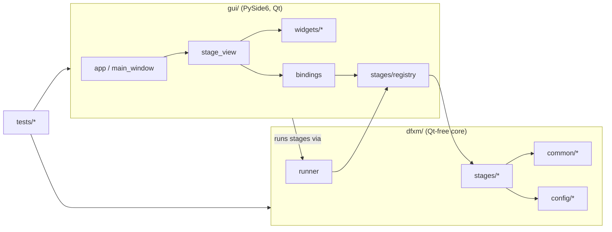

# DFXM Pipeline — Codebase Reference

> [!info] What this is
> A file-by-file, part-by-part explanation of the **entire** codebase: what each
> module, class, and function does and how the pieces fit together. For *how to
> use* the app see [[Usage]]; for contributor conventions see `CLAUDE.md`. This
> document focuses on *what the code is*.

> [!note] Keep this in sync
> When you add/remove a module, class, or public function — or change what one
> does — update the matching entry here in the same change (see
> [[#Maintaining this reference]]).

## Contents

- [[#Big picture]]
- [[#Repository layout]]
- [[#Layer 1 — `dfxm/` core library]]
    - [[#`dfxm/config` — typed config & presets]]
    - [[#`dfxm/common` — shared primitives]]
    - [[#`dfxm/stages` — the nine analysis stages]]
    - [[#`dfxm/runner.py` — the process worker]]
- [[#Layer 2 — `gui/` PySide6 application]]
- [[#Layer 3 — `tests/`]]
- [[#Data & artifact flow]]
- [[#Project files]]
- [[#Maintaining this reference]]

---

## Big picture

The codebase is three layers with a strict one-way dependency:



> [!important] The core invariant
> **`dfxm/` never imports Qt.** The GUI imports the core; the core never imports
> the GUI. That is what lets every stage run headless (CLI/tests) and keeps the
> stage **worker process** lightweight. Heavy optional deps (`pyvista`/`vtk`)
> are imported *lazily*, inside the functions that need them.

Three ideas recur everywhere:

1. **Schema-driven stages.** A stage is a pure function `run(params, progress=None)
   -> result` plus a declarative `STAGE: StageSpec`. The GUI builds its form from
   the schema; the CLI and tests call `run` directly.
2. **One shared alignment.** Every volume stage co-registers through the *single*
   implementation in [[#`alignment.py`]] (origin-0 PVTI world frame). No stage
   re-implements the samy-shift / Z-interpolation.
3. **Process isolation.** Long/`matplotlib`/3-D work runs in a child process via
   [[#`dfxm/runner.py` — the process worker]] so the UI stays responsive and
   cancellable.

---

## Repository layout

```
dfxm_pipeline/
├── dfxm/                  # Layer 1 — Qt-free core library
│   ├── config/            #   typed config models + YAML presets
│   ├── common/            #   shared primitives (sort, h5io, alignment, plotting, figures, …)
│   ├── stages/            #   the 9 analysis stages + registry
│   └── runner.py          #   run a stage in a child process
├── gui/                   # Layer 2 — PySide6 desktop app
│   └── widgets/           #   reusable Qt widgets (incl. export_dialog)
├── tests/                 # Layer 3 — pytest suite + fixtures
├── experiments/           # shipped experiment presets (YAML)
├── docs/                  # Usage.md (user) + Codebase.md (this file)
├── CLAUDE.md  README.md  pyproject.toml  .claude/settings.json  .gitignore
```

---

## Layer 1 — `dfxm/` core library

`dfxm/__init__.py` — package marker; defines `__version__` and states the
**Qt-free invariant** in its docstring.

### `dfxm/config` — typed config & presets

#### `models.py`

The declarative backbone. Nothing here touches Qt; the GUI *reads* these types
to build forms.

| Symbol | Kind | What it does |
|---|---|---|
| `ParamType` | `str, Enum` | The editor kinds: `INT, FLOAT, STR, BOOL, PATH, DIR, SAVE_PATH, ENUM, TEXT`. The GUI maps each to a widget. `TEXT` = multi-line (JSON). |
| `Param` | frozen dataclass | One parameter: `name, type, label, default, unit, choices, help, calibration`. GUI metadata: `advanced` (True → collapse into the Advanced expander), `group` (themed header inside the Advanced section), `must_exist` (True → the GUI verifies the path exists on disk before a run). ROI-picker hooks: `roi_group` (non-empty string → this param belongs to a named ROI-picker target; all params sharing a `roi_group` are edited together), `roi_axis` (`"" | "x" | "y" | "both"` — which spatial axis the param constrains; `"both"` means one 4-int `r0,r1,c0,c1` field). `__post_init__` enforces: (1) `ENUM` has `choices`; (2) non-empty `roi_axis` requires non-empty `roi_group`; (3) `roi_axis` ∈ `{"", "x", "y", "both"}`. `coerce(value)` converts a raw form string to the declared type. |
| `StageSpec` | frozen dataclass | A stage's identity + its `params` tuple. `defaults()` → dict of defaults; `get(name)` → a `Param`; `coerce_all(values)` → all values coerced with defaults filled in. |
| `Experiment` | dataclass | The shared, preset-saved state: data roots, folder glob patterns (`folder_pattern`, `mosa_pattern`, `rocking_pattern`), calibration (`ccmth_ref_deg`, pixel scales), and beamline HDF5/motor paths. `to_dict()` / `from_dict()` (the latter warns on unknown keys). |
| `EXPERIMENT_SCHEMA` | `tuple[Param]` | The display schema for `Experiment`, in field order. A test asserts it stays in lock-step with the dataclass fields. |
| `CALIBRATION_FIELDS` | tuple[str] | Names of the physically-meaningful fields (flagged red in the form). |
| `experiment_schema()` | fn | Returns `EXPERIMENT_SCHEMA`. |

`tests/test_param_metadata.py` enforces the metadata contract: every `Param` must have a `help` string, every advanced param must have a `group`, and every stage declares between 1 and 8 essential (non-advanced) params.

#### `presets.py`

Load/save/discover experiment presets (YAML in `experiments/`).

| Function | What it does |
|---|---|
| `experiments_dir()` | Default presets dir = `<project root>/experiments`. |
| `discover_experiments(dir=None)` | `{name → path}` for every `*.yaml` (name from the YAML `name:` key, else the file stem); sorted. |
| `load_experiment(path)` | Read one YAML → `Experiment`. |
| `save_experiment(exp, path)` | Write an `Experiment` to YAML (field order preserved; comments not emitted). |
| `load_experiment_by_name(name, dir=None)` | Discover + load by name. |

### `dfxm/common` — shared primitives

`common/__init__.py` is just a package marker. The rest are the de-duplicated
building blocks the legacy scripts each re-implemented. New in the plot-export
workstream: `plotting.py` gained the `PlotStyle` dataclass and publication
primitives; `figures.py` was added as the stage-figure catalog.

#### `sort.py`
- `natural_sort_key(s)` — orders embedded numbers numerically (`layer__2` before `layer__10`).
- `find_matching_folders(root, pattern)` — directories matching a glob, natural-sorted by basename.

#### `errors.py`
- `StageUserError(message, hint="")` — a `ValueError` subclass that marks an input problem the user can fix (wrong path, missing file, bad parameter). Stages raise it at their input-validation choke points. The runner captures it and forwards `hint` to the GUI, which displays both `message` and `hint` in the status banner so the user knows what to change. `tests/test_stage_user_errors.py` checks that each stage raises this (not a bare exception) for malformed inputs.

#### `h5io.py`
Stage-agnostic HDF5 I/O (used mostly by [[#concat.py]]).

| Function / type | What it does |
|---|---|
| `resolve_input_file(folder, override)` | BLISS convention: `folder/folder.h5` (or an override name). |
| `make_output_path(in, suffix="_concat")` | `<stem><suffix><ext>` next to the input. |
| `get_filtered_entries(h5f, suffix)` | Top-level groups ending in `suffix` (e.g. `.1`), natural-sorted. |
| `make_virtual_source(ds, out, policy)` | A `VirtualSource` referencing `ds` by **relative** (portable) or **absolute** path. |
| `build_virtual_layout(sources, counts, shape, dtype)` | Stack per-scan detector sources along axis 0 into one `VirtualLayout`. |
| `detector_info(ds)` | `(n_frames, frame_shape, dtype)` for a 3-D stack. |
| `read_positioners(h5f, group)` | Every dataset under a positioners group → `{name: value}` (raw). |
| `read_samy_samz(h5f, group, …)` | The `samy`/`samz` stages specifically. |
| `MapsValidation` + `validate_maps_file(path, required)` | Bracket darfix: check a `maps.h5` has the required COM datasets *without raising* (returns a result object that is truthy when valid). |

#### `pixel_size.py` (new)
`compute_pixel_size(scan_h5, positioners_path="instrument/positioners",
entry_suffix=".1") -> PixelSizeResult`. Reads the far-field geometry motors
(`mainx`, `obx`, `ffsel`, `ffz`, `lenssel`) from the first matching entry of a
raw (pre-darfix) scan and derives the effective detector pixel size. `mainx`
reads negative in the ID03 motor frame, so the formulas use its magnitude:
`M = |mainx|/obx − 1`, `E_x = base/M` (base 3.25 for 2× at `ffsel=−60`, 0.65 for
10× at `ffsel=0`), `2θ = atan2(ffz, |mainx|)`, and `E_y = E_x/sin(2θ)` when the
condenser is in (`lenssel=0`) else `E_y = E_x`. Raises `StageUserError` for a
missing entry/motor, an unrecognized `ffsel`, a non-positive `obx`, a
non-physical magnification, or (condenser in) a non-positive `2θ` (`ffz ≤ 0`) —
so a sign-flipped motor errors out instead of writing a negative pixel size.
`PixelSizeResult` carries both pixel sizes plus `magnification`,
`two_theta_deg`, `objective`, `condenser_in`, and the raw (signed) motor values.

#### `alignment.py`
The **single source of truth** for putting volumes into the shared world frame.
The fixed order is `abs(FWHM) → ROI → samy X-shift → uniform-Z interp → centre`.

| Function / type | What it does |
|---|---|
| `_samy_ref(samy, ref)` | Resolve the X reference: explicit value, else `samy[0]`. |
| `compute_pad_left/right(samy, scale_x, dir, ref_samy=None)` | The left/right canvas padding the X-shift will add (same formula, so an origin can be anchored). |
| `apply_samy_shifts_to_volume(vol, samy, scale_x, dir, ref_samy=None)` | Sub-pixel shift each Z-layer along image-X by its samy offset, expanding the canvas (NaN-padded). `ref_samy` anchors to an external frame (the rocking stage anchors to mosa). |
| `interpolate_to_uniform_z(vol, samz, ref_samz=None)` | Resample irregular `samz` layers onto a uniform Z grid → `(vol, z_uniform_um, scale_z)`. |
| `apply_roi_3d(data, roi_x, roi_y)` | Crop a `(Z,Y,X)` volume in pixel coords. |
| `center_around_zero(data, method)` | Subtract the `mean`/`median` over finite voxels → `(data, offset)`. |
| `raw_detector_origin(samy, z, …)` | World origin (µm) placing a volume in the raw-detector-absolute frame (folds in samy pad + ROI + darfix origin). |
| `AlignedVolume` + `align_volume(...)` | Convenience wrapper running the whole fixed pipeline in one call. |

#### `raster.py`
Per-layer sample positions.
- `find_h5_file(folder)` — the `.h5` in a folder (`folder.h5`, else smallest `*.h5`).
- `extract_motor_positions(folders, samy_path, samz_path)` — scalar `(samy, samz)` per folder → `(samy_arr, samz_arr, names)`; folders without motors are skipped.
- `nearest_index(samy_arr, samz_arr, ty, tz)` — index of the layer closest to a target `(samy, samz)` (used by [[#matched.py]]).

#### `cmaps.py`
ParaView colormaps not shipped with matplotlib. Holds the authoritative *Fast*
control points (9 sRGB points, `ColorSpace: "Lab"`, from ParaView master
`Remoting/Views/ColorMaps.json`), converts them to CIELAB, interpolates
linearly on the normalized positions (exactly how ParaView renders the map) and
bakes a 256-entry `ListedColormap` named `"fast"`. `fast_colormap(n=256)`
builds it; `register()` registers it with `matplotlib.colormaps` (idempotent)
and is called once at [[#plotting.py]] import, so `"fast"` resolves everywhere
— matplotlib, the export dialogs, and pyvista alike.

#### `plotting.py`
GUI-safe plotting helpers — **never** `pyplot`/`matplotlib.use`.

- `symmetric_limits(data, percentile=None)` — colour limits symmetric about 0.
- `round_limits_outward(vmin, vmax)` — round colour limits outward (vmin down, vmax up) to "nice" 2-significant-digit values (step = 0.5 × 10^floor(log10|v|)), so evenly spaced colourbar ticks land on round numbers. Symmetric input stays exactly symmetric. Zero, non-finite, or degenerate inputs are returned unchanged.
- `apply_round_clim(vmin, vmax, style)` → `(vmin, vmax, note | None)` — call `round_limits_outward` when `style.round_clim` is set. Returns a human-readable note string describing what changed (e.g. `"colour limits rounded ±0.0778 → ±0.08 (round_clim)"`) or `None` when rounding is off/not needed. Stages surface the note in the run log and results summary.
- `physical_extent(shape, px, py, roi)` — imshow `extent` in µm.
- `get_cmap(name)` — colormap lookup; ParaView's `"fast"` is a real registered colormap (see [[#cmaps.py]]), so no fallback is needed.
- `new_figure(figsize)` — a white `Figure` (no pyplot).
- `styled_figure(figsize, *, styled)` — the Figure constructor every shared builder uses. `styled=True` (a `PlotStyle` is in play) turns on matplotlib constrained layout, which measures every text element at its final font size and reserves space so title/axis-labels/colourbar/offset-text can never overlap — the figure keeps its exact requested size and the axes shrink instead. `styled=False` is the legacy path: a plain `Figure`, byte-identical with the pre-export renderers. `build_companion_figure` (profiles) is the one exception — it is constrained on both paths, so it always passes `styled=True`.

**Publication-export primitives** (new; all accept a `PlotStyle` argument):

| Symbol | What it does |
|---|---|
| `PlotStyle` | Dataclass holding every style knob — scale bar (show / length / thickness / label-scale / location / edge-inset `scale_bar_inset_pt` in printed points / colour / box show+colour+alpha+margin), text (font_scale / `title_scale` / show_title / center_axis_labels), colourbar (show / label / fraction / ticks / `round_clim`), figure (figure_width, `scale_um_per_cm`), output (formats / dpi) and **per-quantity colormaps** (`cmap_mosa_com="fast"`, `cmap_mosa_fwhm="magma"`, `cmap_strain="RdBu_r"`, `cmap_raw="gray"`, looked up via `cmap_for(group)`; groups in `CMAP_GROUPS`, curated dropdown list in `CMAP_CHOICES`). `None` in any builder means "use legacy look". `title_scale` multiplies the title font size independently of `font_scale`. `round_clim=True` routes auto-computed colour limits through `apply_round_clim` in the slices, strain, visualize, rocking, and matched stages (matched rounds only when both `vmin`/`vmax` params are blank). Per-group colourbar number format is controlled by `tickfmt_<group>` / `offset_scale_<group>` / `offset_pos_<group>` fields (one per `CMAP_GROUPS` entry), looked up via `tickfmt_for(group)` / `offset_scale_for(group)` / `offset_pos_for(group)`; `group=None` returns the neutral defaults (`"auto"` / `1.0` / `"top"`). `scale_um_per_cm: float \| None = None` is an opt-in fixed physical scale (µm of data per cm of page) for MAP figures — when set it overrides `figure_width` for maps (trace figures keep using `figure_width`); read defensively via `fixed_scale`/`fixed_scale_box` below, never `style.scale_um_per_cm` directly. |
| `PUBLICATION_STYLE` | A ready-made `PlotStyle` tuned for publication: white scale bar with a box, font_scale=2.2, colourbar_ticks=5, single-column width, PNG+PDF+SVG at 300 dpi, and per-group tick formats (strain → scientific with the ×10ⁿ exponent at the **bottom**, mosaicity → auto, raw → arbitrary units). |
| `figure_size(style, ext_x, ext_y)` | Returns `(w, h)` in inches from `style.figure_width` (`"single"`=3.5 in, `"double"`=7.0 in), preserving the physical aspect ratio plus ~1 in headroom; returns `None` for `"auto"`. |
| `fixed_scale(style)` | Defensive read of `style.scale_um_per_cm`: `None` for `style=None`, a missing attribute, a blank/non-numeric/non-positive/non-finite value (stale persisted strings like `"50"` still parse; `"junk"` degrades to `None` like any other malformed style field), else the positive float. Never raises. |
| `fixed_scale_box(style, ext_x_um, ext_y_um)` | Target axes-box `(w_in, h_in, effective_um_per_cm)` for fixed-scale mode: `w_in, h_in = ext_x_um/scale/2.54, ext_y_um/scale/2.54`. Returns `None` when `fixed_scale(style)` is `None` or either extent is non-positive/non-finite (degenerate — caller keeps its own sizing). A typo scale that would request a side over `_MAX_FIXED_SIDE_IN` (30 in) is clamped to 30 in preserving aspect, with the effective µm/cm raised accordingly and a `logging.warning` — never an exception or an oversized render. |
| `fit_axes_to_box(fig, ax, w_in, h_in, tol_in=0.02, max_iter=3)` | Draw–measure–resize helper: attaches a `FigureCanvasAgg` if the canvas can't render, then draws, measures `ax.get_window_extent()`, and corrects the figure size ADDITIVELY by the miss between the measured axes box and `(w_in, h_in)` — decorations (title/colourbar/labels) are constant in inches, so the first correction is nearly exact and the loop (`max_iter`, default 3) is insurance. The target box must carry the data aspect so `aspect="equal"` doesn't fight the fit. Returns `True` once the miss is within `tol_in` on both axes; on non-convergence keeps the last (finite, floor-clamped ≥0.5 in) size, logs at `INFO`, and returns `False` — never raises. |
| `finalize_fixed_scale(fig, ax, style, ext_x_um, ext_y_um)` | Convenience wrapper: computes `fixed_scale_box(style, ext_x_um, ext_y_um)` and, when set, calls `fit_axes_to_box` with it; a no-op (returns `None`) when the fixed-scale knob is off or the box is degenerate. Currently has no in-tree callers — the stage builders call `fixed_scale_box` + `fit_axes_to_box` directly (they need `box[2]`, the effective µm/cm, for the scale bar); this wrapper is kept as the documented convenience for future stage authors and is covered on-path by `test_finalize_fixed_scale_fits_axes_box_on_path`. |
| `auto_scale_bar_length_um(ext_x)` | A "nice" bar length ≈15% of the X extent, snapped to the 1–2–5–10 series. |
| `draw_scale_bar(ax, length_um=None, *, style, fixed_scale_um_per_cm=None)` | Draw a µm scale bar on `ax` whose data coordinates are in µm. Built as an `AnchoredOffsetbox` in `ax.artists` (`VPacker`: bold label `TextArea` over a bar `Rectangle` in an `AuxTransformBox(transData)`): the optional background box is laid out at draw time around the *rendered* label + bar, so it hugs its content at any `font_scale` (exact under constrained layout), and label/bar are mutually centred. `length_um=None` calls `auto_scale_bar_length_um`. Box padding (`scale_bar_box_margin_pt`) is in real points and applies only while the box is shown; the corner inset is `scale_bar_inset_pt` in real printed points (`borderpad = max(inset_pt, 0)/label_size`; default 15 pt ≡ the former fixed 1.5 font units at default fonts, but no longer growing with `font_scale`). Robust against hand-written styles: non-canonical `scale_bar_loc` strings fall back via the old substring rule, and the label size is floored so `font_scale=0` can't divide by zero. `set_in_layout(False)` keeps constrained layout from budgeting figure margin for it, and every packed artist is clipped to the axes (`AnchoredOffsetbox` ignores its own clip flag), so extreme font scales truncate at the axes edge like the old clipped label. `fixed_scale_um_per_cm` is a keyword-only, opt-in-per-call override for bar **height**: when a positive value is given, `bh = style.scale_bar_thickness_pt * (2.54/72.0) * fixed_scale_um_per_cm` (true printed points at that known µm-per-cm scale) instead of the default `abs(yr) * 0.004 * style.scale_bar_thickness_pt`. The function never infers the scale from `style` itself — only a caller that has actually fit the axes to a physical page size via `finalize_fixed_scale` may pass it; an un-fitted caller must leave it `None`. Left `None` (the default), geometry is byte-identical to before this knob existed. |
| `apply_text_scale(ax, style)` | Scale axis-label/tick fonts by `style.font_scale` and the title by the independent `style.title_scale`; apply `show_title` and `center_axis_labels`. Also grows the title's `pad` proportionally to `font_scale` — a colourbar's scientific-notation offset text sits just above the axes and constrained layout does not account for it when reserving room for the title, so without extra pad the two collide at large font scales. |
| `colorbar_tick_values(vmin, vmax, n)` | `n` evenly-spaced tick values from vmin..vmax (always includes both endpoints). |
| `add_colorbar(fig, im, ax, label, style, *, group=None)` | Add a colourbar honouring `style.colorbar_fraction`, label, tick count, and the per-group number format `style.tickfmt_for(group)`. `group` is one of `CMAP_GROUPS` (or `None` = neutral). Formats: `"auto"`/digit as before; `"scientific"` draws a custom, styleable `×10ⁿ` exponent label at the group's `offset_pos_*` (top/bottom) and `offset_scale_*` size, hiding matplotlib's built-in top offset; `"arb"` drops all ticks and appends " (arb. units)" to the label (unless it already says a.u./arb, or a manual `colorbar_label` override is set). |
| `build_histogram(data, *, title, xlabel, style)` | Histogram of finite values in `data` (steelblue bars, mean/median lines). Returns a `Figure` or `None` when there are no finite values. Applies text scaling when `style` is not `None`. The caller calls `fig.savefig`. |
| `resolve_cmap(style, group, fallback="magma")` | Colormap name for a quantity group from *style* (PlotStyle defaults when `style=None`); `group=None` returns *fallback* unchanged. Every stage builder resolves its colormap through this at build/run time. |
| `GROUP_BY_KIND: dict[str, str]` | Maps a volume "kind" (as stored in HDF5 attrs: `mosa_com`, `mosa_fwhm`, `strain`, `raw_sum`, `raw_specific`, `raw_mosa_sum`, `raw_mosa_specific`) to its quantity group; shared by slices and profiles. The mosa raw kinds map to `"raw"`. |
| `style_from_params(params)` | Rebuild the GUI-injected style from the reserved `plot_style` params key (`None` when absent → legacy/headless look). Unknown keys dropped, missing keys defaulted, `formats` list→tuple. |
| `style_to_json(style)` / `style_from_json(text)` | JSON (de)serialisation used for QSettings persistence; `style_from_json` returns `None` on any parse/shape failure. |

#### `render.py`
Shared **volume** renderers used by [[#visualize.py]] and [[#rocking.py]].
- `cmap_nan_transparent(name)` — colormap with NaN → transparent.
- `layer_figure(layer, vmin, vmax, cmap, ext_x, ext_y, title, cbar_label, *, style=None, group=None)` — one equal-aspect layer figure. `style=None` reproduces the legacy look (12×10 in, plain colourbar, no scale bar). When a `PlotStyle` is passed, figsize/colourbar/scale-bar/text-scaling are honoured; `group` (a `CMAP_GROUPS` name) selects the per-group colourbar tick format. When `style.scale_um_per_cm` is set, `plotting.fixed_scale_box` sizes the initial figure to the target axes box plus 1.5 in of decoration headroom (`figure_size`/`figure_width` are ignored for the map itself), `draw_scale_bar` gets the effective µm/cm for a point-exact bar, and `plotting.fit_axes_to_box` runs last (after the colourbar/title/scale-bar are all in place) to converge the axes box onto the fixed scale regardless of decoration load. Returns `(fig, ax, im)`. This one code path covers visualize/paraview/rocking/mosaicity/matched live runs, exports, and their `figures.render_volume_layer` replots.
- `save_layer_pngs(..., *, style=None, group=None)` — one PNG per Z layer (styled when a `PlotStyle` is passed); `group` (a `CMAP_GROUPS` name) forwarded to `layer_figure` for per-group colourbar tick format.
- `save_layer_animation(..., *, style=None, group=None)` — layer flip-through movie; MP4 (ffmpeg) → GIF fallback; `group` forwarded to `layer_figure`.
- `_pyvista_grid(data, spacing)` / `save_top_view(...)` — 3-D top-view render (**lazy** `pyvista` import; NaN voxels thresholded out).

> [!note] `render.add_scale_bar` was removed
> The old `render.add_scale_bar` function was deleted. Scale bars are now drawn by `plotting.draw_scale_bar` and are called from `render.layer_figure` (and from stage builders) when a `PlotStyle` with `scale_bar=True` is supplied.

#### `figures.py` (new)
Per-stage figure catalog: enumerate and rebuild a stage's saved figures at any `PlotStyle`. Qt-free.

| Symbol | What it does |
|---|---|
| `FigureSpec` | Dataclass with `figure_id: str`, `title: str`, `kind: str` (`"map"` or `"plot"`), `filename: str` (export stem, no extension), `build: Callable[[PlotStyle \| None], Figure]`. The `build` callable re-reads the saved data from disk and returns a `Figure` at the requested style. |
| `ReplotGroup` | Dataclass with `key: str`, `label: str`, `item_labels: list[str]`, `shape: tuple[int, int] | None` (stored layer `(Y, X)` pixel shape). Represents one selectable group in a replot catalog (a dataset/product with N layers); used by the mosaicity/rocking cold-replot paths. `shape` is surfaced in the dialog tree as the ROI-crop pixel-bounds reference. |
| `resolve_clim(clim, key)` | Pick the per-group `(vmin, vmax)` override for one replot group *key*. `clim=None` → `None` (keep stored limits); a single `(vmin, vmax)` tuple applies to every key (legacy); a `{key: (vmin, vmax)}` mapping is looked up per key (a missing key → `None`, i.e. stored). Called inside every stage's `render_replot` loop so the dialogs can set colour limits per key — per-quantity `volume_id` in slices (χ/μ and each `raw_*` separate, with a colormap-group fallback), per HDF5 dataset key in the generic dialog. |
| `load_middle_layer(h5_path, dataset)` | Return the middle-Z 2-D layer of a `(Z,Y,X)` HDF5 dataset. Used as an ROI-picker preview helper; `h5py` imported lazily inside the function. |
| `crop_roi_2d(layer, roi)` | Crop a 2-D array to `(r0, r1, c0, c1)` pixel bounds, clamped to the array shape. `roi=None` returns *layer* unchanged. Returns `None` when the (clamped) crop is empty. |
| `render_volume_layer(h5_path, dataset, z, *, cmap, cmap_group, title, cbar_label, sx, sy, vmin, vmax, style, clim=None, roi=None, z_um=None)` | Read one `(Z,Y,X)` layer from HDF5, apply optional ROI crop and clim override, and return a map `Figure` (or `None` if the crop is empty). Shared render path used by both `volume_layer_specs` export and the mosaicity/rocking cold-replot. |
| `register(stage_name)` | Decorator: registers a `fn(result, params) -> list[FigureSpec]` catalog function for a stage. `concat` and `paraview` pre-register as empty catalogs. |
| `figures_for(stage_name, result, params)` | Lazy-import all stage modules (via `_load_stage_catalogs()`) then call the registered catalog function. Returns `[]` if no catalog is registered. |
| `volume_layer_specs(*, h5_path, dataset, id_prefix, title, cbar_label, cmap, cmap_group=None, sx, sy, vmin, vmax, z_um=None)` | Convenience factory: one `FigureSpec` of `kind="map"` per Z layer of a `(Z,Y,X)` HDF5 volume. Opens the file once (for the shape); each `build(style)` delegates to `render_volume_layer` (memory-light for large volumes). When `cmap_group` is given, `build(style)` resolves the colormap via `resolve_cmap(style, cmap_group, fallback=cmap)`. |
| `stacked_volume_previews(params)` | `(label, thunk)` ROI-picker previews shared by the co-registration stages (visualize/paraview/slices). Reads `mosa_volume_file` and `strain_volume_file` from `params`; for mosa, opens the HDF5 and finds whichever of `chi/Center of mass` / `mu/Center of mass` are present; for strain uses the top-level `strain` dataset. Each thunk returns `(array2d, sx_um, sy_um)` — the middle-Z layer via `load_middle_layer` plus the pixel scales from `pixel_size_x_um`/`pixel_size_y_um` (defaults 0.152/0.385). Qt-free; returns `[]` when neither file is set or readable — never raises. |

The lazy load (`_load_stage_catalogs`) ensures `import dfxm.common.figures` is cheap and headless-safe — heavy deps (h5py, scipy) are only pulled in on the first `figures_for()` call.

### `dfxm/stages` — the nine analysis stages

`stages/__init__.py` documents the `run(params, progress=None) -> result`
contract. Every stage module follows the same shape: a module-level
`STAGE: StageSpec`, one or more result dataclasses, the ported numeric core, a
`run()` entry point, and a `_main()` CLI.

#### `registry.py`
- `STAGE_TARGETS: dict[name → "module:function"]` — the lazy stage map; importing it does **not** import matplotlib/pyvista/h5py.
- `resolve(target)` — resolve a `"module:function"` string (or callable) to a callable.
- `resolve_stage(name)` — resolve a registered stage name.

#### `concat.py`
Port of `concatenate_h5_scans_v3` + `batch_concatenate_h5_scans_v1`. Combines a
BLISS file's `*.1` entries into one darfix-ready `entry_0000`.
- `ConcatFileResult` / `ConcatResult` — per-file and aggregate outcomes (`n_ok`, `n_skipped`, `n_failed`, `outputs`).
- `collect_positioners(...)` — merge motors across scans (arrays concatenated; varying scalars expanded per-frame; uniform scalars collapsed).
- `concatenate_single_file(...)` — write one output: detector stack as a **VDS** (default) or a self-contained **copy** (`copy_data=True`), plus merged positioners.
- `run(params, progress)` — dispatch `single`/`batch` mode; `_main()` — CLI.

#### `strain.py`
Port of `calc_axial_strain_v7_batch`. Per-pixel axial strain (cot method,
ccmth-only) → stacked 3-D volume.
- `LayerResult` / `StrainResult` — per-layer stats + the stacked path/shape. `LayerResult.maps_path` records the source `maps.h5` this layer was computed from, so `figures()` can rebuild the detrend diagnostic for **nested** `folder_pattern`s (the layer name alone loses sub-folders).
- `cot`, `_arctan_model`, `_fit_arctan_1d`, `detrend_arctan_2d` — the separable arctan **detrend** (run on the full map, **before** ROI).
- `compute_strain(ccmth, ccmth_ref)` — single-array `cot(ccmth_ref)·Δccmth`.
- `build_strain_map(strain, px, py, roi, vlim, *, style=None)` — build and return a strain map `Figure` (cmap = `resolve_cmap(style, "strain")`, default RdBu_r; equal aspect). When `style` is `None` the legacy look is reproduced; otherwise colourbar, scale bar, and text scaling are applied via the shared helpers. When `vlim == (None, None)` the auto limits come from `symmetric_limits` and are then passed through `apply_round_clim(style)` — user-specified `vlim` is never rounded. The `apply_round_clim` note is discarded (strain has no `result.notes`; rounding is visible only on the colourbar). When `style.scale_um_per_cm` is set, the same fixed-scale fitting as `render.layer_figure` applies: `plotting.fixed_scale_box` sizes the figure (target box + 1.5 in headroom), `draw_scale_bar` gets the effective µm/cm, and `plotting.fit_axes_to_box` converges the axes box just before returning. The caller calls `fig.savefig`.
- `build_strain_histogram(data, *, title, xlabel, style=None)` — thin wrapper around `plotting.build_histogram` with strain-specific label defaults. Returns a `Figure` or `None`.
- `build_detrend_diag(original, detrended, surface, *, style=None)` — 3-panel detrend-diagnostic figure (original / arctan surface / detrended). `style` applies the strain-group colormap, colourbar and text scaling per panel; no scale bar (it is a `kind="plot"` figure).
- `process_maps_file(..., style=None)` — one `maps.h5` → 2-D strain + diagnostic PNGs (builders receive the run's `style`; `run` passes `style_from_params(p)`, so GUI runs render publication-styled).
- `save_stacked_volume(...)` — stack all layers into `stacked_strain_volumes.h5`.
- `figures(result, params)` — `@register("strain")` catalog: three `FigureSpec`s per layer — `kind="map"` strain map, `kind="plot"` histogram, `kind="plot"` detrend diagnostic. The map `build` rebuilds with the **same** `roi` and `vlim` `run()` used (so the export matches the saved PNG: symmetric zero-centred RdBu_r and the ROI axis offset, rather than raw per-layer min/max). The detrend `build` re-reads the source `maps.h5` (via `LayerResult.maps_path`) to recompute the arctan surface.
- `_rebuild_strain_map(h5_path, layer_idx, style, *, clim=None, roi=None, params=None) -> Figure | None` — cold single-layer rebuild from a stacked `stacked_strain_volumes.h5`. Reads `strain[layer_idx]`, pixel scales from `params` (falling back to `scale_x_um`/`scale_y_um` in file attrs). When `roi` (pixel bounds `(r0, r1, c0, c1)`) is given, crops via `crop_roi_2d` and renders with zero-origin extent (extent ROI is not re-applied); when no `roi`, `_parse_roi` on `params["roi"]` gives the µm-axis offset. `clim` overrides the symmetric vlim; `(None, None)` falls through to `build_strain_map`'s auto path. Returns `None` when the ROI crop is empty.
- `_derive_maps_path(layer_name, params) -> str` — reconstruct the `maps.h5` path for *layer_name* exactly as `run()` does. Single mode: `<input_folder>/<maps_filename>`; batch mode: `<root_folder>/<layer_name>/<maps_filename>`.
- `roi_previews(params) -> list[tuple[str, Callable]]` — ROI-picker hook for the `roi` param (tagged `roi_group="crop"`, `roi_axis="both"`). Returns a list of `(label, thunk)` pairs where `thunk() -> (array2d, sx_um, sy_um)` loads the ccmth CoM map from the resolved `maps.h5`. Single mode resolves `<input_folder>/<maps_filename>`; batch mode finds the first matching folder via `find_matching_folders` and derives the path with `_derive_maps_path`. Best-effort: returns `[]` when the file cannot be resolved (missing fields, non-existent path, or any exception) — never raises.
- `replot_catalog(h5_path) -> list[ReplotGroup]` — returns a single `ReplotGroup` (key `"strain"`, label `"Strain map"`) with one item per stored layer; item labels come from `f.attrs["source_folders"]` (newline-joined). Falls back to `"layer N"` labels if the attribute is absent or its count disagrees with the volume shape.
- `render_replot(h5_path, selections, style, clim, out_dir, roi=None, params=None) -> list[str]` — cold-replot selected strain layers: `selections` is `list[("strain", item_idxs | None)]` (`None` = all layers). `clim` may be `None`, a single `(vmin, vmax)` tuple, or a `{group_key: (vmin, vmax)}` mapping (resolved per selection via `resolve_clim`, keyed by the `ReplotGroup.key` `"strain"`). Delegates each layer to `_rebuild_strain_map` (with optional `roi` and the resolved `clim`), writes PNGs under `{out_dir}/strain/` (e.g. `strain/a_strain.png`), and returns the list of written paths. Out-of-range indices and layers where `_rebuild_strain_map` returns `None` (empty ROI crop) are silently skipped.
- `run` / `_main`.

#### `mosaicity.py`
Port of `stack_h5_darfix_volumes`. Stacks χ/μ Center-of-mass + FWHM maps.
- `MosaicityResult` — stacked path + per-dataset shapes + layers.
- `_read_dataset(h5f, path)` — a dataset or `None`.
- `_streamed_clim(dataset)` — global `(nanmin, nanmax)` of a `(Z,Y,X)` volume read **one layer at a time** (never materialises the whole volume), so listing the catalog stays memory-light for large stacks.
- `figures(result, params)` — `@register("mosaicity")` catalog: for each dataset key in `result.datasets`, one `kind="map"` `FigureSpec` per Z layer (via `volume_layer_specs`; `_KEY_DISPLAY` maps CoM keys → `mosa_com` and FWHM keys → `mosa_fwhm` colormap groups, resolved from the style at build time) plus one `kind="plot"` histogram `FigureSpec` per layer. `n_z`/`vmin`/`vmax` come from the dataset shape + `_streamed_clim` (no full-volume read).
- `replot_catalog(h5_path) -> list[ReplotGroup]` — enumerate every 3-D dataset present in a `stacked_volumes.h5`; iterates `_KEY_DISPLAY` and includes only datasets actually present in the file. Returns one `ReplotGroup` per key (key = in-file HDF5 path, label = display title, item_labels = `["layer 0", "layer 1", …]`).
- `render_replot(h5_path, selections, style, clim, out_dir, roi=None, params=None) -> list[str]` — cold-replot selected layers: `selections` is `list[(dataset_key, item_idxs | None)]` (`None` = all layers). Reads per-dataset default clim via `_streamed_clim`; `clim` may be `None`, a single `(vmin, vmax)` tuple, or a `{dataset_key: (vmin, vmax)}` mapping (resolved per dataset via `resolve_clim`, so χ/μ CoM and FWHM get independent limits). Delegates each layer to `render_volume_layer` (with optional `roi` crop and the resolved `clim`), writes PNGs under `{out_dir}/{stem}/` (e.g. `chi_com/chi_com_layer_0000.png`), and returns the list of written paths. Layers where `render_volume_layer` returns `None` (empty ROI crop) are silently skipped.
- `run` (a folder is included if any of its four maps exist) / `_main` → `stacked_volumes.h5`.

#### `rocking.py`
Port of `build_aligned_raw_rocking_volumes_v3`. Aligned 3-D volumes straight
from raw scans (rocking or mosaicity), anchored to the mosaicity reference.
- `RockingProducts` / `RockingResult` — per-volume render products + aligned path/shape/reference. `RockingProducts.notes` collects one entry per volume whose auto colour limits were rounded (when `round_clim` is set), surfaced in the run log and the Results summary.
- `_sum_title(source)` / `_spec_title(source, idx)` — source-aware product titles; return "Mosa-integrated …" when `source == "mosaicity"`, "Background-subtracted …" otherwise. Used in both `run()` and `figures()`.
- `process_raw_scan(..., normalize_sum, subtract_background=True)` — when `subtract_background` (default), removes a per-pixel median background before summing (rocking behaviour); with `False`, returns a plain frame sum and the raw specific frame (mosa-topograph behaviour).
- `build_raw_volumes(..., normalize_sum, subtract_background=True, progress=...)` — stack scans (sorted by samz) into two 3-D volumes; threads `subtract_background` into each `process_raw_scan` call.
- `save_aligned_raw_volumes(...)` — write the aligned volume HDF5 (the schema [[#slices.py]] reads).
- `_render(..., style=None)` — per-volume PNGs/animation/top-view via [[#render.py]]; `run` resolves the raw-group colormap (`resolve_cmap(style, "raw")`, default gray) and threads the injected style through.
- `figures(result, params)` — `@register("rocking")` catalog: one `kind="map"` `FigureSpec` per Z layer for each aligned volume (sum intensity, specific frame), via `volume_layer_specs` with `cmap_group="raw"`; reads `source_scan` from params to pass source-aware titles via `_sum_title`/`_spec_title`.
- `run` — `source_scan="rocking"` (default): mosa reference + mosa∪strain samz union filter + alignment, writes `aligned_raw_rocking_volumes.h5`; `source_scan="mosaicity"`: every matched mosa folder is a layer (no samz-union masking), writes `aligned_raw_mosa_volumes.h5` when the output name/dir are still the rocking defaults / `_main`.
- `_DATASET_DISPLAY` — dict mapping each in-file dataset key (`sum_intensity`, `specific_frame`) to a `(title, cbar_label)` pair for cold replot.
- `_replot_default_clim(dataset, params, style)` — default colour limits for a cold replot when the user leaves the clim boxes blank: reuses the run's `_colorbar_range` (percentile via `cbar_pct_lo`/`cbar_pct_hi`, falling back to `STAGE.defaults()` 1.0/99.0) + `apply_round_clim`, so a default replot matches the run/export scaling rather than raw min/max; returns `(0.0, 1.0)` when all values are non-finite.
- `replot_catalog(h5_path) -> list[ReplotGroup]` — enumerate every 3-D dataset present in an aligned rocking h5; iterates `_DATASET_DISPLAY` and includes only datasets actually present in the file (`isinstance(obj, h5py.Dataset) and obj.ndim == 3`). Returns one `ReplotGroup` per key, with `item_labels` annotated with Z coordinates when `z_uniform_um` is present.
- `render_replot(h5_path, selections, style, clim, out_dir, roi=None, params=None) -> list[str]` — cold-replot selected layers: `selections` is `list[(dataset_key, item_idxs | None)]` (`None` = all layers). Pixel scales fall back to `STAGE.defaults()` when absent from `params`. `clim` may be `None`, a single `(vmin, vmax)` tuple, or a `{product_key: (vmin, vmax)}` mapping (resolved per product via `resolve_clim`, so `sum_intensity` and `specific_frame` get independent limits); when the resolved clim for a product is `None` its default limits come from `_replot_default_clim` (percentile-based, matching the run). Source-aware titles/cbar (`_sum_title`/`_spec_title` + `normalize_sum` tag) are rebuilt from `params`, degrading to the generic `_DATASET_DISPLAY` labels when params are absent. Delegates each layer to `render_volume_layer` (with optional `roi` crop and the resolved `clim`), writes PNGs under `{out_dir}/{key}/` (e.g. `sum_intensity/sum_intensity_layer_0000.png`), and returns the list of written paths. Layers where `render_volume_layer` returns `None` (empty ROI crop) are silently skipped.

#### `visualize.py`
Port of `visualize_aligned_volumes_v6`. Aligns the stacked volumes and renders.
- `DatasetProducts` / `VisualizeResult`. `DatasetProducts.notes` collects one entry per dataset whose auto colour limits were rounded (when `round_clim` is set — applies to each mosaicity dataset and to strain), surfaced in the run log and the Results summary.
- Colour/centre helpers: `_symmetric_range`, `_midrange_clim`, `_center_com_and_range`, `_colorbar_range`, `_display_info` (title/label/**colormap group** per field: CoM → `mosa_com`, FWHM → `mosa_fwhm`, strain → `strain`, unknown → `None`).
- `load_mosa_datasets` / `load_strain_volume`, `_align(...)` (reuses [[#`alignment.py`]]), `_process_dataset(..., style=None)` (threads the run's style into the layer PNGs/animation).
- `run` → per-layer PNGs, animation, 3-D top-view; colormaps and figure styling come from the injected `plot_style` (via `style_from_params`/`resolve_cmap`).
- **3-D viewer helpers** (used by the GUI): `mosa_field_names(path)`, `available_fields(params)`, `aligned_field(params, name)` → `(volume, spacing, cmap, clim)` aligned with the *same* pipeline as the PNGs.
- `figures(result, params)` — `@register("visualize")` catalog: one `kind="map"` `FigureSpec` per Z layer per aligned dataset. Each `build` re-runs the alignment for its dataset (lazy per-dataset cache) and, for **Center-of-mass** datasets, re-applies the same `_center_com_and_range` centring `run()` used — so the export renders the centred volume against the centred `vmin/vmax`, matching the saved PNG (and the 3-D viewer).
- `roi_previews(params) -> list[tuple[str, Callable]]` — ROI-picker hook for the `roi_x`/`roi_y` params (tagged `roi_group="crop"`, `roi_axis="x"`/`"y"`). Delegates to `stacked_volume_previews(params)` in `dfxm.common.figures`. Returns `[]` when the volume files cannot be read.

#### `paraview.py`
Port of `export_aligned_volumes_to_paraview_v6_pvti`. Writes partitioned PVTI.
- `SAVE_DTYPE` (`float32`), `ExportInfo` / `ParaviewResult`.
- PVTI writer (`vtk` imported **lazily**): `_numpy_to_vtk_type_str`, `compute_piece_extents_z` (adjacent pieces share one Z index), `write_piece_vti`, `write_pvti_master`, `save_volumes_as_pvti` (NaN sentinels + `valid_mask`).
- `_process_mosaicity` / `_process_strain` — align (shared pipeline) then export; `run` writes `*.pvti` + `*_pieces/` + `export_info.txt`.
- `roi_previews(params) -> list[tuple[str, Callable]]` — ROI-picker hook for the `roi_x`/`roi_y` params (tagged `roi_group="crop"`, `roi_axis="x"`/`"y"`). Delegates to `stacked_volume_previews(params)` in `dfxm.common.figures`. Returns `[]` when the volume files cannot be read.

#### `slices.py`
Port of `extract_oblique_slices_v5`. Arbitrary planes through the aligned volumes.
- `SlicesResult` — `output_dir`, `output_h5`, `volume_ids`, `slice_names`, `n_planes_total`, `pngs`, `skipped`, and `notes: list[str]`. `notes` collects one entry per volume whose auto colour limits were rounded (when `round_clim` is set) plus one warning per slice whose volumes were sampled onto different `(nv, nu)` plane grids (mixed per-volume pixel scales with no explicit `du`/`dv` — the note lists the shapes/volumes and points at explicit `du`/`dv` as the remedy, since profiles can only mix fields sharing a grid), plus a Y-misregistration warning from `_y_height_notes` (below) — all surfaced in the run log and the Results summary.
- `_y_height_notes(volumes, roi_y, scale_y)` — misregistration guard, called at the top of `run`. Computes each selected volume's physical Y height reading only shapes/attrs (stacked: `align_roi_y` span × the stage `pixel_size_y_um`; aligned: `shape[1]` × the file's `scale_y_um_per_px`, labelled with the file's recorded `roi_y_start/end` attrs when present) and returns a single `volume Y heights differ — …` note when the spread exceeds `_Y_HEIGHT_RTOL` (5% — pixel-size rounding between runs is ~1%, a wrong detector-row crop is tens of percent). Motivated by the darfix origin+size vs start,end `roi_y` trap in the rocking stage: all volumes anchor at Y=0, so a height mismatch means features land at the wrong `v`. A note, not an exception.
- Geometry: `build_basis(normal, up)` (orthonormal u/v/n; u is the plot's horizontal axis, v its vertical. Default `up` is world **Y** — the detector-vertical axis (lab-frame X); falls back to Z when the normal is ≈ parallel to Y — so slice plots read like the per-layer renders: detector-X-like horizontal, detector-Y-like vertical), `slice_plane_offsets`, `sample_plane` (world→voxel via `map_coordinates`), `_world_box`/`_union_box`/`resolve_auto_extent` (`extent:"auto"` fits the data box; `default_du` ← `scale_x`).
- `_STD_VOLUMES` — 9-row tuple driving `_standard_volumes`: mosa χ/μ CoM/FWHM (stacked), strain (stacked), rocking raw sum/specific (aligned, from `aligned_rocking_file`), and mosa raw sum/specific (aligned, from `aligned_mosa_file`). The last two rows produce kinds `raw_mosa_sum` / `raw_mosa_specific`, both mapped to the `"raw"` colour group.
- `STAGE.params` includes `aligned_mosa_file` (PATH, `must_exist=True`, blank-allowed — immediately after `aligned_rocking_file`) and two Quantities-group BOOL toggles `include_mosa_sum` / `include_mosa_specific` (default `True`, after `include_raw_specific`).
- `use_pinned` (BOOL, default `False`, non-advanced, immediately after `slices_json`) and `pinned_slices_json` (TEXT, default `""`, `advanced=True`, `group="Pinned planes"`) — the fast pinned-plane re-run pair consumed by `run()`. `pinned_slices_json` is normally produced by `build_pinned_spec` (above) via the GUI "Pin planes…" dialog; the sweep in `slices_json` is never written to by anything.
- `prepare_volume(..., style=None)` — load + (if `stacked`) align + style; the colormap comes from `resolve_cmap(style, GROUP_BY_KIND.get(kind))` (shared constant; kind → group: `raw_sum`/`raw_specific`/`raw_mosa_sum`/`raw_mosa_specific` → `raw`) and the **resolved** name is written to the volume group's `cmap` attr in `oblique_slices.h5`, so profiles and the line picker inherit it. The result dict also carries `group` (a `CMAP_GROUPS` name or `None`) for use by `build_slice_figure`. Auto colour limits pass through `apply_round_clim(style)` and the result dict carries `vmin`, `vmax` (possibly rounded), `vmin_raw`, `vmax_raw` (the unrounded originals), and `clim_note`. `_estimate_box` for auto-extent; `_standard_volumes(...)` builds the volume list from the `include_*` toggles (now also looks up `aligned_mosa_file` in `file_keys`). Titles: `raw_mosa_sum` → "Mosa-integrated Sum Intensity"; `raw_mosa_specific` → "Mosa-integrated Frame N".
- `build_slice_figure(prep, sl, slice2d, u_um, v_um, *, offset_um, style=None)` — build and return a slice `Figure` (equal-aspect, µm axes). When `style` is `None` the legacy appearance is reproduced; otherwise figsize/colourbar/scale-bar/text-scaling are honoured. `prep["group"]` (a `CMAP_GROUPS` name, via `GROUP_BY_KIND[kind]`) selects the per-group colourbar tick format. When `style.scale_um_per_cm` is set, the same fixed-scale fitting as `render.layer_figure`/`build_strain_map` applies: `plotting.fixed_scale_box` sizes the figure (target box + 1.5 in headroom, bypassing `figure_size`/`figure_width`), `draw_scale_bar` gets the effective µm/cm for a point-exact bar, and `plotting.fit_axes_to_box` converges the axes box last, after the colourbar/title/scale-bar are all in place. `save_slice_png`, `_rebuild_plane_figure` (so the slices Replot dialog), and `render_replot`/publication export all inherit it since they funnel through this one function. Does NOT call `savefig`.
- `save_slice_png(prep, sl, slice2d, u_um, v_um, out_png, *, offset_um, dpi=150, style=None)` — build a slice figure (legacy look when `style` is None) and save it to `out_png` (used by `run`, which passes the injected style).
- `write_volume_group` — write one volume group to `oblique_slices.h5`; when `clim_note` is set it also writes `vmin_raw` / `vmax_raw` attrs alongside the rounded `vmin` / `vmax`, so downstream tools (profiles, line picker) can show or log the original unrounded limits.
- `_rebuild_plane_figure(h5_path, vid, sname, k, style, *, clim=None, roi=None) -> Figure | None` — shared single-plane rebuild helper used by both `figures()` and `render_replot`. Reads all needed attrs defensively from the `oblique_slices.h5` volume group (with fallback defaults), optionally overrides one or both colour limits via `clim=(vmin, vmax)` (a `None` entry keeps the stored value), and optionally applies a `roi=(r0, r1, c0, c1)` pixel-index crop to `s2d`, `u_um`, and `v_um` before calling `build_slice_figure`. Returns `None` when the clamped crop is empty. All attr-from-file reconstruction is funnelled through this one function — `figures()` no longer duplicates it.
- `figures(result, params)` — `@register("slices")` catalog: one `kind="map"` `FigureSpec` per plane per slice-name sub-group per volume group in `oblique_slices.h5`. Each `build(style)` delegates to `_rebuild_plane_figure` (attrs read defensively with fallbacks, so one group from an older/partial run missing an attr is catalogued and rendered with fallbacks rather than aborting the whole listing).
- `ReplotEntry` — dataclass: `volume_id: str`, `slice_name: str`, `n_planes: int`, `offsets_um: list[float]`, `shape: tuple[int, int] | None` (stored plane `(nv, nu)` pixel shape, shown in the dialog as the ROI-crop reference), `group: str` (the kind-group `GROUP_BY_KIND[kind]` — `mosa_com`/`mosa_fwhm`/`strain`/`raw` — which selects the **colormap** group; clim overrides are keyed per `volume_id` instead — χ/μ and each `raw_*` get independent limits).
- `replot_catalog(h5_path: str) -> list[ReplotEntry]` — enumerate every `(volume_id, slice_name)` present in an `oblique_slices.h5`, with plane count, offset list, and the volume's kind-group (`GROUP_BY_KIND[kind]`, read from the volume's `kind` attr) used to select the colormap group; clim overrides are keyed per `volume_id`. Skips any sub-group that doesn't contain a `slices` dataset.
- `plane_preview(h5_path, volume_id, slice_name) -> (array2d, sx, sy)` — ROI-picker preview helper: returns the middle plane of a slice group as a float64 2-D array plus its `(du, dv)` µm/px pitch. `sx=du` is the column/u/X pitch and `sy=dv` is the row/v/Y pitch, derived from the stored `u_um`/`v_um` axes — the resampled slice pitch, NOT the detector pixel scale.
- `render_replot(h5_path, selections, style, clim, out_dir, roi=None, *, dpi=150) -> list[str]` — rebuild + save selected planes (appearance-only; no resampling). `selections` is a list of `(vid, slice_name, plane_idxs)` where `plane_idxs=None` means all planes; out-of-range indices and unknown `(vid, slice)` pairs are silently skipped. `roi=(r0, r1, c0, c1)` is an optional pixel-index crop passed through to `_rebuild_plane_figure`; planes whose clamped crop is empty are silently skipped (never raise). PNGs are written under `{out_dir}/{slice_name}/` mirroring the run layout (`{vid}.png` for single-plane slices, `{vid}__p{k:03d}_{off:+08.2f}um.png` for sweeps). Returns the list of written paths. `clim` may be `None`, a single `(vmin, vmax)` tuple, or a `{key: (vmin, vmax)}` mapping; it is resolved per selection via a two-key fallback: first `resolve_clim(clim, entry.volume_id)` (e.g. `"mosa_com_chi"`, `"mosa_com_mu"`, each `"raw_*"`), then — if that returns `None` — `resolve_clim(clim, entry.group)` (colormap group: `mosa_com`/`mosa_fwhm`/`strain`/`raw`). This lets χ and μ CoM carry independent colour limits while group-keyed dicts remain fully backwards-compatible.
- `run` validates each slice up front, writes `oblique_slices.h5` + a PNG per plane; PNGs are written into per-slice-direction subfolders (`<out_dir>/<slice name>/`), e.g. `<out_dir>/oblique/mosa_com_chi.png`; appends a human-readable rounding note to `result.notes` (and logs it via `progress`) for each volume whose colour limits were rounded. It also records each volume's `(nv, nu)` plane grid per slice and, after the volume loop, appends a grid-mismatch warning note per slice whose volumes landed on different grids.
  - **Pinned-plane routing:** when `use_pinned` is true, `run` parses `pinned_slices_json` instead of `slices_json` (the sweep field is read only in the `else` branch — never touched while pinned). Empty/whitespace-only or invalid JSON raises `StageUserError` with a hint pointing at "Pin planes…" / unticking the toggle; a valid non-list or empty list raises the same. On success it appends a `PINNED RUN: rendering N pinned plane(s); the sweep in slices_json is ignored` note (also logged via `progress(0.03, ...)`) before falling into the shared per-slice validation/sampling loop used by both paths.
  - **Output-name clobber guard:** immediately before building `out_h5`, if `use_pinned` is true and `output_h5_name` still equals the stage default (`STAGE.defaults()["output_h5_name"]`, i.e. `"oblique_slices.h5"`), the effective filename is switched to `oblique_slices_pinned.h5` and a note is appended explaining why — so a pinned re-run can never overwrite the sweep file [[#8. Line profiles (`profiles`)|profiles]] reads. A user-edited `output_h5_name` is respected verbatim in both modes. Toggle off (`use_pinned=False`) reproduces the pre-existing behaviour byte-for-byte.
- `roi_previews(params) -> list[tuple[str, Callable]]` — ROI-picker hook for the `align_roi_x`/`align_roi_y` params (tagged `roi_group="crop"`, `roi_axis="x"`/`"y"`). Delegates to `stacked_volume_previews(params)` in `dfxm.common.figures`. Returns `[]` when the volume files cannot be read.
- `_find_slice_group(f, slice_name, volume=None) -> (volume_id, slice_group)` — locate the first volume group in an open `oblique_slices.h5` that holds `slice_name` (has an `offsets_um` dataset); `volume` forces a specific one. Raises `StageUserError` (hint lists the volumes present) when no volume carries that slice.
- `build_pinned_spec(h5_path, slice_name, offsets, *, volume=None) -> list[dict]` — the shared core behind `tools/pin_slice.py`'s CLI and the GUI **Pin planes…** dialog (`pin_planes.py`): for each requested offset, snap to the nearest plane stored in `slice_name`'s `offsets_um`, collapsing duplicate snaps, and emit a single-plane spec dict (`name`, `normal`/`origin`/`up`/`half_u`/`half_v`/`du`/`dv` read byte-exact off the stored slice-group attrs, `sweep_start_um == sweep_stop_um == matched offset`) that reproduces that exact sweep plane when re-run. Raises `StageUserError` (with hint) on an unreadable file or unknown slice name.

#### `profiles.py`
Port of `line_profile_oblique_slices_v2` (headless modes). 1-D profiles across one
slice plane, every field at the same in-plane positions.
- `ProfileJobResult` (now carries `traces: list[str]` — the per-field standalone trace PNGs; `figure` is `None` when `save_companion` is off; and `job_index: int | None` — the position of the originating spec in `jobs_json`, set by `run()` so `figures()` can pair a result with its own spec even when two jobs share a slice name) / `ProfilesResult` (`skipped` keeps its one-entry-per-job-that-produced-no-output invariant; per-field drop notes for jobs that still ran go to the separate `notes: list[str]`, shown as `note:` lines in the Results summary).
- **Profiling core** (pure, unit-tested): `grid_pitch`, `line_geometry`, `sample_nan_aware` (NaN-aware bilinear), `profile_plane`.
- HDF5 access: `volume_ids_with_slice`, `read_volume_attrs`, `read_axes`, `resolve_plane_index`, `check_geometry`. `resolve_job_slice_name(f, name, offset_um)` maps a job's slice name to its effective group: the exact name when present, else the `{name}_pin_*` single-plane group (written by a pinned slices run) whose stored offset is nearest `offset_um`; returns `(resolved_name, note)` and `run()` appends the note to `ProfilesResult.notes` when a pin was substituted. `_clim_attrs(attrs, vid, clim)` applies a per-quantity `(vmin, vmax)` limit override to a `read_volume_attrs` dict — exact field-id key first, then the field kind's colourmap group via `GROUP_BY_KIND` (`dfxm.common.figures.resolve_clim` resolution), half-open pairs keep the stored value on the blank side, `clim=None`/no match leaves `attrs` untouched; `_collect` threads an optional `clim` through to both the reference and per-field attrs.
- `ReplotJobEntry` — dataclass: `job_index: int`, `name: str` (resolved, possibly pinned, slice-group name), `label: str` (`"{fig_name or name}  @ {offset:+.2f} µm"`), `fields: list[str]` (volume ids carrying the slice, sorted), `note: str | None` (pin-substitution note, if any).
- `replot_catalog(h5_path, jobs) -> list[ReplotJobEntry]` — resolve each job's slice (plain or pinned, via `resolve_job_slice_name`) and list the fields present for it; a job whose slice has no match (plain or pinned) is omitted — the dialog shows only what will actually render, and `render_replot` re-reports the skip. Raises `StageUserError` for an unreadable file.
- `_render_parameter_job(f, job, ji, frac, p, result, used_stems, out_dir, style, progress, clim=None)` — the parameter-mode job body factored out of `run()` so `run()` and `render_replot()` share it verbatim (they cannot drift): calls `_collect(..., clim=clim)`, then writes companion/traces/CSVs/overviews per the `p` flags and appends the `ProfileJobResult` to `result`. `frac` is the caller's precomputed progress fraction for this job's drop notes (`progress(frac, msg)`); `ji` becomes the result's `job_index`. Not part of the public API — an implementation detail shared by the two entry points below.
- `render_replot(h5_path, jobs, style, clim, out_dir, *, dpi=None) -> ProfilesResult` — Qt-free cold replot: re-renders `jobs` (the same dicts `jobs_json` parses to) against a consolidated `oblique_slices.h5` on disk, with an optional per-quantity `clim` override (`{field_id_or_group: (vmin, vmax)}`, resolved inside `_collect`/`_clim_attrs`). Resolves each job's slice name (plain or pinned) up front, skipping (into `result.skipped`) any whose slice is absent; delegates each surviving job to `_render_parameter_job` with `save_csv` forced off — replots never write CSVs. `dpi=None` keeps the stage's `fig_dpi` default; progress reporting is a no-op (`_noop`). Raises `StageUserError` for a missing/unreadable h5 or an empty `jobs` list.
- `_draw_reference_image(ax, plane2d, u_um, v_um, attrs, line_color, geom=None, title=None, style=None, fixed_scale_um_per_cm=None)` — shared map-panel renderer used by both `build_companion_figure` and `render_single`. `fixed_scale_um_per_cm` is a keyword-only, opt-in-per-call pass-through to `plotting.draw_scale_bar`'s own parameter of the same name (never inferred from `style`); left `None` it draws the ordinary style-fraction bar.
- `build_companion_figure(ref, fields, geom, line_color, *, style=None)` — build and return a companion profile `Figure` (reference image + N trace panels). When `style` is `None` the legacy appearance is reproduced (including the hand-drawn `_scale_bar` on the map panel); when a `PlotStyle` is supplied, colourbar and text scaling are honoured and the map panel draws the shared `plotting.draw_scale_bar` (gated on `style.scale_bar`, honouring `scale_bar_length_um` and all look knobs — threaded through `_draw_reference_image(style=...)`). It never fits the axes to `style.scale_um_per_cm` and never passes `fixed_scale_um_per_cm` to `_draw_reference_image` — by design the multi-panel companion's map-panel geometry (including scale-bar thickness) stays exactly what it is today even when the fixed-scale knob is set; only the standalone overview (`render_single`) honours it. Does NOT call `savefig`.
- `save_companion_figure(ref, fields, geom, line_color, out_png, dpi, style=None)` — build a companion figure (legacy when `style` is None) and save it (used by `run`, which passes the injected style).
- `parse_aspect(s)` — parse a `"W:H"` aspect string into positive `(w, h)` floats; raises `StageUserError` (with hint) on anything that isn't two positive finite numbers.
- `build_trace_figure(fld, geom, *, aspect_wh, width_in, linewidth, color, font_scale, style=None)` — build and return a standalone line-profile `Figure` for a single field (distance vs value_mean + optional std band). `aspect_wh=(w,h)` pins the **plot box** (data rectangle) to exactly `w:h` via `ax.set_box_aspect(h/w)` — the plotted area keeps the ratio regardless of label/title/font margins; the figure canvas is `(width_in, width_in*h/w)` so it roughly matches the box (tight-crop on save then hugs box+labels). All trace text is multiplied by `font_scale` (its own scale, independent of the map `style.font_scale`); the curve/band use `color` (blank/`None` → `"C0"`). A supplied `style` additionally applies `show_title` (omit the `kind | field | source` header) and `title_scale` (multiplies the title font alone); `style=None` keeps the legacy always-on title. `kind="plot"`, no colorbar. Does NOT call `savefig`.
- `_save_traces(out_dir, stem, fields, geom, *, aspect, file_aspect, width_in, linewidth, color, font_scale, dpi, style=None)` — build+save one `{stem}__trace__{vid}.png` per field; returns the paths. `file_aspect` (blank → `None`) pins the saved PNG's outer W:H: when set, the canvas is resized to that ratio and saved **without** `bbox_inches="tight"` so the file is exactly that ratio (plot box centred + padded); blank keeps the tight-cropped "fit the text" default. Only the `run()` path honours `file_aspect` — the publication export (`save_spec`) always tight-crops.
- `render_single(ref, geom, line_color, out_png, header, dpi, style=None)` — single reference-plane overview PNG (for `preview` mode and per-field overviews); a supplied style applies the styled colourbar + text scaling and the styled scale bar (same `_draw_reference_image` threading as the companion; `style=None` keeps the legacy `_scale_bar`). Unlike the companion, this IS fitted: when `style.scale_um_per_cm` is set, `plotting.fixed_scale_box` sizes the initial figure from the reference plane's µm extent (target box + 1.5 in headroom, same convention as `render.layer_figure`), the effective µm/cm is forwarded to `_draw_reference_image`'s `fixed_scale_um_per_cm` for a point-exact bar, and `plotting.fit_axes_to_box` converges the axes box just before `savefig`.
- `figures(result, params)` — `@register("profiles")` catalog. Per parameter-mode job it emits a companion `kind="plot"` `FigureSpec` (`profiles_<name>`, rebuilt via `build_companion_figure`) when `save_companion`, followed by one trace `FigureSpec` per field (`profiles_<name>__trace__<vid>`, `filename=<fig_name>__trace__<vid>`, rebuilt via `build_trace_figure`) when `save_traces`. Toggles and the `trace_*` appearance params are read from `params` with a `STAGE.defaults()` fallback (both toggles default on). Each build re-reads `oblique_slices.h5` and re-`_collect`s the job. Each result is paired with its originating spec **by position** (`jr.job_index` into the parsed `jobs_json`, validated against the slice name; by-name lookup is the fallback for results predating `job_index`), so two jobs sharing a slice name each rebuild from their own spec; the `profiles_<name>` figure-id and the export stem are both disambiguated (`_2`, `_3`, …) for same-named/same-`fig_name` jobs, and the trace ids/stems inherit the disambiguated forms, so a batch export can't silently overwrite one figure with another.
- Drivers: `_collect(f, job, p, ref_pref, restrict, clim=None)` — collects profiling data for one job; returns `(ref, fields, geom, off_used, dropped)`. `clim` (default `None`, all existing callers unchanged) is applied to each returned volume's `attrs` via `_clim_attrs` — groundwork for a cold-replot API; the run/figures paths still call `_collect` without it. At the top of the function, per-job `"fields"` and `"reference"` keys in the job dict override the global `restrict` / `ref_pref` for that job; when absent the globals are used as fallback. Fields listed in a job's `"fields"` that aren't present for that slice are silently dropped (same as the global restrict). A present field that fails the per-field geometry/offset check against the reference grid (`check_geometry` / offset tolerance / a plane sweep shorter than the reference's — e.g. a `raw_mosa_*` volume sliced onto its own pixel scale) is **dropped with a reason** into `dropped` instead of failing the job; `run()` surfaces each reason in `result.notes` (`<job>: field dropped — …`) and the progress log — `result.skipped` stays jobs-only. Only when usable fields are empty *because of drops* does `_collect` raise (`no usable fields: <reasons>`), which skips the job; a `"fields"` list naming only absent ids keeps the pre-drop behaviour (proceed, reference-only output). Both `run()` and the `figures()` catalog rebuild call `_collect` with the same job dict, so the per-job overrides are inherited for free by export rebuilds without any separate threading. `run()` also dedupes output stems across jobs via the shared `_unique_name` helper (parameter *and* preview modes) so two jobs on the same slice at the same offset write distinct files; `_unique_name(used, base)` registers generated `base_N` names too, so a user-supplied name equal to a generated one still comes out unique (the same helper backs the `fig_name` and figure-id dedup in `figures()`). `_write_csvs`, `_save_overviews`, `_save_traces`; `run` supports `parameter` (per-field trace figures when `save_traces`, the stacked companion when `save_companion`, plus CSVs/overviews) and `preview` modes; when `save_traces` is on, a bad `trace_aspect` or a non-positive `trace_width_in`/`trace_linewidth`/`trace_font_scale` raises `StageUserError` up front. (The interactive click-pick is the GUI's [[#`line_picker.py`]].)

#### `matched.py`
(The `colormap` param is an `ENUM` over `plotting.CMAP_CHOICES` — a real dropdown in the auto-built form; `run` threads the injected style into its `layer_figure` calls.)
Port of `plot_rocking_matched_layers_v3`. Grayscale rocking frames matched to
strain layers.
- `MatchedLayer` — per-layer match record: layer name, matched rocking name, samy shift, output PNG path, and shape.
- `MatchedResult` — `output_dir`, `frame_index`, `vmin`, `vmax`, `vmin_raw`, `vmax_raw` (pre-rounding originals, `None` when rounding was not applied), `skipped`, and `recorded: list[MatchedLayer]` (the list of all successfully matched layers).
- `load_pco_ff_frame(...)` — one frame, median-background subtracted, negatives→NaN.
- `match_nearest(...)` — nearest rocking scan per strain layer within a threshold.
- `_apply_shift_single(...)` — place a frame on the padded canvas with the strain samy shift (skips frames whose shape differs).
- `figures(result, params)` — `@register("matched")` catalog: one `kind="map"` `FigureSpec` per entry in `result.recorded`, reading the saved grayscale PNG and rendering it as a figure.
- `run` / `_main`.

### `dfxm/runner.py` — the process worker

Runs a stage in a **child process** and streams messages back; UI-agnostic.

| Symbol | What it does |
|---|---|
| `Progress` / `Log` / `Done` / `Failed` | The four picklable message kinds (fraction+text / a printed line / the result / error+traceback). `Failed` carries `error`, `traceback`, and `hint` — the hint comes from `StageUserError.hint` when the stage raised one, otherwise it is empty. |
| `_QueueWriter` | stdout/stderr shim → emits one `Log` per completed line. |
| `_worker(q, target, params)` | Child entry point: resolve the target, run it with a `progress` callback that posts `Progress`, post `Done`/`Failed`. |
| `StageRunner` | Parent side: `start()`, `poll()` (drain queued messages), `is_alive()`, `cancel()` (SIGTERM→kill), `join()`, `finished/result/failure` props, and `run_blocking()` (used by CLI/tests). Requires a `"module:function"` target under `spawn`. |

---

## Layer 2 — `gui/` PySide6 application

`gui/__init__.py` is a package marker.

| Module | What it does |
|---|---|
| `app.py` | Entry point `main()` (`python3 -m gui.app`). Sets `QT_API=pyside6`, then **defers** Qt imports so the spawn-reimported worker child stays Qt-free. Reads the saved theme from `QSettings("dfxm", "pipeline")` key `theme` at startup and applies it via `ThemeController.set_mode` before the window is shown. |
| `main_window.py` | `MainWindow`: left column is a **pipeline rail** — `ExperimentPanel` (compact header) then `OverviewPage` and each stage in pipeline order, each row carrying a status glyph (— ▶ ✓ ✗). Concat is marked **(optional)**; darfix appears as a greyed, non-clickable row after concat. The right side is a `QStackedWidget` holding `OverviewPage` plus one `StageView` per stage. Wires experiment changes into every view and updates a stage's ✓/✗ glyph on `runFinished`. A **"Publication style…" button** at the bottom of the left column below the rail opens the global style editor. `global_plot_style()` returns the session-wide `PlotStyle` held as `self._plot_style` — restored at startup by `_load_plot_style()` (QSettings key `plot_style`, JSON via `style_from_json`; a missing/corrupt blob falls back to a copy of `PUBLICATION_STYLE`); `_on_pub_style()` opens a `QDialog` containing a `StyleControls` that mutates it in place and calls `_save_plot_style()` (JSON via `style_to_json`) when the dialog closes; `closeEvent` saves it too. Owns one `FormStateStore` (`self._form_state`) passed to every `StageView` for per-experiment form persistence; `closeEvent` also calls `view.flush()` on every stage to write any pending debounced form-state save. |
| `overview_page.py` | `OverviewPage`: a read-only landing page — a left-to-right row of clickable stage **chips** (label only, `→` between them, darfix as a dashed external step after concat) above a list of per-stage **rows**, each pairing a status glyph with the stage's one-sentence `StageSpec.description`. Emits `stageSelected(str)` when a chip is clicked; `set_status(stage, glyph)` updates the per-stage row glyphs to mirror the rail. |
| `experiment_panel.py` | `ExperimentPanel`: compact header showing the active preset name, its one-line calibration summary, and the preset's notes (red, when present). A dropdown opens the preset list; **Edit…** opens `ExperimentDialog` — a modal with the full `ParamForm` over `EXPERIMENT_SCHEMA` plus a help panel, closed with **OK**/**Cancel** and offering **Save as…** to write a new preset YAML. Emits `experimentChanged(Experiment)`. `ExperimentDialog` also exposes **Compute pixel size from scan…**: `_on_compute_pixel_size()` picks a scan and calls `_apply_pixel_size(path)`, which runs `dfxm.common.pixel_size.compute_pixel_size` and writes `pixel_size_x_um` / `pixel_size_y_um` back into the form (`_apply_pixel_size` raises `StageUserError`; `_on_compute_pixel_size` shows the result/warning). |
| `stage_view.py` | `StageView`: the generic per-stage panel — param form + **Run/Cancel + progress row** + a **status banner** above the tabs + Log/Results/Output tabs (and a **3D** tab for volume stages, a **Pick line…** button for profiles, a **Replot…** button for strain/mosaicity/rocking/slices, and a **Pin planes…** button (`self._pin_btn`) for slices only). Before launching, `_validate_inputs` checks each applicable `must_exist` path on disk (skipping the mode-gated folder the current mode doesn't use, so a stale `single`/`batch` value can't block the active mode) — a missing one blocks the run, focuses the offending field, and shows an error banner. Emits `runStarted` when the stage begins. Launches the stage via `StageRunner` and polls it on a `QTimer`. `_on_run` snapshots the session publication style into the worker params under the reserved `plot_style` key (`asdict(window.global_plot_style())`) — every new run renders with the style as it is at Run click; `self._last_params` stays the clean form values. Module helpers `_summarize(stage_name, result)` (text summary) and `_representative_image(stage_name, result)` (preview picker) dispatch on the stage name via the `_SUMMARIZERS` / `_IMAGE_PICKERS` tables — one formatter per stage, no result-type sniffing. `_VOLUME_STAGES = (visualize, rocking)`. **Export support:** after a run, the Output tab gains **Export…** and **Export all…** buttons. `_figures()` calls `figures_for(stage_name, result, params)` to get the stage's `FigureSpec` list. `export_all(out_dir) -> list[ExportResult]` iterates every spec, calls `save_spec(spec, out_dir, style)` with the session style from `self.window().global_plot_style()`, and returns a `list[ExportResult]` (one per spec, `ok=True/False`, `error=str|None`); a per-figure build failure is recorded and the batch continues. `ExportResult` is a `NamedTuple(figure_id, ok, error)`. **Replot support:** `_on_replot` dispatches on `self._stage_name` — slices stages go to `_replot_slices` (opens `SliceReplotDialog`); strain/mosaicity/rocking open `ReplotDialog` (generic 2-level tree), with per-stage `render_fn` closures wired to the matching module's `render_replot`. Both paths pass `out_default=""` so the dialog defaults its own output dir (a timestamped `replots/<stamp>/` beside the loaded h5); `stage_view` no longer pre-computes it. **Pin planes support (slices only):** `_on_pin_planes` computes the same chained-output h5 path as `_replot_slices`, opens `pin_planes.PinPlanesDialog(h5, parent=self)`, and — only when the dialog was accepted **and** produced a non-empty `result_json` (Cancel, or OK with nothing checked/an error, leaves the form untouched) — writes `self._form.set_values({"pinned_slices_json": dlg.result_json, "use_pinned": True})`. That call flows through the normal dirty-gated form-persistence path (`_on_form_changed` → debounced save), so no custom persistence is needed; a log line and a switch to the **Log** tab confirm the write. **Form-state persistence:** the constructor takes an optional `store: FormStateStore` (None → persistence off, legacy behaviour, used by unit tests). When present: `_calib_names` = calibration params to exclude; the form's `changed` signal routes through `_on_form_changed`, which — only for a *genuine user edit* (`_loading` guards our own programmatic rewrites) — sets a `_dirty` flag and restarts a single-shot `QTimer` (`_SAVE_DEBOUNCE_MS`=400). `_persist_now` writes `_persistable_values()` (form values minus calibration) **only when `_dirty`**, so an untouched stage never freezes a snapshot. `flush()` forces a pending save (called by `MainWindow.closeEvent`). `_restore_state()` overlays `store.load(exp.name, stage)` key-by-key, skipping calibration keys and defensively skipping any value that no longer coerces (schema drift / foreign payload never crashes construction); `__init__` restores before wiring save-on-edit. `set_experiment(exp)` with a store flushes the outgoing experiment, then (under `_loading`) `reset_values`-resets the form to the new experiment's `defaults → experiment_overrides` baseline — `reset_values` clears `None`-default fields too, so no path leaks across experiments — and overlays that experiment's saved values, ending with `_dirty=False` (without a store it keeps the legacy overrides-only behaviour). |
| `bindings.py` | The glue: `STAGE_ORDER` (nav order), `STAGE_SPECS` (name→`StageSpec`), and `experiment_overrides(stage, exp)` — how an `Experiment` pre-fills each stage *and* how an upstream output auto-fills the next stage's input (the auto-chaining). |
| `viewers.py` | Lazy interactive-viewer glue: `volume_sources(stage, result, params)` → `{name: callable}` where each callable loads/aligns one volume **only when invoked**; `_rocking_source(...)` (raw-group default colormap via `resolve_cmap(None, "raw")`); `inject_line_into_jobs(jobs_json, slice_name, start_uv, end_uv, offset_um, fields=None)` writes a picked line back into a profiles job — when `fields` is not `None` a `"fields"` list is written into the job, narrowing profiling to those volumes for that job only (pure, unit-tested). |
| `theme.py` | Single source of truth for all GUI colours. `Palette` (frozen dataclass, 15 hex-string fields) defines the semantic colour tokens for one mode. `LIGHT` and `DARK` are the two built-in palettes (accent is KIT-Grün `#009682` in light, nudged to `#12a890` in dark). `PALETTES` maps mode strings to palettes. `build_qss(p) -> str` returns the global Qt Style Sheet for palette `p`; semantic colours are applied via dynamic `role` properties on `QLabel` (`muted`, `error`, `warning`, `calib`, `notes`, `group-header`, `banner-error`, `banner-success`) and `QPushButton` (`chip`, `external`, `primary`), plus a `HelpPanel` class selector; also covers `QGroupBox`, inputs, tabs, list, and progress bar. `_qpalette(p)` builds a `QPalette` for Fusion-drawn native bits. `apply_theme(app, mode) -> Palette` sets Fusion style + QPalette + stylesheet on the `QApplication` and returns the active `Palette`. `ThemeController(QObject)` singleton (`instance()`) holds the current mode and palette; `set_mode(mode)` applies the theme and emits `themeChanged(Palette)` — standard widgets restyle automatically via the rebuilt stylesheet, while `MplCanvas` and `PvCanvas` subscribe to `themeChanged` and call their own `apply_theme(palette)` methods to update their backgrounds. |

#### `window_state.py` (new)
`WindowState` persists window geometry (size/position/maximized) and the
top-level splitter via `QSettings`, and keeps every stage's middle|right
splitter in lock-step: `register_stage_splitter` applies the shared width and
mirrors future drags to all stages (`DEFAULT_STAGE_SIZES` is the first-run
middle-favoured default). `MainWindow` owns one instance; each `StageView`
exposes its `inner_splitter`.

#### `form_state.py` (new)
`FormStateStore` persists **per-experiment, per-stage form values** across
restarts via the same app-wide `QSettings`. `save(experiment, stage, values)` /
`load(experiment, stage)` read/write key `formState/<_slug(experiment)>/<stage>`
storing the values dict as a JSON string (type-safe across QSettings backends;
`ParamForm.set_values` + `Param.coerce` re-hydrate). `load` returns `None` on a
missing or corrupt/foreign payload (swallows JSON errors, like `WindowState`).
`_slug` collapses non-`[0-9A-Za-z_-]` chars to `_` (empty → `default`) so odd
experiment names can't create stray QSettings groups. Calibration params are
excluded by the caller (`StageView`), never by this store. `MainWindow` owns one
instance and passes it to every `StageView`.

### `gui/widgets/`

| Widget | What it does |
|---|---|
| `param_form.py` | `ParamForm`: auto-builds a form from a `Param` tuple — `ENUM→QComboBox`, `BOOL→QCheckBox`, `INT/FLOAT→spin`, `PATH/DIR/SAVE_PATH→QLineEdit+Browse`, `TEXT→QPlainTextEdit`, else `QLineEdit`. Calibration params get a red label. Non-advanced params appear first (the **essentials**); advanced params collapse under an **Advanced (N settings)** expander, each sub-group separated by a themed header (from `Param.group`). Emits `focusedParamChanged(Param)` when the user focuses a field, and `focusCleared` (wired to the app-wide `QApplication.focusChanged`) when focus leaves every one of the form's fields for something outside the form. `_make_editor` sets the enriched tooltip (from `help_panel.param_help_html`) once on every editor (and its child widgets) and `_label_for` sets the same tooltip on the label. `focus_param(name)` scrolls to and focuses a named field programmatically. `values()` (coerced) / `set_values()` (loads a dict, unknown keys ignored, `None` skipped) / `reset_values()` (sets *every* param, clearing missing/`None` to a type-appropriate empty via `_empty_value` — used to fully reset the form to a new baseline so no `None`-default field retains a stale entry); emits `changed`. |
| `help_panel.py` | `HelpPanel`: a text area below the param form. Module-level `param_help_html(p, error_color=None)` is the single source of the rich help text (label + unit, calibration warning, help), reused by both the panel and the `ParamForm` field/label tooltips — the calibration warning is coloured only when `error_color` is given. `show_param(param)` displays that rich text for the focused param; `set_idle(title, description)` / `show_idle()` show the stage's title and description when no field is focused. The panel is hybrid: it idles on the stage description by default, follows focus while a field is focused (`focusedParamChanged`), reverts to the description when `ParamForm.focusCleared` fires, and `StageView.showEvent` resets it to idle every time a stage is (re)shown. |
| `log_console.py` | `LogConsole`: progress bar + status label + capped append-only log; driven by `runner` messages. |
| `mpl_canvas.py` | `MplCanvas`: an embedded matplotlib `Figure` + toolbar that emits `clicked(x, y)` on a click in the axes. `apply_theme(palette)` updates the figure and axes background colours to match the active palette; subscribed to `ThemeController.themeChanged`. |
| `pv_canvas.py` | `PvCanvas`: an embedded `pyvistaqt` 3-D view created **lazily** (`ensure()` on first use; degrades to a label if there's no OpenGL). `show_volume(volume, spacing, cmap, clim)` volume-renders with NaN thresholded out. `apply_theme(palette)` updates the 3-D background colour to match the active palette; subscribed to `ThemeController.themeChanged`. |
| `volume3d.py` | `Volume3DPanel`: a volume dropdown + **Render 3-D** button over a (lazy) `PvCanvas`. `set_sources()` installs lazy callables — nothing loads until the button is clicked. |
| `roi_picker.py` | `rect_to_indices(xmin, xmax, ymin, ymax, w, h) -> (r0, r1, c0, c1)`: maps a selector rectangle in pixel-edge data coordinates to half-open pixel indices (floor/ceil, clamped to `[0,w]`/`[0,h]`). `ROIPickerDialog(previews, initial=None, parent=None)`: WYSIWYG rectangle-select dialog — embed a matplotlib `FigureCanvasQTAgg` with a `RectangleSelector`; `previews` is a list of `(label, thunk)` pairs where `thunk() -> (array2d, sx_um, sy_um)` (lazy). The plane is rendered with `origin="lower"` and `ax.set_aspect(sy/sx)` so the drawn crop matches the map exports exactly. A layer-selector `QComboBox` lets the user flip through available preview planes; switching to a plane of a different pixel shape clears the existing selection. **Reset** clears the rectangle; **Use** commits and stores `result: tuple[int,int,int,int] | None` as `(r0, r1, c0, c1)` half-open. A readout label shows `{dr}×{dc} px = {dy} × {dx} µm (Y×X)` live; **Use** is disabled until a non-degenerate rectangle (≥ 1 px each side) exists. `initial` pre-populates the rectangle on open. Source-agnostic — imports nothing from `dfxm`. |
| `line_picker.py` | `LinePickerDialog`: scroll a slice's planes (◀/▶), click two endpoints, read back `(start_uv, end_uv, offset_um, fields)`. A **Fields** checklist (one `QCheckBox` per volume present in the slice, all checked by default) sits between the info label and the nav buttons; `selected_fields() -> list[str]` returns ticked field ids in catalog order; `field_restriction() -> list[str] | None` returns `None` when every present field is checked (no restriction — job auto-adapts to future volumes) and the restricted list otherwise. On accept `result` is a 4-tuple `(start_uv, end_uv, offset_um, fields)` where `fields` is the output of `field_restriction()` (i.e. `None` when unrestricted); `_on_pick_line` in `stage_view` unpacks it and passes `fields` to `inject_line_into_jobs`. Built on demand; reuses the [[#profiles.py]] readers. |
| `clim_section.py` | `ClimGroupSection(QWidget)`: the shared colour-limit block used by both replot dialogs (one `vmin/vmax` row per key). `set_groups([(key, label), …])` rebuilds one `vmin/vmax` row per group, carrying over any values already typed for a key that survives the reload; blank rows are omitted. `clim_by_group() -> {key: (vmin, vmax)} | None` collects the filled rows (a blank box in a filled row → `None`; no filled row → `None`, so the cores keep stored limits). `validate() -> str | None` returns an error message for the first unparseable non-empty box. Rows are keyed by `ReplotGroup.key` (generic dialog) or the slices `volume_id` (`SliceReplotDialog`); the mapping feeds `dfxm.common.figures.resolve_clim` in the cores. |
| `plane_selection_model.py` | **Qt-free** (no PySide6 imports) selection model behind the planes-first replot/pin dialogs (Phase B). `PlaneRow` (frozen dataclass: `key`, `section`, `number`, `offset`, `label`) is one selectable plane/layer row. `build_slice_rows(entries)` unions `dfxm.stages.slices.ReplotEntry` planes across volumes into one row per `(slice_name, plane_idx)` (`key=(slice_name, plane_idx)`, `section=slice_name`, `label="p{k:03d}  {off:+.2f} µm"`); `build_layer_rows(groups)` does the same for `dfxm.common.figures.ReplotGroup` layer indices (`key=z`, `section=""`, offset parsed from a `Z=<float>` fragment in the label when present). `parse_tokens(text)` classifies comma-separated filter tokens: bare unsigned integers → `("number", v)`, signed/decimal floats → `("offset", v)`, unparseable → `("invalid", 0.0)` (matches nothing). `filter_rows(rows, text)` narrows visibility only (never changes what's checked): blank text shows everything; number tokens match `row.number` in every section; offset tokens match, per section, the nearest row by offset when within half the section's median sweep step (single-plane sections match unconditionally). `slice_selections(entries, checked_plane_keys, checked_vids)` and `layer_selections(groups, checked_layers, checked_keys)` take the cartesian product of checked planes/layers × checked quantities and return `(selections, skip_reasons)` in the `slices.render_replot` / generic `render_replot` selection formats, with human-readable skip reasons (not exceptions) for combinations that don't exist. Consumed by `plane_selection.py` (Qt widget) and wired into both `slice_replot.py` (Task B4) and the generic `replot_dialog.py` (Task B5). |
| `plane_selection.py` | `PlaneSelectionPanel(QWidget)`: the Qt shell around `plane_selection_model` — left: a checkable plane/layer `QTreeWidget` (section header items, when `PlaneRow.section` is non-empty, are non-checkable; plane rows are leaves, or top-level items when there are no sections); right: a flat checkable `QListWidget` of quantities (hidden entirely when constructed with `show_quantities=False`). `set_rows(rows, section_labels=None)` rebuilds the left tree from `list[PlaneRow]`, **every row checked**, re-applying the current filter text; `section_labels` is an optional `{PlaneRow.section: display_text}` override for a section header's text (falls back to the bare section string for any key missing from the mapping; `None` — the default — reproduces plain section headers, used by `replot_dialog.py`, which has no sections to annotate) — used by `slice_replot.py` to annotate each slice-group header with its stored pixel size. `set_quantities([(key, label), …])` rebuilds the right list, every entry checked. A **Filter** `QLineEdit` narrows row *visibility* only via `filter_rows` (never touches check state); a `_no_match` label appears when a non-blank filter hides every row (a section header hides itself once every child is hidden). **Check all** / **Uncheck all** (`set_all_checked(bool)`) act on every plane row; **Check all visible** (`check_all_visible()`) acts only on rows the current filter shows. `checked_plane_keys()` / `checked_quantity_keys()` read back the ticked `PlaneRow.key` / quantity `key` values (deduplicated for free — both come from a `dict` keyed by the model key, so a key never appears twice even if `set_rows` were called with duplicate keys). `has_selection()` is `False` with no checked planes, or (when `show_quantities=True`) no checked quantities either — driving each caller's Render-button enabled state. `selectionChanged` fires on every check-state change (tree/list `itemChanged`) and after each `set_rows`/`set_quantities` rebuild. No `dfxm` imports beyond the sibling Qt-free model; shared by both replot dialogs (`slice_replot.py`, `replot_dialog.py`) and the planes-only **Pin planes…** dialog (`pin_planes.py`, constructed with `show_quantities=False`). |
| `slice_replot.py` | `SliceReplotDialog`: pick planes/quantities from an `oblique_slices.h5` and re-render PNGs with the current publication style + **per-quantity** (per-`volume_id`) colour-limit overrides + optional ROI crop. Reads the HDF5 directly from disk (works from a cold start with no prior run). Planes-first selection lives in an embedded `self._panel: PlaneSelectionPanel` (left: planes, listed once via `build_slice_rows(catalog)` — one row per `(slice_name, plane_idx)`, unioned across volumes, not duplicated per volume; right: one quantity checkbox per distinct `volume_id`). `_reload()` populates `self._catalog: list[ReplotEntry]` and calls `self._panel.set_rows(build_slice_rows(self._catalog), section_labels=self._section_labels(self._catalog))`/`set_quantities(...)`, which open **everything checked** (a plain Render remakes all — no explicit `select_all()` call needed, though `select_all()` is kept, delegating to `self._panel.set_all_checked(True)`, for smoke/back-compat). `self._render_btn` is disabled whenever `self._panel.has_selection()` is `False` (wired to the panel's `selectionChanged` signal). `_selections()` calls `slice_selections(self._catalog, self._panel.checked_plane_keys(), self._panel.checked_quantity_keys())`, storing the skip reasons on `self._skipped`; `_on_render` appends `; skipped N combo(s)` to the status line when any combination didn't exist (e.g. a plane checked that one volume's slice group doesn't have). Colour limits live in an embedded `ClimGroupSection`, rebuilt in `_reload()` from `_clim_groups(catalog)` — one row per distinct `volume_id` (first-seen order), labelled via `_KIND_LABELS`/`_volume_label` (χ/μ + `raw_*` split); `render_selection` passes `self._clim.clim_by_group()` (a `{volume_id: (vmin, vmax)}` mapping) to the core. `_roi()` parses the four ROI boxes (`_r0/_r1/_c0/_c1`): all four filled → `(r0,r1,c0,c1)` tuple of ints; any blank → `None` (partial ROI is ignored, matching the four-box contract of `ReplotDialog`). `_section_labels(catalog)` (static) restores the old tree's ROI-crop size hint on the new planes-first panel: for each `slice_name`, it collects the distinct `ReplotEntry.shape` values across every volume that has that slice group; a single distinct shape → `f"{sname}   ·   {nv}×{nu} px (Y×X)"` (same wording as the pre-panel tree); more than one distinct shape (a mixed-grid file, e.g. two volumes storing the same `slice_name` at different pixel dimensions) → `f"{sname}   ·   mixed grids — see Pick ROI…"`, since a single Y×X bound would be misleading — the stored plane shape is still visible per-volume directly on each preview inside **Pick ROI…**. **Pick ROI…** (`_pick_roi_btn` / `_on_pick_roi`): builds one preview per `(volume_id, slice_name)` pair via `_sl.plane_preview` (re-reading the catalog fresh from disk), opens `ROIPickerDialog`, and on accept writes all four boxes. `ROIPickerDialog` is imported lazily via the `sys.modules[__name__]` seam (same pattern as `ReplotDialog._on_pick_roi`) — never imported at module top, honoring monkeypatching in tests. The **Output dir** defaults to `_default_out_for(h5)` — a timestamped `replots/<stamp>/` beside the loaded file — re-derived on Browse/Load unless the user edits it (`_out_pinned`, tracked via `textEdited`/Browse) or an explicit non-empty `out_default` was passed. Wired into `StageView` via `_on_replot` (the **Replot…** button, always enabled, on the slices stage panel); the slot snapshots the session `PlotStyle` via `window.global_plot_style()` and passes a defensive copy to the dialog. |
| `replot_dialog.py` | `ReplotDialog(h5_default, catalog_fn, render_fn, style=None, out_default="", preview_fn=None, parent=None)`: generic planes-first replot dialog serving strain/mosaicity/rocking uniformly (Task B5; constructor and `render_selection`/`select_all`/`.written` unchanged from the pre-panel tree version, so `stage_view.py` needed no changes for the swap). `catalog_fn(h5_path) -> list[ReplotGroup]` populates `self._catalog`; selection lives in an embedded `self._panel: PlaneSelectionPanel(show_quantities=True)` — left: layer rows, listed **once** via `build_layer_rows(self._catalog)` (a `Z=<float>` fragment in a layer's label is parsed into `PlaneRow.offset` for decimal-token filtering when present); right: one quantity checkbox per `ReplotGroup`, labelled `grp.label` plus a `{Y}×{X} px (Y×X)` ROI-crop-size hint appended when `grp.shape` is stored. `_reload()` calls `self._panel.set_rows(...)`/`set_quantities(...)`, which open **everything checked** (a plain Render remakes all); `select_all()` delegates to `self._panel.set_all_checked(True)` (kept for smoke/back-compat). `self._render_btn` is disabled whenever `self._panel.has_selection()` is `False` (wired to the panel's `selectionChanged` signal). `render_fn(h5_path, selections, style, clim, roi, out_dir) -> list[str]` is called on **Render**; `_selections() -> list[(group_key, item_idxs)]` calls `layer_selections(self._catalog, self._panel.checked_plane_keys(), self._panel.checked_quantity_keys())` — the cartesian product of checked layers × checked quantity groups, storing skip reasons (e.g. a layer index a group doesn't have) on `self._skipped`; `_on_render` appends `; skipped N combo(s)` to the status line when any exist. A file field (editable + Browse + Load) reloads the catalog cold — keeps the dialog working when opened without a prior stage run. Colour limits live in an embedded `ClimGroupSection`, rebuilt in `_reload()` with one row per catalog group (keyed by `ReplotGroup.key`); `render_selection(out_dir)` passes `self._clim.clim_by_group()` (a `{key: (vmin, vmax)}` mapping) to `render_fn` and stores `.written`. **ROI contract:** all four boxes (`r0,r1,c0,c1`) must be filled together → `(r0,r1,c0,c1)` tuple; any blank → `None` (partial ROI never forwarded); `_on_pick_roi` still reloads the catalog via `self._catalog_fn` directly, unchanged by the panel swap. The **Output dir** defaults beside the loaded h5 (`_default_out_for`, same `_out_pinned` rule as `SliceReplotDialog`). Imported on demand inside `_on_replot`. |
| `pin_planes.py` | `PinPlanesDialog(h5_default="", parent=None)`: pick specific sweep planes to pin from an `oblique_slices.h5`, emitting `self.result_json: str \| None` on accept — the slices stage's Phase B "Pin planes…" workflow (Task B6). Layout: a file row (edit + Browse… + Load, same shape as the replot dialogs) above an embedded `self._panel: PlaneSelectionPanel(show_quantities=False)` (planes-only — pinning has no per-quantity axis) and a status label + OK/Cancel row. `_reload()` calls `dfxm.stages.slices.replot_catalog(h5)` → `build_slice_rows` → `self._panel.set_rows(...)`, then **immediately un-checks every row** (`set_all_checked(False)`) — the one place this family of dialogs deliberately opens with nothing selected, since pinning means explicit picks, not "everything by default"; an unreadable/empty file leaves the panel empty and shows an inline status message rather than raising. `_on_ok()` reads `self._panel.checked_plane_keys()`, groups them by slice name, and calls `dfxm.stages.slices.build_pinned_spec(h5, slice_name, offsets)` once per slice group, concatenating the returned spec dicts into `self.result_json = json.dumps(specs, indent=2)` before accepting; an empty selection or a `StageUserError` (unreadable file, unknown slice name) sets the status label instead and leaves the dialog open with `result_json` untouched (`None` on first open) — the `StageUserError` branch follows the same `f"{exc}\n\n{exc.hint}"` convention as `experiment_panel.py`'s `_on_compute_pixel_size` (message plus hint when `exc.hint` is set, else just the message), so the hint (e.g. the volumes-present list from `_find_slice_group`) reaches the user instead of being dropped. Imported on demand inside `StageView._on_pin_planes`. |
| `export_dialog.py` | Publication export widgets and helpers. `sanitize_stem(name)` replaces path-unsafe characters with underscores. `save_spec(spec, out_dir, style)` builds a `FigureSpec` at the given style (scale bar force-disabled for `kind="plot"`), saves one file per `style.formats` into `out_dir`, and returns the list of written paths. Each format is written **atomically** (to a `.part` temp file then `os.replace`, passing `format=` explicitly) so a failed format never leaves a truncated/corrupt file at the target; per-format failures are skipped and the built `Figure` is cleared afterwards. `ExportDialog._render` skips the rebuild when only export-only fields (`formats`/`dpi`) changed, so preview tweaks don't needlessly re-read the HDF5. `StyleControls(QWidget)` provides the full set of `PlotStyle` controls (grouped as **Colormaps** — one dropdown per quantity group (`_w_cmap_mosa_com` / `_w_cmap_mosa_fwhm` / `_w_cmap_strain` / `_w_cmap_raw`, options from `CMAP_CHOICES`) — then Scale bar / Text / Colourbar / Figure / Output). The **Figure** group's `_w_fig_width` combo sits beside `_w_scale_umcm` (`QLineEdit`, blank = off), a defensively-parsed (`dfxm.common.plotting.fixed_scale`) fixed µm/cm scale for map figures that mutates `PlotStyle.scale_um_per_cm`; `_on_scale_umcm` is the parse slot. Mutates the bound `PlotStyle` in place and emits `changed` after each mutation. `sync_from_style()` pushes the current style back into all widgets (used after a reset). `ExportDialog(QDialog)` wraps a live `MplCanvas` preview + a figure-selector `QComboBox` + `StyleControls` + **Reset to global style** and **Export** buttons. The **Export** button calls `QFileDialog.getExistingDirectory` — the user picks a folder, and files are written flat into that folder. `export_to(out_dir)` calls `save_spec` for the current spec and returns the list of written paths. |

---

## Layer 3 — `tests/`

`pytest` suite (run `python3 -m pytest`). `tests/__init__.py` is a marker.

| File | Covers |
|---|---|
| `conftest.py` | Fixtures `bliss_factory` / `batch_root` that write tiny synthetic BLISS HDF5 files (detector stack + positioners), so stages run without the SSD. |
| `test_common_sort.py`, `test_common_alignment.py`, `test_common_h5io.py` | The shared primitives (incl. alignment **vs-legacy parity**). |
| `test_config.py` | `Param`/`StageSpec` coercion, the `EXPERIMENT_SCHEMA`↔dataclass sync, preset round-trip, the shipped calibration values. |
| `test_stage_*.py` | One per stage: synthetic-data end-to-end + targeted unit tests (and golden comparison vs the legacy script where available). |
| `test_gui_viewers.py` | `visualize.aligned_field`, `viewers.volume_sources` (lazy), `inject_line_into_jobs` — the headless parts of the interactive viewers. |
| `test_stage_summaries.py` | `stage_view._summarize` / `_representative_image` — the stage-name-keyed Results/Output formatters (one per stage), incl. skip-reason listing and the empty-result messages. |
| `test_param_metadata.py` | Checks the `Param` metadata contract across every registered stage: every param has a `help` string, every advanced param has a `group`, and every stage declares between 1 and 8 essential (non-advanced) params. |
| `test_runner_hints.py` | Verifies that when a stage raises `StageUserError`, the runner's `Failed` message carries the `hint` field through to the caller. |
| `test_stage_user_errors.py` | Checks that each stage raises `StageUserError` (not a bare exception) for malformed or missing inputs — ensures the GUI banner always has actionable text. |
| `gui_smoke.py` | A scripted Qt smoke test (offscreen): builds the window, loads the preset, runs concat + strain through the UI, checks the 3D tab / pick button exist and that `pyvista` isn't imported at startup, and that Cancel kills a worker. Extended in the overhaul to also exercise the `OverviewPage` chip click, the help panel text update on field focus, and the status banner after a run. Run directly, not via pytest. |

> [!note] "vs-legacy" tests self-skip here
> Several parity tests import the original ESRF scripts as oracles. In this
> standalone repo those scripts aren't vendored, so those tests **skip**
> gracefully (parity was confirmed where the originals live).

---

## Data & artifact flow

What each stage reads and writes (file names are the defaults), and what its `figures()` catalog produces for export:

| Stage | Reads | Writes | `figures()` catalog |
|---|---|---|---|
| `concat` | raw BLISS `*.1` scans | `<folder>_concat.h5` (→ darfix) | *(none)* |
| *(darfix, external)* | `*_concat.h5` | `maps.h5` | — |
| `strain` | `maps.h5` | strain PNGs + `stacked_strain_volumes.h5` | map + histogram + detrend diagnostic per layer |
| `mosaicity` | `maps.h5` | `stacked_volumes.h5` | map + histogram per layer per dataset (χ/μ CoM + FWHM) |
| `rocking` | raw rocking scans (+ mosa/strain motors) | `aligned_raw_rocking_volumes.h5` + media | map per layer for sum + specific-frame volumes |
| `visualize` | `stacked_volumes.h5`, `stacked_strain_volumes.h5` | PNGs / MP4 / 3-D top-view | map per layer per aligned dataset |
| `paraview` | the stacked volumes | `*_volume.pvti` + `*_pieces/` + `export_info.txt` | *(none)* |
| `slices` | stacked volumes + aligned rocking volume + (opt.) aligned mosa volume | `oblique_slices.h5` (or `oblique_slices_pinned.h5` when `use_pinned` is on and the filename wasn't user-edited) + PNG per plane (in `<out_dir>/<slice name>/`) | map per plane per volume group |
| `profiles` | `oblique_slices.h5` | per-field trace figures (+ optional companion) + CSVs + overviews | one trace `FigureSpec` per field (+ optional companion) per parameter-mode job |
| `matched` | raw strain + rocking scans | grayscale `rocking_layers/*.png` | map per matched layer |

`bindings.experiment_overrides` encodes these hand-offs so each stage's inputs
auto-fill from the experiment + the previous stage's outputs.

---

## Project files

| File | Purpose |
|---|---|
| `pyproject.toml` | Project metadata + deps; **ruff** config (line 100, py310, E/F/I) and **pytest** config (`pythonpath=["."]` so `dfxm`/`gui` import without installing). |
| `.claude/settings.json` | `PostToolUse` hooks: ruff format+check on `.py` edits, and a reminder to update the `docs/` guides when `dfxm/stages/` or `gui/` changes. |
| `.gitignore` | Ignores `__pycache__/`, `*.pyc`, `.ruff_cache/`, `.pytest_cache/`. |
| `CLAUDE.md` | Contributor/AI guide: architecture, conventions, add-a-stage checklist, doc-sync rule. |
| `README.md` | Short project summary. |
| `docs/Usage.md` | The user-facing how-to ([[Usage]]). |
| `docs/Codebase.md` | This file. |
| `experiments/STO2_overnight.yaml` | The shipped preset (paths, calibrated angles, pixel scales). |

---

## Maintaining this reference

> [!important] For contributors (and future Claude sessions)
> This file mirrors the code structure. **When you add, remove, or change a
> module, class, or public function — or what it does — update the matching entry
> here in the same change**, alongside the user-facing [[Usage]] guide. The
> `.claude/settings.json` hook reminds you when you edit `dfxm/stages/` or `gui/`,
> and `CLAUDE.md` records this as a standing rule.

## See also

- [[Usage]] — how to operate the pipeline.
- `CLAUDE.md` — conventions & the add-a-stage checklist.
