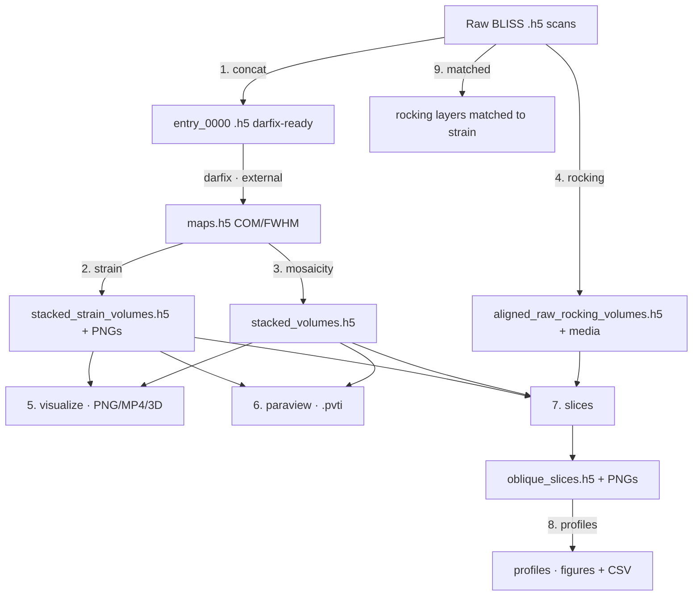

# DFXM Pipeline — Usage Guide

> [!info] What this is
> A desktop (PySide6) application that takes **Dark-Field X-ray Microscopy**
> (DFXM) data from the ESRF ID03 beamline all the way from raw detector files to
> finished **strain** and **mosaicity** maps, aligned 3-D volumes, ParaView
> exports, oblique slices and line profiles. Every original analysis script is
> reproduced here as one stage of a 9-stage pipeline you drive from a single
> window.

> [!note] This document is kept in sync with the code
> When stages, parameters, outputs, or behaviour change, this guide is updated
> in the same change (see [[#Maintaining this guide]]). If something here
> disagrees with the app, the app wins — please report or fix the drift.

## Contents

- [[#Quick start]]
- [[#Core concepts]]
- [[#The pipeline at a glance]]
- [[#Stage reference]]
- [[#Interactive viewers]]
- [[#Tips & troubleshooting]]
- [[#Running without the GUI (CLI)]]
- [[#Maintaining this guide]]

---

## Quick start

> [!example] Launch the app
> ```bash
> cd /home/albert/Desktop/dfxm_pipeline
> python3 -m gui.app
> ```

**Dependencies** (no virtualenv needed; install once):

```bash
pip install numpy h5py scipy matplotlib PySide6 pyvista pyvistaqt vtk
# optional: ffmpeg on PATH for MP4 export (otherwise animations fall back to GIF)
```

**Typical first run:**

1. The app opens on the **Overview** page — the pipeline drawn left-to-right
   with one sentence per stage. Concat is **optional** (skip it if your scans
   are already concatenated) and **darfix runs outside the app**, between
   concat and the map stages.
2. Pick an **experiment preset** from the dropdown (ships with `STO2_overnight`).
   The one-line summary shows its calibration; **Edit…** opens the full editor.
3. Click a stage in the pipeline rail (or its chip on the Overview page). The
   form shows the stage's **essentials**; everything else is under
   **Advanced (N settings)**, grouped by theme.
4. Click into any field — the **help panel** under the form explains it. Press
   **Run**. Progress shows next to the buttons; results land in **Results**, a
   preview in **Output**, and a green/red **banner** summarises the outcome
   (with a fix-it hint when an input was wrong).

> [!warning] Calibration values are physical
> `ccmth reference` and the pixel scales (µm/px) are flagged with **⚠ calibration**
> in red. Wrong values produce *meaningless* strain maps — confirm them against the
> beamline calibration for your experiment.

---

## Core concepts

### The main window

The left column is a **pipeline rail**: *Overview* first, then the stages in
pipeline order, each with a status glyph (— idle, ▶ running, ✓ ok, ✗ failed).
**Concat is marked (optional)** — skip it when your scans are already
concatenated — and **darfix** appears as a greyed, non-clickable row right
after concat because it runs outside the app. Above the rail, the experiment
header shows the active preset and its calibration in one line; **Edit…**
opens the full schema-driven editor (every field explained in its help panel).

**Appearance.** A light/dark toggle (☀ Light / ☾ Dark) sits at the bottom of
the left column, beside *Publication style…*. Your choice is remembered between
sessions. Switching theme only affects the on-screen app and the embedded
plot/3-D viewers — exported figures are always written on a white background.

### Experiment presets

An **experiment** captures everything shared across stages: data roots, folder
glob patterns, calibration angles, pixel scales, and the beamline HDF5/motor
paths. Define it once; every stage inherits it. Presets are YAML files in
`experiments/` and are chosen from a dropdown.

> [!tip]
> Editing a calibration field updates only this session until you **Save as…**.
> Keep one preset per sample/beamtime.

The experiment editor has a **Compute pixel size from scan…** button: pick a raw
(pre-darfix) scan `.h5` and it reads the far-field motors (`mainx`, `obx`,
`ffsel`, `ffz`, `lenssel`) and fills **Pixel size X** and **Pixel size Y** for
you, reporting the magnification, 2θ, the detected objective (2× / 10×) and
whether the condenser was in. Any unrecognized `ffsel` leaves the fields
untouched and explains what to set manually.

### Shared project state & auto-chaining

Each stage's form is pre-filled from the experiment, and **an upstream stage's
output auto-fills the next stage's input** (e.g. the strain/mosaicity volumes
flow into `visualize`, `paraview` and `slices`; the slices file flows into
`profiles`). You can still point any stage at files manually.

### The stage panel

Every stage uses the same layout:

| Area | What it does |
|---|---|
| **Parameter form** (left) | Auto-generated from the stage's schema. The few **essential** fields show first; the rest collapse under **Advanced (N settings)**, grouped by theme (Calibration, Data layout, Alignment, Appearance, Output, …). Hover any label for a tooltip. |
| **Help panel** (under the form) | Explains whichever field has focus — what it does, its unit, and the calibration warning where relevant. Idles on a description of the stage. |
| **Run / Cancel + progress** | Runs the stage in a **separate process**; the bar and step text track progress; **Cancel** truly kills it. Before launching, input paths are checked on disk — a missing one blocks the run and focuses the offending field. |
| **Status banner** (above the tabs) | Green one-liner on success; on failure, the error in plain language plus an actionable hint (the full traceback stays in **Log**). |
| **Log** tab | Live progress + streamed messages. |
| **Results** tab | A text summary of what was produced — including every skipped layer/input and the reason. |
| **Output** tab | A representative image preview. |
| **3D** tab | (visualize & rocking only) interactive volume viewer — see [[#Interactive viewers]]. |

A help box under the form shows the current stage's description by default. Click
a field and it shows that field's help; click away (or open another stage) and it
returns to the stage description. The same per-field help is also available as a
hover tooltip on each field and its label.

---

## The pipeline at a glance



> [!note] darfix runs outside this app
> `darfix` (the ESRF tool that fits per-pixel rocking curves into `maps.h5`) is a
> separate program. The app **brackets** it: `concat` prepares its input; the
> map stages consume its `maps.h5` output. Run darfix yourself between the two.

---

## Stage reference

> [!info] Every parameter is explained in the app
> Tables below list the **key** parameters only. In the app, click into any
> field and the help panel under the form explains it (hover tooltips work
> too). Each stage shows its essentials first; the rest live under *Advanced*.

### 1. Concatenate (`concat`)

Combine the `*.1` entries of BLISS scan files into a single darfix-compatible
`entry_0000` (a detector **VDS** or copy, plus merged positioners).

- **Input:** a raw scan folder (single) or a parent of per-layer folders (batch).
- **Output:** `<folder>_concat.h5` next to each input.

**Essentials:** mode, input/root folder, folder pattern, skip existing

| Param | Meaning |
|---|---|
| `mode` | `single` (one folder) or `batch` (glob many) |
| `input_folder` / `root_folder` | the folder, or the parent for batch |
| `folder_pattern` | glob for batch subfolders |
| `vds_policy` | `relative` (portable) / `absolute` |
| `copy_data` | **False** = VDS (fast, but breaks if sources move); **True** = self-contained copy |

> [!warning] VDS fragility
> With `copy_data = False` the output only *references* the original `.h5` files.
> If you move/delete them, the concatenated file breaks. Use `copy_data = True`
> for an archival, self-contained file.

### 2. Axial strain (`strain`)

Per-pixel axial strain (cot method) from darfix `maps.h5`, then stacked into a
3-D volume.

- **Input:** `maps.h5` per layer folder (under the processed root).
- **Output:** per-layer diagnostic PNGs (`strain_maps/`, or the chosen *Output
  dir*) + `stacked_strain_volumes.h5` (always written to the input/root
  folder, regardless of *Output dir*).

**Essentials:** mode, input/root folder, ROI, output dir

| Param | Meaning |
|---|---|
| `ccmth reference` | calibration angle (deg) ⚠ — strain is `cot(ccmth_ref)·Δccmth` |
| `roi` | `r0,r1,c0,c1` (blank = full image) |
| `vmin` / `vmax` | colour limits (blank = symmetric auto) |

> [!important] Detrend before ROI
> The full map is **detrended first** (separable 2-D arctan fit), then the ROI
> is cropped. This order is a physics constraint and is not configurable.

### 3. Mosaicity volume (`mosaicity`)

Stack per-layer χ/μ **Center-of-mass** and **FWHM** maps into a 3-D volume.

- **Input:** `maps.h5` per mosaicity layer folder.
- **Output:** `stacked_volumes.h5` with `/chi` and `/mu` groups (CoM + FWHM).

**Essentials:** mode, input/root folder, output dir

| Param | Meaning |
|---|---|
| `folder_pattern` | usually the `*_mosa__*` glob |
| `compression` | `gzip` / `lzf` / `none` |

### 4. Aligned rocking volumes (`rocking`)

Build aligned 3-D volumes straight from raw rocking scans: per-scan background
subtraction → an integrated **sum** image and one **specific frame**, anchored to
the mosaicity reference so they overlay the other volumes.

- **Input:** raw rocking scan folders (+ mosa/strain folders for the samz range &
  reference).
- **Output:** `aligned_raw_rocking_volumes.h5` + per-layer PNGs, animation, 3-D
  top-view.

**Essentials:** raw root, ROI X/Y, specific frame, output dir

| Param | Meaning |
|---|---|
| `rocking_pattern` / `mosa_pattern` / `strain_pattern` | which raw folders to use |
| `roi_x` / `roi_y` | detector crop applied at read time |
| `specific_frame_idx` | which frame to extract (blank = central) |
| `normalize_sum` | divide the summed intensity by frame count |

### 5. Visualize volumes (`visualize`)

Align the stacked mosaicity/strain volumes and render them.

- **Input:** `stacked_volumes.h5` and/or `stacked_strain_volumes.h5` (+ raw
  motors for alignment).
- **Output:** per-layer PNGs, a layer animation (MP4→GIF fallback), a 3-D
  top-view, and an interactive [[#3-D volume viewer|3-D view]].

**Essentials:** both volume files, raw root, ROI X/Y, output dir

| Param | Meaning |
|---|---|
| `center_method` | `midrange` / `mean` / `median` (CoM colour centring only) |
| `roi_x` / `roi_y` | crop in pixels |
| `output_format` | `mp4` / `gif` / `both` |

> [!note]
> Mosaicity uses the `magma` colourmap; strain uses diverging `RdBu_r` pinned at
> ε = 0.

### 6. ParaView export (`paraview`)

Align the volumes and write a partitioned **PVTI** dataset for parallel ParaView
rendering, with a `valid_mask` and NaN sentinels.

- **Input:** stacked mosaicity/strain volumes.
- **Output:** `mosaicity_volume.pvti` + `strain_volume.pvti` (each with a
  `*_pieces/` folder) + `export_info.txt`.

**Essentials:** both volume files, raw root, ROI X/Y, output dir

| Param | Meaning |
|---|---|
| `num_pieces_z` | Z pieces — match your `pvserver` MPI rank count |
| `anchor_origin_to_reference` | place the world origin in the raw-detector frame so all volumes co-register |

> [!example] ParaView workflow
> ```bash
> mpirun -np 16 pvserver        # terminal 1
> paraview                      # terminal 2 → Connect cs://localhost:11111 → open the .pvti
> ```
> Then Threshold on `valid_mask` in (0.5, 1.5) and set Representation = Volume.

### 7. Oblique slices (`slices`)

Cut arbitrary planes (defined in physical µm, optionally swept along the normal)
through the aligned volumes — all in one world frame so the slices co-register.

- **Input:** stacked volumes + the aligned rocking volume.
- **Output:** `oblique_slices.h5` (consumed by [[#8. Line profiles (`profiles`)|profiles]]) + a PNG per plane.

**Essentials:** three volume files, raw root, slices JSON, output dir

| Param | Meaning |
|---|---|
| `slices_json` | a JSON list of plane specs (see below) |
| `include_*` | which volumes to slice (χ/μ CoM/FWHM, strain, raw sum/specific) |
| `center_method` / `range_pct` | CoM colour centring |

> [!example] A slice spec
> ```json
> [
>   {"name": "z_sweep", "normal": [0,0,1], "origin": [0,0,0],
>    "extent": "auto", "sweep_step_um": 5.0},
>   {"name": "oblique", "normal": [0.65,0,0.76], "origin": [0,0,0],
>    "extent": "auto", "sweep_step_um": 2.0}
> ]
> ```
> `extent: "auto"` fits the plane (and its sweep) to the data automatically — you
> only need `normal`. Otherwise give `half_u`, `half_v` (µm) and optional
> `du`/`dv` (in-plane step).

### 8. Line profiles (`profiles`)

Profile a straight line (or a band of parallel lines) across one slice plane —
**every** scalar field is profiled at the *same* in-plane positions, so intensity,
strain and misorientation line up.

- **Input:** `oblique_slices.h5`.
- **Output:** a stacked companion figure + per-field CSVs + per-field overviews.

**Essentials:** slices file, mode, jobs JSON, output dir

| Param | Meaning |
|---|---|
| `mode` | `parameter` (reproducible run from committed coords) / `preview` (just show the plane) |
| `jobs_json` | list of profile jobs (slice name, offset, `start_uv`/`end_uv`, band width) |
| `reference_volume_id` | which field is the top image |

> [!tip] Don't type coordinates by hand
> Use **Pick line…** to click the endpoints on the plane — see
> [[#Line picker (profiles)]].

### 9. Rocking-matched layers (`matched`)

For each strain layer, find the nearest rocking scan by `(samy, samz)`, load a
background-subtracted frame, apply the same samy shift, and save grayscale PNGs
pixel-aligned with the strain/mosaicity layer images.

- **Input:** raw strain + rocking folders.
- **Output:** `rocking_matched_layers/rocking_layers/layer_*.png`.

**Essentials:** raw root, frame index, match threshold, output dir

| Param | Meaning |
|---|---|
| `frame_index` | which detector frame to show |
| `match_threshold_mm` | max `(samy,samz)` distance to accept a match |

---

## Publication export

After a stage runs successfully, the **Output** tab gains two buttons at the bottom right:

- **Export…** — single-figure export: opens a dialog with a live preview, a figure selector drop-down (if the stage produced multiple figures), per-figure style controls, and an **Export** button that writes into a folder you pick.
- **Export all…** — batch export: exports every figure the stage produced into a single folder you pick via a folder-chooser dialog. Progress is shown per-figure in a banner; one bad figure never aborts the rest. The banner and a warning dialog report how many figures succeeded and what went wrong with any failures.

Files are written **flat** into the folder you choose (e.g. `/tmp/my_exports/`). Each figure gets a sanitised filename stem (path-unsafe characters replaced with `_`) plus the format extension (`strain_map.png`, `strain_map.pdf`, etc.). There is no automatic sub-folder. Files are written **atomically** — a format that fails to save leaves no partial/corrupt file behind. For line profiles, two jobs that share a `fig_name` are disambiguated automatically so a batch export never silently overwrites one with another.

Exported figures are **rebuilt from the saved data to match the figure the run produced** — same colour scale (strain maps stay symmetric and zero-centred; misorientation maps stay centred), the same ROI axis offset, and the same axes — only the publication styling differs.

### The "Publication style…" editor

A **Publication style…** button lives in the **left column of the main window**, below the pipeline rail. It holds one **session-global** `PlotStyle` — seeded from `PUBLICATION_STYLE` at startup and shared by every export dialog opened from any stage during the session.

Clicking it opens a scrollable style editor (the same control set as the per-figure export dialog). Changes persist for the rest of the session. Each **Export…** dialog starts from a private copy of the session style and lets you adjust it per-figure without changing the global.

### Style controls

Both the global "Publication style…" editor and the per-figure **Export…** dialog offer the same controls:

**Scale bar**

| Control | Meaning |
|---|---|
| Show scale bar | Draw a µm scale bar overlay |
| Bar length | **Auto** (≈15 % of the image X extent, snapped to a 1–2–5–10 nice value) or a fixed µm value |
| Bar thickness | Visual height in points (default 3 pt; use 4 pt for publication) |
| Label scale | Multiplies the font size for the scale-bar label (relative to Font scale) |
| Bar location | `lower right` / `lower left` / `upper right` / `upper left` |
| Bar colour | Foreground colour of the bar and label |
| Background box | Optionally draw a semi-transparent box behind the bar + label |
| Box colour / alpha / margin | Control the background box appearance |

> [!note] Scale bars on maps only
> Scale bars are drawn **only on physical maps** (`kind="map"` figures: per-layer volume maps, strain maps, mosaicity maps, slice maps). Histograms, detrend diagnostics, and line-profile companion figures are `kind="plot"` — the scale-bar checkbox is ignored for them. Physical aspect ratio is always preserved on maps (`aspect="equal"`).

**Text**

| Control | Meaning |
|---|---|
| Font scale | Multiplies all axis labels, tick labels, and the title |
| Show title | Uncheck to suppress the figure title |
| Centre axis labels | Horizontally centre the x/y axis labels |

**Colourbar**

| Control | Meaning |
|---|---|
| Show colourbar | Draw a colourbar |
| Colourbar label | Override the figure's own colourbar label (blank = use the stage's label) |
| Colourbar fraction | Controls the colourbar width (matplotlib `fraction` parameter) |
| Colourbar ticks | Number of evenly-spaced ticks including both endpoints; `0` = matplotlib auto |
| Tick format | `auto` (matplotlib default) / `scientific` (e.g. `1.2×10⁻³`) / a digit count like `2` (two decimal places) |

**Figure**

| Control | Meaning |
|---|---|
| Figure width | `single` (3.5 in), `double` (7.0 in), or `auto` (keeps the stage's own figsize) |

**Output**

| Control | Meaning |
|---|---|
| Formats | PNG / PDF / SVG (any combination; all enabled → three files per figure) |
| DPI | Output resolution (default 300) |

### What figures each stage produces

| Stage | Figures |
|---|---|
| `strain` | Per-layer strain map (`kind="map"`) + strain histogram (`kind="plot"`) + detrend diagnostic 3-panel (`kind="plot"`) |
| `mosaicity` | Per-layer per-dataset map + histogram for each χ/μ CoM and FWHM dataset |
| `rocking` | Per-layer maps for sum intensity and specific-frame intensity |
| `visualize` | Per-layer maps for all aligned datasets |
| `slices` | One map per plane per volume (`kind="map"`) |
| `profiles` | One companion figure per parameter-mode job (`kind="plot"`) — reference image + per-field line traces |
| `matched` | Per-layer matched rocking-frame maps |
| `concat`, `paraview` | No exportable figures |

---

## Interactive viewers

> [!note] Loaded only when you ask
> Both viewers initialise lazily — no 3-D/OpenGL libraries are imported and no
> data is loaded until you explicitly open them. If your machine has no OpenGL
> context, the 3-D view degrades to a message instead of crashing.

### 3-D volume viewer

On the **visualize** and **rocking** stage views, after a run open the **3D** tab,
pick a volume from the dropdown, and click **Render 3-D** to rotate/zoom the
aligned volume (NaN padding is hidden). For `visualize` the volume is aligned on
demand with the *same* pipeline as the rendered PNGs, so they match.

### Line picker (profiles)

On the **profiles** view, click **Pick line…** to open the picker:

1. Use **◀ plane / plane ▶** to scroll through the slice's planes.
2. Click two points to set the line endpoints.
3. **Use line** writes `start_uv` / `end_uv` / `offset_um` into `jobs_json`.
4. Press **Run** to profile.

---

## Tips & troubleshooting

> [!tip] Hardcoded data lives on the external SSD
> Default paths point at `/media/albert/DIC_SSD_3/ESRF/…`. On another machine,
> edit the experiment roots first.

- **A stage is greyed out / "no volumes":** an upstream output doesn't exist yet —
  run the earlier stage (or fix the file path).
- **Animation came out as GIF:** `ffmpeg` isn't on `PATH`; install it for MP4.
- **3-D view says "unavailable":** no OpenGL context (headless / plain X
  forwarding) — the PNG top-view still works.
- **Strain looks wrong / shifted:** check the calibration angles and the
  `samy direction` sign.
- **Slices error about `du`/`half_u`:** every non-auto slice needs positive
  `du`, `dv`, `half_u`, `half_v`.

---

## Running without the GUI (CLI)

Every stage is also a headless command (handy for batch/scripting):

```bash
python3 -m dfxm.stages.strain --help
python3 -m dfxm.stages.mosaicity --root-folder /path/to/processed --folder-pattern '*_mosa__*'
python3 -m pytest -q          # run the test suite
ruff check . && ruff format . # lint + format
```

---

## Maintaining this guide

> [!important] For contributors (and future Claude sessions)
> This file is the user-facing companion to `CLAUDE.md`. **Whenever you change a
> stage's parameters, behaviour, inputs/outputs, add or remove a stage, or change
> how a viewer works, update the matching section here in the same change.** The
> repo's `CLAUDE.md` records this as a standing rule, and a PostToolUse hook
> reminds you when you edit `dfxm/stages/` or `gui/`.

## See also

- [[Codebase]] — file-by-file code reference (what every module/function does).
- `CLAUDE.md` — architecture & contributor conventions.
- `README.md` — short project summary.
- `experiments/STO2_overnight.yaml` — the shipped preset (paths, calibrated angles, pixel scales).
