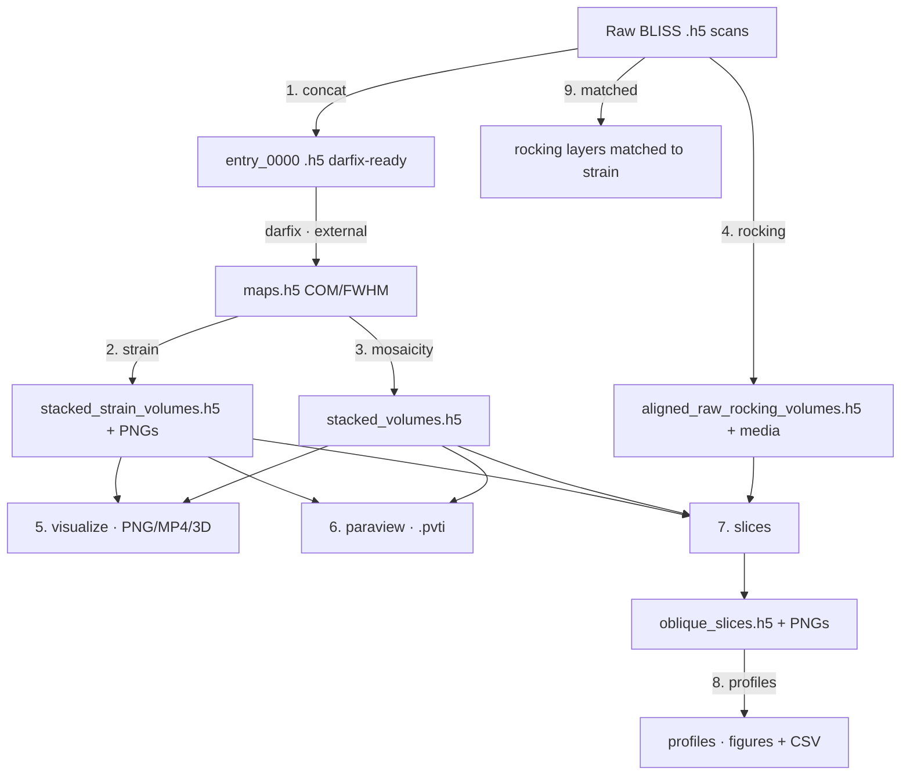

# DFXM Pipeline — Usage Guide

> [!info] What this is
> A desktop (PySide6) application that takes **Dark-Field X-ray Microscopy**
> (DFXM) data from the ESRF ID03 beamline all the way from raw detector files to
> finished **strain** and **mosaicity** maps, aligned 3-D volumes, ParaView
> exports, oblique slices and line profiles. Every original analysis script is
> reproduced here as one stage of a 9-stage pipeline you drive from a single
> window.

> [!note] This document is kept in sync with the code
> When stages, parameters, outputs, or behaviour change, this guide is updated
> in the same change (see [[#Maintaining this guide]]). If something here
> disagrees with the app, the app wins — please report or fix the drift.

## Contents

- [[#Quick start]]
- [[#Core concepts]]
- [[#The pipeline at a glance]]
- [[#Stage reference]]
- [[#Interactive viewers]]
- [[#Tips & troubleshooting]]
- [[#Running without the GUI (CLI)]]
- [[#Maintaining this guide]]

---

## Quick start

> [!example] Launch the app
> ```bash
> cd /home/albert/Desktop/dfxm_pipeline
> python3 -m gui.app
> ```

**Dependencies** (no virtualenv needed; install once):

```bash
pip install numpy h5py scipy matplotlib PySide6 pyvista pyvistaqt vtk
# optional: ffmpeg on PATH for MP4 export (otherwise animations fall back to GIF)
```

**Typical first run:**

1. Pick an **experiment preset** from the dropdown (ships with `STO2_overnight`),
   or edit the fields and **Save as…** a new one.
2. Click a stage in the navigation list.
3. The parameter form is pre-filled from the experiment — adjust as needed.
4. Press **Run**. Watch progress in **Log**; results land in **Results** and a
   preview in **Output**.

> [!warning] Calibration values are physical
> `ccmth reference`, `mu reference`, and the pixel scales (µm/px) are flagged
> with **⚠ calibration** in red. Wrong values produce *meaningless* strain maps.
> The `STO2_overnight` preset ships `mu_ref = 11.5015`, while the older standalone
> scripts used `11.2491` — **confirm which is correct for your experiment** before
> trusting absolute strain numbers. The discrepancy is recorded in the preset's
> notes.

---

## Core concepts

### Experiment presets

An **experiment** captures everything shared across stages: data roots, folder
glob patterns, calibration angles, pixel scales, and the beamline HDF5/motor
paths. Define it once; every stage inherits it. Presets are YAML files in
`experiments/` and are chosen from a dropdown.

> [!tip]
> Editing a calibration field updates only this session until you **Save as…**.
> Keep one preset per sample/beamtime.

### Shared project state & auto-chaining

Each stage's form is pre-filled from the experiment, and **an upstream stage's
output auto-fills the next stage's input** (e.g. the strain/mosaicity volumes
flow into `visualize`, `paraview` and `slices`; the slices file flows into
`profiles`). You can still point any stage at files manually.

### The stage panel

Every stage uses the same layout:

| Area | What it does |
|---|---|
| **Parameter form** (left) | Auto-generated from the stage's schema: dropdowns for choices, file/folder pickers for paths, spin boxes for numbers, multi-line boxes for JSON. Hover any label for a tooltip. |
| **Run / Cancel** | Runs the stage in a **separate process** so the UI stays responsive; **Cancel** truly kills it. |
| **Log** tab | Live progress bar + streamed messages. |
| **Results** tab | A text summary of what was produced. |
| **Output** tab | A representative image preview. |
| **3D** tab | (visualize & rocking only) interactive volume viewer — see [[#Interactive viewers]]. |

---

## The pipeline at a glance



> [!note] darfix runs outside this app
> `darfix` (the ESRF tool that fits per-pixel rocking curves into `maps.h5`) is a
> separate program. The app **brackets** it: `concat` prepares its input; the
> map stages consume its `maps.h5` output. Run darfix yourself between the two.

---

## Stage reference

> [!info] Every parameter has a tooltip
> Tables below list the **key** parameters only. Hover a field's label in the app
> for the full description and units.

### 1. Concatenate (`concat`)

Combine the `*.1` entries of BLISS scan files into a single darfix-compatible
`entry_0000` (a detector **VDS** or copy, plus merged positioners).

- **Input:** a raw scan folder (single) or a parent of per-layer folders (batch).
- **Output:** `<folder>_concat.h5` next to each input.

| Param | Meaning |
|---|---|
| `mode` | `single` (one folder) or `batch` (glob many) |
| `input_folder` / `root_folder` | the folder, or the parent for batch |
| `folder_pattern` | glob for batch subfolders |
| `vds_policy` | `relative` (portable) / `absolute` |
| `copy_data` | **False** = VDS (fast, but breaks if sources move); **True** = self-contained copy |

> [!warning] VDS fragility
> With `copy_data = False` the output only *references* the original `.h5` files.
> If you move/delete them, the concatenated file breaks. Use `copy_data = True`
> for an archival, self-contained file.

### 2. Axial strain (`strain`)

Per-pixel axial strain (cot method) from darfix `maps.h5`, then stacked into a
3-D volume.

- **Input:** `maps.h5` per layer folder (under the processed root).
- **Output:** per-layer diagnostic PNGs (`strain_maps/`) + `stacked_strain_volumes.h5`.

| Param | Meaning |
|---|---|
| `method` | `ccmth_mu` = `cot(ccmth)·Δccmth − cot(mu)·Δmu`; `ccmth_only` drops the mu term |
| `ccmth reference` / `mu reference` | calibration angles (deg) ⚠ |
| `roi` | `r0,r1,c0,c1` (blank = full image) |
| `vmin` / `vmax` | colour limits (blank = symmetric auto) |

> [!important] Detrend before ROI
> The full map is polynomial (arctan) **detrended first**, then the ROI is
> cropped. This order is a physics constraint and is not configurable.

### 3. Mosaicity volume (`mosaicity`)

Stack per-layer χ/μ **Center-of-mass** and **FWHM** maps into a 3-D volume.

- **Input:** `maps.h5` per mosaicity layer folder.
- **Output:** `stacked_volumes.h5` with `/chi` and `/mu` groups (CoM + FWHM).

| Param | Meaning |
|---|---|
| `folder_pattern` | usually the `*_mosa__*` glob |
| `compression` | `gzip` / `lzf` / `none` |

### 4. Aligned rocking volumes (`rocking`)

Build aligned 3-D volumes straight from raw rocking scans: per-scan background
subtraction → an integrated **sum** image and one **specific frame**, anchored to
the mosaicity reference so they overlay the other volumes.

- **Input:** raw rocking scan folders (+ mosa/strain folders for the samz range &
  reference).
- **Output:** `aligned_raw_rocking_volumes.h5` + per-layer PNGs, animation, 3-D
  top-view.

| Param | Meaning |
|---|---|
| `rocking_pattern` / `mosa_pattern` / `strain_pattern` | which raw folders to use |
| `roi_x` / `roi_y` | detector crop applied at read time |
| `specific_frame_idx` | which frame to extract (blank = central) |
| `normalize_sum` | divide the summed intensity by frame count |

### 5. Visualize volumes (`visualize`)

Align the stacked mosaicity/strain volumes and render them.

- **Input:** `stacked_volumes.h5` and/or `stacked_strain_volumes.h5` (+ raw
  motors for alignment).
- **Output:** per-layer PNGs, a layer animation (MP4→GIF fallback), a 3-D
  top-view, and an interactive [[#3-D volume viewer|3-D view]].

| Param | Meaning |
|---|---|
| `center_method` | `midrange` / `mean` / `median` (CoM colour centring only) |
| `roi_x` / `roi_y` | crop in pixels |
| `output_format` | `mp4` / `gif` / `both` |

> [!note]
> Mosaicity uses the `magma` colourmap; strain uses diverging `RdBu_r` pinned at
> ε = 0.

### 6. ParaView export (`paraview`)

Align the volumes and write a partitioned **PVTI** dataset for parallel ParaView
rendering, with a `valid_mask` and NaN sentinels.

- **Input:** stacked mosaicity/strain volumes.
- **Output:** `mosaicity_volume.pvti` + `strain_volume.pvti` (each with a
  `*_pieces/` folder) + `export_info.txt`.

| Param | Meaning |
|---|---|
| `num_pieces_z` | Z pieces — match your `pvserver` MPI rank count |
| `anchor_origin_to_reference` | place the world origin in the raw-detector frame so all volumes co-register |

> [!example] ParaView workflow
> ```bash
> mpirun -np 16 pvserver        # terminal 1
> paraview                      # terminal 2 → Connect cs://localhost:11111 → open the .pvti
> ```
> Then Threshold on `valid_mask` in (0.5, 1.5) and set Representation = Volume.

### 7. Oblique slices (`slices`)

Cut arbitrary planes (defined in physical µm, optionally swept along the normal)
through the aligned volumes — all in one world frame so the slices co-register.

- **Input:** stacked volumes + the aligned rocking volume.
- **Output:** `oblique_slices.h5` (consumed by [[#8. Line profiles (`profiles`)|profiles]]) + a PNG per plane.

| Param | Meaning |
|---|---|
| `slices_json` | a JSON list of plane specs (see below) |
| `include_*` | which volumes to slice (χ/μ CoM/FWHM, strain, raw sum/specific) |
| `center_method` / `range_pct` | CoM colour centring |

> [!example] A slice spec
> ```json
> [
>   {"name": "z_sweep", "normal": [0,0,1], "origin": [0,0,0],
>    "extent": "auto", "sweep_step_um": 5.0},
>   {"name": "oblique", "normal": [0.65,0,0.76], "origin": [0,0,0],
>    "extent": "auto", "sweep_step_um": 2.0}
> ]
> ```
> `extent: "auto"` fits the plane (and its sweep) to the data automatically — you
> only need `normal`. Otherwise give `half_u`, `half_v` (µm) and optional
> `du`/`dv` (in-plane step).

### 8. Line profiles (`profiles`)

Profile a straight line (or a band of parallel lines) across one slice plane —
**every** scalar field is profiled at the *same* in-plane positions, so intensity,
strain and misorientation line up.

- **Input:** `oblique_slices.h5`.
- **Output:** a stacked companion figure + per-field CSVs + per-field overviews.

| Param | Meaning |
|---|---|
| `mode` | `parameter` (reproducible run from committed coords) / `preview` (just show the plane) |
| `jobs_json` | list of profile jobs (slice name, offset, `start_uv`/`end_uv`, band width) |
| `reference_volume_id` | which field is the top image |

> [!tip] Don't type coordinates by hand
> Use **Pick line…** to click the endpoints on the plane — see
> [[#Line picker (profiles)]].

### 9. Rocking-matched layers (`matched`)

For each strain layer, find the nearest rocking scan by `(samy, samz)`, load a
background-subtracted frame, apply the same samy shift, and save grayscale PNGs
pixel-aligned with the strain/mosaicity layer images.

- **Input:** raw strain + rocking folders.
- **Output:** `rocking_matched_layers/rocking_layers/layer_*.png`.

| Param | Meaning |
|---|---|
| `frame_index` | which detector frame to show |
| `match_threshold_mm` | max `(samy,samz)` distance to accept a match |

---

## Interactive viewers

> [!note] Loaded only when you ask
> Both viewers initialise lazily — no 3-D/OpenGL libraries are imported and no
> data is loaded until you explicitly open them. If your machine has no OpenGL
> context, the 3-D view degrades to a message instead of crashing.

### 3-D volume viewer

On the **visualize** and **rocking** stage views, after a run open the **3D** tab,
pick a volume from the dropdown, and click **Render 3-D** to rotate/zoom the
aligned volume (NaN padding is hidden). For `visualize` the volume is aligned on
demand with the *same* pipeline as the rendered PNGs, so they match.

### Line picker (profiles)

On the **profiles** view, click **Pick line…** to open the picker:

1. Use **◀ plane / plane ▶** to scroll through the slice's planes.
2. Click two points to set the line endpoints.
3. **Use line** writes `start_uv` / `end_uv` / `offset_um` into `jobs_json`.
4. Press **Run** to profile.

---

## Tips & troubleshooting

> [!tip] Hardcoded data lives on the external SSD
> Default paths point at `/media/albert/DIC_SSD_3/ESRF/…`. On another machine,
> edit the experiment roots first.

- **A stage is greyed out / "no volumes":** an upstream output doesn't exist yet —
  run the earlier stage (or fix the file path).
- **Animation came out as GIF:** `ffmpeg` isn't on `PATH`; install it for MP4.
- **3-D view says "unavailable":** no OpenGL context (headless / plain X
  forwarding) — the PNG top-view still works.
- **Strain looks wrong / shifted:** check the calibration angles and the
  `samy direction` sign.
- **Slices error about `du`/`half_u`:** every non-auto slice needs positive
  `du`, `dv`, `half_u`, `half_v`.

---

## Running without the GUI (CLI)

Every stage is also a headless command (handy for batch/scripting):

```bash
python3 -m dfxm.stages.strain --help
python3 -m dfxm.stages.mosaicity --root-folder /path/to/processed --folder-pattern '*_mosa__*'
python3 -m pytest -q          # run the test suite
ruff check . && ruff format . # lint + format
```

---

## Maintaining this guide

> [!important] For contributors (and future Claude sessions)
> This file is the user-facing companion to `CLAUDE.md`. **Whenever you change a
> stage's parameters, behaviour, inputs/outputs, add or remove a stage, or change
> how a viewer works, update the matching section here in the same change.** The
> repo's `CLAUDE.md` records this as a standing rule, and a PostToolUse hook
> reminds you when you edit `dfxm/stages/` or `gui/`.

## See also

- `CLAUDE.md` — architecture & contributor conventions.
- `README.md` — short project summary.
- `experiments/STO2_overnight.yaml` — the shipped preset (and the calibration note).
