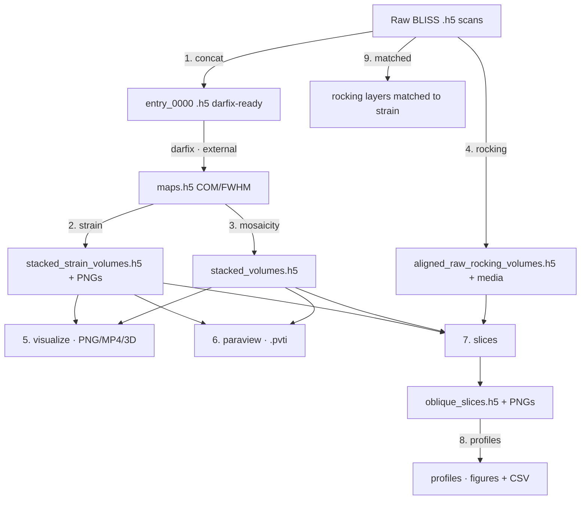

# DFXM Pipeline — Usage Guide

> [!info] What this is
> A desktop (PySide6) application that takes **Dark-Field X-ray Microscopy**
> (DFXM) data from the ESRF ID03 beamline all the way from raw detector files to
> finished **strain** and **mosaicity** maps, aligned 3-D volumes, ParaView
> exports, oblique slices and line profiles. Every original analysis script is
> reproduced here as one stage of a 9-stage pipeline you drive from a single
> window.

> [!note] This document is kept in sync with the code
> When stages, parameters, outputs, or behaviour change, this guide is updated
> in the same change (see [[#Maintaining this guide]]). If something here
> disagrees with the app, the app wins — please report or fix the drift.

## Contents

- [[#Quick start]]
- [[#Core concepts]]
  - [[#Regions of interest — two windows, two frames]]
- [[#The pipeline at a glance]]
- [[#Stage reference]]
- [[#Figure builder]]
- [[#Interactive viewers]]
- [[#Tips & troubleshooting]]
- [[#Running without the GUI (CLI)]]
- [[#Maintaining this guide]]

---

## Quick start

> [!example] Launch the app
> ```bash
> cd /home/albert/Desktop/dfxm_pipeline
> python3 -m gui.app
> ```

**Dependencies** (no virtualenv needed; install once):

```bash
pip install numpy h5py scipy matplotlib PySide6 pyvista pyvistaqt vtk
# optional: ffmpeg on PATH for MP4 export (otherwise animations fall back to GIF)
```

**Typical first run:**

1. The app opens on the **Overview** page — the pipeline drawn left-to-right
   with one sentence per stage. Concat is **optional** (skip it if your scans
   are already concatenated) and **darfix runs outside the app**, between
   concat and the map stages.
2. Pick an **experiment preset** from the dropdown (ships with `STO2_overnight`).
   The one-line summary shows its calibration; **Edit…** opens the full editor.
3. Click a stage in the pipeline rail (or its chip on the Overview page). The
   form shows the stage's **essentials**; everything else is under
   **Advanced (N settings)**, grouped by theme.
4. Click into any field — the **help panel** under the form explains it. Press
   **Run**. Progress shows next to the buttons; results land in **Results**, a
   preview in **Output**, and a green/red **banner** summarises the outcome
   (with a fix-it hint when an input was wrong).

> [!warning] Calibration values are physical
> `ccmth reference` and the pixel scales (µm/px) are flagged with **⚠ calibration**
> in red. Wrong values produce *meaningless* strain maps — confirm them against the
> beamline calibration for your experiment.

---

## Core concepts

### The main window

The left column is a **pipeline rail**: *Overview* first, then the stages in
pipeline order, each with a status glyph (— idle, ▶ running, ✓ ok, ✗ failed).
**Concat is marked (optional)** — skip it when your scans are already
concatenated — and **darfix** appears as a greyed, non-clickable row right
after concat because it runs outside the app. Above the rail, the experiment
header shows the active preset and its calibration in one line; **Edit…**
opens the full schema-driven editor (every field explained in its help panel).

**Appearance.** A light/dark toggle (☀ Light / ☾ Dark) sits at the bottom of
the left column, beside *Publication style…*. Your choice is remembered between
sessions. Switching theme only affects the on-screen app and the embedded
plot/3-D viewers — exported figures are always written on a white background.

The window remembers its size, position and maximized state between runs, along
with the left-rail width and the shared middle/right column width — so the layout
you set stays put next time you open the app. Drag the divider between the
parameter form and the Log/Results/Output panel to rebalance them; the new width
applies to every stage and is remembered.

### Experiment presets

An **experiment** captures everything shared across stages: data roots, folder
glob patterns, calibration angles, pixel scales, and the beamline HDF5/motor
paths. Define it once; every stage inherits it. Presets are YAML files in
`experiments/` and are chosen from a dropdown.

> [!tip]
> Editing a calibration field updates only this session until you **Save as…**.
> Keep one preset per sample/beamtime.

The experiment editor has a **Compute pixel size from scan…** button: pick a raw
(pre-darfix) scan `.h5` and it reads the far-field motors (`mainx`, `obx`,
`ffsel`, `ffz`, `lenssel`) and fills **Pixel size X** and **Pixel size Y** for
you, reporting the magnification, 2θ, the detected objective (2× / 10×) and
whether the condenser was in. Any unrecognized `ffsel` leaves the fields
untouched and explains what to set manually.

Real ID03 scans record `mainx` negative (motor-frame sign convention); the
calculator uses its magnitude, so those scans compute normally. Non-physical
geometry — `obx ≤ 0`, `|mainx| ≤ obx`, or `ffz ≤ 0` while the condenser is
in — raises an error instead of filling a wrong value. The calculator cannot
tell a mis-read motor from a real one, so sanity-check the reported
magnification and 2θ against your setup before saving the preset.

The experiment also carries three ROI fields. **Darfix ROI** is the detector
crop darfix used, copied verbatim as darfix's own ROI widget shows it —
`x,y,w,h` origin then size, no conversion. **Analysis window X/Y** are the
part of the darfix map you actually want to study, as map-frame `c0,c1` /
`r0,r1` start,end pixels (blank means the full width/height). Together these
pre-fill the stages' own ROI fields.

Below the form, a live read-out line translates both ROI fields into detector
pixels as you type — the numbers you'd previously derive by hand are
displayed, never typed: the darfix window's own detector-pixel span, plus the
analysis window translated into absolute detector pixels. It goes blank when
Darfix ROI is empty, and shows the parse error in place of numbers while a
field is mid-edit (e.g. an incomplete `x,y,w,h`) rather than raising. Clicking
**OK** or **Save as…** validates all three ROI fields (well-formed, positive
darfix size, analysis windows within the darfix window's bounds) and blocks
with a message dialog if any are wrong — a bad experiment ROI can never be
saved or applied.

Typing the analysis window by hand is optional: **Pick analysis ROI…** opens
the same drag-a-rectangle picker used elsewhere in the app, previewing a
mid-Z layer of the stacked mosaicity/strain volumes next to `processed_root`
(`stacked_volumes.h5` / `stacked_strain_volumes.h5` — run mosaicity or strain
at least once first, or use the picker's Browse fallback to point at any
stacked `.h5`). The rectangle you draw is already in the map frame, so it
writes straight into **Analysis window X** and **Analysis window Y** with no
conversion, and the read-out line above updates immediately.

#### Initializing an experiment from data

Instead of hand-filling the editor, click **Initialize from data…** (in
*Edit…*). It scans the roots currently typed in the form and suggests values,
shown in a review table — current value vs detected, with a per-row *Apply*
checkbox (pre-checked only where it would not overwrite something you set):

- **Folder patterns** and **entry suffix**, from the `<name>__<N>` layer
  folders under the raw root.
- **Pixel sizes X/Y**, computed from the far-field motors of the first raw
  scan (same physics as *Compute pixel size from scan…*).
- **ccmth reference**, preferably the median of a strain-layer ccmth
  centre-of-mass map under the processed root; before darfix has run it
  falls back to the raw `ccmth` motor snapshot — confirm either against the
  beamline alignment before trusting strain maps.
- **Darfix ROI size**: darfix does not record its crop anywhere, so only the
  window *size* can be read back (from the map shape). The row shows
  `?,?,w,h` — type the origin from darfix's ROI widget to enable applying
  it. If your Darfix ROI is already filled and its size matches `maps.h5`,
  the row is an info-only "✓ size matches" line; if the size instead
  mismatches, the row offers the corrected `w,h` with your existing origin
  kept, ready to apply.

A row whose detected value already **equals** the current one (same field,
same value) shows as an info-only "✓ matches current" row too — nothing to
apply, just confirmation that the data agrees with what's already in the
form.

The flow is **re-runnable**: run it on day one for the raw-data facts (the
maps rows appear greyed with the reason), then again after darfix to add the
maps-derived rows. On *OK*, if you applied anything, the dialog offers to
save the preset YAML — otherwise the values live only in this session.

The same detection runs headless:
`python3 -m dfxm.config.detect RAW_ROOT --processed-root PROC_ROOT`.

### Regions of interest — two windows, two frames

Every DFXM dataset carries **two** regions of interest, and they are not the
same kind of thing:

- The **darfix window** (`105,230,1832,1266` for STO2, `x,y,w,h` = origin then
  size) is a **fact**. It is the detector crop darfix used when it fitted
  `maps.h5` — you don't choose it here, you copy it verbatim from darfix's own
  ROI widget. Map pixel `(0, 0)` sits at detector pixel `(x, y)`.
- The **analysis window** (STO2's Y is `400,1100`, map-frame `start,end`) is a
  **choice**. It is the sub-region of that map you actually want to study —
  blank means the full width/height. Because map pixel 0 is the darfix
  origin, translating it to an absolute detector row/column is just
  `detector = darfix_origin + map`.

**Worked STO2 example.** darfix window origin `(105, 230)`, size `(1832,
1266)` → covers detector columns `105→1937` and rows `230→1496`. Analysis
window Y `400,1100` (map-frame) → detector rows `230 + 400 = 630` to
`230 + 1100 = 1330`, i.e. `630→1330`. That single pair of experiment fields
feeds every stage's own ROI, each in the frame that stage actually crops in:

| Stage | Field(s) | Frame | Value for this example |
|---|---|---|---|
| Rocking | `roi_x` / `roi_y` | absolute detector pixels | Y: `630,1330` |
| Visualize, ParaView | `roi_x` / `roi_y` (Map ROI) | map pixels | Y: `400,1100` |
| Slices | `align_roi_x` / `align_roi_y` (Align ROI) | map pixels | Y: `400,1100` |
| Strain | `roi` (`r0,r1,c0,c1`) | map pixels | rows: `400,1100` |

Enter the darfix window and the analysis window **once**, in the experiment
editor — every stage form pre-fills its own ROI field(s) in its own frame from
those two, so you never hand-convert map pixels to detector pixels again. If
you then edit a stage's ROI so it no longer matches what the experiment would
derive, the field's label grows a **⚠** (see [[#ROI deviation markers]]) —
that's fine for a deliberate one-off, but treat an unexpected ⚠ as a prompt to
re-check which frame you typed in. The slices stage's Y-height check remains
the last-line guard: if the volumes it's about to combine disagree on physical
Y height by more than ~5%, it warns before you go further.

> [!warning] The classic mistake
> On 2026-07-18 a real STO2 run had darfix's origin+size numbers (`230,1266`)
> typed directly into rocking's `roi_y`, which expects **start,end** — instead
> of the correct `630,1330`. The result was a ~154 µm Y-misregistration between
> the raw rocking volume and the map volumes. That conversion is exactly what
> the experiment's two ROI fields plus the per-stage pre-fill now do for you:
> the detector-pixel numbers are **displayed** in the read-out and written into
> each stage's form automatically — you should never need to type them by hand.

### Shared project state & auto-chaining

Each stage's form is pre-filled from the experiment, and **an upstream stage's
output auto-fills the next stage's input** (e.g. the strain/mosaicity volumes
flow into `visualize`, `paraview` and `slices`; the slices file flows into
`profiles`). You can still point any stage at files manually. If the
experiment has ROIs set, they also pre-fill every stage's crop in that
stage's own frame — rocking gets the absolute detector window, while
visualize/paraview/slices/strain get the map-frame window — so the same two
experiment fields (darfix window + analysis window) crop consistently
everywhere without hand conversion.

### Resuming a session (per-experiment form memory)

Every stage form's fields — all the paths, folders, numbers, ROIs, toggles and
JSON boxes you enter — are **saved automatically as you type** and restored when
you reopen the app, **kept separately for each experiment**. Switch experiments
and each one comes back to the state you last left it in, so you can stop and
continue analysis without re-entering anything. (Storage is the app-wide
QSettings, same place the window layout and publication style live — no files to
manage.)

Only stages you actually **edit** are remembered — an untouched stage keeps
following the experiment, so a fresh preset still pre-fills normally.

**Calibration fields are the exception:** the reference angle and pixel sizes
(anything flagged *⚠ calibration*) always follow the active **experiment**, not
the saved form state — a stale saved value can never silently override an
updated experiment. Change them in the experiment editor. (Consequence: once you
have edited a stage under an experiment, later changing that experiment's
*non*-calibration fields won't re-derive into that stage — its saved values win.
Untouched stages are unaffected.)

### The stage panel

Every stage uses the same layout:

| Area | What it does |
|---|---|
| **Parameter form** (left) | Auto-generated from the stage's schema. The few **essential** fields show first; the rest collapse under **Advanced (N settings)**, grouped by theme (Calibration, Data layout, Alignment, Appearance, Output, …). Hover any label for a tooltip. Scrolling the form never changes a spin box or dropdown any more — a field only reacts to the wheel once you've clicked into it; otherwise the wheel just scrolls the page. |
| **Help panel** (under the form) | Explains whichever field has focus — what it does, its unit, and the calibration warning where relevant. Idles on a description of the stage. |
| **Run / Cancel + progress** | Runs the stage in a **separate process**; the bar and step text track progress; **Cancel** truly kills it. Before launching, input paths are checked on disk — a missing one blocks the run and focuses the offending field. Once a run/batch is more than 5 % done and has been going for more than 2 seconds, the progress text may also show a `~… left` estimate; the estimate starts fresh every time you click **Run**, so it never carries a stale reading over from a previous run. |
| **Status banner** (above the tabs) | Green one-liner on success; on failure, the error in plain language plus an actionable hint (the full traceback stays in **Log**). |
| **Log** tab | Live progress + streamed messages. |
| **Results** tab | A text summary of what was produced — including every skipped layer/input and the reason. |
| **Output** tab | A representative image preview. |
| **3D** tab | (visualize & rocking only) interactive volume viewer — see [[#Interactive viewers]]. |

A help box under the form shows the current stage's description by default. Click
a field and it shows that field's help; click away (or open another stage) and it
returns to the stage description. The same per-field help is also available as a
hover tooltip on each field and its label.

#### Picking an ROI interactively

The **strain**, **visualize**, **paraview**, and **slices** stages show a
**Pick ROI…** button in the button row (alongside Run and Cancel). Clicking it
opens a visual picker pre-loaded with the stage's representative map or volume
layer; drag a rectangle and click **OK** to fill the ROI field(s) automatically.

Every picker has a **Keep size** checkbox next to the preview dropdown: tick it
and the rectangle's current pixel size is locked — dragging (or dragging a
handle) then *moves* the ROI without resizing it, snapped to whole pixels and
kept fully inside the image, so you can try the exact same crop size in a
different spot or on a different preview. With the box ticked before any
rectangle exists, the first drag establishes the locked size. Untick to resize
freely again; **Reset** also forgets the locked size. Where the picker offers
several previews, the drawn rectangle carries over when you switch between
same-sized previews (a differently-sized preview clears it, but the locked
size is remembered), so you can flip through the maps and check the one crop
works on each before accepting.

The picker is **per-stage** — accepting a rectangle writes only into the current
stage's form and does not propagate to sibling stages. If you want the same crop
on multiple stages you pick separately on each. Rocking does not have a picker
because its detector crop is in the raw frame (before alignment); it is instead
pre-filled automatically from the experiment's darfix window + analysis window,
converted to absolute detector pixels — normally leave it as-is.

If no preview can be loaded (the required volume/map file is not set yet), the
picker button logs a message and opens the Log tab instead of opening the picker.

#### ROI deviation markers

ROI fields (the crop boxes above, plus rocking's detector-frame `roi_x`/`roi_y`)
pre-fill from the experiment. If you then edit one so it no longer matches the
experiment-derived value, its label grows a **⚠** suffix and the tooltip names
the expected value. That is fine for a deliberate one-off override — nothing is
blocked — but treat an unexpected ⚠ as a prompt to double-check you typed the
crop in the right frame (map pixels vs. detector pixels are the classic mix-up).
The marker clears itself as soon as the field matches the experiment again, and
it only appears when the experiment actually has ROIs configured.

### Busy indication

Two visual cues mark the app as working: an animated **spinner overlay** — a
translucent panel with a rotating arc and a status line, covering whatever it
is rendering and blocking input to it until the work finishes (a **Cancel**
button appears on it wherever the operation can actually be stopped
mid-batch) — for renders that run long enough to animate visibly, and the
system **wait cursor** for shorter synchronous operations (a load, a read or
write). A stage **Run**'s progress bar and step text are unchanged, gaining a
`~… left` estimate once far enough along to be trustworthy (see the
stage-panel table above). Either indicator always clears itself once the work
finishes, errors, or is cancelled. The nine synchronous load/save spots in the
app that were previously silent — Pick line…, Jobs from marks…, Mark planes…
(opening, changing slice, and Save), Pick ROI… previews, Initialize from
data…, opening a figure-builder recipe, and opening a pop-out 3-D viewer —
all show the wait cursor for the duration of the load/save.

---

## The pipeline at a glance



> [!note] darfix runs outside this app
> `darfix` (the ESRF tool that fits per-pixel rocking curves into `maps.h5`) is a
> separate program. The app **brackets** it: `concat` prepares its input; the
> map stages consume its `maps.h5` output. Run darfix yourself between the two.

---

## Stage reference

> [!info] Every parameter is explained in the app
> Tables below list the **key** parameters only. In the app, click into any
> field and the help panel under the form explains it (hover tooltips work
> too). Each stage shows its essentials first; the rest live under *Advanced*.

### 1. Concatenate (`concat`)

Combine the `*.1` entries of BLISS scan files into a single darfix-compatible
`entry_0000` (a detector **VDS** or copy, plus merged positioners).

- **Input:** a raw scan folder (single) or a parent of per-layer folders (batch).
- **Output:** `<folder>_concat.h5` next to each input.

**Essentials:** mode, input/root folder, folder pattern, skip existing

| Param | Meaning |
|---|---|
| `mode` | `single` (one folder) or `batch` (glob many) |
| `input_folder` / `root_folder` | the folder, or the parent for batch |
| `folder_pattern` | glob for batch subfolders |
| `vds_policy` | `relative` (portable) / `absolute` |
| `copy_data` | **False** = VDS (fast, but breaks if sources move); **True** = self-contained copy |

> [!warning] VDS fragility
> With `copy_data = False` the output only *references* the original `.h5` files.
> If you move/delete them, the concatenated file breaks. Use `copy_data = True`
> for an archival, self-contained file.

### 2. Axial strain (`strain`)

Per-pixel axial strain (cot method) from darfix `maps.h5`, then stacked into a
3-D volume.

- **Input:** `maps.h5` per layer folder (under the processed root).
- **Output:** per-layer diagnostic PNGs (`strain_maps/`, or the chosen *Output
  dir*) + `stacked_strain_volumes.h5` (always written to the input/root
  folder, regardless of *Output dir*).

**Essentials:** mode, input/root folder, ROI, output dir

| Param | Meaning |
|---|---|
| `ccmth reference` | calibration angle (deg) ⚠ — strain is `cot(ccmth_ref)·Δccmth` |
| `roi` | `r0,r1,c0,c1` in map pixels, relative to the darfix window (blank = full image); pre-filled from the experiment's analysis window |
| `vmin` / `vmax` | colour limits (blank = symmetric auto) |

> [!important] Detrend before ROI
> The full map is **detrended first** (separable 2-D arctan fit), then the ROI
> is cropped. This order is a physics constraint and is not configurable.

> [!warning] ROI must fit the map
> If `roi` does not fit inside the loaded map (e.g. the experiment's analysis
> window was set up for a different dataset), the run stops with an error
> naming the ROI values and the map's actual shape — rather than silently
> cropping to an empty or unexpected array. Blank the ROI or fix the
> experiment's analysis window.

> [!tip] Picking the run-time ROI interactively
> Click **Pick ROI…** (in the button row alongside Run/Cancel) to open a visual
> picker that shows the ccmth Center-of-mass map loaded from the current
> `maps.h5`. Drag a rectangle on the CoM map and click **OK** — the `roi` field
> is filled with `r0,r1,c0,c1` automatically. The preview is oriented like the
> exported maps (rows = Y, columns = X). If the maps file cannot be resolved from
> the current form inputs the picker shows no preview.

#### Replotting strain layers without re-running

The **Replot…** button on the strain stage panel opens a dialog that re-renders
selected layers directly from a `stacked_strain_volumes.h5` — a prior run in
the current session is not required (cold-start). Use **Browse…** / **Load** to
point at a different file.

The dialog is **planes-first**, same panel as the slices stage's Replot dialog
(see [Replotting slices without re-running](#replotting-slices-without-re-running)
for the full filter/check-all mechanics): the left panel lists each layer
**once** (there are no slice-group sections here — strain/mosaicity/rocking
layers are a flat list); the right panel lists **quantities**, one checkbox per
`ReplotGroup` returned by `replot_catalog` (strain has a single quantity, so one
checkbox). Both open **everything checked**, so a plain **Render** remakes every
layer × every quantity; type in the **Filter** box (bare integers match a layer
number, signed/decimal values match the nearest `Z=…` offset when the layer
labels carry one) to narrow which rows are *visible* — it never changes what's
checked — then **Check all visible** to select exactly that subset. **Render**
is disabled while nothing is selected. A checked layer that doesn't exist for a
checked quantity is silently skipped rather than erroring; the status line
reports `skipped N combo(s)` after rendering.

**Render** runs the batch on a background thread (see
[Busy indication](#busy-indication)): a spinner overlay covers the dialog with
a `{i}/{N}` progress bar and, once far enough along, a `~… left` ETA; **Render**
and **Close** are disabled until the batch finishes. Clicking **Cancel** on the
overlay (or pressing Esc / **Close**, which is gated the same way while a
batch is running) stops the batch **after the item currently rendering
completes** — any PNGs already written stay on disk, and the status line is
prefixed `cancelled — ` alongside the usual `wrote N PNG(s) → …` summary.

`strain.replot_catalog(h5_path)` reads a `stacked_strain_volumes.h5` and returns
a single `ReplotGroup` (key `"strain"`) with one item per stored layer (names
come from `source_folders` in the file's attributes).
`strain.render_replot(h5_path, selections, style, clim, out_dir, roi=None, params=None)`
re-renders selected layers cold from disk. PNGs are written under
`{out_dir}/strain/` (e.g. `strain/a_strain.png`). Colour limits follow the same
rules as the live export: both `vmin`/`vmax` blank → symmetric auto-limits
(white = zero strain on RdBu_r). The dialog shows **one vmin/vmax row per plot
kind** present in the file — strain has a single kind, so it is one row; `clim`
is passed to the core as a `{kind: (vmin, vmax)}` mapping.

> [!note] Colour limits are per kind, not per layer
> The **vmin** / **vmax** you set for a kind apply to every selected layer *of
> that kind* in the batch. To apply different limits to individual layers, run
> the dialog twice with different selections. The **Output dir** pre-fills to a
> timestamped `replots/<stamp>/` subfolder beside the loaded h5 and follows the
> file if you Browse/Load a different one (until you edit it by hand).

> [!note] ROI and axis caveats for replot
> When a pixel-bounds `roi=(r0, r1, c0, c1)` is supplied the layer is cropped
> to that rectangle and the resulting figure uses a **zero-origin extent** — the
> µm-axis labels start at 0 rather than reflecting the position within the
> original scan. This is a replot-only simplification: during a normal run the
> extent is derived from the full-scan ROI stored in the params, which is not
> re-applied here unless you pass `params={"roi": "r0,r1,c0,c1", …}`. For exact
> axis reproduction, pass the original `params` dict rather than a pixel crop.
> The ROI crop is bounded by the stored data dimensions — values outside the
> array shape are clamped silently. To make those bounds visible, each
> **quantity** row in the right-hand panel is labelled with its stored pixel
> size, e.g. `120×256 px (Y×X)`, so you can read off the valid range: rows
> `r0:r1` ∈ `[0, Y]`, cols `c0:c1` ∈ `[0, X]`. (For strain and rocking that size
> is the run's already-ROI-cropped layer — i.e. the largest region a replot crop
> can reach; a wider frame needs a re-run.)

> [!tip] Picking an ROI interactively
> Click **Pick ROI…** (beside the four pixel boxes) to open a visual picker that
> shows the middle Z-layer of each plot-kind group at its natural pixel scale.
> Drag a rectangle on the preview and click **OK** — the four boxes (r0, r1, c0,
> c1) are filled automatically. The preview is oriented exactly like the exported
> maps (rows = Y, columns = X), so the coordinates transfer directly.

### 3. Mosaicity volume (`mosaicity`)

Stack per-layer χ/μ **Center-of-mass** and **FWHM** maps into a 3-D volume.

- **Input:** `maps.h5` per mosaicity layer folder.
- **Output:** `stacked_volumes.h5` with `/chi` and `/mu` groups (CoM + FWHM).

**Essentials:** mode, input/root folder, output dir

| Param | Meaning |
|---|---|
| `folder_pattern` | usually the `*_mosa__*` glob |
| `compression` | `gzip` / `lzf` / `none` |

#### Replotting mosaicity layers without re-running

The **Replot…** button on the mosaicity stage panel opens a dialog that
re-renders selected layers directly from a `stacked_volumes.h5` — a prior run
in the current session is not required (cold-start). Use **Browse…** / **Load**
to point at a different file.

The dialog is the same **planes-first** panel described under
[Replotting strain layers without re-running](#replotting-strain-layers-without-re-running):
layers are listed **once** on the left (flat, no sections); each dataset (χ/μ
CoM and FWHM) is a **quantity** checkbox on the right. Both open **everything
checked**; the **Filter** box narrows which layer rows are visible without
changing what's checked, and **Check all visible** selects exactly the filtered
subset. **Render** is disabled while nothing is selected, and a checked layer
missing from one dataset is skipped (reported, not an error). **Render** runs
in the background with the same progress-overlay/ETA/cancel-after-current-item
behaviour as the strain dialog — see
[Replotting strain layers without re-running](#replotting-strain-layers-without-re-running)
and [Busy indication](#busy-indication).

`mosaicity.replot_catalog(h5_path)` enumerates the 3-D datasets present in a
`stacked_volumes.h5` and returns one `ReplotGroup` per dataset (χ/μ CoM and
FWHM). `mosaicity.render_replot(h5_path, selections, style, clim, out_dir, roi=None, params=None)`
re-renders selected layers cold from disk. PNGs are written under
`{out_dir}/{stem}/` (e.g. `chi_com/chi_com_layer_0000.png`). An optional
pixel-bounds ROI crops each layer (bounded by the stored data dimensions — each
quantity row on the right is labelled with its stored pixel size, e.g.
`120×256 px (Y×X)`, as the crop bound); the colour limits are set **per dataset**
— the dialog shows a separate vmin/vmax row for χ/μ **Center of mass** and for
**FWHM**, so the two
(which live on very different scales) get independent limits. `clim` reaches the
core as a `{dataset_key: (vmin, vmax)}` mapping (either entry may be `None`; a
dataset with both blank keeps its auto limits). When an ROI crop is applied the
resulting figure uses a **zero-origin µm extent** (the crop origin is treated as
0 µm), unlike a normal run which preserves the true physical axes. The **Output
dir** pre-fills to a timestamped `replots/<stamp>/` subfolder beside the loaded
h5 and follows the file on Browse/Load (until edited by hand). Click **Pick
ROI…** (beside the four pixel boxes) to open a visual picker showing the middle
Z-layer of each dataset; drag a rectangle and click **OK** to fill the boxes
automatically. The preview is oriented exactly like the exported maps.

### 4. Aligned rocking volumes (`rocking`)

Build aligned 3-D volumes from raw scans — either the rocking scans or the
mosaicity scans — producing an integrated **sum** image and one **specific
frame**, anchored to the mosaicity reference so they overlay the other volumes.

- **Input:** raw scan folders (+ mosa/strain folders for the alignment reference
  and, in rocking mode, the samz union range).
- **Output:** `aligned_raw_rocking_volumes.h5` (rocking mode) or
  `aligned_raw_mosa_volumes.h5` (mosaicity mode) + per-layer PNGs, animation,
  3-D top-view (a styled figure with colourbar and scale bar, like the
  [[#5. Visualize volumes (`visualize`)|visualize]] one).

**Essentials:** raw root, ROI X/Y, specific frame, output dir

| Param | Meaning |
|---|---|
| `source_scan` | `rocking` (default) — use the rocking scan folders; `mosaicity` — use every matched mosa folder as a layer (DFXM topograph) |
| `rocking_pattern` / `mosa_pattern` / `strain_pattern` | which raw folders to use |
| `roi_x` / `roi_y` | detector-frame crop applied at read time — **start,end** pixels on the raw detector (darfix shows its ROI as origin+size: end = origin + size). Must cover the same detector window as the other volumes, or the slices stage flags a Y-height mismatch. Pre-filled from the experiment's darfix + analysis ROIs — normally leave as-is |
| `specific_frame_idx` | which frame to extract (blank = central) |
| `normalize_sum` | divide the summed intensity by frame count |
| `subtract_background` | subtract each pixel's median across the scan's frames before summing, so only above-background signal accumulates — applies to whichever scan type the run reads (default on; turn off for a plain intensity sum, e.g. a mosa-scan topograph where the background level itself is meaningful) |

**Source scan selector (`source_scan`)**

- `rocking` (default): each rocking scan folder whose `samz` falls in the union
  of the mosaicity and strain Z ranges becomes one layer. Output is written to
  `aligned_raw_rocking_volumes.h5`.
- `mosaicity`: every matched `mosa_pattern` folder is a layer — frames are
  summed and aligned exactly like rocking but no samz-union masking is applied.
  Product titles read "Mosa-integrated …". Output is auto-named
  `aligned_raw_mosa_volumes.h5` (under `aligned_raw_mosa_volumes/`) so it never
  clobbers the rocking file. Run the stage once per source to build both
  volumes side-by-side.

> [!tip]
> An explicit value is always respected; each default is substituted
> independently. The filename is auto-renamed to the mosa variant whenever
> `aligned_h5_name` is still at its rocking default; the output directory is
> renamed whenever `output_dir` is left blank. If you reuse a single explicit
> `output_dir` for both a rocking and a mosaicity run, the rendered media
> (per-layer PNGs, animation, top-view) will be overwritten even though the
> `.h5` files have distinct default names.

#### Replotting rocking layers without re-running

The **Replot…** button on the rocking stage panel opens a dialog that re-renders
selected layers directly from an `aligned_raw_rocking_volumes.h5` (or
`aligned_raw_mosa_volumes.h5`) — a prior run in the current session is not
required (cold-start). Use **Browse…** / **Load** to point at a different file.

The dialog is the same **planes-first** panel described under
[Replotting strain layers without re-running](#replotting-strain-layers-without-re-running):
layers are listed **once** on the left (flat, no sections); `sum_intensity` and
`specific_frame` are separate **quantity** checkboxes on the right. Both open
**everything checked**; the **Filter** box narrows which layer rows are visible
without changing what's checked, and **Check all visible** selects exactly the
filtered subset. **Render** is disabled while nothing is selected, and a
checked layer missing from one product is skipped (reported, not an error).
**Render** runs in the background with the same
progress-overlay/ETA/cancel-after-current-item behaviour as the strain dialog
— see
[Replotting strain layers without re-running](#replotting-strain-layers-without-re-running)
and [Busy indication](#busy-indication).

`rocking.replot_catalog(h5_path)` enumerates the 3-D datasets present and returns
one `ReplotGroup` per dataset (`sum_intensity` and `specific_frame`).
`rocking.render_replot(h5_path, selections, style, clim, out_dir, roi=None, params=None)`
re-renders selected layers cold from disk. PNGs are written under
`{out_dir}/{key}/` (e.g. `sum_intensity/sum_intensity_layer_0000.png`). An
optional pixel-bounds ROI crops each layer (bounded by the stored data
dimensions — each quantity row on the right is labelled with its stored pixel
size, e.g. `120×256 px (Y×X)`, as the crop bound); the colour limits are set
**per product**
— the dialog shows a separate vmin/vmax row for `sum_intensity` and for
`specific_frame`. `clim` reaches the core as a `{product_key: (vmin, vmax)}`
mapping (either entry may be `None`; a product with both blank keeps its
percentile auto limits). When an ROI crop is applied the resulting figure uses a
**zero-origin µm extent** (the crop origin is treated as 0 µm), unlike a normal
run which preserves the true physical axes. The **Output dir** pre-fills to a
timestamped `replots/<stamp>/` subfolder beside the loaded h5 and follows the
file on Browse/Load (until edited by hand). Click **Pick ROI…** (beside the
four pixel boxes) to open a visual picker showing the middle Z-layer of each
product; drag a rectangle and click **OK** to fill the boxes automatically. The
preview is oriented exactly like the exported maps.

### 5. Visualize volumes (`visualize`)

Align the stacked mosaicity/strain volumes and render them.

- **Input:** `stacked_volumes.h5` and/or `stacked_strain_volumes.h5` (+ raw
  motors for alignment).
- **Output:** per-layer PNGs, a layer animation (MP4→GIF fallback), a 3-D
  top-view, an optional rotating 3-D orbit video
  (`<name>_rotation.mp4`/`.gif`), and an interactive
  [[#3-D volume viewer|3-D view]].

**Essentials:** both volume files, raw root, Map ROI X/Y, output dir

| Param | Meaning |
|---|---|
| `center_method` | `midrange` / `mean` / `median` (CoM colour centring only) |
| `roi_x` / `roi_y` | map-frame crop in map pixels (`c0,c1` / `r0,r1`), relative to the darfix window, NOT absolute detector pixels; pre-filled from the experiment's analysis window |
| `output_format` | `mp4` / `gif` / `both` |
| `save_rotation` | write a 360° orbiting movie of the 3-D volume render (same look and opacity as the top view; container follows `output_format`). Slow — off by default |
| `render_mode` | how the 3-D top view and rotation video draw the volume: `volume` (default — true volumetric rendering, shaded, transfer-function opacity), `surface` (the legacy NaN-thresholded mesh), or `isosurface` (stacked contour shells) |
| `opacity_mapping` | opacity transfer function used by `render_mode=volume`: `linear` (default), `sigmoid` (emphasises mid-range values), `geom` (high values), `geom_r` (low values). Ignored by `surface`/`isosurface` |
| `rotation_frames` | frames in one 360° orbit of the rotation video (default 180, 15 fps) |
| `log_scale` | logarithmic colour mapping for the 3-D top view and rotation video. Falls back to linear — with a note recorded on the dataset — whenever the colour range includes zero or negative values (e.g. Center-of-mass and strain, which straddle zero) |

> [!note] The 3-D top view and the orbit video are publication figures
> Both are rendered in `render_mode` (`volume` by default — true volumetric
> rendering shaded by `opacity_mapping`; `surface`/`isosurface` are lighter
> legacy looks) and then composed into a styled figure — white background, the
> dataset's colourbar (with your Colormaps/publication-style settings), and a
> µm scale bar that is exact, not estimated (the render uses a parallel
> projection, so the µm-per-pixel is known). The NaN padding the alignment adds
> around the sample is fully transparent in `volume` mode for any colour range
> — including the zero-centred ranges of Center-of-mass and strain, where it
> used to render as a haze of mid-colormap fog around the data. The video keeps that colourbar and
> scale bar in every frame, and each frame is rendered at an absolute camera
> pose along the orbit, so the movie really does turn all the way round.

> [!warning] "3-D volume render exceeds this machine's GL 3-D texture limit"
> `render_mode=volume` uploads the whole volume as one 3-D texture, and every
> graphics stack caps its size (2048 px per axis on software/llvmpipe GL —
> narrower than a typical 2891 px-wide aligned volume). Over that cap the
> renderer draws **nothing**, so the top view and the orbit video would be blank
> images with no error. The stage now detects this and records it in the
> dataset's notes (shown in the run summary); the same hint appears in the 3-D
> viewer's status line. Crop the map ROI (or raise **Downsample** in the 3-D
> viewer) until the largest axis fits, or render on a machine with a real GPU.
> Nothing is downsampled automatically — the products keep full resolution.

> [!tip] Picking the run-time ROI interactively
> Click **Pick ROI…** (in the button row alongside Run/Cancel) to open a visual
> picker that shows the middle Z-layer of the χ/μ Center-of-mass and strain
> volumes. Drag a rectangle and click **OK** — the `roi_x` and `roi_y` fields
> are filled automatically. Returns no preview when the volume files cannot be
> read.

> [!note]
> Colourmaps follow the publication-style **Colormaps** dropdowns (misorientation
> defaults to ParaView's `fast`, FWHM to `magma`, strain to diverging `RdBu_r`
> pinned at ε = 0).

### 6. ParaView export (`paraview`)

Align the volumes and write a partitioned **PVTI** dataset for parallel ParaView
rendering, with a `valid_mask` and NaN sentinels.

- **Input:** stacked mosaicity/strain volumes.
- **Output:** `mosaicity_volume.pvti` + `strain_volume.pvti` (each with a
  `*_pieces/` folder) + `export_info.txt`.

**Essentials:** both volume files, raw root, Map ROI X/Y, output dir

| Param | Meaning |
|---|---|
| `roi_x` / `roi_y` | map-frame crop in map pixels (`c0,c1` / `r0,r1`), relative to the darfix window, NOT absolute detector pixels; pre-filled from the experiment's analysis window |
| `num_pieces_z` | Z pieces — match your `pvserver` MPI rank count |
| `anchor_origin_to_reference` | place the world origin in the raw-detector frame so all volumes co-register |
| `mosa_darfix_origin_xy` / `strain_darfix_origin_xy` | the darfix crop origin for the mosaicity / strain maps, in absolute detector pixels `x,y` — copy verbatim from darfix's ROI widget. Only used when `anchor_origin_to_reference` is on; NOT pre-filled from the experiment, so update them by hand for a non-STO2 dataset |

> [!tip] Picking the run-time ROI interactively
> Click **Pick ROI…** (in the button row alongside Run/Cancel) to open a visual
> picker that shows the middle Z-layer of the χ/μ Center-of-mass and strain
> volumes. Drag a rectangle and click **OK** — the `roi_x` and `roi_y` fields
> are filled automatically. Returns no preview when the volume files cannot be
> read.

> [!example] ParaView workflow
> ```bash
> mpirun -np 16 pvserver        # terminal 1
> paraview                      # terminal 2 → Connect cs://localhost:11111 → open the .pvti
> ```
> Then Threshold on `valid_mask` in (0.5, 1.5) and set Representation = Volume.

### 7. Oblique slices (`slices`)

Cut arbitrary planes (defined in physical µm, optionally swept along the normal)
through the aligned volumes — all in one world frame so the slices co-register.

- **Input:** stacked volumes + the aligned rocking volume + (optionally) the aligned mosa volume (`aligned_raw_mosa_volumes.h5` from the rocking stage run with Source scan = mosaicity).
- **Output:** `oblique_slices.h5` (consumed by [[#8. Line profiles (`profiles`)|profiles]]) + a PNG per plane. Per-plane PNGs are written into one subfolder per slice direction: `<output_dir>/<slice name>/`. For example, a slice named `oblique` produces `<output_dir>/oblique/mosa_com_chi.png`, etc. Slice PNGs honour the publication-style "Scale (µm/cm)" field once it's set — the map renders at a fixed physical scale instead of a fixed figure size (full knob documentation lands with the GUI field).

**Essentials:** three volume files, raw root, slices JSON, output dir

| Param | Meaning |
|---|---|
| `slices_json` | a JSON list of plane specs (see below) |
| `use_pinned` | run only the planes in `pinned_slices_json` instead of the full sweep — see [[#Pinned planes (fast re-runs)]] |
| `pinned_slices_json` | JSON list of pinned single-plane specs, normally written by **Pin planes…**; only used when `use_pinned` is ticked — blank there raises an error asking you to open **Pin planes…** or untick it |
| `include_*` | which volumes to slice (χ/μ CoM/FWHM, strain, raw rocking sum/specific, mosa-scan sum/specific) |
| `aligned_mosa_file` | path to `aligned_raw_mosa_volumes.h5`; leave blank to skip the mosa raw fields |
| `include_mosa_sum` | slice the mosa-scan summed intensity (mapped to the "raw" colour group) |
| `include_mosa_specific` | slice the mosa-scan specific-frame intensity (mapped to the "raw" colour group) |
| `center_method` / `range_pct` | CoM colour centring |
| `align_roi_x` / `align_roi_y` | map-frame crop (`c0,c1` / `r0,r1` map pixels, relative to the darfix window) used during alignment — must match the crop from visualize/paraview runs (blank = full width/height); pre-filled from the experiment's analysis window |

> [!tip] Picking the alignment ROI interactively
> Click **Pick ROI…** (in the button row alongside Run/Cancel) to open a visual
> picker that shows the middle Z-layer of the χ/μ Center-of-mass and strain
> volumes. Drag a rectangle and click **OK** — the `align_roi_x` and
> `align_roi_y` fields are filled automatically. Returns no preview when the
> volume files cannot be read.

> [!example] A slice spec
> ```json
> [
>   {"name": "z_sweep", "normal": [0,0,1], "origin": [0,0,0],
>    "extent": "auto", "sweep_step_um": 5.0},
>   {"name": "oblique", "normal": [0.65,0,0.76], "origin": [0,0,0],
>    "extent": "auto", "sweep_step_um": 2.0}
> ]
> ```
> `extent: "auto"` fits the plane (and its sweep) to the data automatically — you
> only need `normal`. Otherwise give `half_u`, `half_v` (µm) and optional
> `du`/`dv` (in-plane step).

> [!warning] Mixed pixel scales → mixed plane grids
> Without an explicit `du`/`dv`, each volume is sampled at **its own** pixel
> scale — volumes carrying a different scale (typically the `raw_mosa_*` ones)
> then land on a slightly different `(u, v)` grid for the *same* plane. The run
> still succeeds, but the Results summary warns
> (`slice '…': plane grids differ across volumes — …`), and downstream
> [[#8. Line profiles (`profiles`)|profiles]] jobs can only mix fields that
> share a grid. Set explicit `du`/`dv` in the slice spec to sample every volume
> onto one common grid.

> [!warning] Mismatched volume heights → Y misregistration
> All volumes anchor at Y=0 in the shared world frame, so they only co-register
> vertically if they cover the **same detector-row window**. If an aligned raw
> volume (from the rocking stage) was built with a different `roi_y` than the
> crop behind `align_roi_y`, its features land at the wrong `v` in every slice.
> The run checks the physical Y heights up front and warns
> (`volume Y heights differ — …`, listing each volume's height and recorded
> crop) when they disagree by more than ~5%. Classic cause: darfix displays its
> ROI as **origin + size**, while the rocking stage's `roi_y` wants
> **start,end** detector rows — entering origin/size as start/end shifts and
> stretches the raw volume. Rebuild the flagged volume with the same
> detector-row window the map volumes use.

> [!note] Plot orientation
> Slice plots follow the same convention as the per-layer renders: the vertical
> plot axis (`v`) is the detector-vertical Y-like in-plane direction (world Y,
> i.e. lab-frame X) and the horizontal axis (`u`) the detector-X-like one (for a
> z-normal plane, u/v are exactly X/Y). Add an `"up": [x,y,z]` entry to a slice
> spec to override the vertical direction.

> [!tip] Pinning one plane from a sweep
> Prefer picking visually? **Mark planes…** (below) lets you browse the sweep
> and star the interesting offsets without typing any JSON.
> A sweep writes many parallel planes; each plane's offset along the normal is in
> its PNG filename (`…__p012_+024.00um.png`) and in the `offsets_um` dataset of
> `oblique_slices.h5`. To re-render **just** the plane you liked, pin the sweep to
> a single offset by setting `sweep_start_um == sweep_stop_um`. One gotcha:
> `extent: "auto"` overwrites the sweep window (and re-centres the origin), so
> drop it and give explicit `half_u`/`half_v` (µm):
> ```json
> [
>   {"name": "oblique_pick", "normal": [0.647648, 0, 0.761939],
>    "origin": [0, 0, 0], "half_u": 60.0, "half_v": 40.0,
>    "sweep_step_um": 1.0, "sweep_start_um": 24.0, "sweep_stop_um": 24.0}
> ]
> ```
> To reproduce the swept plane **exactly**, reuse the geometry the sweep stored:
> copy `normal`/`origin`/`up`/`half_u`/`half_v` from the slice group's attrs in
> `oblique_slices.h5`. The helper does this for you and snaps to the nearest
> stored plane:
> ```
> python3 tools/pin_slice.py oblique_slices.h5 oblique_full --offset 24
> ```
> It prints a ready-to-paste one-element `slices_json`. The
> [[#8. Line profiles (`profiles`)|profiles]] stage selects the same way — a job's
> `offset_um` picks the nearest plane in the swept slice group (within
> `offset_tol_um`), so you can also feed that offset straight to a profile job
> without re-slicing. The **Pinned planes (fast re-runs)** feature below
> supersedes hand-copying this JSON into `slices_json` — it stores the pinned
> spec in its own field and re-runs without touching the sweep.

#### Pinned planes (fast re-runs)

Once you've swept a set of planes and found the ones worth keeping, re-rendering
only those is much faster than re-running the full sweep, and it can't clobber
the sweep's output file:

1. Run the stage once with a sweep in `slices_json` (as above) — this produces
   `oblique_slices.h5`.
2. Click **Pin planes…** on the slices stage panel. The **Slices file** field
   pre-fills from the current form (the same chained-output path the
   **Replot…** button uses); **Browse…**/**Load** point it at a different file.
   The dialog lists every plane found in the file, one row per `(slice group,
   plane index)` — grouped under its slice-group name — using the same
   integer/decimal **Filter** box as the Replot dialogs. Unlike Replot,
   **planes start unchecked**: pinning means picking exactly the planes you
   want, not "everything by default". Tick the planes to keep (or filter down
   first, then **Check all visible**).
3. Click **OK**. For each checked plane the dialog reads that plane's exact
   stored geometry (`normal`/`origin`/`up`/`half_u`/`half_v`/`du`/`dv`,
   snapped to the nearest stored offset) via `build_pinned_spec` and writes
   the resulting JSON straight into the **Pinned planes (JSON)** field
   (`pinned_slices_json`, under the "Pinned planes" advanced group) — and
   ticks **Run pinned planes only** (`use_pinned`) for you. Nothing is
   checked → **OK** shows an inline "no planes checked" status and the dialog
   stays open; an unreadable file or unknown slice name shows the error
   inline the same way — either case leaves the form untouched. **Cancel**
   also leaves the form untouched.
4. Click **Run**. The sweep in `slices_json` is left untouched and ignored —
   the run log and Results notes show a loud `PINNED RUN: rendering N pinned
   plane(s)` line.
5. While `use_pinned` is on and the output filename is still the stage
   default, the run writes to `oblique_slices_pinned.h5` instead of
   `oblique_slices.h5` — a clobber guard so a fast pinned re-run never
   overwrites the full sweep file that
   [[#8. Line profiles (`profiles`)|profiles]] reads. Set an explicit
   **Output filename** to override (an edited name is always respected).

Untick **Run pinned planes only** to go back to running the full sweep in
`slices_json` — the pinned JSON stays in the field, ready to re-tick later.

> [!tip] Profiling a pinned file
> Point the profiles stage's **Slices file** at `oblique_slices_pinned.h5`
> (browse to it — the pre-fill defaults to the sweep file) and run your
> existing jobs unchanged: a job whose slice name (e.g. `oblique_full`) is
> absent automatically falls back to the pinned group
> (`oblique_full_pin_…um`) nearest the job's `offset_um`, and the
> substitution is listed in the run's Results notes.

`pinned_slices_json` empty or invalid while `use_pinned` is ticked raises a
clear error (with a hint to open **Pin planes…** or untick the toggle) rather
than silently running the sweep or an empty output.

#### Replotting slices without re-running

The **Replot…** button (always enabled, even before any run) opens a dialog that
reads an `oblique_slices.h5` **directly from disk** — a prior stage run in the
current session is not required. It works from a cold start or after a restart.

1. Click **Replot…** on the slices stage panel.
2. The file field pre-fills from the current form values; click **Browse…** or
   type a path and **Load** to use a different file.
3. The left panel lists each **plane once** — one row per `(slice group, plane
   index)`, e.g. `p001  +1.00 µm` — grouped under its slice-group name when the
   file has more than one such group (a union across whichever volumes contain
   that plane, not a per-volume duplicate). The right panel lists **quantities**
   (one checkbox per distinct volume present in the file). Both open with
   **everything checked**, so a plain **Render** remakes every plane × every
   quantity. *(This all-checked default applies to the strain/mosaicity/rocking
   Replot dialogs too.)*
   - Type in the **Filter** box to narrow which plane rows are *visible* — it
     never changes what's checked. Bare integers match a plane number (e.g.
     `118`); signed or decimal values match the nearest plane by µm offset,
     within half the sweep's step size (e.g. `-3.7`); comma-separate several
     tokens to match more than one plane at once. A **no match** hint appears
     when a non-blank filter hides every row.
   - **Check all** / **Uncheck all** act on every plane row regardless of the
     filter; **Check all visible** checks only the rows the current filter
     shows (handy for "filter down to a subset, then select exactly that
     subset"). Untick individual rows, or a quantity checkbox, to narrow
     further.
   - **Render** is disabled while nothing is selected (no checked planes, or —
     since quantities matter here — no checked quantities).
   - A checked plane that doesn't exist for a checked quantity (e.g. a
     slice group present in one volume but not another) is silently skipped
     rather than erroring; the status line reports `skipped N combo(s)` after
     rendering.
4. Optionally override the stored colour limits **per quantity**. The dialog
   shows one **vmin** / **vmax** row for each distinct volume present in the
   file, in first-seen order — χ and μ components of mosaicity are separate
   rows (e.g. **Mosaicity COM (χ)** and **Mosaicity COM (μ)**), and each raw
   variant (`raw_sum`, `raw_specific`, `raw_mosa_sum`, `raw_mosa_specific`) is
   its own row. Leave a row's boxes blank to keep the limits stored in the HDF5.
5. Optionally enter an **ROI crop** as four pixel-index integers (**r0**, **r1**,
   **c0**, **c1**) to restrict each plane to a sub-region. Each slice-group
   header in the left panel is labelled with its stored plane pixel size, e.g.
   `plane_a   ·   7×9 px (Y×X)`, so the valid range is visible without opening
   the picker: rows `r0:r1` ∈ `[0, nv]`, cols `c0:c1` ∈ `[0, nu]`. If the same
   slice-group name stores a different pixel shape per volume (a mixed-grid
   file), the header instead reads `mixed grids — see Pick ROI…` and you should
   use the picker below to see each volume's actual bound. Leave all four boxes
   blank for the full image. Partial fills (some boxes filled, some blank) are
   ignored — all four must be provided together. Click **Pick ROI…** (beside the
   four pixel boxes) to open a visual picker that shows one preview per
   `(volume_id, slice_name)` pair in the loaded file — the middle plane of each
   group is rendered at its stored µm pitch, so the valid pixel range (`r0:r1`
   ∈ `[0, nv]`, `c0:c1` ∈ `[0, nu]`) is visible directly on the preview.
   Accepting the selection writes all four boxes at once. Because different
   volume/slice groups can have different plane dimensions, switching to a
   differently-shaped preview clears the current selection before you confirm.
6. The **Output dir** pre-fills to a timestamped `replots/<stamp>/` subfolder
   **beside the loaded slices file** (i.e. inside the folder that holds the
   `oblique_slices.h5`). It re-derives automatically if you Browse/Load a
   different file, until you edit it by hand.
7. Click **Render** — PNGs are written into `<out_dir>/<slice_name>/`, mirroring
   the layout the slices stage uses.

The dialog renders with the current session publication style (font scale,
colourmap, scale bar, etc.) from the **Publication style…** dialog, so style
changes made since the original run are reflected in the replot.

**Render** runs the batch on a background thread (see
[Busy indication](#busy-indication)): a spinner overlay covers the dialog with
a `{i}/{N}` progress bar and, once far enough along, a `~… left` ETA; **Render**
and **Close** are disabled until the batch finishes. Clicking **Cancel** on the
overlay (or pressing Esc / **Close**, which is gated the same way while a
batch is running) stops the batch **after the item currently rendering
completes** — any PNGs already written stay on disk, and the status line is
prefixed `cancelled — ` alongside the usual `wrote N PNG(s) → …` summary.

> [!note] ROI crop for slices replot
> `render_replot` and `_rebuild_plane_figure` accept an optional
> `roi=(r0, r1, c0, c1)` pixel-index crop. Both the 2-D slice array **and** the
> stored `u_um` (columns) / `v_um` (rows) axis arrays are trimmed to the same
> bounds, so the µm axis labels in the output figure correctly reflect the
> cropped sub-region rather than starting at zero. Planes whose clamped crop is
> empty (e.g. `r0 == r1`) are silently skipped and omitted from the returned
> paths list.

#### Marking interesting planes

Instead of typing offsets into a pin spec, **Mark planes…** lets you browse a
sweep visually and star the ones worth keeping — the stars are saved directly
into the `oblique_slices.h5` itself (a root `/marks/<slice name>` group), so
every plane list in the app (Pin planes…, Replot…) can show which planes were
already flagged interesting.

1. Click **Mark planes…** on the slices stage panel. It opens on the same
   chained-output file the **Pin planes…**/**Replot…** buttons use; if that
   file doesn't exist yet, the Log tab explains you need to run slices first.
2. Pick a **Slice** (the plane-sweep group) and a **Background** field to view
   it against, then step through planes with **◀ plane** / **plane ▶**.
3. Click **★ Mark** to star the plane currently showing (it un-marks if you
   click it again); the button always reflects whether the *current* plane is
   starred, and the status line under the image shows how many planes are
   starred in this slice, plus an **unsaved changes** flag while there's
   anything to save.
4. Click **Save** to write the starred offsets for every slice you've touched
   into `/marks` (each offset snaps to its exact stored plane). Saving briefly
   closes and reopens the file's read handle — the view doesn't refresh
   because only `/marks` changed, not the volume data. **Close** with unsaved
   changes asks for confirmation before discarding them.
5. Marked planes show as ★ in the **Pin planes…**/**Replot…** plane lists
   (prefixed onto the row label), and a **★ only** checkbox appears next to
   the filter box whenever the loaded file has any marks, to narrow the list
   down to just the starred planes. Marked planes feed **Jobs from marks…** on
   the [[#8. Line profiles (`profiles`)|profiles]] stage to turn them straight
   into profile jobs.

Re-running the slices stage rewrites `oblique_slices.h5` from scratch, so
marks don't survive a fresh sweep — mark planes again after re-running.

### 8. Line profiles (`profiles`)

Profile a straight line (or a band of parallel lines) across one slice plane —
**every** scalar field is profiled at the *same* in-plane positions, so intensity,
strain and misorientation line up.

- **Input:** `oblique_slices.h5`.
- **Output:** one line-profile figure **per field** (`<fig_name>__trace__<field>.png`) + per-field CSVs + per-field overviews, plus (optionally) the stacked companion figure. The per-field overview PNGs honour the publication-style "Scale (µm/cm)" field once it's set — each overview map renders at a fixed physical scale instead of a fixed figure size, same as the slices stage — and so do the per-field **trace figures** (the distance axis prints at that same µm-per-cm; see the trace table below); the stacked companion figure's map panel does **not** (see below).

**Essentials:** slices file, mode, jobs JSON, output dir

| Param | Meaning |
|---|---|
| `mode` | `parameter` (reproducible run from committed coords) / `preview` (just show the plane) |
| `jobs_json` | list of profile jobs (slice name, offset, `start_uv`/`end_uv`, band width) |
| `reference_volume_id` | which field is the top image (global default) |
| `volume_ids` | comma-separated field ids to profile, in order (global default; blank = all) |

> [!tip] Don't type coordinates by hand
> Use **Pick line…** to click the endpoints on the plane — see
> [[#Line picker (profiles)]]. Already starred planes on the slices stage?
> **Jobs from marks…** turns them into jobs in one guided pass — see
> [[#Jobs from marks… (profiles)]].

#### Jobs JSON: per-job `fields` and `reference`

Each job in `jobs_json` may carry two optional keys that override the global
`volume_ids` / `reference_volume_id` for that job alone:

| Key | Type | Meaning |
|---|---|---|
| `"fields"` | list of strings | Field ids to profile for this job, in this order. Ids not present for the slice are silently dropped. Omit to use the global `volume_ids` (or all fields when blank). |
| `"reference"` | string | Field id to use as the top reference image for this job. Omit to use the global `reference_volume_id` fallback. |

Example — profile only `strain` for one job while the global default profiles all fields:

```json
[
  {
    "name": "oblique_full",
    "offset_um": 0.0,
    "start_uv": [-5, -3],
    "end_uv": [5, 3],
    "n_samples": 40,
    "width_pixels": 1,
    "fig_name": "strain_only",
    "fields": ["strain"],
    "reference": "raw_sum"
  }
]
```

Both `run()` and the export catalog rebuild (`figures()`) honour per-job
`fields`/`reference` automatically — they both call the shared `_collect`
function where the override is applied.

#### Mixed grids and repeated slice names

- **A field on a different plane grid is dropped, not fatal.** When a requested
  field was sliced onto a different `(u, v)` grid than the job's reference
  (typical for the `raw_mosa_*` fields, whose source volume carries its own
  pixel scale), only that field is dropped — the job still profiles the fields
  that match, and the **Results** summary lists the drop
  (`field dropped — geometry shape mismatch for '…'`). A job is skipped outright
  only when *no* requested field matches. To profile the odd field anyway,
  either give it its own job with a matching `"reference"`, or re-run slices
  with explicit `du`/`dv` so every volume shares one grid (the slices stage
  warns when its volumes land on different grids).
- **Pinned files resolve by base name.** On a pinned slices file
  (`oblique_slices_pinned.h5`, where every plane is its own
  `<slice>_pin_<offset>um` group), a job may keep its sweep-era slice name:
  when the exact name is absent, the job falls back to the pinned group whose
  stored offset is nearest the job's `offset_um` (the same nearest-plane snap
  used inside a sweep), and the substitution is listed in the Results notes.
  An exact-name match always wins; a name with no plain or pinned match still
  skips as before.
- **Two jobs may share a slice name.** Each job keeps its own outputs: when the
  default file stems would collide (same slice, same offset, no distinct
  `fig_name`), later jobs get a `_2`, `_3`, … suffix instead of overwriting the
  first ones, and the Results/export tab rebuilds each figure from its own job
  entry. Distinct `fig_name`s per job are still the tidier choice.

#### Separate trace figures (per field)

By default each profiled field is written as its **own** figure
(`<fig_name>__trace__<field>.png`) so a single trace — say misorientation vs
distance — reads clearly as a paper subfigure. Shape and style them with:

| Param | Meaning |
|---|---|
| `save_traces` | Write the separate per-field trace figures (default on). |
| `save_companion` | Also write the old stacked companion figure (overview + all traces in one). Turn off for traces-only. |
| `trace_aspect` | Aspect ratio `width:height` of the **plot box** (data area) — `4:3`, `1:1`, `16:9`, …; the plotted rectangle keeps this ratio exactly, regardless of label/title margins. The saved PNG is tight-cropped around the box + labels (legacy mode only — see below for fixed-scale mode). **Ignored while a fixed scale (Scale/Trace scale µm/cm) is set** — see below. |
| `trace_width_in` | Width of the trace figure canvas in inches (sets the overall scale; the plot box is inset from it by the label/title margins). **Ignored while a fixed scale (Scale/Trace scale µm/cm) is set** — the box width then comes from the line length at that scale and the box height from "Trace height (cm)", so the distance axis prints at the same µm-per-cm as the maps. |
| `trace_linewidth` | Thickness (pt) of the plotted profile curve. |
| `trace_color` | Colour of the curve and its std band (blank = default matplotlib blue). |
| `trace_font_scale` | Multiplies the trace figures' label/tick/title fonts, independent of the map figures' font scale. |

The overview images (plane + line, per field) are still written by
`save_overview` and are unaffected by these knobs.

When a run (or the publication export) carries the global plot style, the trace
figures also honour its **Show title** toggle and **Title scale** — so a
paper-ready trace can drop its `kind | field | source` header entirely. The
companion's and the per-field overview figures' reference map panels both draw
the publication-style scale bar (length, thickness, colour, location,
background box — all the Scale bar controls apply, exactly as on the map
stages).

Whether the **companion**'s map panel honours "Scale (µm/cm)" depends on
whether a fixed scale is in effect:

- **No fixed scale set** (blank Scale and Trace scale, or a plain run):
  the companion keeps its today's-look layout byte-for-byte — the map panel is
  left alone by design and never fitted, so a saved companion never shifts
  underfoot.
- **A fixed scale IS set** (Scale and/or Trace scale µm/cm): the companion is
  instead built on the same deterministic, left-aligned stacked layout the
  standalone trace figures use — the map panel is fitted to the **map**
  scale (same point-exact scale bar as the overview/map stages), and every
  trace panel is styled *exactly* like its standalone counterpart (trace
  line width/colour/font scale, box sized from the line length at the
  TRACE-effective scale and "Trace height (cm)"). Panels share one left
  margin so their boxes line up, and each panel's title follows **Show
  title** independently (a colourbar attached to the map panel, if shown,
  travels with it). A rendered box that misses its physical target is
  reported the same way the standalone trace figures report it (a note in
  the Results tab / run log).

#### Replotting line profiles

The **Replot…** button (always enabled, even before any run) opens a dialog
that re-renders profile jobs directly from an `oblique_slices.h5` — a prior
profiles run in the current session is not required (cold-start).

1. Click **Replot…** on the profiles stage panel. The dialog reads the file at
   the form's **Slices file** (`consolidated_h5`) and the jobs currently in
   **Jobs (JSON)** (`jobs_json`) — whatever is in those two fields at the
   moment you click, so fill them in (or use **Pick line…**) first.
2. The tree lists each **job once**, expandable into a checkbox per **field**
   the job can profile. A job's own `"fields"` list (see
   [[#Jobs JSON: per-job `fields` and `reference`]]) seeds which children start
   checked; when a job has no `"fields"` override, every field present for
   that slice opens checked. Uncheck individual fields, or a whole job, to
   narrow the batch — **Render** is disabled while nothing is checked.
3. Optionally override the stored colour limits **per quantity** — one
   **vmin** / **vmax** row per distinct field present in the file, same
   semantics as [Replotting slices without re-running](#replotting-slices-without-re-running):
   leave a row's boxes blank to keep the limits stored in the HDF5.
4. The **Output dir** pre-fills to a timestamped `replots/<stamp>/` subfolder
   **beside the loaded slices file**; it re-derives automatically on
   Browse/Load until you edit it by hand. Set **DPI** alongside it if you want
   a different resolution than the stage default.
5. Click **Render** — each checked job writes its companion figure, per-field
   overviews and per-field trace figures into `<out_dir>`, using the current
   session publication style. **CSVs are never rewritten** by a replot (unlike
   a live `parameter`-mode run). The trace figures are re-rendered on every
   replot but are **unaffected by the colour-limit overrides** — a line trace
   has no colour scale to clamp, only the map overview does.
6. Jobs that reference a sweep-era slice name still resolve against a
   **pinned** file (`oblique_slices_pinned.h5`) the same way a normal run
   does — see [Pinned planes (fast re-runs)](#pinned-planes-fast-re-runs); the
   substitution is reported in the dialog's status line after rendering.

The dialog honours the form's current **appearance** knobs — trace styling
(aspect, width, line width/colour, font scale), the overview **line colour**,
the **reference field**, and **DPI** — so a replot looks like the form is set
up, not like the stage defaults; the **save-toggles**
(`save_companion`/`save_traces`/`save_overview`) are deliberately not passed
through, since a replot always writes all three figure kinds regardless of
what the form's Output group is set to.

**Render** runs the batch on a background thread (see
[Busy indication](#busy-indication)), but as a **single item** — the whole
checked-jobs list renders in one call, not one call per job, because filename
de-duplication and shared trace-figure margins are computed once per run
across every job. The overlay therefore shows the plain rotating spinner (no
`{i}/{N}` bar or ETA — there is only ever one step) with a
`Rendering N job(s)…` label; **Render** and **Close** are disabled until it
finishes. Because it's a single item, **Cancel** only takes effect before
rendering starts (the status line is then prefixed `cancelled — ` on the
resulting `wrote 0 PNG(s) → …`, same as the slices/strain dialogs) — once
under way the batch always completes and reports the normal
`wrote N PNG(s) → …` summary.

A job whose `"fields"` override names only ids **absent** from this file (a
reference-only job in a run — see
[[#Jobs JSON: per-job `fields` and `reference`]]) opens with every child
unchecked and is skipped if left that way; there is nothing to re-render for
it here — run the stage itself to reproduce that job's reference-only output.

### 9. Rocking-matched layers (`matched`)

For each strain layer, find the nearest rocking scan by `(samy, samz)`, load a
background-subtracted frame, apply the same samy shift, and save grayscale PNGs
pixel-aligned with the strain/mosaicity layer images.

- **Input:** raw strain + rocking folders.
- **Output:** `rocking_matched_layers/rocking_layers/layer_*.png`.

**Essentials:** raw root, frame index, match threshold, output dir

| Param | Meaning |
|---|---|
| `frame_index` | which detector frame to show |
| `match_threshold_mm` | max `(samy,samz)` distance to accept a match |

---

## Publication export

After a stage runs successfully, the **Output** tab gains two buttons at the bottom right:

- **Export…** — single-figure export: opens a dialog with a live preview, a figure selector drop-down (if the stage produced multiple figures), per-figure style controls, and an **Export** button that writes into a folder you pick.
- **Export all…** — batch export: exports every figure the stage produced into a single folder you pick via a folder-chooser dialog. Progress is shown per-figure in a banner; one bad figure never aborts the rest. The banner and a warning dialog report how many figures succeeded and what went wrong with any failures.

Files are written **flat** into the folder you choose (e.g. `/tmp/my_exports/`). Each figure gets a sanitised filename stem (path-unsafe characters replaced with `_`) plus the format extension (`strain_map.png`, `strain_map.pdf`, etc.). There is no automatic sub-folder. Files are written **atomically** — a format that fails to save leaves no partial/corrupt file behind. For line profiles, two jobs that share a `fig_name` are disambiguated automatically so a batch export never silently overwrites one with another.

Exported figures are **rebuilt from the saved data to match the figure the run produced** — same colour scale (strain maps stay symmetric and zero-centred; misorientation maps stay centred), the same ROI axis offset, and the same axes — only the publication styling differs.

### The "Publication style…" editor

A **Publication style…** button lives in the **left column of the main window**, below the pipeline rail. It holds one **session-global** `PlotStyle` — restored from your previous session (saved automatically via QSettings when you close the dialog or the app), else seeded from `PUBLICATION_STYLE` — and shared by every export dialog opened from any stage.

Clicking it opens a scrollable style editor (the same control set as the per-figure export dialog). Each **Export…** dialog starts from a private copy of the session style and lets you adjust it per-figure without changing the global.

> [!note] Need several panels in one figure?
> Everything on this page exports **one stage's own figure at a time**. To
> arrange panels from one or more stages (maps, slices, line traces) side by
> side into a single multi-panel publication figure, use the **Figure
> builder…** button next to Publication style — see [[#Figure builder]].

> [!important] Runs use the current style
> Every stage **run** renders its own PNGs/animations (layer maps, slice PNGs,
> profile companions, strain diagnostics, matched layers) with the publication
> style **as it is at the moment you press Run**. Edit the style, re-run, and
> the new look is guaranteed to apply. Headless CLI runs (without the GUI) keep
> the plain legacy look.

### Style controls

Both the global "Publication style…" editor and the per-figure **Export…** dialog offer the same controls:

**Colormaps** — one dropdown per quantity group; applies to every stage that
plots that quantity (runs, previews, exports and the 3-D viewers alike):

| Group | Applies to | Default |
|---|---|---|
| Mosa misorientation | χ/μ centre-of-mass maps & slices | `fast` (ParaView's default map, registered with matplotlib) |
| Mosa FWHM | χ/μ peak-broadening maps & slices | `magma` |
| Strain | strain maps, detrend diagnostics, strain slices | `RdBu_r` |
| Raw intensity | rocking volumes, raw slices | `gray` |

The choices persist across sessions together with the rest of the style. The
matched stage keeps its own per-stage `colormap` dropdown in its parameter
form.

**Scale bar**

| Control | Meaning |
|---|---|
| Show scale bar | Draw a µm scale bar overlay |
| Bar length | **Auto** (≈15 % of the image X extent, snapped to a 1–2–5–10 nice value) or a fixed µm value |
| Bar thickness | Visual height in points (default 3 pt; use 4 pt for publication) |
| Label scale | Multiplies the font size for the scale-bar label (relative to Font scale) |
| Bar location | `lower right` / `lower left` / `upper right` / `upper left` |
| Edge inset | Distance of the bar (with its box) from the axes corner, in printed points. Default 15 pt; lower it (e.g. 2–5 pt) to push the bar into the corner when it would otherwise sit on top of your data, `0` = flush with the edge. Unlike older versions the inset does **not** grow with Font scale |
| Bar colour | Foreground colour of the bar and label |
| Background box | Optionally draw a semi-transparent box behind the bar + label. The box sizes itself to the rendered label and bar at any font scale, with the label centred over the bar |
| Box colour / alpha / margin | Control the background box appearance; margin is the padding inside the box, in points |

> [!note] Scale bars on maps only
> Scale bars are drawn **only on physical map panels** (per-layer volume maps, strain maps, mosaicity maps, slice maps, and the reference map panel of the line-profile companion/overview figures). Histograms, detrend diagnostics, and the 1-D trace panels have no scale bar — for those figures the scale-bar controls are ignored. Physical aspect ratio is always preserved on maps (`aspect="equal"`).

**Text**

| Control | Meaning |
|---|---|
| Font scale | Multiplies all axis labels and tick labels (not the title — use Title scale for that) |
| Title scale | Multiplies the title font size **independently** of Font scale. Set it small (e.g. 0.3) when the title is only needed to identify the plot while composing figures elsewhere, without enlarging the axes text. |
| Show title | Uncheck to suppress the figure title |
| Centre axis labels | Horizontally centre the x/y axis labels |
| Axes | Axis decoration on map figures: **Full** (default, today's look), **No frame** (hides the box/spines around the plot; ticks and numbers stay), or **None** (removes ticks, numbers and axis labels entirely — an axis-free map where the scale bar and colourbar carry the physical context, so consider keeping **Show scale bar** on). Applies to every styled map figure and all Replot… dialogs; profiles trace figures, the companion figure and diagnostic images always keep their axes. Headless CLI runs (no injected style) are unaffected. |

**Colourbar**

| Control | Meaning |
|---|---|
| Show colourbar | Draw a colourbar |
| Colourbar label | Override the figure's own colourbar label (blank = use the stage's label) |
| Colourbar fraction | Controls the colourbar width (matplotlib `fraction` parameter) |
| Colourbar ticks | Number of evenly-spaced ticks including both endpoints; `0` = matplotlib auto |
| Cbar label size × | Multiplies the colourbar label's font size on top of the global font scale — independent of the tick numbers |
| Cbar tick size × | Multiplies the colourbar tick numbers' font size on top of the global font scale — independent of the label |
| Cbar label pad (pt) | Gap between the colourbar label and its tick numbers, in printed points; blank = matplotlib default. The layout reserves whatever space the result needs — larger fonts or pads can never overlap neighbouring panels |
| Colourbar — per group | One row per quantity group (Mosa misorientation, Mosa FWHM, Strain, Raw intensity), each with **Tick format** + **offset size** + **offset position**. Tick format: **auto** (matplotlib default), **scientific (×10ⁿ offset)** (forces offset notation), **arbitrary units (no ticks)** (drops numeric ticks and marks the label "arb. units" — the default for Raw), or a digit-count (**0/1/2/3 decimals**). Offset size scales the scientific `×10ⁿ` exponent; offset position places it at the **top** or **bottom** of the bar (both only take effect when that group's format is scientific). |
| Round colour limits | When checked, auto-computed colour limits are rounded **outward** to the nearest "nice" value (2 significant digits, last digit 0 or 5), so evenly spaced colourbar ticks land on round numbers (e.g. ±0.0778 → ±0.08). Applies to: the **slices** stage (per volume; raw limits stored as `vmin_raw`/`vmax_raw` in `oblique_slices.h5`); the **strain map** (auto path only); the **visualize** stage (per mosaicity dataset and strain); the **rocking** stage (per rendered volume); and the **matched** stage (when both `vmin`/`vmax` are blank — a half-manual pair is never half-rounded; pre-round values stored in `MatchedResult.vmin_raw`/`vmax_raw`). User-specified limits are never rounded. Each rounded dataset is noted in the run log and the Results summary — except the **strain** stage, which discards the note (rounding is visible on the colourbar but strain has no per-run notes surface). |

> [!tip] Why does my colourbar say ×10⁻²?
> The **scientific** tick-format forces offset notation: the ticks show plain multipliers (e.g. −8, 0, 8) and a `×10⁻³` exponent is drawn separately. That exponent is now a styleable label — set its **offset size** and **offset position** (top/bottom) per group. Prefer full numbers? Switch that group's Tick format to a digit-count (e.g. **3 decimals**) or **auto**. For images with no absolute scale (raw intensity), choose **arbitrary units (no ticks)**.
> The per-group tick formats also style the **profiles trace value axes** (2026-07-25): set Strain to **scientific** and only the strain traces get mantissa ticks with a `×10ⁿ` exponent at the top of the y-axis — mosaicity and raw traces keep their own group's format. (**arbitrary units** is ignored on traces — a curve's value numbers are never hidden.)

**Figure**

> [!note] Constrained layout on styled figures
> When the publication style is active, all figure builders use matplotlib's **constrained layout**: every text element (title, axis labels, colourbar, and the ×10ⁿ offset label) is measured at its final font size, and the axes shrink to make room for all of them. The figure keeps its exact requested width (single or double column) — titles, axis labels and colourbars are placed without overlapping each other (tick density at extreme Font scales can still crowd). The legacy plain-layout path (headless CLI runs) is close to — but not byte-identical with — the pre-export renderers.

| Control | Meaning |
|---|---|
| Figure width | `single` (3.5 in), `double` (7.0 in), or `auto` (keeps the stage's own figsize) |
| Scale (µm/cm) | Fixed physical scale for **map** figures: µm of data per cm of page. Blank = off (default). Trace figures follow it too unless Trace scale overrides. |
| Trace scale (µm/cm) | Separate fixed scale for the profiles **trace** figures only. Blank = follow Scale (µm/cm). **Hint:** traces usually need a *smaller* value than the maps — start at about half the map scale or less; at the map's own scale the trace box tends to come out too small. |
| Trace height (cm) | Fixed height of every trace plot box, in cm of page — only takes effect once a fixed scale (Scale and/or Trace scale) is set. Blank = 3 cm (default). All traces of one run/replot share this height, so they align side-by-side; pairs with **Trace scale (µm/cm)**, which sets the box width via the line length. |

> [!tip] Fixed physical scale across figures
> Setting **Scale (µm/cm)** fits every map's data box (per-layer maps, slices,
> the strain diagnostic, the matched stage's rocking-matched layer maps, and
> the profiles reference/overview panels — and, once a fixed scale is set,
> the profiles companion's map panel too, at the same point-exact scale bar)
> so the printed scale, and the scale bar, are identical across figures
> regardless of each crop's pixel extent. The profiles **trace figures** follow the same
> scale on their distance axis — or their own **Trace scale (µm/cm)** when
> that field is set (traces usually want ~half the map value or less): the
> plot box is placed at an EXACT `line length ÷ scale` cm wide × **Trace
> height (cm)** tall (default 3 cm) — `trace_aspect`/`trace_width_in` no
> longer shape the box in this mode, only the legacy (no fixed scale) trace
> figures. Box placement is deterministic — the box is measured and set
> exactly once, with no iterative fitting and no dependence on the saved
> PNG's tight crop for correctness — fixed-scale trace PNGs are no longer
> tight-cropped at all; the saved canvas is exactly box + margins. While a
> scale is set, **Figure width is
> ignored for maps and Trace width is ignored for
> traces**. Requested sides are clamped to 30 in — a typo scale (e.g. a
> stray `0.001`) raises the effective scale instead of rendering a
> 47000-pixel image (and the Results notes flag it: "trace box clamped to 30
> in — effective scale raised to …"). An extreme **Trace height (cm)** clamps
> the same way, but since height carries no scale the note instead reads
> "trace box height clamped to 30 in (trace_height_cm=… cm)" — the requested
> height is simply capped. If the reference plane's own extent is degenerate
> (e.g. a zero-width pinned edge-of-ROI plane) the companion figure cannot fit
> a physical map box even though a trace scale is set, and falls back to the
> pre-fixed-scale legacy layout with a Results note: "companion: reference
> plane extent is degenerate — rendered with the legacy layout (fixed scale
> not applied)". **Identical bars across different
> crops:** auto Bar length still picks ~15 % of each crop's own extent, so it
> differs crop to crop even at a fixed scale — set an explicit **Bar length**
> (e.g. 50 µm) as well to get bars that match pixel-for-pixel across
> figures. **Uniform margins across a run/replot:** all fixed-scale trace
> PNGs produced by one **run or replot batch** share the same margins — sized
> to the largest labels/title in that set — so they line up if you place
> several in a grid or slideshow; re-rendering a different subset (or a
> single job) can shift the margins slightly since the shared max is
> recomputed over whatever was rendered. This uniform-margin behaviour is
> specific to batch output (Run/Replot…); a **single figure exported from the
> Export… dialog** is tight-cropped around its box + labels instead (the box
> itself is still placed at the exact physical scale — only the surrounding
> whitespace differs, so it will not share a batch's margins if you mix the
> two). If the rendered box still misses its target after placement, a note
> appears in Results ("… physical scale is off").

**Output**

| Control | Meaning |
|---|---|
| Formats | PNG / PDF / SVG (any combination; all enabled → three files per figure) |
| DPI | Output resolution (default 300) |

### What figures each stage produces

| Stage | Figures |
|---|---|
| `strain` | Per-layer strain map (`kind="map"`) + strain histogram (`kind="plot"`) + detrend diagnostic 3-panel (`kind="plot"`) |
| `mosaicity` | Per-layer per-dataset map + histogram for each χ/μ CoM and FWHM dataset |
| `rocking` | Per-layer maps for sum intensity and specific-frame intensity |
| `visualize` | Per-layer maps for all aligned datasets |
| `slices` | One map per plane per volume (`kind="map"`) |
| `profiles` | Per parameter-mode job: one line-profile figure per field (`kind="plot"`), plus the stacked companion (reference image + all traces) when `save_companion` is on |
| `matched` | Per-layer matched rocking-frame maps |
| `concat`, `paraview` | No exportable figures |

---

## Figure builder

> [!example] Opening the builder
> Click **Figure builder…** in the left column of the main window, just below
> **Publication style…**. The window is non-modal (the rest of the app stays
> usable) and reused — clicking the button again re-raises the same window
> instead of opening a second one, so a recipe you're mid-edit on is never
> silently orphaned.
>
> [!example] A "reference maps + trace stacks" figure (the Figure-5 look)
> Two profiles jobs → outline `Row[ Col[ ref A, Scale bar, ref B ] (One
> colorbar for this group), Col[ A's traces ] (Shared x, gap 0, **Fill
> height**, group label "A2"), Col[ B's traces ] (same, "B2") ]`; on the two
> reference panels tick **Crop to data** and give them custom labels "A1"/"B1"
> (traces: *No label*); Style → Axes **None**, Font scale ~2.8, Scale
> ~20 µm/cm, *Trace scale* ~5 µm/cm (trace width); Compose → Traces: font
> scale ~2, line width ~7 pt, aspect 0 (keep box), Autoscale off. Fill height
> makes the three traces equal-height and as tall as the map column.
> `docs/examples/figure5_style_recipe.json` is exactly this recipe (its
> `h5_path`s point at the STO2 `oblique_slices_v2.h5`; edit them for your data).
> The Style pane's Font scale now goes up to 20 (was 5) for large pages.
>
> **Recipe files** are JSON. **Save as…** appends `.json` when you type a name
> without an extension, and **Open…** lists `*.json` by default — switch its
> file-type dropdown to *All files* to open a recipe saved under another name.

The figure builder (`dfxm/compose/`) assembles a **multi-panel publication
figure** — several map/slice/trace panels from one or more stage outputs,
laid out together, sized to an exact physical page size — from a single
**recipe file**, independent of any one stage's own export. It reuses the
same panel-drawing code and `PlotStyle` as every other export in this app, so
a composed figure looks consistent with the per-stage exports above.

**Concepts**

- **Recipe** — one JSON file (`dfxm.compose.recipe.FigureRecipe`) describing
  a figure: a name, a `PlotStyle` override dict, composer-level settings
  (label lettering, gutter/padding, scale-bar mode, a colourbar mode, an
  optional pinned total width), a **layout tree**, and the list of **panels**
  the layout refers to. The colourbar mode is `per-panel` (default — today's
  behaviour: each map/slice panel gets its own bar, or a `Row`/`Col`'s
  `shared_colorbar` flag gives its members one bar together) or `united`: one
  bar per **quantity** (strain, mosaicity, …) placed along one edge of the
  whole figure (`colorbar_pos`, `right` or `bottom`), set from the in-app
  editor's compose pane (below) or a saved recipe file/the headless CLI. In
  `united` mode, any `shared_colorbar` flags on rows/columns are
  ignored (a note explains why — the per-quantity bar supersedes them), and a
  panel's own **Colourbar** override set to On still forces that panel to keep
  its private bar, excluded from the union. Pick `colorbar_pos` **orthogonal**
  to how quantities are arranged — e.g. one quantity per column stretches
  each united bar to (near) the full column height, so `bottom` keeps them
  apart, while `right` puts both in the same right-edge strip and they
  overlap. If two united bars' member spans do overlap on the chosen edge,
  a render note names the two quantities and suggests the other edge or
  per-panel bars; the renderer does not separate the bars into lanes on its
  own.
- **Panels** — each panel (`PanelDef`) points at one dataset inside a stage's
  output h5 (`strain`/`mosaicity`/`rocking` map layer, an `oblique_slices.h5`
  plane, or a `profiles` job's reference image/line trace) plus optional
  per-panel overrides (ROI crop or crop-to-data, colour limits, colormap, label
  text, its own physical scale). A recipe can mix panels from several different h5 files.
  A `profiles_ref` panel's ROI crop only trims the displayed image — the
  analysis line overlay keeps the job's own endpoints and simply clips at the
  crop's edge when the line runs past it, rather than resizing the panel.
- **Rows/Cols** — the layout tree nests `Row`/`Col` containers (each holding
  panels, spacers, text cells, or further rows/columns) to arrange panels
  side-by-side or stacked; a `Row`/`Col` can also pin a height/width, carry a
  group label (one letter for the whole group), or share a colorbar/x-axis
  across its members. A blank group label means "no group" — each member
  keeps its own per-panel letter — the opposite of a blank panel label, which
  is its own explicit "no label" state. A pinned height crossing a nested
  column (or a pinned width crossing a nested row) is divided equally among
  the stacked panels after gutters, so the container matches the pin exactly;
  the split is reported in the notes bar. That exact match assumes every
  stacked child is a panel — mixing in a spacer or text cell breaks it, since
  those keep their own fixed size regardless of the pin, so the container's
  total can drift from the pin by that amount (the note still reports the
  equal split that was computed).
- **Physical scales** — like every other exported map (see the "Scale
  (µm/cm)" control under [[#Publication export]] above), a panel's box can be
  sized from an exact µm/cm scale rather than a fixed inch size, so panels
  drawn from different crops still print at a common, comparable scale.
- **Placeholders** — a panel whose source data can't be read at render time
  (a deleted file, a renamed dataset) never aborts the whole figure: it
  renders as a hatched grey box captioned with the reason, and the exit code
  reflects whether *any* panel had real data (see below).

**Add panels…**

Clicking **Add panels…** opens a two-step dialog:

1. **Step 1 — pick.** The existing per-stage picker: choose a stage, its h5
   loads (or Browse…/Load a different one), check the map layers/slice
   planes/profile fields you want, then click **Next** (or **OK** to skip
   arranging and add the checked panels flat, in tree order, exactly as
   before). Clicking **Next** with nothing checked stays on step 1 with a
   "check at least one item first" status message.
2. **Step 2 — arrange (optional).** A drag grid seeded with one column per
   staged panel — each tile a schematic chip (colour-coded by quantity group:
   strain/raw/mosa FWHM/mosa COM/trace) labelled with the panel's captured
   data name. Drag a tile into another column to stack it there (a `Col`, top
   to bottom); **◀/▶** reorder columns; **✕** removes a column, merging its
   tiles into a neighbour (never removable below one column); **+ Add
   column** adds a blank one. Clicking a tile's corner marks it as the
   scale-bar panel (a small dot), mirroring the compose pane's "one-panel"
   scale-bar mode. The grid's colourbar-strip preview (along the right or
   bottom edge) reflects the compose pane's **current** Colourbar mode/
   position (see *Compose* below) at the moment you opened Add panels…, so
   switching to "One per quantity" beforehand previews the union strip here.
   **Back** returns to step 1 without losing the arrangement.

**OK from step 1** appends the checked panels flat — one `PanelRef` per panel,
in tree order — into the current outline container, same as before this
two-step flow existed. **OK from step 2** appends the arranged grid as a
**single new block** (a `Row` of bare `PanelRef`s and/or `Col`s) into the
current outline container, preserving whatever rows/columns you dragged into
place; new panel ids are uniquified against the recipe's existing panels
first, so the arrangement's references always point at the ids actually
stored. If a scale-bar corner was picked in step 2, OK from step 2 also
switches Scale-bar mode to **one-panel** targeting that panel (translated
through the same id-uniquification, so a picked panel that got renamed for a
collision still resolves to the right id) and moves the Style pane's Bar
location — and the Compose pane's Corner combo — to that corner, the same
handoff Arrange…'s Apply performs (below).

**Arrange…**

Clicking **Arrange…** (next to Add panels…) opens the same drag grid over the
**whole figure's current layout**, letting you re-lay-out everything already
in the recipe instead of only newly-added panels. It seeds the grid from
`recipe.layout` when that layout is already a plain grid (one column per
top-level `PanelRef`/`Col`, each `Col`'s tiles stacked top to bottom); when
it isn't (spacers, text cells, or nested groups are present), it instead
seeds one flat column with every panel and shows a persistent warning that
applying will rebuild the layout as a plain grid — dropping those spacers,
text cells and nested groups. A note above Apply/Cancel always reminds you
that any panel dragged out of the grid entirely is removed from the recipe on
Apply, the same as Delete. Dragging tiles between columns, reordering with
◀/▶, and clicking a tile's corner to set the one-panel scale-bar target work
exactly as in the Add-panels arranger (see above). **Apply** rebuilds the
layout from the grid; a column whose set of panel ids is unchanged from
before keeps that `Col`'s group label and shared-x/shared-colorbar/shared-clim
settings — only genuinely new or reshuffled columns start blank. If you
picked a scale-bar corner, Apply also switches the compose pane to
**one-panel** scale-bar mode targeting that panel and moves the style's
scale-bar location to that corner. **Cancel** discards the arrangement and
leaves the recipe untouched.

**In-app editor: live preview**

The `FigureBuilderWindow`'s center pane shows a **live preview** of the
composed figure, built by the same render pipeline that exports it. The
preview is a **true-to-scale thumbnail**: the figure keeps its real physical
size (cm) and only its on-screen resolution is reduced to fit the pane, so
text and line widths shrink together with the page exactly as in the export
(before 2026-08-18 the pane squeezed the figure's *size* instead, leaving
fonts at full point size — a wide recipe showed oversized, overlapping text
that the export never had). Every export re-renders from the recipe at its
exact physical size, so exported files are always exact regardless of how
the preview happened to be scaled on screen.
Every outline edit (add/move/delete/group/label a panel, row,
column, spacer, or text cell) and every recipe load schedules a re-render
300 ms after the last edit, so a burst of clicks re-renders once, not once
per click. The render itself runs on a background thread, so the window stays
responsive while it works: a translucent spinner overlay ("Rendering…") covers
the preview and the **Refresh data**/**Export…** buttons disable for the
duration, clearing and re-enabling the moment the result lands. A render
requested while one is already running is queued — only the most recently
requested render ever attaches its result to the canvas (**latest wins**), so
a burst of edits, or the 300 ms debounce firing mid-render, never flashes a
stale, superseded figure on screen. Render and export requests are queued in
**separate slots**, so a render queued behind a running export (or an export
queued behind a running render) is never silently dropped by the other kind
— both eventually run (see the **Export…** bullet below for the export
side). A **Refresh data** button forces an
immediate re-render *and*
drops the cached source-file readings first — normally a panel's h5 data is
cached after the first read (so editing the layout, labels, or style stays
fast even against large files), but that means a source file changed or
deleted on disk after it was first read keeps showing its last-known data
until you click Refresh data. A **notes bar** under the preview reports
implied-scale/drift/placeholder notes from the render (semicolon-joined), or
— if the recipe can't be composed at all (e.g. no panel has a physical scale
to size from) — the error message plus its hint, without ever crashing the
window. Deleting the last panel clears the live preview canvas outright
(rather than leaving the last-rendered figure showing behind the "add panels
to preview" note) — the note always describes exactly what's on screen.
The notes bar can also carry a **text-overlap advisory**: after every render
(and every export — same code path) the composer checks whether visible text
from different panels overlaps in the final figure — titles, axis and tick
labels (only the ones actually drawn within the panel's current view range —
a tick the locator proposed but that fell off the visible axis range is never
counted), panel letters, colorbar text (including each panel's own private
colorbar, not just a shared/united one — but a panel's own colorbar is
checked only against OTHER panels/bars, never against that SAME panel; a
panel's own colorbar sitting right beside it is expected to run close, and
the pre-existing case where its "×10ⁿ" offset label brushes that same
panel's own last tick number is a separate, known plotting quirk, not
something this advisory reports), and any text-panel caption — and, if so,
appends one note naming the colliding panels with suggested fixes —
*enable trace autoscale* (offered when a trace panel rendered far narrower
than its column's maps and that option is off), *increase gutter*, and
*reduce font scale*. If the ONLY thing colliding is two shared/united
colorbars (e.g. two "one per quantity" bars stretched into the same corner),
that generic note is skipped — the more specific *united bars … overlap*
note (above) already covers it; a genuine collision between two DIFFERENT
panels' own private colorbars still reports normally. It is advisory only,
never an error, and on a figure with an unusually large number of text
artists (over 400) the check skips itself with a note rather than slow the
render down.

Closing the builder window never waits on a running render or export — a
close request in progress (e.g. from an outline edit's 300 ms debounce, or an
export you just started) is dropped immediately and the window closes right
away; the background work itself keeps running to completion, but its result
is discarded rather than applied to a window that's already gone. Closing the
**main application window** is different: it waits (showing the wait cursor)
for every such background render/export to actually finish before the app
exits, so a run that is still mid-flight when you quit is never torn down
half-written and the app never aborts trying to shut down a still-running
worker.

A trace panel rendered under 40% of its column's map width also gets its own
**standalone advisory** — `"panel(s) {name(s)}: trace rendered under 40% of
the column's map width — consider enabling trace autoscale"` — even when
nothing actually overlaps: a microscopic trace panel still reserves its own
space cleanly, so the text-overlap check above rarely fires for it on its
own; this note catches the case anyway.
Clicking a panel in the preview selects that panel's node in the
outline tree, mirroring the selection you'd otherwise make by hand before
Label…/Delete/↑/↓. The outline keeps the node you're editing selected across
a move, group toggle, or label edit — the rebuilt tree re-selects the same
node by identity, so pressing ↑/↓ repeatedly keeps moving the same item
instead of losing the selection after the first press. Deleting a node
selects its parent container afterwards, so the outline never drops to no
selection after a delete. Each panel row in the outline shows its **captured
data name** — the stage/group/layer, slice plane, or profiles job/field name
recorded when the panel was checked off in the Add-panels picker — instead of
its internal id; a panel added before this capture existed (or a recipe saved
by an older version) has no stored name and falls back to showing its id.
Render/export notes (placeholders, drift, …) always reference panels by id
regardless of what the outline displays. A panel whose label has been
switched off (Label mode "No label" in the selected-node pane, below) shows
"(label off)" next to its data name (or id) in the outline, distinguishing it
at a glance from a panel still auto-lettering.

**In-app editor: right pane (style, compose, overrides, export)**

The right pane is a scrollable column with three sections plus an **Export…**
button:

- *Style* — the full per-figure style control set (the same
  `StyleControls` widget used by [[#Publication export]]), bound to an
  independent working copy of the `PlotStyle` the builder window was opened
  with — editing it here never touches the app-wide session style. Every
  change serialises the whole style into `recipe.style` (a plain JSON-safe
  dict) and schedules a re-render, so the preview always matches what
  Export… will write. Opening a saved recipe rebuilds this working copy from
  the recipe's own stored `style` dict (falling back to a bare default style
  if the recipe has none) and refreshes every control from it.
- *Compose* — the composer-level knobs on `recipe.compose`: the label
  template (must contain an `A`/`a` placeholder), the label font scale, the
  gutter and padding (cm), an **Autoscale traces to column width**
  checkbox (off by default — when on, every trace panel is rescaled with its
  box ratio kept so its width matches the widest map panel in its own
  column, falling back to the widest map anywhere in the figure when its
  column has none; a figure with no maps leaves traces untouched, and a
  trace sized by a pinned row height or column width keeps its pin — pins
  always win over autoscale; each rescale is reported in the notes bar with
  the implied µm/cm), then three headed groups, then a pinned total width in
  cm (0 = auto-sized from the layout):
  - **Traces** — the look of every line-profile (trace) panel: *Trace line
    width* in pt (0 = auto: 1.8 pt × the trace font scale, so lines thicken
    with the text), *Trace colour* (any matplotlib colour name or hex; blank
    = the default blue `C0`), and *Trace font scale* (0 = follow the Style
    pane's **Font scale**, so map and trace text stay the same size — before
    this the composer drew traces at a fixed 1.8 pt / 10 pt regardless of the
    style, which is why a large map font left tiny trace text). These are
    composer settings saved in the recipe; the profiles *stage's* own
    `trace_linewidth`/`trace_font_scale` parameters only affect that stage's
    standalone PNGs, not composed figures. *Trace aspect w/h* (0 = keep each
    trace's own box) forces every trace box to a width/height ratio after
    sizing/autoscale — e.g. 3 for the wide, short traces of a stacked profile
    column; pinned traces keep their pin.
  - **Colourbars** — *Colourbar mode*, "Per panel" (default — each map/slice
    panel keeps its own bar, or a `Row`/`Col`'s "one colorbar for this group"
    flag gives its members one together) or "One per quantity" (`united`:
    one bar per quantity placed along one edge of the whole figure), and
    *Colourbar position (united)*, "Right" or "Bottom" — greyed out unless
    mode is "One per quantity". In united mode, any row/column
    shared-colorbar flags are ignored (`united` supersedes them) and a
    panel's own **Colourbar** override set to On (in the selected-node pane,
    below) still forces that panel to keep its private bar, excluded from
    the union.
  - **Scale bar** — the scale-bar mode (`per-panel`/`one-panel`/`gutter`)
    with a panel dropdown for the one-panel mode (populated from the
    recipe's current panels, showing each panel's captured data name —
    falling back to its id when no name was captured; blank = none
    designated yet), and a **Corner** dropdown over the four scale-bar
    corners. The dropdown displays the data name but stores the panel's id,
    so `compose.scale_bar_panel` is always set from the id, never the
    displayed text. **Corner is the same setting as the Style pane's "Bar
    location"** — editing either widget updates both immediately (and the
    Style pane's `changed` signal keeps them in sync from that side too), so
    there is exactly one `style.scale_bar_loc` value shown two places.
    Clicking a corner dot on a tile in the Add-panels/Arrange… drag-grid
    arranger (see below) is a third route to the same setting — it also
    switches Scale-bar mode to `one-panel` and targets that panel.
  Every edit writes straight into `recipe.compose` (or, for Corner, into the
  working `PlotStyle` and then `recipe.style`) and schedules a re-render.
- *Selected node* — a stack of pages, one per outline-node type; the page
  shown always matches the current tree selection. Selecting nothing shows a
  short hint ("select a node in the outline to edit it"). Every field on
  every page applies independently and immediately: editing one never
  re-reads or resets any other field on the same node, malformed text (a
  colour-limits or shared-colour-limits box that isn't `lo,hi`, or a
  malformed ROI) reports to the notes bar and changes nothing, and typing
  back the value already stored changes nothing at all — no dirty flag, no
  re-render.
  - **Panel** — edits its `PanelDef` in place: **ROI crop** as `r0,r1,c0,c1`
    pixel text (blank = full frame; all four values are required together) —
    or click **Pick…** next to it to draw the rectangle on the panel's full
    image with the same interactive ROI picker the replot dialogs use (the
    current ROI is pre-drawn; *Use* writes the pixel bounds back; trace panels
    have no ROI). The picker's **Preview** dropdown offers *every* image panel
    in the recipe (the selected panel first), and **each map you place or move
    the rectangle on gets its own ROI** when you click *Use* — flip to another
    map (the rectangle carries over between same-sized maps as a starting
    point, marked "not applied … until you move it"), tick **Keep size** to
    move it without resizing, and drop it where that map needs it; maps you
    only look at are left untouched, so browsing never overwrites an existing
    crop. Use **→ all maps** instead to copy one identical ROI and Crop-to-data
    setting to every other image panel so they show the same region and get
    the same box size (the scale bar needs no such help — every map already
    shares the Style pane's *Scale (µm/cm)*, so "50 µm" is the same length on
    all of them whatever the crop) —
    a **Crop to data** checkbox (auto-crops the panel to the bounding box of
    its finite, non-NaN pixels plus a 3 % margin — the quickest way to get
    rid of the blank frame around an aligned map or oblique slice without
    typing pixel bounds; when an ROI is also given, the box is searched inside
    that ROI; trace panels ignore it),
    **colour limits** as `lo,hi` (either half may be left blank to keep that
    bound automatic), **colormap** (blank = follow the style), a three-state
    **Label** control — *Auto letter* (the automatic sequence letter, the
    default), *No label* (explicitly suppressed), or *Custom…* (a text box
    appears below, enabled only in this mode; switching to *Custom…* commits
    nothing until you actually type — the stored label keeps its previous
    state, and deleting all the text again keeps the last typed label) —
    **show title** and
    **colourbar** (Follow/On/Off — Follow defers to the composed default),
    and **panel scale** in µm/cm (0 = follow the style's own scale).
  - **Row** — a **Group label** control with three states — *Not a group*,
    *Auto letter* (the panel-group bracket/letter is auto-assigned; this is
    the same "auto" bookkeeping value `toggle_group_selected`/the outline's
    Group button write, so re-selecting a row grouped this way always shows
    *Auto letter* with a blank custom-text box, never a literal "auto"),
    and *Custom…* (a text box beneath becomes enabled for a literal group
    label; as with the panel Label control, *Custom…* commits nothing until
    text is typed) — a **pinned height** in cm (0 = off, the row sizes itself from
    its content), a **One colorbar for this group** checkbox
    (`shared_colorbar`), and **shared colour limits** as `lo,hi`
    (`shared_clim`; blank = union of the member panels' own ranges). The
    shared bar reserves real space for its own tick numbers and label (they
    can never spill over a neighbouring panel or off the page), and its ends
    are inset slightly from the group's edges so the end tick numbers stay
    inside the group's span.
  - **Col** — the same group-label control, pinned-height control (here
    **pinned width**, cm, 0 = off), one-colorbar checkbox, and shared colour
    limits as Row, plus a **Shared x axis (bottom labels only)** checkbox
    (`shared_x`).
  - **Spacer** — its width and height in cm.
  - **Text** — its text string plus its box's width and height in cm.
  - **Scale bar** — a stand-alone scale-bar cell (outline button **Scale
    bar**), width/height in cm; place it anywhere — e.g. between two stacked
    maps. While one exists the maps' own bars are off and the cell shows the
    shared map scale using the Style pane's *Bar length* (falling back to an
    automatic length, with a note, when that length would not fit the cell).
    All maps must then be at one µm/cm (the same rule as the `gutter` mode).
  - Every **Row/Col** page also has **Gap between children**: the spacing
    inside that container only — *follow gutter* (default), **0 cm** for
    touching panels (a stacked trace column looks like one plot with shared
    x), or any value in cm; the compose-pane *Gutter* still applies elsewhere.
    And a **Fill** checkbox — Col: *Fill height (stretch my traces to the
    row)*, Row: *Fill width (stretch my traces to the column)* — which
    stretches that container's trace panels **equally** until it is as tall
    (wide) as its tallest (widest) sibling. This is how a column of three
    traces next to a tall map ends up as three equal-height panels spanning
    the map's height, exactly like the profiles widget's companion stack;
    every trace keeps its own width (line length ÷ trace scale), maps and
    pinned traces are never stretched. Prefer this over *Trace aspect* when
    the columns have different numbers of rows — aspect ties each height to
    its own line length, so traces of different lengths end up different
    heights.

  Long axis labels are reserved for: a trace whose "distance along line (µm)"
  is wider than the panel, or a y label taller than a short panel, gets the
  extra room in its margins instead of running into a neighbour (2026-08-18 —
  before, the layout ignored a label's length entirely). If that spacing looks
  too generous, lower the *Trace font scale* rather than the gap.

  Within any column of stacked panels the y-axis labels are automatically
  aligned to one x position (and x-axis labels within a row to one y), even
  when the panels' tick numbers have different widths — so e.g. a strain
  trace's label lines up with its mosaicity neighbours'.
- **Export…** opens a directory picker and, like the live preview, runs on
  the same background compose thread (spinner overlay text "Exporting…";
  **Refresh data**/**Export…** disable for the duration and re-enable when it
  lands) — it writes the recipe with `dfxm.compose.render.export_recipe` (the
  same formats/DPI the recipe's current style specifies — exactly what the
  live preview is showing you, including any style-pane edits not yet saved
  into the recipe file — reusing the preview's loader cache so nothing
  already read is re-read from disk; export re-renders the recipe rather than
  reusing the on-screen preview figure); the notes bar reports how many files
  were written and where, or the error and its hint if the recipe couldn't be
  exported (including an output directory that couldn't be created). An
  export request made while a render (or another export) is already running
  is queued in its own slot, separate from a queued render — the two never
  clobber each other, and a queued export always starts before a queued
  render once the running worker finishes (it snapshots the recipe at that
  moment, so it exports the most current state).

**Rendering from the command line**

```bash
python3 -m dfxm.compose render recipe.json -o outdir
python3 -m dfxm.compose render recipe.json -o outdir --formats png,pdf,svg --dpi 300
```

- `recipe.json` — the recipe file. Relative `h5_path`s inside it resolve
  against the recipe file's own directory, so a recipe and the data it
  points at can be moved together.
- `-o/--out` — output directory (created if missing).
- `--formats` — comma list of `png`/`pdf`/`svg` only (default: whatever the
  recipe's own style specifies); any other value is rejected before
  anything renders.
- `--dpi` — overrides the recipe's own DPI.
- The output filename is the recipe's `name` (sanitised) plus the format
  extension, e.g. `recipe.json` named `"demo"` → `outdir/demo.png`.

Any implied-scale, drift, or placeholder note is printed to stdout as
`note: …` — these are informational, not failures. The command's **exit
code** is the pass/fail signal: `0` once at least one panel rendered for
real; `1` if the figure was produced but every panel came out a placeholder;
`2` for anything that stops the render before it can produce a figure — an
unreadable recipe file (bad path, permissions), a `--formats` value outside
`png`/`pdf`/`svg` (each bad value quoted individually, e.g.
`unknown format(s) 'jpg', 'tiff'`), an output directory that cannot be created
(e.g. a file stands in its way), or the recipe itself being rejected (invalid
JSON, a file that isn't a figure recipe at all, unknown recipe version, a
structurally malformed recipe — a hand-edited file with an unknown or missing
field, a layout `Row`/`Col` referencing a panel id that doesn't exist or
referencing the same panel more than once, an invalid `scale_bar_panel` —
unknown, not placed in the layout, or a trace panel (a scale bar needs a map
panel) — mismatched scales under a shared scale bar, …) — the error message
and a hint print to stderr in every `2` case.

---

## Interactive viewers

> [!note] Loaded only when you ask
> Both viewers initialise lazily — no 3-D/OpenGL libraries are imported and no
> data is loaded until you explicitly open them. If your machine has no OpenGL
> context, the 3-D view degrades to a message instead of crashing.

### 3-D volume viewer

On the **visualize** and **rocking** stage views, after a run open the **3D**
tab — it's now a small **launcher**: pick a volume from the dropdown and click
**Open 3D viewer…** to pop out an independent window for that volume, with its
own GL context and controls. Opening several volumes opens several windows;
closing a window frees its GPU context and drops the loaded volume, so memory
never accumulates in the main window no matter how many volumes you've viewed.
For `visualize` the volume is aligned on demand with the *same* pipeline as the
rendered PNGs, so they match.

The pop-out window's right-hand panel holds the appearance controls (every
change re-renders immediately):

| Control | Effect |
| --- | --- |
| **Render mode** | `volume` (true volumetric, shaded), `surface` (legacy NaN-thresholded mesh), or `isosurface` (stacked contour shells) — same modes as the visualize/rocking `render_mode` param |
| **Colormap** | matplotlib names (`magma`, `viridis`, `plasma`, `inferno`, `RdBu_r`, `gray`) plus `fast`, the pipeline's ParaView-Fast colormap |
| **Colour min / max** | manual colour range; **Auto colour range** resets both to the volume's 1st/99th percentile |
| **Log colour scale** | logarithmic colour mapping; disabled (with a tooltip) whenever the current colour range isn't all-positive — matches the log-scale guard on the visualize/rocking stages |
| **Opacity** | overall transparency (0–100%), honoured by every render mode |
| **Opacity mapping** | volume-mode transfer function (`linear`, `sigmoid`, `geom`, `geom_r`), scaled by **Opacity** |
| **Background** | `theme` (follows the app's light/dark palette), or a fixed `white`/`black` |

Below the appearance controls, a second group of structural and camera
controls (also every change re-renders — threshold/clip/downsample rebuild the
scene, camera/bounds just re-render the existing one):

| Control | Effect |
| --- | --- |
| **Value threshold** + min/max | when checked, NaNs out voxels outside the `[min, max]` value window before rendering |
| **Downsample** | block-averages the volume 1–16× in Y/X (Z untouched) before rendering — a quick way to preview a large volume responsively |
| **Clip plane** + **Clip axis** (X/Y/Z) + **Flip clip direction** | NaNs out the half of the volume on one side of an axis-aligned plane through the volume's centre; **Flip clip direction** swaps which half is kept. This is a v1 (axis presets + flip only) — not a live draggable plane widget |
| **Camera preset** (Front / Top / Side / Iso) | snaps the interactive camera to that preset (offsets reset to 0/0/1×) |
| **Azimuth / Elevation / Zoom** + **Apply camera pose** | applies a custom offset on top of the `front` preset. These three fields always show the *last applied* pose, not wherever your mouse has since orbited the view — video/image exports use the live plotter camera, not these fields |
| **Show bounds axes (µm)** | toggles a `pyvista` bounding box with µm-labelled X/Y/Z axes around the volume |

The status line under the view reports the loaded volume's shape — and, when
the volume is wider than this machine's GL 3-D texture limit (so `volume` mode
can only draw a blank canvas), says so and names the limit. Raise **Downsample**
until it fits, or switch **Render mode** to `surface`/`isosurface`, which upload
geometry instead of a 3-D texture.

#### Exports

A toolbar above the 3-D view has three buttons. All three need a live GL
canvas — on a machine with no OpenGL context they're disabled, same as the
rest of the window's controls:

| Button | Produces |
| --- | --- |
| **Save figure…** | A publication-styled PNG: prompts for a save path, then a width×height in pixels (default 1920×1080), off-screen re-renders the current scene at that size from the *live* camera pose, and composites it through the same colorbar/scale-bar figure builder the visualize/rocking top-view and rotation-video exports use — so it looks like the interactive view, on a white background, with the session's publication style |
| **Save screenshot…** | A raw PNG of exactly what's on screen right now (`plotter.screenshot`) — no compositing, no colorbar, fastest option |
| **Save rotation video…** | A 360° orbit MP4/GIF, prompting for a base path, format, frame count (default 180) and FPS (default 15). Rendering runs in a **child process** (`dfxm.viewer_jobs.rotation_video_job` via `StageRunner`, the same mechanism stage runs use) so the GUI stays responsive; a progress dialog tracks it and **Cancel** terminates the child. The orbit starts from the live camera pose if the canvas is available, otherwise from the `front` preset — including how far you have zoomed/dollied in, so the movie is framed like the view (and like **Save figure…**). The video reuses the window's current appearance/structure settings and the session's publication style. If the scene turns out to be empty, the status line says "nothing to export"; a failed job shows the error and its hint |

### Line picker (profiles)

On the **profiles** view, click **Pick line…** to open the picker:

1. Use **◀ plane / plane ▶** to scroll through the slice's planes. The info
   line below the image adds a ★ after the offset when the current plane was
   starred in **Mark planes…**.
2. The **Background** dropdown switches which field group is displayed while you
   draw (e.g. draw against `strain` instead of `raw_sum`). Switching the
   background keeps your picked points — the line stays put over the new image.
   Whichever group you accept with becomes the job's `reference`.
3. Click two points to set the line endpoints.
4. The **Fields** row shows one checkbox per volume present in the slice (all
   checked by default). Untick a field to exclude it from this job's profile —
   the ticked fields are written as a `"fields"` list into `jobs_json` for that job,
   overriding the global `restrict` for this job only.
5. **Use line** writes `start_uv` / `end_uv` / `offset_um` / `fields` /
   `reference` into `jobs_json`.
6. Press **Run** to profile.

### Jobs from marks… (profiles)

Once you've starred planes with **Mark planes…** on the slices stage, **Jobs
from marks…** turns them straight into profile jobs without hand-typing
offsets:

1. Click **Jobs from marks…** on the profiles view. It reads `/marks` from
   the same `consolidated_h5` file the stage form points at; if the file is
   missing or has no marks yet, the Log tab explains what to do first (run
   slices, then star planes with **Mark planes…**).
2. A checklist lists every marked plane (`<slice> @ <offset> µm`, sorted by
   slice then offset), all checked by default. Uncheck anything you don't
   want to make into a job, then click **OK**.
3. A **Pick line…** dialog opens once per checked plane, pre-navigated to
   that exact offset, titled `Pick line (k/n) — <slice> @ <offset> µm` so you
   always know which mark you're on. Draw the line (and optionally adjust
   Background/Fields) as usual and click **Use line** — each accepted line
   *appends* a brand-new job to `jobs_json` (unlike **Pick line…**'s own
   button, which updates the job matching that slice name, **Jobs from
   marks…** never touches your existing jobs, so several marks on the same
   slice each become their own job).
4. Cancelling any individual line-picker dialog skips just that mark; the
   Log tab reports how many jobs were added vs. skipped when the loop ends.
   Press **Run** to profile the new jobs.

---

## Tips & troubleshooting

> [!tip] Hardcoded data lives on the external SSD
> Default paths point at `/media/albert/DIC_SSD_3/ESRF/…`. On another machine,
> edit the experiment roots first.

- **A stage is greyed out / "no volumes":** an upstream output doesn't exist yet —
  run the earlier stage (or fix the file path).
- **Animation came out as GIF:** `ffmpeg` isn't on `PATH`; install it for MP4.
- **3-D view says "unavailable":** no OpenGL context (headless / plain X
  forwarding) — the PNG top-view still works.
- **Strain looks wrong / shifted:** check the calibration angles and the
  `samy direction` sign.
- **Slices error about `du`/`half_u`:** every non-auto slice needs positive
  `du`, `dv`, `half_u`, `half_v`.

---

## Running without the GUI (CLI)

Every stage is also a headless command (handy for batch/scripting):

```bash
python3 -m dfxm.stages.strain --help
python3 -m dfxm.stages.mosaicity --root-folder /path/to/processed --folder-pattern '*_mosa__*'
python3 -m dfxm.compose render recipe.json -o outdir --formats png,pdf,svg
python3 -m pytest -q          # run the test suite
ruff check . && ruff format . # lint + format
```

`python3 -m dfxm.compose render` re-renders a **figure recipe** (see
[[#Figure builder]]) without launching the GUI — handy for CI or a batch of
figures from a script. Exit code `0` means at least one panel rendered
(placeholder/drift notes still print); `1` means every panel was a
placeholder; `2` means nothing rendered at all — an unreadable recipe path,
a `--formats` value other than `png`/`pdf`/`svg`, or the recipe itself being
rejected (bad JSON, unknown panel id, …) — the message and a hint print to
stderr.

---

## Maintaining this guide

> [!important] For contributors (and future Claude sessions)
> This file is the user-facing companion to `CLAUDE.md`. **Whenever you change a
> stage's parameters, behaviour, inputs/outputs, add or remove a stage, or change
> how a viewer works, update the matching section here in the same change.** The
> repo's `CLAUDE.md` records this as a standing rule, and a PostToolUse hook
> reminds you when you edit `dfxm/stages/` or `gui/`.

## See also

- [[Codebase]] — file-by-file code reference (what every module/function does).
- `CLAUDE.md` — architecture & contributor conventions.
- `README.md` — short project summary.
- `experiments/STO2_overnight.yaml` — the shipped preset (paths, calibrated angles, pixel scales).
